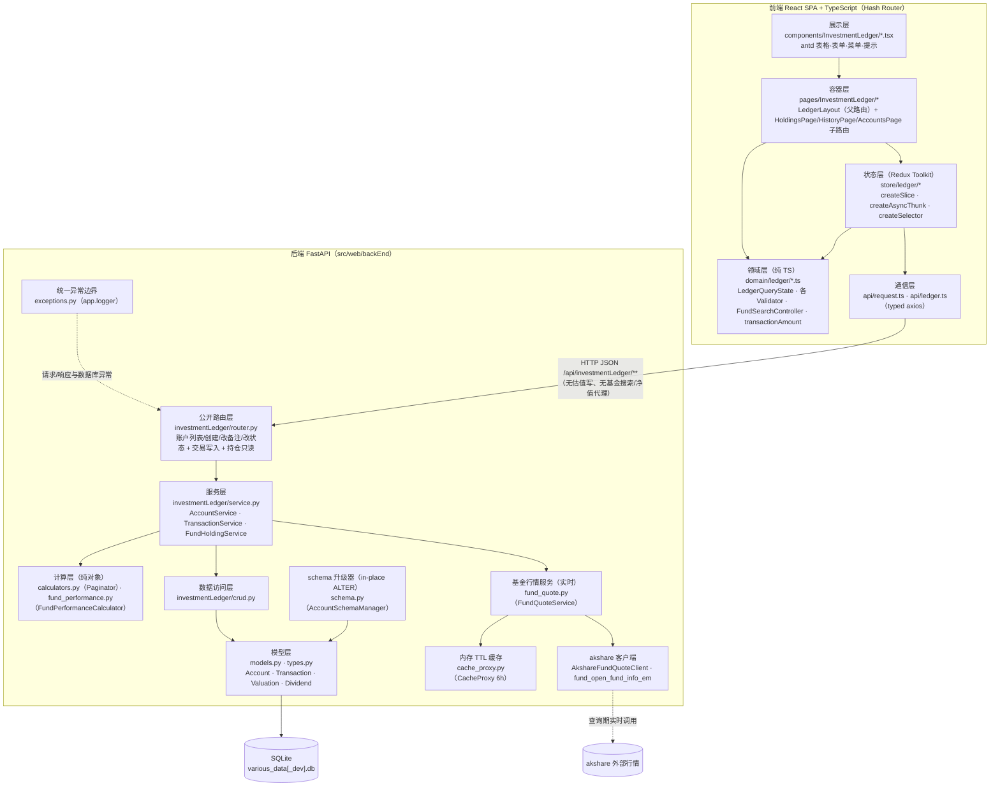
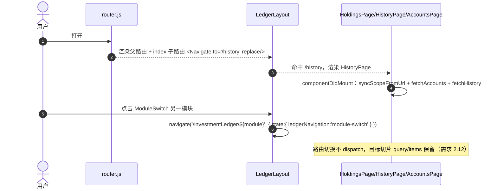
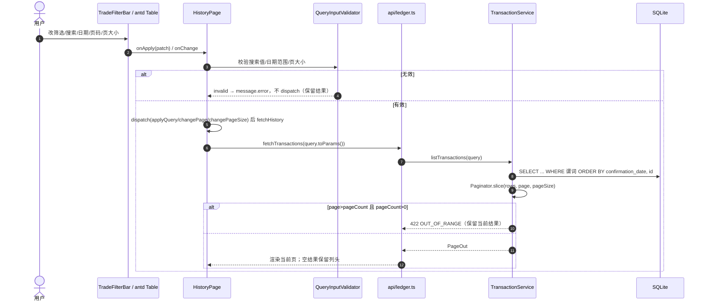
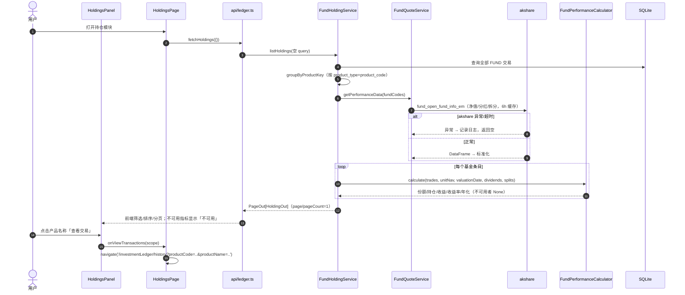
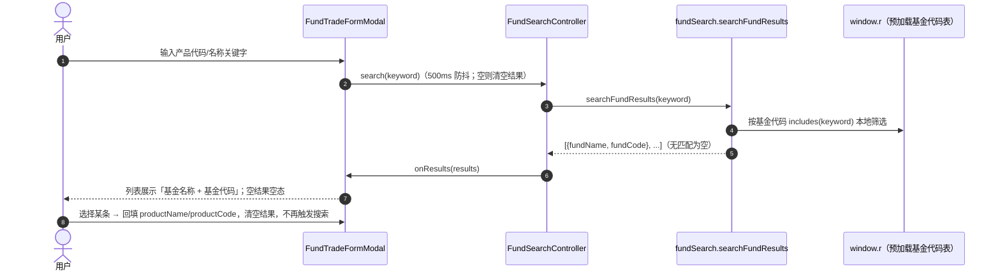

# 投资交易账本 设计文档

> 本文档按仓库当前代码实现重写，作为唯一真源。旧版中未落地的设想（外部估值采集器编排、`il_valuation` 表账本读取、账户唯一命名/删除/系统迁移账户、投资组合统计接口、初始模块判定接口、后端基金搜索代理、基金历史净值接口）已删除；确需这些能力时按“后续扩展”另行立项。凡描述与代码不一致处，以代码为准。

## Overview

投资交易账本在 `various-data` 应用中提供三个互斥用户模块：

- **历史交易记录模块**：交易数据的唯一用户写入入口（创建、删除、查询）。
- **持仓模块**：只读的**基金**产品汇总视图（持仓与收益）。
- **账户管理模块**：账户创建、备注编辑、启用/停用（不提供删除，也不提供名称/类型/机构改名）。

每笔交易可选关联一个账户（历史遗留交易允许 `account_id` 为空）。持仓与收益所需的最新净值、分红、拆分由后端在查询时实时调用 akshare 基金接口获取（`FundQuoteService`，经内存 TTL 缓存），并由纯计算器 `FundPerformanceCalculator` 汇总。`il_valuation` 标准估值表已在库中建好但当前账本路径未读取，也无任何采集器写入实现。用户不能通过界面或账本 API 手动维护估值。

### 设计原则

| 原则 | 落地方式 |
| --- | --- |
| 分层清晰 | 前端：领域层 / 状态层 / 容器层 / 展示层 / 通信层；后端：路由层 / 服务层 / 计算层 / 数据访问层 / 模型层 |
| 边界清晰 | 用户交易写只在历史交易入口；账户备注/状态写只在账户管理入口；持仓模块无写接口；不提供交易编辑接口（需求 1.16）；不提供按交易标识查询的接口（需求 2.23） |
| 复用优先 | 后端沿用现有 FastAPI/SQLAlchemy/Pydantic 与模块装配；前端沿用 React、antd、axios、dayjs、Sass、RTK |
| OOP + 模块化 | 后端以 `Service` / `Calculator` / `crud` 与纯值对象组织；前端以 class 组件 + 领域类（`LedgerQueryState`、各 `Validator`）组织 |
| 类型安全 | 前端 `.ts`/`.tsx`（`strict`）；后端 Pydantic v2 + SQLAlchemy `Mapped` 注解 |
| 代码标识符不用中文 | 枚举以英文码定义（`WEALTH`/`FUND`/`STOCK`、`BUY`/`SELL`）贯穿类型/线格式/DB 列；中文仅作前端展示标签 |
| 无行内样式 | 全部样式写入 `*.module.scss`（CSS Modules），不使用 `style={{...}}` |

### 现状实现基线（本文档以此为准）

- 后端包 `app/investmentLedger` 为扁平结构，文件为：`business_days.py`、`cache_proxy.py`、`calculators.py`、`constants.py`、`crud.py`、`exceptions.py`、`fund_performance.py`、`fund_quote.py`、`models.py`、`router.py`、`schema.py`、`schemas.py`、`service.py`、`types.py`、`__init__.py`。**不存在** `valuation_ingest/`、`collectors/`、`migrations/` 目录，也**不存在** `logging.py`（日志经项目级 `app.logger`）。
- **估值采集未实现**：无采集器协议/注册/编排/标准化/仓储/命令入口。`il_valuation` 表已建（含 `source_id`/`collected_at`/`source_reference`/`raw_payload_hash` 及 `(product_type, product_code, valuation_date, source_id)` 唯一约束），`crud.getLatestValuations` 已实现但**当前持仓/收益查询并不读取该表**。
- **持仓只支持基金且用实时行情**：`FundHoldingService` 硬编码只处理 `FUND`；最新净值/分红/拆分由 `FundQuoteService` 查询时调用 akshare `fund_open_fund_info_em`（单位净值走势/分红送配详情/拆分详情），经 `cache_proxy.CacheProxy` 缓存 6 小时；纯计算由 `FundPerformanceCalculator` 完成。持仓列表**在前端**完成筛选/排序/分页；后端 `HoldingQuery` 为空模型、`PageOut` 的 `page`/`page_count` 恒为 1。
- **账户模型**：`il_account` = `id`、`name`、`account_type`、`institution`（可空）、`is_active`、`remark`（可空）、`created_at`、`updated_at`。`name`/`account_type`/`institution` 创建后不可改；**唯一可编辑的是 `remark` 与 `is_active`**。无删除、无名称唯一性、无重名 409、无系统迁移账户、无 fail-closed 门禁。
- **交易账户关联可选**：`il_transaction.account_id` 为可空外键（`ondelete=RESTRICT`）；创建交易时若提供 `account_id` 则校验账户存在且启用（停用账户 `AccountDisabled`）。
- **确认日期是真实字段**：`il_transaction.confirmation_date`（可空 Date）用于基金；创建基金交易未提供时由服务层补 `business_days.next_working_day(trade_date)`，非基金不保存。前端有独立 `FundTradeFormModal`（含确认日期），通用「新建交易」入口被注释、当前只暴露「新建基金交易」。
- **schema 升级**：由 `schema.py` 的 `AccountSchemaManager.upgradeAccountSchema()` 幂等 ALTER TABLE（建账户表、加 `account_id`/`confirmation_date` 列、回填基金确认日、补索引、校验外键 RESTRICT）。非 Alembic、非门禁。
- **交易数值命名 canonical**：前端 `transactionPrice`/`transactionQuantity`、后端 `transaction_price`/`transaction_quantity`，以无标度 `DecimalText` 存放。`fee` 端到端落地（可选，未填归一为 `Decimal(0)`）。
- **公开路由只有 8 个**（见「后端设计 · 接口清单」）：账户 4、交易 3、持仓 1。**无** `/initialModule`、`/portfolioStatistics`、`/fundSearch`、`/fundQuote/navHistory`、估值写接口。
- **基金搜索是纯前端本地筛选**：`FundSearchController` + `FundSearchResults/fundSearch.searchFundResults`，在页面预加载的全局基金代码表（`window.r`）上按基金代码 `includes` 匹配，不发 HTTP。
- **产品历史范围通过 URL query 承载**：前端仅用 `scopeProductCode`（配合展示用 `productName`）；持仓“查看交易”导航到 `/investmentLedger/history?productCode=...&productName=...`，`HistoryPage` 据 URL 派发 `openHistoryScope`/`resetHistory`。
- **前端结构**：嵌套路由（`LedgerLayout` + `<Outlet/>`，index 重定向到 `/history`），Redux **无** `activeModule`/`switchModule`/`bootstrapLedger`，`ModuleSwitch` 用 antd `Menu` 路由导航。空目录未实现：`PortfolioSummary`、`LedgerPagination`、`ValuationFormModal`。另有 `Dividend`（`il_dividend`）模型与 `crud.get_current_holdings`/`Paginator2` 等辅助存在但服务层未使用。

## Architecture

### 总体架构



### 分层职责与依赖规则

| 层 | 职责 | 允许依赖 | 禁止依赖 |
| --- | --- | --- | --- |
| 前端 展示层 | 渲染 antd 组件、把事件回调给容器 | 领域层常量/标签 | store、api |
| 前端 容器层 | `connect` store、组装面板、下发 thunk、路由导航 | 状态层、领域层、展示层 | api（一律经 thunk） |
| 前端 状态层 | 保存已应用查询快照、列表数据、表单草稿与字段错误；thunk 中调 api | RTK、领域层、通信层 | React、antd |
| 前端 领域层 | 查询状态转换、输入校验、枚举常量、本地基金搜索、交易金额计算 | 无框架 | RTK、React、antd、axios |
| 前端 通信层 | axios 实例、统一响应解包与错误归一（`LedgerApiError`） | 无 | store |
| 后端 路由层 | HTTP 语义、参数绑定、依赖注入、响应模型 | 服务层、schemas | crud、models、外部行情客户端 |
| 后端 服务层 | 账户/交易用例、只读基金持仓编排、事务/业务判定 | 计算层、数据访问层、基金行情服务、schemas | HTTP 对象 |
| 后端 基金行情服务层 | 查询期取 akshare 净值/分红/拆分、收敛异常、缓存 | akshare 客户端、cache_proxy | DB Session、前端 |
| 后端 计算层 | 分页切片（`Paginator`）、基金收益公式（`FundPerformanceCalculator`），纯 `Decimal` | 值对象 | Session、schemas |
| 后端 数据访问层 | 账户/交易读写、持仓交易查询；`getLatestValuations` 只读（当前未接入持仓） | 模型层 | 路由、外部 HTTP |
| 后端 模型层 | 表结构、约束、`DecimalText` | 无 | 其它层 |
| 后端 Schema 升级层 | 幂等 ALTER TABLE 建表/加列/回填/校验外键 | `database.py`、Inspector | 路由业务 |
| 后端 异常边界 | 异常分类、脱敏、统一 JSON 响应，日志经 `app.logger` | FastAPI exception handlers | `print`、返回 SQL/堆栈/敏感内容 |

### 与既有代码的装配点

| 文件 | 现状 |
| --- | --- |
| `app/api.py` | 已注册账本 `router`（前缀 `/investmentLedger`） |
| `app/models.py` | `create_all` 创建缺失表；账户/交易列升级由 `investmentLedger/schema.py` 的 `AccountSchemaManager` ALTER TABLE 完成 |
| `app/database.py` | `Engine`/`SessionLocal` 提供给 `get_db` 与 schema 升级器 |
| `main.py` | 装配路由、异常处理器与 schema 升级；无 fail-closed 门禁 |
| `frontEnd/src/router.js` | 父路由 `/investmentLedger` + `holdings`/`history`/`accounts` 三子路由，index 重定向到 `/history` |
| `frontEnd/src/store/index.ts` | `configureStore({ reducer: { news, stock, crawlers, ledger } })`，导出 `RootState`/`AppDispatch` |
| `scripts/webpack.config.js` | 支持 TS/TSX + `@babel/preset-typescript` |
| `package.json` | 含 RTK、TypeScript 工具链、测试依赖及 `build:web`/`type-check`/`test` |
| `tsconfig.json`（仓库根） | 增量接入（`strict`、`allowJs`、`checkJs:false`、`noEmit`） |

## Components and Interfaces

| 侧 | 模块 | 主要类型 / 接口 | 对外契约 |
| --- | --- | --- | --- |
| 前端 | `pages/InvestmentLedger` | `LedgerLayout`（`index.tsx`，父路由布局）、`HoldingsPage`、`HistoryPage`、`AccountsPage`（子路由容器）；`pageUtils.ts` | 三子路由承载持仓/历史/账户，`LedgerLayout` 渲染 `ModuleSwitch` + `<Outlet />`，index 重定向到 `/history` |
| 前端 | `components/InvestmentLedger` | `ModuleSwitch`、`TradeHistoryPanel`、`HoldingsPanel`、`TradeFilterBar`、`TradeFormModal`、`FundTradeFormModal`、`FundSearchResults`、`MetricValue`、`AccountList`、`AccountFormModal`、`AccountRemarkModal` | props 入、回调出；表格用 antd `Table` 自身分页/展示。空目录未实现：`PortfolioSummary`、`LedgerPagination`、`ValuationFormModal` |
| 前端 | `store/ledger` | `ledgerSlice`、`thunks`、`selectors`、`types` | `state.ledger` 见「前端设计 4」；无 `activeModule`/`switchModule`/`bootstrapLedger` |
| 前端 | `domain/ledger` | `LedgerQueryState`、`TradeDraftValidator`、`QueryInputValidator`、`AccountDraftValidator`、`FundSearchController`、`constants`、`labels`、`transactionAmount`、`formatNumbers`、`businessDay` | 纯函数/纯类；`FundSearchController` 本地防抖筛选，不发 HTTP |
| 前端 | `api` | `request.ts`、`ledger.ts`、`types.ts` | 唯一 HTTP 出口；无 `account.ts`、无估值写、无基金搜索/净值 HTTP |
| 后端 | `investmentLedger/router.py` | `APIRouter(prefix="/investmentLedger")` | 8 个公开接口：账户 4、交易 3、持仓 1 |
| 后端 | `investmentLedger/service.py` | `AccountService`、`TransactionService`、`FundHoldingService`（+`ServiceQueryValidator`、`groupByProductKey`、`HoldingGroup`） | 账户/交易用例、只读基金持仓编排 |
| 后端 | `investmentLedger/fund_quote.py` · `fund_performance.py` | `AkshareFundQuoteClient`、`FundQuoteService`、`FundPerformanceData`、`FundPerformanceCalculator`、`FundTrade`/`FundDividend`/`FundSplit`/`FundPerformance` | 查询期实时行情 + 纯 `Decimal` 收益计算 |
| 后端 | `investmentLedger/calculators.py` | `Paginator`（+`Paginator2`） | 分页切片 |
| 后端 | `investmentLedger/crud.py` | `queryTransactions`、`countTransactions`、`listAccounts`、`addAccount`、`updateAccountRemark`、`updateAccountStatus`、`addTransaction`、`getPositionQuantity`、`removeTransaction`、`getHoldingTransactions`、`getLatestValuations` | 账户/交易数据动作 |
| 后端 | `investmentLedger/models.py` · `types.py` | `Account`、`Transaction`、`Valuation`、`Dividend`、`DecimalText` | 表结构见「Data Models」 |
| 后端 | `investmentLedger/schemas.py` | `ApiResponse`、`AccountCreate/RemarkUpdate/StatusUpdate/Out`、`Metric`、`TransactionCreate/Out/Query`、`HoldingQuery`（空）/`HoldingOut`/`HoldingAccountOut`、`PageOut`、`InternalValuationCandidate`/`ValuationOut`（内部） | 请求/响应契约 |
| 后端 | `investmentLedger/exceptions.py` | `LedgerError` 体系 + `registerLedgerExceptionHandlers(app)` | 统一错误响应，日志经 `app.logger` |
| 后端 | `investmentLedger/schema.py` | `AccountSchemaManager`、`AccountSchemaMigrationError`、`upgradeAccountSchema(engine)` | 幂等 ALTER TABLE 升级 |
| 后端 | `investmentLedger/business_days.py` · `cache_proxy.py` | `next_working_day`、`CacheManager`/`CacheProxy` | 工作日辅助与内存 TTL 缓存 |

---

## 前端设计（Front-End）

### 1. 技术栈

- React 18 class 组件、antd 5、`@ant-design/icons`、react-redux 8、`@reduxjs/toolkit` 1.9、react-router-dom 6（Hash Router）、axios 1、dayjs 1、Sass + CSS Modules。
- TypeScript（`tsc --noEmit`）+ `@babel/preset-typescript`；增量接入（`allowJs`、`checkJs:false`）。
- 金额/比率不在前端做浮点运算；由后端以十进制字符串下发。展示用交易金额由 `transactionAmount.computeTransactionAmount` 以 BigInt 定点计算，仅用于展示。

### 2. 目录与路由

```
src/web/frontEnd/src/
├── pages/InvestmentLedger/
│   ├── index.tsx                 # LedgerLayout：ModuleSwitch + <Outlet />（不连接业务数据）
│   ├── index.module.scss
│   ├── pageUtils.ts              # 导航状态类型、rejectionMessage、validateQueryPatch
│   ├── HoldingsPage/index.tsx    # /investmentLedger/holdings：只读基金持仓
│   ├── HistoryPage/index.tsx     # /investmentLedger/history：历史交易 + 新建基金交易 + 删除
│   └── AccountsPage/index.tsx    # /investmentLedger/accounts：账户创建/改备注/改状态
├── components/InvestmentLedger/
│   ├── ModuleSwitch/             # antd Menu，URL 路由导航
│   ├── TradeHistoryPanel/        # 历史交易表格（含费用列、交易金额计算列、确认日期排序、删除）
│   ├── HoldingsPanel/            # 只读持仓表格（前端筛选/排序）
│   ├── TradeFilterBar/           # 产品类型/名称/代码/方向/日期范围筛选
│   ├── TradeFormModal/           # 通用交易弹窗（入口当前被注释）
│   ├── FundTradeFormModal/       # 基金交易弹窗（当前暴露入口，含确认日期）
│   ├── FundSearchResults/        # 基金搜索结果展示 + fundSearch.ts 本地筛选
│   ├── MetricValue/              # Metric 展示（不可用显示「不可用」+ Tooltip）
│   ├── AccountList/  AccountFormModal/  AccountRemarkModal/
│   └── （空目录未实现）PortfolioSummary/ LedgerPagination/ ValuationFormModal/
├── store/ledger/{ledgerSlice.ts, thunks.ts, selectors.ts, types.ts}
├── domain/ledger/{LedgerQueryState.ts, TradeDraftValidator.ts, QueryInputValidator.ts,
│                  AccountDraftValidator.ts, FundSearchController.ts, constants.ts,
│                  labels.ts, transactionAmount.ts, formatNumbers.ts, businessDay.ts}
└── api/{request.ts, ledger.ts, types.ts}
```

`router.js`（既有 JS）：

```js
{
  path: '/investmentLedger',
  element: <LedgerLayout />,
  children: [
    { index: true, element: <Navigate to="/investmentLedger/history" replace /> }, // 需求 2.3
    { path: 'holdings', element: <HoldingsPage /> },
    { path: 'history', element: <HistoryPage /> },
    { path: 'accounts', element: <AccountsPage /> },
  ],
}
```

`LedgerLayout` 用 `useLocation` 从 URL 派生高亮模块，`ModuleSwitch` 点击时 `navigate` 携带 `state: { ledgerNavigation: 'module-switch' }`，不 dispatch 任何 redux action。直接切换模块因“路由切换不触碰对应切片”而天然保留目标模块状态（需求 2.12）。

### 3. 领域层

#### 3.1 枚举与展示标签（`constants.ts` / `labels.ts`）

- `constants.ts`：`PRODUCT_TYPES=['WEALTH','FUND','STOCK']`、`TRADE_DIRECTIONS=['BUY','SELL']`、`PAGE_SIZE_OPTIONS=[10,20,50]`、`DEFAULT_PAGE_SIZE=10`、`MIN_PAGE_SIZE=1`、`MAX_PAGE_SIZE=100`；类型 `LedgerModule='history'|'holdings'`、`LedgerNavigationModule=LedgerModule|'accounts'`、`SortOrder`、`HoldingSortField='position'|'totalProfit'`。只含码，不含中文。
- `labels.ts`：`PRODUCT_TYPE_LABELS`、`TRADE_DIRECTION_LABELS`、`TRADE_VALUE_LABELS`（FUND/WEALTH→净值/份额，STOCK→单价/数量）、`productTypeOptions`/`tradeDirectionOptions`、`ACCOUNT_TYPE_LABELS`、`accountTypeLabel`、`formatAccountDisplayName`。中文文案唯一来源；组件不手写码↔中文对照。

#### 3.2 `LedgerQueryState`（不可变值对象）

`LedgerQuerySnapshot` 字段：`productType`、`direction`、`startDate`、`endDate`、`productName`、`productCode`、`tradeDateOrder`、`holdingSortField`、`holdingSortOrder`、`page`、`pageSize`、`scopeProductCode`。

- 工厂：`default(module)`、`defaultWithScope(module, scope)`、`from(snapshot)`。
- 变换：`withFilters(patch)`（补丁非空则 `page→1`）、`withPage(page)`、`withPageSize(size)`（`page→1`）。
- `toParams()`：跳过所有 `null`，枚举输出英文码，日期输出 `YYYY-MM-DD`。
- `ProductScope = { productCode, productName }`：`productName` 仅用于页面标题展示，不进入后端查询。
- Redux 只存快照（纯数据），规则唯一实现在类中：reducer 内 `LedgerQueryState.from(...).withFilters(...).toSnapshot()`。

#### 3.3 校验器与工具（纯逻辑）

- `TradeDraftValidator.validate(draft)` → `{ valid, fieldErrors:[{field,code,message}] }`，不修改草稿；字段用 canonical `transactionPrice`/`transactionQuantity`；校验 `accountId`（可选）、`productType`（枚举）、`productName`(≤100)、`productCode`(≤32)、`transactionPrice`（正十进制）、`transactionQuantity`（正十进制；STOCK 需正整数）、`fee`（可选，空值合法，非空须 ≥0 十进制）、`direction`（枚举）、`tradeDate`（有效日历日）。导出 `DECIMAL_PATTERN`、`TRADE_ERROR_CODES`、`isValidCalendarDate`。
- `QueryInputValidator`：`validateSearchValue`（1..100）、`validateDateRange`（成对+日历有效+start≤end）、`validatePageSize`（1..100 整数）、`validatePage(page,pageCount)`。校验失败时容器只 `message.error`，不 dispatch（保留当前结果，需求 2.19/2.21/2.27）。
- `AccountDraftValidator`：`validateCreate(draft)`（`name` 必填≤100、`accountType` 必填≤32、`institution`≤100、`remark`≤255）、`validateRemark(value)`。
- `FundSearchController`：500ms 防抖 + 生命周期 `dispose`；结果来自 `FundSearchResults/fundSearch.searchFundResults(keyword)`（对 `window.r` 全局基金代码表按基金代码 `includes` 本地匹配，返回 `{fundName,fundCode}`），**不发 HTTP**；回调 `onResults`/`onLoadingChange`。
- `transactionAmount.computeTransactionAmount(price,quantity,fee)`：`price×quantity+fee`，BigInt 精确定点、保留两位小数，空/非法按 0；纯展示，不落库、不进 Redux。
- `businessDay.nextWorkingDay(date)`：前端工作日辅助，供 `FundTradeFormModal` 交易日变更时自动填确认日。

### 4. 状态层（Redux Toolkit）

根 store 用 `configureStore({ reducer: { news, stock, crawlers, ledger } })`，state 形状与旧 `combineReducers` 一致；对既有模块（dayjs 实例）豁免 serializable/immutable 检查的指定路径。

`state.ledger` 形状（`store/ledger/types.ts`）：

```ts
interface ListSliceState<T> { query: LedgerQuerySnapshot; items: T[]; total: number;
  page: number; pageSize: number; pageCount: number; loading: boolean; error: string | null; }

interface LedgerState {
  history: ListSliceState<TransactionOut>;
  holdings: ListSliceState<HoldingOut>;
  tradeForm: { visible: boolean; mode: 'general' | 'fund'; draft: TradeDraft;
               fieldErrors: FieldError[]; submitting: boolean };
  accounts: { items: AccountOut[]; loading: boolean; updatingId: number | null; error: string | null };
  accountForm: { visible: boolean; draft: AccountDraft; fieldErrors: FieldError[]; submitting: boolean };
  accountRemarkForm: { visible: boolean; accountId: number | null; remark: string;
                       fieldErrors: FieldError[]; submitting: boolean };
}
```

- **无 `activeModule`**：当前模块由路由派生。
- 同步 actions：`openHistoryScope`、`resetHistory`、`applyQuery`、`changePage`、`changePageSize`、`openTradeForm`、`openFundTradeForm`、`closeTradeForm`、`changeTradeDraft`、`openAccountForm`、`closeAccountForm`、`changeAccountDraft`、`openAccountRemarkForm`、`closeAccountRemarkForm`、`changeAccountRemark`。
- thunks（`createAsyncThunk`）：`fetchHistory`、`fetchHoldings`、`submitTransaction`、`removeTransaction`、`fetchAccounts`、`createAccount`、`updateAccountRemark`、`updateAccountStatus`（另有别名 `submitTrade`/`deleteTrade`）。提交类 thunk 先跑领域校验器，不过则不发 HTTP、`rejectWithValue` 带 `fieldErrors`；`fetchHoldings` 不传任何查询参数（持仓筛选/排序在前端）。
- rejected 分支：`fetch*` 只写 `error`+`loading=false`，不清空 `items`、不改 `query`；`submitTransaction.rejected` 只写 `fieldErrors`，草稿原样保留。
- selectors（`createSelector`）：`selectLedger`、`selectModuleRows`、`selectModuleQuery`、`selectHistoryQuery`、`selectHoldingsQuery`、`selectHistoryRows`、`selectHoldingsRows`、`selectHistoryPagination`、`selectHoldingsPagination`、`selectModulePagination`、`selectHasScope`、`selectTradeFieldErrorMap`。

### 5. API 客户端

- `request.ts`：账本专用 axios（`baseURL='/api/investmentLedger'`，超时 10s），`LedgerApiError(message, fieldErrors, code)`，泛型 `unwrap<T>`（解 `{code,msg,data}`，`code≠200` 抛错）。
- `ledger.ts` 函数（唯一 HTTP 出口）：`fetchTransactions(params)`、`createTransaction(payload)`、`deleteTransaction(id)`、`fetchHoldings(params)`（超时 30s）、`fetchAccounts()`、`createAccount(payload)`、`updateAccountRemark(id,payload)`、`updateAccountStatus(id,payload)`。**无** `searchFunds`、基金净值历史、估值写。
- `types.ts` 关键 DTO：
  - `TransactionOut`：`id`、`accountId:number|null`、`accountName`、`accountInstitution`、`productType`、`productName`、`productCode`、`transactionPrice`、`transactionQuantity`、`fee`、`direction`、`tradeDate`、`confirmationDate?`。
  - `TradeDraft`：`accountId?`、`productType?`、`productName?`、`productCode?`、`transactionPrice?`、`transactionQuantity?`、`fee?`、`direction?`、`tradeDate?`、`confirmationDate?`（交易金额不进草稿）。
  - `HoldingOut`：`productType`、`productName`、`productCode`、`accounts: HoldingAccount[]`、`position`、`positionQuantity`、`latestValuationUnitPrice`、`latestValuationDate`、`totalProfit`、`totalProfitRate`、`annualizedRate`（后 5 项为 `Metric{available,value,unavailableReason}`）。
  - `AccountOut`：`id`、`name`、`accountType`、`institution`、`isActive`、`remark`、`createdAt`、`updatedAt`；`AccountCreatePayload`、`AccountRemarkUpdatePayload`、`AccountStatusUpdatePayload`、`AccountDraft`。

### 6. 组件渲染约束

| 组件 | 关键约束 |
| --- | --- |
| `LedgerLayout` | 渲染 `ModuleSwitch` + `<Outlet/>`；`useLocation` 派生高亮；不连接业务数据 |
| `ModuleSwitch` | antd `Menu`（`mode="inline"`）在 holdings/history/accounts 间路由导航；`selectedKeys` 由 URL 派生；不 dispatch |
| `HoldingsPanel` | 只读 antd `Table`（`pagination=false`，前端筛选/排序）；列：产品类型、产品名称（点击→查看交易）、产品代码、交易账户（多账户，未关联显示「未关联账户」）、持仓量、持仓额、最新净值、最新净值日期、总收益、总收益率、年化收益率；数值列用 `MetricValue`；写意图 `message.info` |
| `TradeHistoryPanel` | antd `Table`；列：产品类型、产品名称（基金渲染为外链）、产品代码、交易账户、净值/单价、份额/数量、费用、交易金额（`computeTransactionAmount` 计算列）、交易方向、确认日期（可排序）、操作（删除 `Popconfirm`）；`rowKey=record.id`，id 不作列；分页内建于 `Table`（`PAGE_SIZE_OPTIONS`） |
| `TradeFilterBar` | 产品类型/名称/代码/方向/日期范围；`scoped` 时隐藏名称/代码/类型；提交前经 `QueryInputValidator` |
| `FundTradeFormModal` | 当前暴露的交易入口；`productType=FUND`；字段含可选账户 `Select`、方向、交易日期、确认日期（交易日变更自动填下一个工作日）、产品代码、产品名称（只读，由基金搜索回填）、净值、份额、费用；底部只读「交易金额」；挂 `FundSearchResults` |
| `TradeFormModal` | 通用交易弹窗，入口被注释；含费用输入与只读交易金额；FUND 时挂本地基金搜索 |
| `FundSearchResults` | 受控展示（loading→Spin，空→Empty，有结果→可点击项）；`onSelect` 回填；无自身请求、无 Redux |
| `MetricValue` | `available=false` 渲染「不可用」+ Tooltip 原因，绝不以 0 替代；`kind` 决定金额加「元」/比率×100 加「%」/数量原样 |
| `AccountList` / `AccountFormModal` / `AccountRemarkModal` | 列表展示账户名称/类型/机构/状态/备注 + 启停/编辑备注入口；创建表单含 `name`/`accountType`/`institution`/`remark`；备注弹窗只维护备注；均无删除、无改名 |

所有组件为 `React.Component` 子类，样式经 `import styles from './index.module.scss'`，不出现 `style={{...}}`。

---

## 后端设计（Back-End）

### 1. 目录结构

```
src/web/backEnd/app/investmentLedger/
├── __init__.py
├── constants.py       # ProductType/TradeDirection 英文码、页大小与字段长度边界、SOURCE_PRIORITY、账户长度边界
├── types.py           # DecimalText：SQLite 上精确存取 Decimal 的 TypeDecorator（无标度 TEXT）
├── models.py          # Base / Account / Transaction / Valuation / Dividend
├── schema.py          # AccountSchemaManager：幂等 ALTER TABLE 升级账户/交易列并回填基金确认日
├── schemas.py         # Pydantic v2 请求/响应契约（含 ApiResponse、Metric、内部估值契约）
├── crud.py            # 数据访问：交易查询/写入/删除、账户读写、持仓交易查询、估值只读函数
├── calculators.py     # Paginator（+Paginator2 辅助）
├── fund_performance.py# FundPerformanceCalculator：基金持仓/收益纯 Decimal 计算（分红/拆分/费用）
├── fund_quote.py      # AkshareFundQuoteClient / FundQuoteService：查询期实时行情 + 缓存
├── cache_proxy.py     # CacheManager / CacheProxy：内存 TTL 缓存
├── business_days.py   # next_working_day：工作日辅助
├── service.py         # AccountService / TransactionService / FundHoldingService / ServiceQueryValidator / groupByProductKey
├── exceptions.py      # LedgerError 体系 + registerLedgerExceptionHandlers(app)
└── router.py          # 8 个公开接口
```

### 2. 数据模型概要

#### 2.1 枚举与常量（`constants.py`）

`ProductType(str, Enum)` = `WEALTH`/`FUND`/`STOCK`；`TradeDirection(str, Enum)` = `BUY`/`SELL`（成员名与值均为英文码，全链路统一）。常量：`DEFAULT_PAGE_SIZE=20`（后端默认；前端默认 10）、`MIN_PAGE_SIZE=1`、`MAX_PAGE_SIZE=100`、`PAGE_SIZE_OPTIONS=(10,20,50)`、`MAX_PRODUCT_NAME_LENGTH=100`、`MAX_PRODUCT_CODE_LENGTH=32`、`MAX_SEARCH_VALUE_LENGTH=100`、`ANNUALIZATION_DAYS=365`、`MAX_VALUATION_UNIT_PRICE="999999999.99"`、`SOURCE_PRIORITY={"legacy":1000}`、账户长度 `MAX_ACCOUNT_NAME_LENGTH=100`/`MAX_ACCOUNT_TYPE_LENGTH=32`/`MAX_INSTITUTION_NAME_LENGTH=100`/`MAX_ACCOUNT_REMARK_LENGTH=255`。后端不维护码→中文映射，错误文案直接写完整中文句子。

#### 2.2 `DecimalText`（`types.py`）

`DecimalText(TypeDecorator, impl=Text)`：把 `Decimal` 以无标度十进制文本存入 TEXT 列，读写全程不经 `float`；拒绝 `bool`/`float`；不声明长度、不 `quantize`，不引入小数位/整数位/上限限制。`DECIMAL_SCALE=2`、`DECIMAL_EXPONENT=Decimal("0.01")` 供估值/金额出参格式化。

#### 2.3 表模型（`models.py`）

- `Account`（`il_account`）：`id`(pk)、`name`(String 100)、`account_type`(String 32)、`institution`(String 100, 可空)、`is_active`(Boolean, 默认 true, 索引)、`remark`(String 255, 可空)、`created_at`、`updated_at`(onupdate)；关系 `transactions`；`CheckConstraint(length(account_type)>0)`。
- `Transaction`（`il_transaction`）：`id`(pk)、`account_id`(可空外键→`il_account.id`, `ondelete=RESTRICT`, 索引)、`product_type`(String 16, 索引)、`product_name`(String 100)、`product_code`(String 32, 索引)、`transaction_price`(DecimalText)、`transaction_quantity`(DecimalText)、`fee`(DecimalText, 可空)、`direction`(String 16, 索引)、`trade_date`(Date, 索引)、`confirmation_date`(Date, 可空)、`created_at`(无 onupdate，仅 INSERT/DELETE)；属性 `account_name`/`account_institution`（经关联读取）；索引 `(product_type, product_code)`、`(account_id, product_type, product_code)`。
- `Valuation`（`il_valuation`）：`id`、`product_type`、`product_code`、`valuation_date`、`unit_price`(DecimalText)、`source_id`(String 64)、`collected_at`、`source_reference`(String 512, 可空)、`raw_payload_hash`(String 128, 可空)、`updated_at`；唯一约束 `(product_type,product_code,valuation_date,source_id)`、索引 `(product_type,product_code,valuation_date)`。**当前账本查询未读取本表。**
- `Dividend`（`il_dividend`）：`id`、`product_code`、`ex_date`、`pay_date`、`div_per_share`(DecimalText)、`event_type`、`linked_trade_id`(可空 FK)、`created_at`。**当前服务层未使用**（基金分红/拆分来自 akshare 的内存值对象）。

#### 2.4 Schema 升级（`schema.py`）

`AccountSchemaManager.upgradeAccountSchema(engine)` 幂等执行：建/校验 `il_account`（缺列抛 `AccountSchemaMigrationError`）→ 若 `il_transaction` 存在则 ALTER 加缺失的 `account_id`(RESTRICT 外键)与 `confirmation_date` 列 → 为 `product_type='FUND'` 且 `confirmation_date IS NULL` 的历史交易回填 `next_working_day(trade_date)` → 补账户相关索引 → 校验 `account_id` 外键指向 `il_account.id` 且 `ondelete=RESTRICT`。不做版本记录、不做备份、不做系统迁移账户回填、不 fail-closed。

### 3. Pydantic 契约（`schemas.py`）

`LedgerSchema`（`alias_generator=to_camel`、`populate_by_name`、`from_attributes`）为基类；金额/比率以十进制字符串序列化。字段错误码常量：`NOT_IN_ENUM`、`INVALID_SCALE`、`NOT_A_NUMBER`、`NOT_INTEGER`、`OUT_OF_RANGE`、`TOO_LONG`、`INSUFFICIENT_HOLDING`、`ACCOUNT_DISABLED`。

- `ApiResponse[T]`：`{ code=200, msg="ok", data=None }`。
- `Metric`：`available`/`value`/`unavailable_reason`，`model_validator` 强制“不可用则无值且必有中文原因，可用则有值且无原因”；工厂 `Metric.of(value)`、`Metric.unavailable(reason)`。
- `AccountCreate`（`extra="forbid"`）：`name`(1..100，去空白)、`account_type`(1..32，去空白)、`institution`(可空≤100，空串归 None)、`remark`(可空≤255，空串归 None)。
- `AccountRemarkUpdate`（`extra="forbid"`）：`remark`(可空≤255)。`AccountStatusUpdate`（`extra="forbid"`）：`is_active:bool`。
- `AccountOut`：`id`、`name`、`account_type`、`institution`、`is_active`、`remark`、`created_at`、`updated_at`。
- `TransactionCreate`：`account_id:int|None(ge=1)`、`product_type`、`product_name`(1..100)、`product_code`(1..32)、`transaction_price:Decimal`(有限>0)、`transaction_quantity:Decimal`(有限>0；STOCK 需整数)、`fee:Decimal|None`(有限≥0，None/空串透传由服务层归一 0)、`direction`、`trade_date`、`confirmation_date:date|None`。数值以 `_toDecimal` 精确解析并拒绝 `float`/`NaN`/`Infinity`，不量化。
- `TransactionOut`：`id`、`account_id`、`account_name`、`account_institution`、`product_type`、`product_name`、`product_code`、`transaction_price`(DecimalString)、`transaction_quantity`(DecimalString)、`fee`(DecimalString)、`direction`、`trade_date`、`confirmation_date`。
- `TransactionQuery`（`Depends()`）：`product_type`、`direction`、`start_date`、`end_date`、`product_name`(1..100)、`product_code`(1..100)、`trade_date_order:Literal['asc','desc']|None`（作用于确认日期排序）、`scope_product_code`(1..32)、`page`(≥1)、`page_size`(1..100，默认 20)；`model_validator` 校验日期范围成对且 start≤end。
- `HoldingQuery`：**空模型**（持仓筛选/排序/分页在前端）。
- `HoldingAccountOut`：`account_id|None`、`account_name|None`、`account_institution|None`。
- `HoldingOut`：`product_type`、`product_name`、`product_code`、`accounts:list[HoldingAccountOut]`、`position:Metric`、`position_quantity:Metric`、`total_profit:Metric`、`total_profit_rate:Metric`、`annualized_rate:Metric`、`latest_valuation_date:date|None`、`latest_valuation_unit_price:Metric`。
- `PageOut[T]`：`items`、`total`、`page`、`page_size`(1..100)、`page_count`。
- `InternalValuationCandidate` / `ValuationOut`：内部估值契约，标注“不对外暴露”，供既有模型测试，公开路由不使用。

### 4. 接口清单

前缀 `/api/investmentLedger`，全部包裹在 `ApiResponse`。**当前只有 8 个接口：**

| # | 方法与路径 | 请求 | 响应 `data` | 覆盖需求 |
| --- | --- | --- | --- | --- |
| 1 | `GET /accounts` | 无 | `list[AccountOut]`（按创建时间倒序） | 7.2、7.8 |
| 2 | `POST /accounts` | `AccountCreate` | `AccountOut` | 7.4-7.9 |
| 3 | `PATCH /accounts/{accountId}/remark` | `AccountRemarkUpdate` | `AccountOut` | 7.11、7.13 |
| 4 | `PATCH /accounts/{accountId}/status` | `AccountStatusUpdate` | `AccountOut` | 7.12、7.13 |
| 5 | `GET /transactions` | `TransactionQuery`（`Depends()`） | `PageOut[TransactionOut]` | 2.13-2.28 |
| 6 | `POST /transactions` | `TransactionCreate` | `TransactionOut` | 1.1-1.16、6.2-6.6、7.16-7.18 |
| 7 | `DELETE /transactions/{transactionId}` | 路径 `int` | `null` | 1.17、1.18 |
| 8 | `GET /holdings` | `HoldingQuery`（空） | `PageOut[HoldingOut]`（`page`/`pageCount` 恒为 1） | 2.4-2.8、2.29、2.30、3.1-3.10 |

> **不存在**：估值读写接口、`GET /initialModule`、`GET /portfolioStatistics`、`GET /fundSearch`、`GET /fundQuote/navHistory`、交易更新接口、`GET /transactions/{id}`。

### 5. 服务层与数据访问层

- `AccountService(db)`：`listAccounts()`（倒序）、`createAccount(payload)`、`updateAccountRemark(accountId, payload)`（不存在→`AccountNotFound`）、`updateAccountStatus(accountId, payload)`（不存在→`AccountNotFound`）。不做名称唯一性、无删除。
- `TransactionService(db)`：
  - `listTransactions(query)`：`ServiceQueryValidator.validate(query)` → `crud.queryTransactions` → `Paginator.slice(rows, page, pageSize)` → `PageOut`（空结果 total/page_count 为 0）。
  - `createTransaction(payload)`：若带 `account_id` 校验存在（`AccountNotFound`）且启用（`AccountDisabled`）；`fee=None` 归一为 `Decimal(0)`；基金未提供确认日则补 `next_working_day(trade_date)`，非基金清空确认日；卖出时预演 `crud.getPositionQuantity` 后若持仓<0 抛 `InsufficientHolding`（422，指向 `transactionQuantity`）；`crud.addTransaction` 落库。无更新方法（需求 1.16）。
  - `deleteTransaction(transactionId)`：不存在→`TransactionNotFound`。
- `FundHoldingService(db, fundQuoteService, performanceCalculator?)`：
  1. `crud.getHoldingTransactions(productType=FUND)`；
  2. `groupByProductKey(rows)` 按 `(product_type, product_code)` 分组，产品展示名取“交易日最大、同日 id 最大”的交易名；
  3. `fundQuoteService.getPerformanceData(fundCodes)` 取净值/分红/拆分（异常收敛为空）；
  4. 每组 `FundPerformanceCalculator.calculate(trades, unitNav, valuationDate, dividends, splits)`；份额 ≤0 的组丢弃；
  5. 组装 `HoldingOut`（含去重账户列表，未关联账户以 `account_id=None` 保留）；
  6. 返回 `PageOut`（`page=1`、`page_count=1 if holdings else 0`）——不分页、不排序（前端负责）。
- `ServiceQueryValidator.validate(query)`：静态校验 `page_size∈[1,100]`、搜索值长度、日期范围成对与顺序，失败抛 `InvalidPageSize`/`InvalidSearchValue`/`InvalidDateRange`（页码上界由 `Paginator` 判定）。
- `crud`：`queryTransactions` 把产品类型/方向/日期闭区间/名称`LIKE`/代码`LIKE`/`scope_product_code` 精确匹配下推为 AND 谓词；按 `confirmation_date` 排序（未指定方向默认降序、`nulls_last`），同日以 `id` 升序稳定；`getPositionQuantity` 单条 SQL 聚合买入正/卖出负；账户 CRUD 异常回滚。

### 6. 基金收益计算（`fund_performance.py`）

`FundPerformanceCalculator.calculate(trades, unitNav, valuationDate, dividends, splits)`（纯 `Decimal`，无 I/O）：

- 交易起算日 `FundTrade.effective_date`：基金取 `confirmation_date`（无则交易日），其它取交易日；只纳入 `effective_date ≤ valuationDate` 的事件。
- 按日期顺序处理，同日先拆分、再分红、后交易：拆分按 `ratio` 调整份额；分红 `reinvest_nav` 非空则再投资增份，否则计入现金分红；买入 `shares += quantity`、`buyCost += price×quantity + fee`；卖出 `shares -= quantity`、`sellProceeds += price×quantity − fee`；`holding_start_date` 取首个买入的起算日。
- 无 `unitNav`/`valuationDate` 时返回 `position/total_profit/rate/annualized=None`（仅 `shares` 与成本可得）。
- 有净值时：`position = shares × unitNav`；`total_profit = sellProceeds + cashDividend + position − buyCost`；`total_profit_rate = total_profit / buyCost`（`buyCost>0` 才可用）；`annualized_rate = (1+rate)^(365/持有天数) − 1`（`buyCost>0` 且持有天数>0 才可得）。
- 任一指标不满足前提返回 `None`，由服务层映射为 `Metric.unavailable(...)`，绝不以 0 替代。

`FundQuoteService.getPerformanceData(fundCodes)`：对每个基金分别取“单位净值走势/分红送配详情/拆分详情”，标准化 Chinese 列名、拆分比例（如 "1:3"）、每 10 份分红，经 `CacheProxy`（6h）缓存；任一 indicator 异常记 `WARNING` 并返回空，收敛不外抛。

## Data Models

### 后端持久化模型（表与约束）

| 表 | 字段/约束 | 说明 |
| --- | --- | --- |
| `il_account` | `id` 自增 pk；`name` 100；`account_type` 32（非空约束）；`institution` 100 可空；`is_active` 默认 true 索引；`remark` 255 可空；`created_at`/`updated_at` | 身份字段创建后不可改；仅 `remark`/`is_active` 可改；无删除、无唯一性 |
| `il_transaction` | `id` pk；`account_id` 可空外键 RESTRICT 索引；`product_type` 16 索引；`product_name` 100；`product_code` 32 索引；`transaction_price`/`transaction_quantity`/`fee` DecimalText（`fee` 可空）；`direction` 16 索引；`trade_date` Date 索引；`confirmation_date` Date 可空；`created_at`；索引 `(product_type,product_code)`、`(account_id,product_type,product_code)` | 只 INSERT/DELETE，无 UPDATE；`fee` 未填服务层归一 0 |
| `il_valuation` | 见 2.3；唯一约束 `(product_type,product_code,valuation_date,source_id)` | 已建但**账本查询未读取** |
| `il_dividend` | 见 2.3 | 已建但**服务层未使用** |

### 值语义

| 概念 | 表示 |
| --- | --- |
| 产品键（持仓分组） | `(product_type, product_code)`，账户不参与键；条目内以 `accounts[]` 列出涉及账户 |
| 枚举 | 后端 `str,Enum` 英文码 ↔ DB TEXT ↔ JSON 英文串 ↔ 前端联合类型；中文仅前端展示映射 |
| 金额/单价/份额 | `Decimal` ↔ DecimalText ↔ JSON 十进制字符串 |
| 统计指标 | `Metric{available, value, unavailableReason}`，不可用时 `value=null`，不以 0 替代 |
| 日期 | `date` ↔ `YYYY-MM-DD`；前端用 dayjs 与 antd DatePicker |

### 前端状态模型

Redux 只存账户列表、per-module 已应用查询快照、当前页数据和表单草稿；`LedgerState` 无“当前激活模块”字段（由路由决定）。交易/持仓 DTO 带 `accountId`，账户名称由后端关联返回。`LedgerQuerySnapshot` 保存 `scopeProductCode`；`LedgerQueryState` 负责重置规则。

## 核心流程时序图

### 流程 1：进入账本与模块导航（需求 2.2、2.3、2.12）



### 流程 2：新建基金交易（需求 1.1-1.16、6、7.16-7.18）

```mermaid
sequenceDiagram
    autonumber
    actor U as 用户
    participant F as FundTradeFormModal
    participant P as HistoryPage
    participant V as TradeDraftValidator
    participant A as api/ledger.ts
    participant SV as TransactionService
    participant DB as SQLite
    U->>F: 选账户/方向/交易日期(自动填确认日)/代码/名称/净值/份额/费用
    F->>P: onSubmit(draft)
    P->>V: validate(draft)
    alt 无效
        V-->>P: {valid:false, fieldErrors}
        P-->>F: 按字段显示中文原因，保留输入
    else 有效
        P->>A: createTransaction(payload)
        A->>SV: createTransaction
        SV->>SV: 账户存在且启用；fee=None→0；基金补确认日；卖出预演持仓
        alt 卖出后持仓<0
            SV-->>A: 422 fieldErrors[transactionQuantity]=INSUFFICIENT_HOLDING
        else 通过
            SV->>DB: INSERT il_transaction; COMMIT
            SV-->>A: TransactionOut
            A-->>P: 成功→关闭弹窗、重拉当前页
        end
    end
```

### 流程 3：历史交易查询/筛选/分页（需求 2.13-2.28）



### 流程 4：基金持仓与收益（需求 2.4-2.8、3.1-3.10）



### 流程 5：账户管理（需求 7）

```mermaid
sequenceDiagram
    autonumber
    actor U as 用户
    participant AP as AccountsPage
    participant A as api/ledger.ts
    participant AS as AccountService
    participant DB as SQLite
    U->>AP: 打开账户管理 → fetchAccounts
    AP->>A: GET /accounts
    A->>AS: listAccounts()（倒序）
    AS->>DB: SELECT il_account
    A-->>AP: 展示名称/类型/机构/状态/备注 + 编辑备注/启停入口
    U->>AP: 创建账户（name/accountType/institution/remark）
    AP->>A: POST /accounts（AccountCreate，去空白校验）
    A->>AS: createAccount → INSERT → 刷新列表
    U->>AP: 改备注 / 切换状态
    AP->>A: PATCH /accounts/{id}/remark 或 /status
    A->>AS: updateAccountRemark / updateAccountStatus
    alt 账户不存在
        AS-->>A: 404 ACCOUNT_NOT_FOUND（列表/交易不变）
    else 成功
        AS->>DB: UPDATE; COMMIT
    end
```

### 流程 6：本地基金搜索（需求 5）



## Error Handling

### 统一错误响应

```json
{ "code": 422, "msg": "参数校验失败", "data": { "fieldErrors": [ { "field": "transactionQuantity", "code": "NOT_INTEGER", "message": "股票数量必须为正整数" } ] } }
```

### 后端异常体系（`exceptions.py`）

| 异常 | HTTP | 触发场景 | 需求 |
| --- | --- | --- | --- |
| `LedgerError`（基类） | 400 | 兜底业务错误 | — |
| `LedgerValidationError` | 422 | 服务层业务校验失败（含 `fieldErrors`） | 1.8-1.14 |
| `AccountNotFound` | 404（`ACCOUNT_NOT_FOUND`） | 账户 id 不存在（改备注/改状态/创建交易关联） | 7.13、7.17 |
| `AccountDisabled` | 422（`ACCOUNT_DISABLED`） | 关联已停用账户创建交易 | 7.18 |
| `TransactionNotFound` | 404 | 删除的交易不存在 | 1.18 |
| `InsufficientHolding` | 422（`INSUFFICIENT_HOLDING`，指向 `transactionQuantity`） | 卖出后持仓<0，不写入记录 | 1.14/3.x |
| `PageOutOfRange` | 422（`OUT_OF_RANGE`） | 页码<1 或 >总页数 | 2.27 |
| `InvalidPageSize` | 422 | 页大小不在 1..100 | 2.24 |
| `InvalidDateRange` | 422（`OUT_OF_RANGE`） | 日期范围缺项或起始晚于结束 | 2.21 |
| `InvalidSearchValue` | 422 | 搜索值为空或超 100 字符 | 2.19 |

`registerLedgerExceptionHandlers(app)` 顺序：`LedgerError` → 统一信封（含中文 `msg` 与可选 `fieldErrors`）；`RequestValidationError` → 翻译为 `data.fieldErrors`（`field` camelCase、`code` 取 `NOT_IN_ENUM`/`INVALID_SCALE`/`OUT_OF_RANGE`/`TOO_LONG` 等、`message` 完整中文，枚举非法不回显英文原文）；`IntegrityError`/`OperationalError` → 收敛为通用 500 + `msg:"数据保存失败，请稍后重试"`，不外泄 SQL/表名/连接串/堆栈，详情写 `app.logger`。所有写操作失败在 CRUD 内 `db.rollback()`。该处理器注册在 FastAPI 应用级，对既有模块的校验失败同样生效，统一信封与既有 `{code,msg,data}` 一致。

### 前端错误处理

| 场景 | 行为 | 需求 |
| --- | --- | --- |
| 表单字段无效（领域层拦截） | 不发请求；按字段渲染中文错误；输入保留 | 1.8-1.14 |
| 后端 422 带 `fieldErrors` | 映射到 antd `Form.Item`；输入保留 | 1.x、6.5 |
| 卖出后持仓<0（后端拦截） | `transactionQuantity` 字段显示中文原因；草稿保留、不关闭弹窗 | 3.x |
| 搜索值/日期范围/页大小/页码无效 | `message.error`；不更新 query、不清空 items | 2.19、2.21、2.27 |
| 删除失败（404） | `message.error`；表格与查询状态不变 | 1.18 |
| 账户改备注/改状态失败（404） | `message.error`；账户列表与交易/持仓状态不变 | 7.13 |
| 创建交易关联账户不存在/停用 | 提示 404/`ACCOUNT_DISABLED`；交易数据不变 | 7.17、7.18 |
| 网络/超时/5xx | `message.error('网络异常，请稍后重试')`；保留当前表格与浏览状态 | — |
| 持仓模块写意图 | `message.info('请在历史交易记录模块中维护历史交易')` / `'持仓模块仅供查看'` | 1.19、1.20 |
| 基金实时行情失败 | 后端收敛为无行情；持仓依赖净值的指标显示「不可用」 | 3.3、3.9 |
| 统计指标不可用 | `MetricValue` 渲染「不可用」+ Tooltip 原因，绝不以 0 替代 | 3.9、3.10 |

## Testing Strategy

| 层次 | 范围 | 工具 |
| --- | --- | --- |
| 后端属性测试 | `fund_performance.py` 收益/份额/年化、`Paginator`、`schemas` 校验器、`crud` 查询谓词与分组 | `pytest` + `hypothesis`（fake clock，不访问真实金融接口） |
| 后端示例/集成测试 | 账户创建/改备注/改状态与 404、交易创建（含 fee 归一、账户校验、卖出拦截、确认日回填）/删除、历史查询筛选/排序/分页/越界、持仓聚合（fake `FundQuoteService`）、异常映射与脱敏、`AccountSchemaManager` 幂等 ALTER/回填 | `pytest` + `TestClient` + 临时 SQLite + fake fund quote |
| 前端类型检查 | 全部 `.ts`/`.tsx` | `tsc --noEmit`（`strict`） |
| 前端属性测试 | `domain/ledger/*`（`LedgerQueryState`、各 Validator、`transactionAmount`、本地基金搜索）与纯 reducer | `vitest` + `fast-check` |
| 前端示例测试 | 三模块路由与保留状态、`ModuleSwitch` 导航、`FundTradeFormModal`（fee/交易金额/确认日/基金搜索回填）、`TradeHistoryPanel` 列（含费用/交易金额）、`HoldingsPanel` 只读、`MetricValue` 不可用、账户交互、无行内样式 | `@testing-library/react` + `vitest`（`jsdom`） |

约束：金额/比率断言用 `Decimal`/精确比较，不用浮点近似；集成测试用临时 SQLite，不连接 `various_data(.dev).db`；持仓测试用 fake `FundQuoteService`，不访问真实 akshare/天天基金网；样式经 CSS Modules，测试断言组件树无 `style` 属性。

### 回归验证

1. `npm run type-check`（`tsc --noEmit`）0 错误。
2. `npm run build:web` 通过。
3. `npm test`（`vitest --run`）与 `pytest -q` 全绿。
4. 手工验证既有页面（首页、`#/chartWithNews`、`#/crawlersAdmin`）不受根 store 迁移影响，控制台无 serializable/immutable 告警。

## 部署与运行说明

- 账本 Web 服务按现有 FastAPI 进程部署；启动时通过 `AccountSchemaManager.upgradeAccountSchema()` 幂等升级账户/交易列并回填基金确认日。
- 基金净值/分红/拆分在处理 `GET /holdings` 时实时调用 akshare 并缓存 6 小时；外部行情不可用不阻断账本查询（依赖净值的指标显示「不可用」）。
- 无采集任务、无估值写入命令、无第三方基金搜索/净值代理；基金搜索完全在前端本地完成。

## 后续扩展（当前未实现，不属于本设计契约）

- 外部估值采集器编排（协议/白名单注册/标准化/幂等写入/来源优先级/故障隔离）与 `il_valuation` 表的账本读取。
- 投资组合汇总统计接口、初始模块判定接口、后端基金搜索代理、基金历史净值查询接口。
- 账户删除、账户名称唯一性、系统迁移账户回填、版本化 fail-closed 迁移门禁。
- 通用（非基金）新建交易入口的启用、`il_dividend` 表的实际使用。
