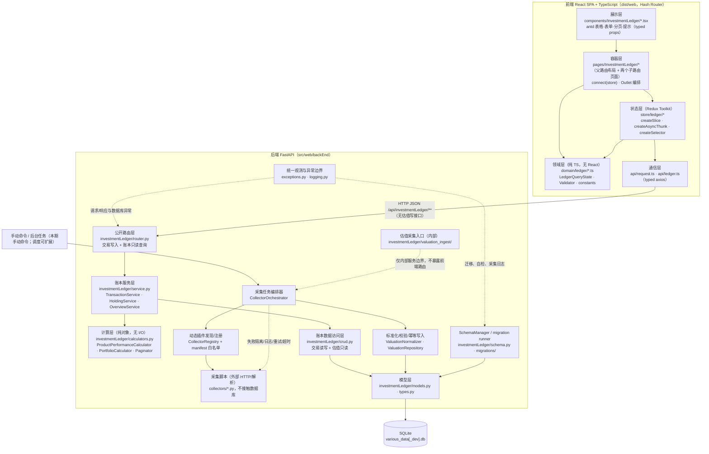
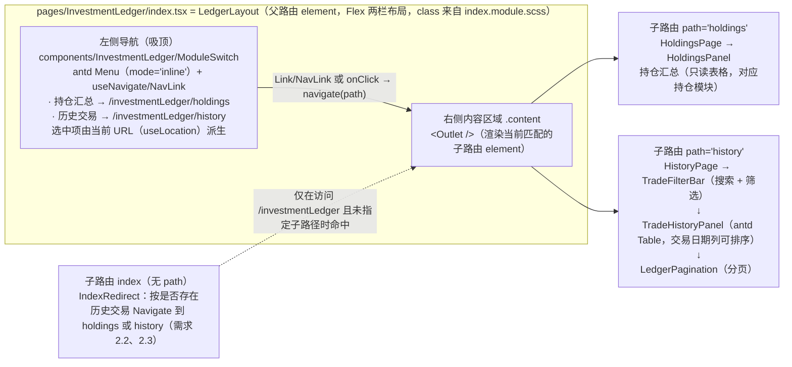
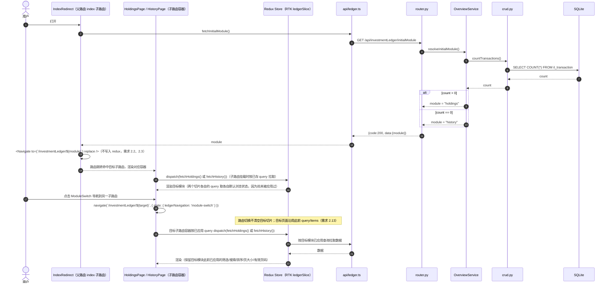
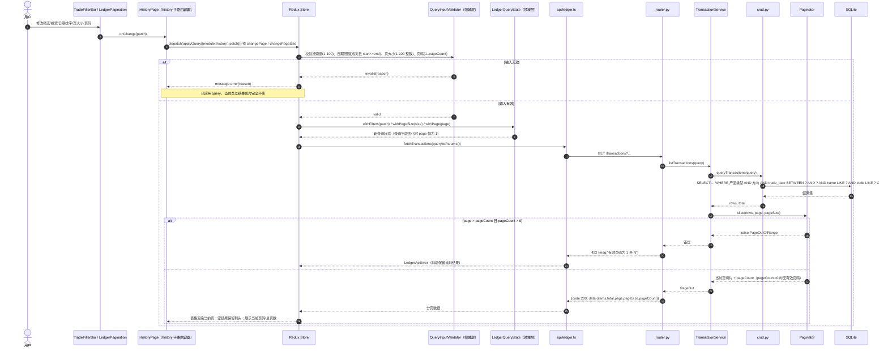
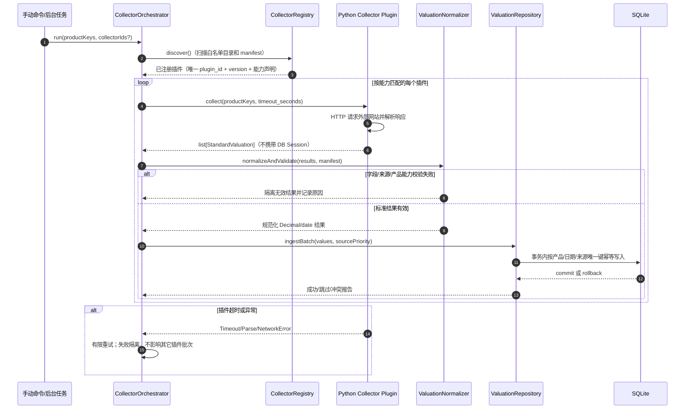

# 投资交易账本 设计文档

## Overview

（概述）

投资交易账本在现有 `various-data` 应用中新增一个独立功能模块：以「历史交易记录模块」作为交易数据的唯一用户写入入口（创建、删除、查询），以「持仓模块」作为只读的产品汇总视图。估值由受核心系统编排的外部采集器从天天基金网等数据源采集并写入估值表，账本业务只读最新估值并用于产品收益与投资组合统计；用户不能通过界面或账本公开 API 手动新增、校验或覆盖估值记录。

本设计严格以 [requirements.md](./requirements.md) 为唯一功能来源，分为**前端**与**后端**两大部分，遵循以下原则：

| 原则 | 落地方式 |
| --- | --- |
| 分层清晰 | 前端：领域层 / 状态层 / 容器层 / 展示层 / 通信层；后端：路由层 / 服务层 / 计算层 / 数据访问层 / 模型层 |
| 边界清晰 | 用户写操作只存在于历史交易入口；持仓模块无任何写接口；估值写入只允许内部采集任务通过采集服务进入，账本统计与公开 API 只读估值；不提供交易编辑接口（需求 1.4）；不提供按交易标识查询的接口（需求 2.23） |
| 低耦合 | 计算层与数据访问层零依赖（纯函数/纯对象）；前端领域层不依赖 React 与 antd；复用现有账本装配，目标只在路由、状态和估值摄取边界上做必要迁移 |
| 复用优先 | 后端沿用现有 FastAPI/SQLAlchemy/Pydantic 与模块装配；前端沿用现有 React、antd、axios、dayjs、Sass、RTK 和测试工具，不重复引入同类依赖 |
| OOP + 模块化 | 后端以 `Service` / `Calculator` / `Repository(crud)` 类与纯值对象组织；前端以 TypeScript class 组件 + 领域类（`LedgerQueryState`、`TradeDraftValidator`）组织，类型契约显式声明 |
| 类型安全 | 新增前端模块全部使用 TypeScript（`.ts` / `.tsx`），`strict: true`；后端 Pydantic v2 + SQLAlchemy `Mapped` 注解 |
| 代码标识符不使用中文 | 领域枚举一律以**英文常量码**定义并贯穿类型系统、JSON 线格式与数据库列值：产品类型 `WEALTH` / `FUND` / `STOCK`，交易方向 `BUY` / `SELL`；中文（理财/基金/股票、买入/卖出）仅作为**前端展示标签**，集中在展示映射层（见「前端设计 3.1」），面向用户的错误文案与界面文案仍为中文 |
| 定义自带注释 | 所有接口/类型/类/常量/字段/方法在代码中均带中文注释，说明含义、单位与格式（十进制字符串、`YYYY-MM-DD`、闭区间等）、可空语义及其对应需求条目 |
| 无行内样式 | 全部样式写入 `index.module.scss`（CSS Modules）或 `index.css`，与现有 webpack loader 规则一致；TS 下需配 `*.module.scss` 模块声明（见「前端设计 1.3」） |

### 调研结论（设计依据）

对现有代码的核查结果，直接决定了本设计的技术选型：

1. **前端 UI 依赖已齐备**（[package.json](../../../package.json)）：`react@18`、`antd@5.8`、`@ant-design/icons@5.2`、`react-redux@8`、`redux@4.2`、`redux-thunk@2.4`、`react-router-dom@6.4`、`axios@1.4`、`dayjs@1.11`、`echarts@5.3`、`normalize.css`、`rc-virtual-list`。→ UI、路由、HTTP、日期、样式能力**全部复用，无需新增**。
   - **状态管理改用 Redux Toolkit（新增依赖）**：既有 store 为 `createStore + combineReducers + applyMiddleware(redux-thunk)`（[store/index.js](../../../src/web/frontEnd/src/store/index.js)、[store/reducers/index.js](../../../src/web/frontEnd/src/store/reducers/index.js)）。本设计**引入 `@reduxjs/toolkit`**，新模块以 `createSlice` / `createAsyncThunk` / `createSelector` 编写，`redux.createStore` 在 redux 4.2 中已被标记为 deprecated，RTK 是官方推荐替代。
   - **版本兼容性核查**：RTK **2.x 与 redux 5.0 / react-redux 9.0 / redux-thunk 3.0 同步发布**，会要求升级这三个包（[RTK 2.0 迁移说明](https://github.com/reduxjs/redux-toolkit/blob/master/docs/usage/migrating-rtk-2.md)、[react-redux v9 发布说明](https://github.com/reduxjs/react-redux/discussions/2098)）；而本项目为 `redux@^4.2.0` + `react-redux@^8.0.2` + `redux-thunk@^2.4.1`。→ 因此固定选用 **`@reduxjs/toolkit@^1.9.7`**（1.9 线内置 redux 4.2 / reselect 4 / redux-thunk 2.4，peer 允许 react-redux 7/8），**不升级** redux 与 react-redux，避免连带的破坏性升级。（内容依据来源转述以符合许可要求。）
   - 金额计算不引入 `decimal.js`：前端只做展示与输入校验，所有金额与比率均由后端以 `Decimal` 计算后以**十进制字符串**下发，前端不做浮点运算。
2. **样式方案由 webpack 决定**（[webpack.config.js](../../../scripts/webpack.config.js)）：
   - `.css` → `style-loader + css-loader`（全局作用域）。
   - `.s[ac]ss` → `style-loader + css-loader(modules.auto: true, localIdentName: '[local]__[hash]') + sass-loader`。`modules.auto: true` 意味着**只有 `*.module.scss` 才会被编译为 CSS Modules**。
   - → 本功能新增样式统一使用 **`index.module.scss`**，通过 `styles.xxx` 引用，禁止 `style={{...}}`。
   - **在 TypeScript 中导入 `*.module.scss` 必须先声明模块类型**，否则 `tsc` 报 `TS2307: Cannot find module`。因此新增 `src/web/frontEnd/src/types/global.d.ts`（见「前端设计 1.3」）。
3. **构建链现状与 TypeScript 接入方式**（[webpack.config.js](../../../scripts/webpack.config.js)、[webpack.dev.config.js](../../../scripts/webpack.dev.config.js)、[package.json](../../../package.json)）：
   - babel-loader 规则为 `test: /\.js$/`，presets 仅 `['@babel/preset-react']`；**未配置 `resolve.extensions`**（webpack 默认 `['.js', '.json', '.wasm']`）；`webpack.dev.config.js` 只是 `Object.assign(config, { mode: 'development' })`，因此**所有 loader / resolve 改动只需改 `webpack.config.js` 一处，dev 配置自动继承**。
   - 现有代码为 ESM + JSX 纯 JS，且 `package.json` 含 `"type": "module"`，`import` 都写全 `.js` 后缀。
   - → 选择 **`@babel/preset-typescript` + 独立 `tsc --noEmit` 类型检查**，而**不用 `ts-loader`**：babel 只做语法剥离（不做类型检查），编译最快且与既有 babel-loader 管线同构，只需在同一条 rule 上加一个 preset；`ts-loader` 会在构建期做全量类型检查、需要单独维护 `transpileOnly` / `fork-ts-checker` 配置，且与已有 babel 管线并行两套语法处理，收益不足。类型安全由独立 `npm run type-check` 与 CI/回归验证保证。
   - → **增量接入**：`allowJs: true`、`checkJs` 不开启，既有 `.js` 文件**一个字都不改**，仅投资账本新模块使用 `.ts` / `.tsx`。
4. **后端模块惯例**（[app/](../../../src/web/backEnd/app/)）：
   - 每个业务模块是一个包，内部文件职责固定：`router.py` / `crud.py` / `models.py` / `schemas.py`（见 [sinaFinanceNews](../../../src/web/backEnd/app/sinaFinanceNews)）。
   - SQLAlchemy 2.0 风格：模块内自带 `class Base(DeclarativeBase)`，`Mapped` / `mapped_column` 注解，并在 [app/models.py](../../../src/web/backEnd/app/models.py) 的 `initAppModels()` 中仅用 `create_all` 补建缺失表；已有表升级由独立 `SchemaManager` 和版本化迁移负责，绝不依赖 `create_all`。
   - 会话由 [app/database.py](../../../src/web/backEnd/app/database.py) 的 `SessionLocal` 提供，通过 [app/dependencies.py](../../../src/web/backEnd/app/dependencies.py) 的 `get_db` 以 `Depends` 注入。
   - 路由在 [app/api.py](../../../src/web/backEnd/app/api.py) 汇聚到 `apiRouter = APIRouter(prefix="/api")`，由 [main.py](../../../src/web/backEnd/main.py) `include_router`。
   - 函数命名使用 **camelCase**（`getNews`、`addNews`、`initAppModels`），Pydantic v2（`from_attributes = True`）。→ 新模块沿用同样的命名与组织风格。
   - 账本读取路径通过 `getLatestValuations` 取每个产品估值日期最大的标准化估值；估值写入路径由 `valuation_ingest` 内部服务专属处理，负责标准结果校验、来源优先级、同日幂等和事务提交。采集脚本只实现稳定的 `ValuationCollector` 协议，不接触 SQLAlchemy Session 或账本数据库。
   - [Pipfile](../../../Pipfile) 已含 `fastapi` / `uvicorn` / `sqlalchemy`；**未含测试依赖**，测试依赖需在实现阶段以固定版本加入 `[dev-packages]`。
5. **本期边界**：估值外部采集、标准化、校验、幂等落库以及手动命令触发属于本设计范围；后台调度接口可先以可替换编排器抽象保留，具体 cron/Celery/APScheduler 部署属于后续扩展。requirements.md 未包含 CSV/Excel 导入导出，因此不设计通用导入导出流程。用户估值表单、账本公开估值写入入口和用户覆盖动作均明确不提供；交易编辑接口（需求 1.4）和按交易标识查询接口（需求 2.23）同样刻意不提供。

---

### 现有实现基线与本次修订边界

本次审查同时核对了仓库当前实现与 `requirements.md`。以下事实会影响设计落地：

- 当前仓库已经存在 `app/investmentLedger` 后端包、`pages/InvestmentLedger/index.tsx` 前端入口、RTK store 装配、账本组件以及测试依赖；因此文档中“新增”表示目标差距，不表示这些文件在仓库中尚不存在。
- 当前前端仍以单个 `/investmentLedger` 页面和 `activeModule` 状态承载两个模块，且 `switchModule` 会重置目标模块；这不满足需求 2.13。目标设计保留两个独立模块，但改由嵌套路由和导航意图承载：模块内切换必须保留目标状态，持仓入口和无导航上下文的历史深链接才执行重置/默认策略。
- 当前实现仍存在 `PUT /valuations`、`ValuationService`、`ValuationFormModal` 和估值维护按钮；这与引言及需求 3.18 的“无前端手动估值维护入口”冲突。它们属于待移除的过时实现，不是本设计允许继续暴露的接口。目标公开 API 仍只有交易写入与账本只读查询，估值写入必须迁移到下文的 `valuation_ingest` 受控边界。
- 当前 `il_valuation` 只有产品、日期和单价等基础字段，缺少来源标识、采集元数据和同日跨来源唯一键；需求 3.1、3.11-3.17 要求的来源优先级、采集器审计、故障隔离和幂等写入必须由目标模型与内部仓储补齐。
- 当前仓库已有产品历史范围字段的后端查询校验，但前端查询 DTO、`LedgerQueryState.toParams()`、路由导航和测试必须保持 `scopeProductType` 与 `scopeProductCode` 成对传递；范围只用于历史模块，不能被误并入普通搜索条件。
- 当前交易链路仍使用前端 `unitPrice` / `quantity`、后端 `unit_price` / `quantity`、`Integer` 数量列和交易价格恰两位小数校验；交易表单与历史表格也使用“交易单价/交易数量”静态标签。这与需求 1.1-1.3、2.12 不一致。目标实现应一次性迁移为 `transactionPrice` / `transactionQuantity` ↔ `transaction_price` / `transaction_quantity`，以无标度 `DecimalText` 保存并按产品类型校验；迁移期间不得保留一套语义重复的旧字段或以 UI 标签作为传输字段。
- **本次运行错误属于迁移缺失而非业务数据校验错误**：ORM 已查询 canonical 列 `il_transaction.transaction_price`，既有 SQLite 表仍可能只有旧列 `unit_price` / `quantity`；`SQLAlchemy metadata.create_all()` 只创建不存在的表，不会修改已存在表，因此不能作为 schema 升级机制。实现前必须按本文“schema 版本与迁移策略”完成备份、迁移和自检；开发环境发现不匹配时必须明确失败，禁止静默继续或直接删除生产列/表。
- 本次仅更新设计文档；不据此修改源代码、`requirements.md` 或 `tasks.md`。实现阶段必须先处理上述差距，再按本设计执行回归测试。

## Architecture

（架构）

### 总体架构



### 分层职责与依赖规则

| 层 | 职责 | 允许依赖 | 禁止依赖 |
| --- | --- | --- | --- |
| 前端 展示层 | 渲染 antd 组件、把用户事件回调给容器；不含业务规则 | 领域层常量 | store、api |
| 前端 容器层 | `connect` store、组装面板、下发 thunk；不含计算公式 | 状态层、领域层、展示层 | api（一律经 thunk） |
| 前端 状态层 | 保存「已应用查询状态」「列表数据」「表单草稿与字段错误」；`createAsyncThunk` 中调用 api | RTK、领域层、通信层 | React、antd（`message` 提示由容器/组件负责） |
| 前端 领域层 | 查询状态转换规则、输入校验规则、枚举常量（纯 TS 类/纯函数，可单测与属性测试） | 无（仅 TS 类型） | 一切框架（含 RTK） |
| 前端 通信层 | axios 实例、统一响应解包与错误归一 | 无 | store |
| 后端 路由层 | 公开 HTTP 语义、参数绑定与依赖注入、响应模型；只暴露交易写入和账本/统计读取 | 服务层、schemas | crud、models、采集器实现、估值写入服务 |
| 后端 账本服务层 | 交易用例、只读持仓/组合编排、事务边界 | 计算层、数据访问层、schemas | HTTP 对象、采集脚本 |
| 后端 采集编排层 | 发现白名单插件、能力匹配、并发/顺序执行、超时、重试、失败隔离与日志 | collector protocol、registry、valuation ingest | 前端、采集脚本数据库连接 |
| 后端 估值摄取层 | 标准结果校验、来源优先级、同日幂等冲突处理、单事务落库 | ValuationRepository、标准值对象 | 公开路由、外部 HTTP、前端 |
| 后端 计算层 | 统计公式与分页切片，纯 `Decimal` 运算 | 值对象 | Session、schemas |
| 后端 数据访问层 | 交易读写与估值读取；估值写入仅由 `ValuationRepository` 内部调用 | 模型层 | 路由、采集脚本 |
| 后端 模型层 | 表结构、约束、`DecimalText` 类型 | 无 | 其它层 |
| 后端 Schema 管理层 | 读取 schema 版本、检查 `il_transaction` 实际列、执行受控迁移与启动门禁 | `database.py`、SQLAlchemy Inspector、迁移脚本 | 路由业务、自动删除生产数据 |
| 后端 可观测性与异常边界 | 统一 logging、request/trace id、异常分类、脱敏和统一 JSON 响应 | FastAPI middleware/exception handlers、Python logging | `print`、返回 SQL/堆栈/敏感请求内容 |

### 与既有代码的装配点与目标差距

当前 `app/api.py`、`app/models.py`、根 store 和账本页面已经完成基础装配；下表保留目标装配契约，并标出仍需为本需求补齐的边界。

| 文件 | 追加内容 |
| --- | --- |
| [app/api.py](../../../src/web/backEnd/app/api.py) | 当前已注册 `ledgerRouter`；实现阶段仅在移除过时估值写路由后保持该注册，不重复追加 |
| [app/models.py](../../../src/web/backEnd/app/models.py) | 当前仅负责导入模型并执行 `create_all` 以创建缺失的新表；目标实现必须在其前后调用独立 `SchemaManager` 做版本读取、实际列自检和迁移门禁，`create_all` 不得承担已有表升级，也不得新增第二个静默初始化路径 |
| [app/database.py](../../../src/web/backEnd/app/database.py) | `Engine` / `SessionLocal` 创建后提供给 `SchemaManager` 和 `get_db`；暴露数据库路径的服务端诊断标签，不向响应/生产日志泄露连接字符串 |
| [main.py](../../../src/web/backEnd/main.py) | lifespan 顺序为 `configureLogging` → `SchemaManager.checkOrMigrate()` → `initAppModels()` → 注册 middleware/`registerLedgerExceptionHandlers(app)`；schema 门禁失败时不启动 HTTP 服务 |
| [frontEnd/src/router.js](../../../src/web/frontEnd/src/router.js) | 当前仅有单一 `/investmentLedger` 入口；目标改为父路由 + `holdings` / `history` 子路由和 index 重定向，补充导航意图（需求 2.1、2.13、2.14） |
| [frontEnd/src/main.js](../../../src/web/frontEnd/src/main.js) | 当前已复用 TypeScript store 入口；保持现有 import 解析，不再把该文件描述为必然改动 |
| [frontEnd/src/store/index.ts](../../../src/web/frontEnd/src/store/index.ts) | 当前已使用 `configureStore({ reducer: { news, stock, crawlers, ledger } })` 并导出 `RootState` / `AppDispatch`；保持现有装配 |
| [frontEnd/src/store/reducers/index.js](../../../src/web/frontEnd/src/store/reducers/index.js) | 当前根 store 已不再依赖该合并层；既有 `news.js` / `stock.js` / `crawlers.js` 保持零改动 |
| [scripts/webpack.config.js](../../../scripts/webpack.config.js) | 当前已支持 TS/TSX 扩展名与 `@babel/preset-typescript`；保持该配置，`webpack.dev.config.js` 继续复用 |
| [package.json](../../../package.json) | 当前已包含 RTK、TypeScript 工具链、测试依赖及 `build:web` / `type-check` / `test` 脚本；保持版本兼容性，不重复新增 |
| `tsconfig.json`（仓库根） | 当前已存在增量接入配置；保持 `strict`、`allowJs`、`checkJs: false` 和 `noEmit` 约束 |

其中 `app/api.py`、`app/models.py` 和根 store 的基础注册已经存在；实现阶段不重复注册。当前路由仍是单页入口，需按目标嵌套路由补齐导航意图；当前估值写入路由和表单则必须删除/迁移，而不是继续追加到装配点。

---

## Components and Interfaces

（组件与接口总览：下面两节「前端设计」「后端设计」分别展开细节）

| 侧 | 模块 | 主要类型 / 接口 | 对外契约 |
| --- | --- | --- | --- |
| 前端 | `pages/InvestmentLedger` | `LedgerLayout`（`index.tsx`，父路由布局）、`IndexRedirect`（默认重定向）、`HoldingsPage`、`HistoryPage`（两个子路由容器） | 两个子路由承载两个独立模块，`LedgerLayout` 渲染 `ModuleSwitch` + `<Outlet />` |
| 前端 | `components/InvestmentLedger` | `TradeHistoryPanel`、`HoldingsPanel`、`TradeFilterBar`、`TradeFormModal`、`PortfolioSummary`、`MetricValue`、`LedgerPagination`（均为 `.tsx`，props 接口显式声明） | props 入、回调出，无自有请求 |
| 前端 | `store/ledger` | `ledgerSlice`（`createSlice`）、`createAsyncThunk` 集合、`createSelector` 选择器 | `state.ledger` 形状见「前端设计 4」 |
| 前端 | `domain/ledger` | `LedgerQueryState`、`TradeDraftValidator`、`QueryInputValidator`、`constants`（英文枚举码）、`labels`（码→中文展示映射） | 纯函数/纯类，可独立测试 |
| 前端 | `api` | `request.ts`（axios 实例 + 泛型解包）、`ledger.ts`（6 个函数）、`types.ts`（DTO 接口） | 唯一 HTTP 出口 |
| 后端 | `investmentLedger/router.py` | `APIRouter(prefix="/investmentLedger")` | 6 个公开接口，全部为交易写入或账本只读查询；无估值写接口，见「后端设计 4」 |
| 后端 | `investmentLedger/service.py` | `TransactionService`、`HoldingService`、`OverviewService` | 账本用例方法，估值仅读取 |
| 后端 | `investmentLedger/valuation_ingest/` | `ValuationCollector`、`CollectorManifest`、`CollectorRegistry`、`CollectorOrchestrator`、`ValuationNormalizer`、`ValuationRepository` | 内部命令/后台任务入口；不注册到前端 API |
| 后端 | `investmentLedger/calculators.py` | `ProductPerformanceCalculator`、`PortfolioCalculator`、`Paginator` | 纯 `Decimal` 计算，无 I/O |
| 后端 | `investmentLedger/crud.py` | `queryTransactions`、`countTransactions`、`addTransaction`、`removeTransaction`、`getLatestValuations` | 账本数据动作；估值读取，不向公开服务暴露写动作 |
| 后端 | `investmentLedger/models.py` · `types.py` | `Transaction`、`Valuation`、`DecimalText` | 表结构见「Data Models」 |
| 后端 | `investmentLedger/schemas.py` | `ApiResponse`、`Metric`、`TransactionCreate/Out/Query`、`HoldingQuery/Out`、`PageOut`、`PortfolioStatisticsOut`、`InitialModuleOut` | 请求/响应契约 |
| 后端 | `investmentLedger/exceptions.py` | `LedgerError` 体系 + `registerLedgerExceptionHandlers(app)` | 统一错误响应、OperationalError/schema 异常分类、敏感信息不外泄 |
| 后端 | `investmentLedger/schema.py` · `migrations/` | `SchemaManager`、`SchemaStatus`、版本迁移脚本 | 启动自检、受控 check/migrate、备份、事务/回滚；不依赖 `create_all` 升级 |
| 后端 | `investmentLedger/logging.py` | `configureLogging`、`RequestContextMiddleware`、`SensitiveDataFilter` | `log/various_data.log` + 可选控制台；开发 DEBUG/生产 INFO-WARNING；统一字段 |

---

## 前端设计（Front-End）

### 1. 技术栈与依赖

#### 1.1 能力与依赖对照

| 能力 | 采用方案 | package.json 现状 | 是否新增 |
| --- | --- | --- | --- |
| UI 框架 | React 18 class 组件 | `react@^18.1.0`、`react-dom@^18.1.0` | 否（复用） |
| 组件库 | antd 5（`Table`、`Form`、`Select`、`DatePicker.RangePicker`、`InputNumber`、`Input.Search`、`Modal`、`Pagination`、`Radio.Group`、`Descriptions`、`Popconfirm`、`Tooltip`、`message`） | `antd@^5.8.4` | 否（复用；antd 5 自带 TS 类型） |
| 图标 | `@ant-design/icons` | `^5.2.5` | 否（复用，自带类型） |
| 状态管理（容器绑定） | react-redux `connect` | `react-redux@^8.0.2` | 否（复用；**v8 自带 TS 类型**，不需要 `@types/react-redux`） |
| 状态管理（store / 切片） | **Redux Toolkit**：`configureStore`、`createSlice`、`createAsyncThunk`、`createSelector` | `@reduxjs/toolkit@^1.9.7` | 否（当前已具备，保持 1.9 线） |
| redux 内核 / thunk | 由 RTK 1.9 内置复用（`redux@4.2`、`redux-thunk@2.4`、`reselect@4`） | `redux@^4.2.0`、`redux-thunk@^2.4.1` | 否（保持现版本，**不升级**） |
| 路由 | react-router-dom Hash Router（沿用 `createHashRouter`） | `^6.4.4` | 否（复用，自带类型） |
| HTTP | axios 实例 + 拦截器（泛型响应） | `axios@^1.4.0` | 否（复用，自带类型） |
| 日期 | dayjs（antd 5 的 DatePicker 原生使用 dayjs） | `^1.11.9` | 否（复用，自带类型） |
| 样式 | Sass + CSS Modules（`*.module.scss`） | `sass`、`sass-loader`、`css-loader`、`style-loader` | 否（复用） |
| 语言与类型检查 | **TypeScript**（`tsc --noEmit`）+ `@babel/preset-typescript`（编译期仅剥离类型） | `typescript@^5.4.5`、`@babel/preset-typescript@^7.24.0` | 否（当前已具备） |

**依赖清单与当前基线（相对上一版设计的修订：这些依赖已存在于仓库）**

| 依赖 | 版本 | 位置 | 理由 |
| --- | --- | --- | --- |
| `@reduxjs/toolkit` | `^1.9.7` | dependencies | 官方推荐的 redux 写法：`createSlice` 用 immer 消除手写不可变更新、`createAsyncThunk` 统一 pending/fulfilled/rejected 三态、`configureStore` 默认内置 thunk 与 DevTools。固定 1.9 线以兼容 `redux@4.2` + `react-redux@8`（RTK 2.x 需 redux 5 / react-redux 9） |
| `typescript` | `^5.4.5` | devDependencies | 类型检查器；`moduleResolution: "bundler"` 需要 TS ≥ 5.0 |
| `@babel/preset-typescript` | `^7.24.0` | devDependencies | 让既有 babel-loader 直接处理 `.ts` / `.tsx`（仅剥离类型，零运行时开销），避免引入 `ts-loader` 造成两套语法管线 |
| `@types/react` | `^18.2.79` | devDependencies | React 18 类型（`React.Component`、`ReactNode`、事件类型）；react-redux 8 的类型也依赖它 |
| `@types/react-dom` | `^18.2.25` | devDependencies | `react-dom/client` 的 `createRoot` 类型（供 `main` 及测试使用） |

**明确不新增**：

- `@types/react-redux`：react-redux **v8 起自带类型声明**，官方已将 `@types/react-redux` 标为 stub，安装反而可能与自带类型冲突。
- `ts-loader` / `fork-ts-checker-webpack-plugin`：见「调研结论 3」的取舍说明。
- `decimal.js`：金额/比率不在前端参与运算（后端以字符串下发）。
- `@types/node`：前端源码不使用 Node API；webpack 配置文件保持 `.js`，不纳入类型检查。
- 额外表格库：antd `Table` + `Pagination` 已满足分页与排序。

#### 1.2 `tsconfig.json`（仓库根，新增）

采用**增量接入**策略：`allowJs: true` 让既有 `.js` 文件仍可被解析与引用，`checkJs` 不开启因此**不会对既有 JS 产生任何报错**；只有本模块新增的 `.ts` / `.tsx` 受 `strict: true` 约束。

```jsonc
{
  "compilerOptions": {
    "target": "ES2020",              // 目标语法层级；babel 才是真正的降级者，此项只影响类型检查时的内置库假设
    "lib": ["ES2020", "DOM", "DOM.Iterable"],  // 浏览器环境：需要 DOM 与可迭代 NodeList 类型
    "module": "ESNext",              // 保留 ESM 语法交给 webpack 做 tree-shaking
    "moduleResolution": "bundler",   // 由 webpack 负责解析；import 允许不写扩展名
    "jsx": "react",                  // 与 babel @babel/preset-react 的默认 classic runtime 一致
    "strict": true,                  // 新模块的类型底线：严格空检查、严格函数参数等全开
    "noUncheckedIndexedAccess": true,// 索引访问返回 T | undefined，逼迫处理越界（分页切片场景直接受益）
    "noImplicitOverride": true,      // class 组件覆写 render/componentDidMount 必须显式 override
    "exactOptionalPropertyTypes": false, // 关闭：草稿类型大量使用 `?: T | null`，开启会与 antd 受控值互相打架
    "isolatedModules": true,         // 与 babel 单文件转译语义对齐：类型导入需写 import type
    "verbatimModuleSyntax": false,   // 关闭以兼容既有 CommonJS 风格依赖的默认导入
    "noEmit": true,                  // 产物由 webpack + babel 生成，tsc 只做类型检查
    "allowJs": true,                 // 既有 .js 文件可被 TS 解析与 import
    "checkJs": false,                // 不检查既有 .js，避免历史代码报错
    "esModuleInterop": true,         // 允许 `import axios from 'axios'` 这类默认导入互操作
    "allowSyntheticDefaultImports": true, // 无默认导出的模块也可默认导入（类型层面）
    "resolveJsonModule": true,       // 允许 import *.json（配置类静态数据）
    "forceConsistentCasingInFileNames": true, // Windows 开发 + Linux 部署，防止大小写不一致的路径漂移
    "skipLibCheck": true,            // 跳过 node_modules 的 .d.ts 检查，缩短 type-check 时间
    "baseUrl": ".",                  // 路径别名的解析基准（仓库根）
    "paths": {
      "@ledger/*": ["src/web/frontEnd/src/*"]  // 可选便利别名；需与 webpack resolve.alias 保持一致
    }
  },
  "include": ["src/web/frontEnd/src/**/*"],    // 只纳入前端源码，避免检查 webpack 配置等 Node 侧脚本
  "exclude": ["node_modules", "dist", "scripts"]
}
```

约定说明：

- **`jsx: "react"`（classic）而非 `react-jsx`**：项目 babel 只配了 `@babel/preset-react` 且未开启 `runtime: 'automatic'`，因此 JSX 会编译为 `React.createElement`。为保持与既有文件一致且不改动 babel 的 React 行为，新 `.tsx` 文件**必须 `import React from 'react'`**。若日后将 preset-react 切到 `runtime: 'automatic'`，则同步把此项改为 `react-jsx`。
- **`isolatedModules: true`**：babel 逐文件转译，无法感知跨文件类型信息。因此类型-only 导入必须写 `import type { ... } from '...'`，且**不使用 `const enum`**（本设计的枚举一律用 `as const` 对象 + 联合类型，见 3 节）。
- **`paths` 别名**：webpack 侧需同步 `resolve.alias`；若不希望维护两处映射，可只用相对路径导入而不使用该别名（本设计的示例代码全部使用相对路径，别名为可选便利）。
- **import 扩展名规则**：既有 `.js` 文件写全 `.js` 后缀（ESM 风格），**新增 TS 文件的 import 一律不写扩展名**（`import LedgerQueryState from '../../domain/ledger/LedgerQueryState'`）。二者可共存，因为解析工作由 webpack `resolve.extensions` 完成，`moduleResolution: "bundler"` 也不要求扩展名。TS 文件引用**既有 JS 文件**时保留其 `.js` 后缀写法（如 `import store from './store/index'` 为新文件、`import { getNews } from '../../store/actions.js'` 为旧文件）。

#### 1.3 `src/web/frontEnd/src/types/global.d.ts`（新增）

CSS Modules 与静态资源在 TS 中没有内置类型，必须声明，否则 `tsc --noEmit` 会在 `import styles from './index.module.scss'` 处报错：

```ts
// types/global.d.ts —— 全局环境声明（无 import/export 顶层语句，故为全局脚本）

/** CSS Modules（Sass）：webpack 的 modules.auto 只对 *.module.scss 生效，故默认导出为「原类名 → 编译后类名」映射 */
declare module '*.module.scss' {
  /** 只读的类名映射表；键为源文件中书写的类名 */
  const classes: { readonly [key: string]: string };
  export default classes;
}

/** CSS Modules（原生 css）：同上，便于日后新增 *.module.css */
declare module '*.module.css' {
  const classes: { readonly [key: string]: string };
  export default classes;
}

// 既有全局样式以副作用方式导入（import './index.css'），无默认导出，声明为无形状模块即可
declare module '*.css';
declare module '*.scss';
```

> 「避免行内样式」的项目规范不变：所有样式仍写在 `index.module.scss` 中，通过 `styles.xxx` 引用，组件里不出现 `style={{...}}`。上述声明文件正是为了让该规范在 TS 下仍然通过类型检查。

#### 1.4 webpack 改动（仅改 `scripts/webpack.config.js`）

`webpack.dev.config.js` 通过 `Object.assign(config, { mode: 'development' })` 继承同一份配置，因此**无需改动 dev 配置**。改动共两处：

```diff
 export default {
     entry: path.join(ROOT_PATH, 'src/web/frontEnd/src/main.js'),
+    resolve: {
+        // 默认值为 ['.js', '.json', '.wasm']，必须显式加入 TS 扩展名，
+        // 否则新 TS 文件的无扩展名 import 无法解析
+        extensions: ['.ts', '.tsx', '.js', '.jsx', '.json'],
+        alias: {
+            // 与 tsconfig.json 的 paths 对应（可选）
+            '@ledger': path.join(ROOT_PATH, 'src/web/frontEnd/src'),
+        },
+    },
     module: {
         rules: [
             {
-                test: /\.js$/,
+                // 同时覆盖既有 .js / .jsx 与新增 .ts / .tsx
+                test: /\.[jt]sx?$/,
                 exclude: /(node_modules|bower_components)/,
                 use: {
                     loader: 'babel-loader',
                     options: {
-                        presets: ['@babel/preset-react']
+                        // @babel/preset-typescript 内部按文件扩展名启用，
+                        // 对既有 .js 文件不产生任何行为变化
+                        presets: ['@babel/preset-react', '@babel/preset-typescript']
                     }
                 }
             },
```

- CSS / Sass 两条 rule **完全不动**，`modules.auto: true` 继续只对 `*.module.scss` 生效。
- `entry` 保持 `main.js`（既有文件不改）；新模块由 `router.js` 以 `import` 引入，webpack 顺着依赖图自动编译 `.tsx`。
- 若日后把 `main.js` / `router.js` 迁到 TS，只需改扩展名，本配置无需再动。

#### 1.5 `package.json` 目标契约（当前仓库已具备）

仓库当前已经包含 RTK、TypeScript、Babel TypeScript preset、类型声明、Vitest、fast-check 和 Testing Library；下列脚本/版本是设计契约，后续实现只需保持一致，不应重复添加或升级为 RTK 2.x：

- 运行时保持 `@reduxjs/toolkit@^1.9.7`，与现有 `redux@^4.2.0`、`react-redux@^8.0.2`、`redux-thunk@^2.4.1` 兼容。
- 保持 `build:web`、`type-check` 和一次性 `test: vitest --run` 脚本；现有 `dev:web` 的 watch 行为仅用于开发，不作为验证命令。
- 保持 `typescript@^5.4.5`、`@babel/preset-typescript@^7.24.0`、React 18 类型声明，以及当前固定版本的 Vitest/fast-check 测试工具。
- 不修改既有 `dev:server` 的实际启动参数；文档不再假定旧的 `src.web.backEnd.main:app` 命令形式。

### 2. 目录结构（目标结构与现状差距）

当前仓库已经有账本页面、组件、store、API 和领域目录；下列结构是完成需求 2.1、2.13、2.14 及需求 3.10-3.18 后的目标拆分。实现时应优先移动/复用现有组件，而不是复制一套并行实现。

```
tsconfig.json                            # 新增：TS 增量接入配置（仓库根）
src/web/frontEnd/src/
├── types/
│   └── global.d.ts                     # 新增：*.module.scss 等模块声明
├── api/
│   ├── index.js                        # 既有，不改动（legacy JS）
│   ├── types.ts                        # 新增：后端 DTO 接口（camelCase，与 Pydantic 输出对齐）
│   ├── request.ts                      # 新增：axios 实例 + 泛型解包拦截器 + LedgerApiError
│   └── ledger.ts                       # 新增：账本 API 客户端（唯一 HTTP 出口）
├── domain/ledger/                      # 新增：纯 TS 领域层（无 React / antd / axios / RTK）
│   ├── constants.ts                    # 英文枚举码（WEALTH/FUND/STOCK、BUY/SELL）、页大小边界（as const + 联合类型）
│   ├── labels.ts                       # 展示标签映射：码 → 中文文案 + antd 选项生成器（仅展示用）
│   ├── LedgerQueryState.ts             # 浏览状态值对象（readonly 字段，含重置/翻页规则）
│   ├── TradeDraftValidator.ts          # 交易草稿校验（需求 1.2）
│   └── QueryInputValidator.ts          # 搜索值/日期范围/页大小/页码校验（需求 2.20/2.21/2.26/2.30）
├── store/
│   ├── index.ts                        # 改写：configureStore + RootState/AppDispatch（原 index.js 删除）
│   ├── actions.js                      # 既有，不改动
│   ├── actionTypes.js                  # 既有，不改动
│   ├── reducers/
│   │   ├── news.js                     # 既有，零改动
│   │   ├── stock.js                    # 既有，零改动
│   │   └── crawlers.js                 # 既有，零改动
│   │   # reducers/index.js 删除：combineReducers 由 configureStore 的 reducer 映射替代
│   └── ledger/                         # 新增：RTK 切片
│       ├── types.ts                    # LedgerState / LedgerQuerySnapshot / 表单状态类型
│       ├── thunks.ts                   # createAsyncThunk 定义
│       ├── ledgerSlice.ts              # createSlice（reducers + extraReducers）
│       └── selectors.ts                # createSelector 派生选择器
├── pages/InvestmentLedger/              # 新增：容器（父路由布局 + 两个子路由页面）
│   ├── index.tsx                       # LedgerLayout：父路由 element，渲染 ModuleSwitch + <Outlet />
│   ├── index.module.scss
│   ├── IndexRedirect.tsx               # 父路由 index 子路由：根据是否存在历史交易决定默认重定向目标（需求 2.2、2.3）
│   ├── HoldingsPage/index.tsx          # /investmentLedger/holdings 子路由 element：渲染 HoldingsPanel
│   └── HistoryPage/index.tsx           # /investmentLedger/history 子路由 element：渲染 TradeFilterBar + TradeHistoryPanel + LedgerPagination
├── components/InvestmentLedger/         # 新增：展示组件（每个组件显式声明 Props 接口）
│   ├── ModuleSwitch/{index.tsx,index.module.scss}
│   ├── TradeHistoryPanel/{index.tsx,index.module.scss}
│   ├── HoldingsPanel/{index.tsx,index.module.scss}
│   ├── TradeFilterBar/{index.tsx,index.module.scss}
│   ├── TradeFormModal/index.tsx
│   ├── PortfolioSummary/{index.tsx,index.module.scss}
│   ├── MetricValue/{index.tsx,index.module.scss}
│   └── LedgerPagination/index.tsx
└── router.js                            # 既有，追加 /investmentLedger 父路由与 holdings/history 两个子路由（import 无扩展名）
```

#### 2.1 页面整体布局与导航映射

本节是需求 2.1「THE 投资交易账本 SHALL 将持仓模块和历史交易记录模块提供为两个独立的用户界面模块」在视觉与导航层面的设计落地方案；不新增验收标准，仅描述现有目录结构中各组件如何组合成最终页面。与之相关的还有需求 2.2/2.3（默认打开哪个模块）、2.13（直接切换保留目标模块状态）、2.16-2.19（筛选/搜索/排序）与 2.24（分页），这些行为已在「前端设计 4」「前端设计 7」中定义，本节只补充它们在页面上的**布局位置**与**导航方式**，不改变其行为契约。

**导航方式：两个子路由，而非内部状态切换**。持仓模块与历史交易记录模块分别对应 `#/investmentLedger/holdings` 与 `#/investmentLedger/history` 两个子路由（命名沿用 `router.js` 现有的 camelCase 路径风格，如 `/chartWithNews`、`/crawlersAdmin`）；当前显示哪个模块由 **URL 决定**，不再由 redux 中的 `activeModule` 字段决定。`router.js` 使用 `createHashRouter` 的嵌套路由能力：父路由 `/investmentLedger` 的 `element` 为 `pages/InvestmentLedger/index.tsx`（`LedgerLayout`，布局容器），其内部渲染左侧导航 + `<Outlet />`；两个子路由的 `element` 分别是 `HoldingsPage`（渲染 `HoldingsPanel`）与 `HistoryPage`（渲染 `TradeFilterBar` + `TradeHistoryPanel` + `LedgerPagination`）：



对应的页面结构示意：

```
┌──────────────────────────────────────────────────────────┐
│ pages/InvestmentLedger/index.tsx = LedgerLayout（父路由）  │
│ .layout（Flex 容器）                                       │
│ ┌───────────┬────────────────────────────────────────────┐│
│ │ .sider    │ .content：<Outlet />                        ││
│ │ 吸顶导航   │                                              ││
│ │           │ URL = /investmentLedger/holdings：            ││
│ │ ▸ 持仓汇总 │   HoldingsPage → HoldingsPanel（只读汇总表） ││
│ │   历史交易 │                                              ││
│ │           │ URL = /investmentLedger/history：              ││
│ │           │   HistoryPage →                                ││
│ │           │   TradeFilterBar（产品类型/交易方向筛选、       ││
│ │           │     交易日期范围、产品名称/代码搜索）             ││
│ │           │   TradeHistoryPanel（逐行交易，支持按交易       ││
│ │           │     日期列排序）                                ││
│ │           │   LedgerPagination（页大小 10/20/50 + 自        ││
│ │           │     定义页大小 + 页码）                          ││
│ │           │                                                 ││
│ │           │ URL = /investmentLedger（无子路径）：            ││
│ │           │   IndexRedirect → 按是否存在历史交易             ││
│ │           │   Navigate 到 holdings 或 history（需求 2.2/2.3）││
│ └───────────┴────────────────────────────────────────────────┘│
└──────────────────────────────────────────────────────────────┘
```

**导航入口、路由与组件的映射关系**：

| 导航入口 | 子路由路径 | 对应模块码（`domain/ledger/constants.ts` 的 `LedgerModule`） | 子路由渲染的组件 | 对应需求 |
| --- | --- | --- | --- | --- |
| 持仓汇总 | `/investmentLedger/holdings` | `holdings` | `HoldingsPage` → `HoldingsPanel`（持仓模块，只读） | 2.1、2.4-2.8 |
| 历史交易 | `/investmentLedger/history` | `history` | `HistoryPage` → `TradeFilterBar` + `TradeHistoryPanel` + `LedgerPagination`（历史交易记录模块） | 2.1、2.11、2.12、2.16-2.19、2.24 |

**`ModuleSwitch` 的职责调整为「路由高亮 + 路由导航」**：`ModuleSwitch` 仍由展示层的 antd `Menu`（`mode="inline"`）渲染两个 `Menu.Item`（对应 `holdings` / `history`），但职责从「派发 redux action 切换内部状态」调整为：

1. **高亮**：菜单的 `selectedKeys` 由当前路由派生，而不是由 redux 的模块字段派生。容器用 `react-router-dom` 的 `useLocation()`（或 `useMatch`）取当前路径，映射出应高亮的 `key`（`holdings` 或 `history`），作为 `ModuleSwitchProps.activeModule` 传入——**该 prop 的取值来源变了（路由而非 redux），但字段本身语义不变**，`ModuleSwitch` 组件内部实现不需要感知这一变化。
2. **导航**：`Menu.Item` 点击后不再 `dispatch(switchModule(...))`，而是导航到对应子路由。实现可二选一（本设计采用第一种，理由见下）：
   - **antd `Menu` 的 `items` + `onClick` 结合 `useNavigate`**：`onClick={({ key }) => navigate(`/investmentLedger/${key}`, { state: { ledgerNavigation: 'module-switch' } })}`；
   - 或 `Menu.Item` 内嵌 `react-router-dom` 的 `Link`/`NavLink`。

   **采纳 `useNavigate` 方案**：antd `Menu` 的 `selectedKeys` 高亮机制与 `Link` 包裹的可点击区域在样式上需要额外处理才能对齐（`Link` 默认渲染 `<a>`，与 `Menu.Item` 的点击区域重叠时需要 `style={{ color: 'inherit' }}` 之类的样式覆盖，容易违反「无行内样式」约束）；`onClick + useNavigate` 让 `Menu.Item` 保持原生渲染与样式，纯粹在事件回调里调用路由 API，改动面最小且不引入行内样式。

   `ModuleSwitchProps` 从「向容器上抛模块码，由容器 dispatch action」调整为「向容器上抛模块码，由容器调用 `navigate`」：

   ```ts
   /** 模块切换器：两个独立子路由之间的唯一切换入口（需求 2.1、2.13） */
   export interface ModuleSwitchProps {
     /** 当前应高亮的模块码；由容器根据当前路由（useLocation）派生，不再来自 redux */
     activeModule: LedgerModule;
     /** 切换回调；容器使用带 ledgerNavigation='module-switch' 的 navigate，目标切片不得重置 */
     onSwitch: (module: LedgerModule) => void;
   }
   ```

   容器内实现示意（`pages/InvestmentLedger/index.tsx`）：

   ```tsx
   const navigate = useNavigate();
   const location = useLocation();
   const activeModule: LedgerModule = location.pathname.endsWith('/history') ? 'history' : 'holdings';
   const handleSwitch = (module: LedgerModule) => navigate(
     `/investmentLedger/${module}`,
     { state: { ledgerNavigation: 'module-switch' } },
   );
   // <ModuleSwitch activeModule={activeModule} onSwitch={handleSwitch} />
   ```

菜单项的中文文案为导航专用静态文案，与「前端设计 3.1」中产品类型/交易方向的展示标签映射（`labels.ts`）是不同的关注点，不写入 `labels.ts`。

**历史交易记录模块的表格能力**：历史交易记录模块在 `/investmentLedger/history` 子路由对应的内容区域中始终以“一个表格”的形式呈现，搜索、筛选、排序均由已有组件组合完成，本节不新增任何组件：

- **搜索 + 筛选**：`TradeFilterBar` 提供产品名称/产品代码搜索（`Input.Search`）与产品类型、交易方向、交易日期范围筛选（`Select`、`Radio.Group`、`DatePicker.RangePicker`），置于表格上方；提交前经 `QueryInputValidator` 校验（需求 2.20、2.21）。
- **排序**：`TradeHistoryPanel` 的交易日期列启用 antd `Table` 原生 `sorter`，触发 `onSortChange`（需求 2.15）。
- **分页**：`LedgerPagination` 置于表格下方，提供页大小 10/20/50 与自定义页大小（需求 2.24-2.31）。

三者在 `HistoryPage`（`history` 子路由的 element）内垂直堆叠（`TradeFilterBar` → `TradeHistoryPanel` → `LedgerPagination`）；`HoldingsPage`（`holdings` 子路由的 element）渲染 `HoldingsPanel`。两个子路由页面各自 `connect` 到 `store/ledger` 中对应模块的切片（`state.ledger.history` / `state.ledger.holdings`），`TradeHistoryPanel` 自身不发请求、不内置筛选/排序状态（状态来自 `store/ledger`，见「前端设计 4」）。

**默认重定向规则（需求 2.2、2.3）与父路由装配**：`router.js` 的父路由不再直接渲染唯一的账本页面，而是承载一个 `index` 子路由（无 `path`，仅在访问 `/investmentLedger` 且未指定 `holdings`/`history` 子路径时命中），其 `element` 为 `pages/InvestmentLedger/IndexRedirect.tsx`——一个轻量的重定向组件：挂载时直接调用 `api/ledger.ts` 的 `fetchInitialModule()`（不经过 redux）判定是否存在已保存的历史交易，再用 `react-router-dom` 的 `<Navigate to={...} replace />` 跳转到 `holdings` 或 `history`：

```tsx
// pages/InvestmentLedger/IndexRedirect.tsx（父路由的 index 子路由 element）
// 需求 2.2：不存在历史交易时默认打开历史交易记录模块；需求 2.3：存在时默认打开持仓模块。
// 判定过程中渲染骨架屏，不做任何重定向；判定完成后用 Navigate 一次性跳转到目标子路由。
const IndexRedirect: React.FC = () => {
  const [target, setTarget] = useState<LedgerModule | null>(null);
  useEffect(() => {
    fetchInitialModule().then(({ module }) => setTarget(module)); // module: 'holdings' | 'history'
  }, []);
  if (target === null) return <Skeleton active />;
  return <Navigate to={`/investmentLedger/${target}`} replace />;
};
```

`router.js` 的嵌套路由结构：

```js
// router.js（既有 JS 文件）：父路由 + 两个子路由 + index 子路由承担默认重定向
{
  path: '/investmentLedger',
  element: <InvestmentLedger />,        // LedgerLayout：渲染 ModuleSwitch + <Outlet />
  children: [
    { index: true, element: <IndexRedirect /> },   // 需求 2.2、2.3：按是否存在历史交易决定默认子路由
    { path: 'holdings', element: <HoldingsPage /> },
    { path: 'history', element: <HistoryPage /> },
  ],
}
```

`IndexRedirect` 只在用户直接访问不带子路径的 `/investmentLedger` 时命中一次；一旦重定向完成，浏览器地址变为 `/investmentLedger/holdings` 或 `/investmentLedger/history`。模块内点击 `ModuleSwitch` 使用带 `ledgerNavigation: 'module-switch'` 的导航状态，因此目标模块沿用原有查询状态；无导航上下文直接输入/收藏 `/investmentLedger/history` 则按需求 2.14 初始化默认浏览状态，不继承此前的临时页面状态；从持仓条目进入历史使用 `ledgerNavigation: 'holding-scope'`，只附加产品历史交易范围（需求 2.9、2.10）。

**吸顶导航的实现方式**：左侧导航的吸顶效果通过 CSS `position: sticky` 实现，写在 `pages/InvestmentLedger/index.module.scss` 中，不使用任何行内 `style`：

```scss
// pages/InvestmentLedger/index.module.scss（新增布局相关类；页面其余既有样式不变）

.layout {
  display: flex;            // 左侧导航 + 右侧内容两栏布局
  align-items: flex-start;  // 右侧内容区域滚动增高时，左侧导航不被拉伸
  gap: 16px;
}

.sider {
  position: sticky;   // 吸顶：随页面滚动时导航保持在可视区域顶部
  top: 0;
  flex: 0 0 200px;     // 固定宽度导航栏，不随内容区域伸缩
  align-self: flex-start;
}

.content {
  flex: 1 1 auto;   // 占据剩余宽度
  min-width: 0;     // 避免表格内容撑破 flex 容器（antd Table 横向滚动场景）
}
```

`LedgerLayout` 渲染时把 `.layout` 作为最外层容器 `className`，左侧 `<ModuleSwitch />` 包裹在 `className={styles.sider}` 的容器内，右侧 `<Outlet />` 包裹在 `className={styles.content}` 的容器内；`ModuleSwitch` 组件自身的 `index.module.scss` 只负责菜单内部样式（选中态、间距等），页面级吸顶定位属于容器职责，统一放在本节声明的 `.sider` 类中。

### 3. 领域层（OOP + TypeScript，纯逻辑）

领域层不依赖 React、antd、axios，也**不依赖 RTK**，因此可以在 vitest 中直接以属性测试驱动。所有值对象字段为 `readonly`，所有方法显式标注返回类型。

#### 3.1 枚举常量与展示标签分离

**设计决定：枚举值一律为英文常量码，中文只出现在展示标签映射中。**

| 关注点 | 位置 | 取值 |
| --- | --- | --- |
| 类型系统 / API 负载 / 数据库列值 | `domain/ledger/constants.ts`、后端 `constants.py`、`il_transaction` 表 | `WEALTH` / `FUND` / `STOCK`，`BUY` / `SELL` |
| 用户可见文案 | `domain/ledger/labels.ts`（仅前端，仅展示） | 理财 / 基金 / 股票，买入 / 卖出 |

理由：中文字面量作为类型值会把展示语言写死进契约与存储，一旦文案调整就要改数据；英文码使前后端契约稳定、日志与 SQL 可读、URL query 参数无需转义。**本功能的两张表都是全新表，不存在历史中文值，因此没有数据迁移问题。**

```ts
// domain/ledger/constants.ts
// 领域枚举与边界常量：用 as const + 联合类型替代 enum（isolatedModules 下不使用 const enum）。
// 本文件只定义「码」，不含任何中文展示文案（展示文案见 labels.ts）。

/** 产品类型码全集：WEALTH=理财、FUND=基金、STOCK=股票（需求 1.1、1.2 的预定义取值） */
export const PRODUCT_TYPES = ['WEALTH', 'FUND', 'STOCK'] as const;

/** 产品类型：与后端 ProductType 枚举、`il_transaction.product_type` 列值逐字符一致 */
export type ProductType = typeof PRODUCT_TYPES[number];

/** 交易方向码全集：BUY=买入、SELL=卖出（需求 1.1、1.2 的预定义取值） */
export const TRADE_DIRECTIONS = ['BUY', 'SELL'] as const;

/** 交易方向：与后端 TradeDirection 枚举、`il_transaction.direction` 列值逐字符一致 */
export type TradeDirection = typeof TRADE_DIRECTIONS[number];

/** 需求 2.24 规定必须提供的三个预设页大小，直接喂给 antd Pagination 的 pageSizeOptions */
export const PAGE_SIZE_OPTIONS = [10, 20, 50] as const;

/** 默认浏览状态使用的页大小（需求「默认浏览状态」定义中的模块预设页大小） */
export const DEFAULT_PAGE_SIZE = 20;

/** 自定义页大小下界，闭区间（需求 2.25、2.26） */
export const MIN_PAGE_SIZE = 1;

/** 自定义页大小上界，闭区间（需求 2.25、2.26） */
export const MAX_PAGE_SIZE = 100;

/** 两个独立界面模块的标识：history=历史交易记录模块，holdings=持仓模块（需求 2.1） */
export type LedgerModule = 'history' | 'holdings';

/** 排序方向：asc=从小到大，desc=从大到小（需求 2.19） */
export type SortOrder = 'asc' | 'desc';

/** 持仓模块可排序的数值字段：position=持仓（市值），totalProfit=总收益（需求 2.19） */
export type HoldingSortField = 'position' | 'totalProfit';
```

```ts
// domain/ledger/labels.ts
// 展示标签映射层（presentation-only）：把英文码翻译为界面中文文案。
// 只被展示层/容器层引用；领域计算、API 负载、持久化一律使用码，不使用本文件的值。
import { PRODUCT_TYPES, TRADE_DIRECTIONS } from './constants';
import type { ProductType, TradeDirection } from './constants';

/**
 * 产品类型的中文展示名。
 * 使用 Record<ProductType, string> 而非索引签名：新增类型码时缺少映射会**编译期报错**，
 * 从而保证映射对枚举全集穷尽（不会出现界面上显示原始码的情况）。
 */
export const PRODUCT_TYPE_LABELS: Record<ProductType, string> = {
  WEALTH: '理财',
  FUND: '基金',
  STOCK: '股票',
};

/** 交易方向的中文展示名，穷尽性同上 */
export const TRADE_DIRECTION_LABELS: Record<TradeDirection, string> = {
  BUY: '买入',
  SELL: '卖出',
};

/** antd Select / Radio 的选项类型：value 为码（进入 query 与请求体），label 为中文（仅渲染） */
export interface LabeledOption<T extends string> {
  readonly value: T;
  readonly label: string;
}

/** 由码全集 + 标签映射生成产品类型下拉选项，保证选项顺序与码全集声明顺序一致 */
export const productTypeOptions = (): readonly LabeledOption<ProductType>[] =>
  PRODUCT_TYPES.map((value) => ({ value, label: PRODUCT_TYPE_LABELS[value] }));

/** 由码全集 + 标签映射生成交易方向下拉选项 */
export const tradeDirectionOptions = (): readonly LabeledOption<TradeDirection>[] =>
  TRADE_DIRECTIONS.map((value) => ({ value, label: TRADE_DIRECTION_LABELS[value] }));
```

> 落地约束：`TradeFilterBar` / `TradeFormModal` 的 antd `Select`、`Radio.Group` 选项**必须**由 `productTypeOptions()` / `tradeDirectionOptions()` 生成，表格的产品类型列与交易方向列用 `render: (v: ProductType) => PRODUCT_TYPE_LABELS[v]` 渲染；组件内不得出现中文字面量与码的手写对照。

#### 3.2 查询状态值对象

```ts
// domain/ledger/LedgerQueryState.ts
// 浏览状态（筛选 + 搜索 + 排序 + 分页 + 产品范围）的不可变值对象：
// 所有变换方法返回新实例，重置规则（需求 2.9 / 2.13 / 2.27）在此唯一实现。
import type { ProductType, TradeDirection, LedgerModule, SortOrder, HoldingSortField } from './constants';
import { DEFAULT_PAGE_SIZE } from './constants';

/**
 * 可序列化的查询快照：存进 redux state 的形状（纯数据，无类实例、无 dayjs 对象）。
 * 所有「未启用」的条件统一以 null 表示，便于 toParams() 直接省略该参数。
 */
export interface LedgerQuerySnapshot {
  /** 产品类型筛选码；null=未启用该筛选（需求 2.16） */
  readonly productType: ProductType | null;
  /** 交易方向筛选码；null=未启用（需求 2.16） */
  readonly direction: TradeDirection | null;
  /** 交易日期范围起始，YYYY-MM-DD，闭区间下界；与 endDate 必须成对（需求 2.16、2.21） */
  readonly startDate: string | null;
  /** 交易日期范围结束，YYYY-MM-DD，闭区间上界；须 >= startDate（需求 2.16、2.21） */
  readonly endDate: string | null;
  /** 产品名称搜索值，语义为「包含」匹配，长度 1..100；null=未启用（需求 2.17、2.18、2.20） */
  readonly productName: string | null;
  /** 产品代码搜索值，语义为「包含」匹配，长度 1..100；null=未启用（需求 2.17、2.18、2.20） */
  readonly productCode: string | null;
  /** 交易日期排序方向；null=未启用日期排序（需求 2.15） */
  readonly tradeDateOrder: SortOrder | null;
  /** 持仓条目排序字段；null=未显式选择数值字段，此时按持仓数值升序（需求 2.15、2.19） */
  readonly holdingSortField: HoldingSortField | null;
  /** 持仓条目排序方向；仅在 holdingSortField 非 null 时有意义（需求 2.19） */
  readonly holdingSortOrder: SortOrder | null;
  /** 当前页码，1 起；有效范围 1..pageCount（需求 2.28、2.30） */
  readonly page: number;
  /** 当前页大小，闭区间 1..100（需求 2.24、2.25） */
  readonly pageSize: number;
  /** 产品历史交易范围的产品类型码；与 scopeProductCode 同时为 null 或同时非 null（需求 2.9、2.10） */
  readonly scopeProductType: ProductType | null;
  /** 产品历史交易范围的产品代码（需求 2.9、2.10） */
  readonly scopeProductCode: string | null;
}

/** 产品键：持仓条目的唯一标识，也是「从持仓进入历史交易」时携带的范围参数（需求 2.5、2.9） */
export interface ProductScope {
  /** 产品类型码 */
  readonly productType: ProductType;
  /** 产品代码 */
  readonly productCode: string;
}

/**
 * 发往后端的 query 参数：键取自快照字段名（camelCase），
 * 值为字符串或数字（枚举传英文码，日期传 YYYY-MM-DD）；未启用的字段整体省略而非传 null。
 */
export type LedgerQueryParams = Partial<Record<keyof LedgerQuerySnapshot, string | number>>;

/** 浏览状态值对象：构造私有，只能经 default / defaultWithScope / from 创建 */
export default class LedgerQueryState {
  /**
   * @param snapshot 内部持有的纯数据快照；构造后连同实例一起冻结，保证真正不可变
   */
  private constructor(private readonly snapshot: LedgerQuerySnapshot) {
    Object.freeze(this.snapshot);
    Object.freeze(this);
  }

  /**
   * 构造模块的默认浏览状态：全部筛选/搜索/排序为 null，pageSize=DEFAULT_PAGE_SIZE，page=1，无产品范围。
   * @param module 目标模块，决定默认排序字段的取舍（当前两模块默认值一致，保留参数以便后续分化）
   * @returns 满足需求「默认浏览状态」定义的新实例
   */
  static default(module: LedgerModule): LedgerQueryState { /* ... */ }

  /**
   * 构造「默认浏览状态 + 产品历史交易范围」：除 scope 两字段外与 default(module) 完全相同。
   * @param scope 来源持仓条目的产品键
   * @returns 需求 2.9 要求的状态（不继承任何此前条件）
   */
  static defaultWithScope(module: LedgerModule, scope: ProductScope): LedgerQueryState { /* ... */ }

  /**
   * 从 redux 中的纯数据快照还原领域对象（reducer 与选择器的入口）。
   * @param snapshot 已存在的快照，不会被修改
   */
  static from(snapshot: LedgerQuerySnapshot): LedgerQueryState { /* ... */ }

  /**
   * 合并筛选/搜索/排序补丁。
   * @param patch 仅包含待变更字段；未出现的字段保持原值
   * @returns 新实例；**不变量：只要 patch 非空即把 page 置为 1**（需求 2.27）
   */
  withFilters(patch: Partial<LedgerQuerySnapshot>): LedgerQueryState { /* ... */ }

  /**
   * 切换页大小。
   * @param size 已由 QueryInputValidator 校验通过的 1..100 整数
   * @returns 新实例；**不变量：page 置为 1**（需求 2.25）
   */
  withPageSize(size: number): LedgerQueryState { /* ... */ }

  /**
   * 仅翻页。
   * @param page 已校验的有效页码
   * @returns 新实例；**不变量：除 page 外所有字段逐字段相等**（需求 2.28）
   */
  withPage(page: number): LedgerQueryState { /* ... */ }

  /**
   * 判断当前状态是否等于该模块的默认浏览状态（产品范围字段不参与比较）。
   * 供属性测试断言重置不变量、以及「重置」按钮的禁用判定使用。
   */
  isDefault(module: LedgerModule): boolean { /* ... */ }

  /** 导出内部快照，用于写回 redux；返回的对象已冻结，调用方不能改 */
  toSnapshot(): LedgerQuerySnapshot { return this.snapshot; }

  /** 序列化为后端 query 参数：跳过所有值为 null 的字段，枚举按英文码原样输出 */
  toParams(): LedgerQueryParams { /* ... */ }
}
```

> **为什么 state 里存快照而不是类实例**：RTK 的 `configureStore` 默认启用 `serializableCheck`，类实例会触发告警且不利于 DevTools 时间旅行。因此 **redux 只存 `LedgerQuerySnapshot`（纯数据）**，reducer 内部通过 `LedgerQueryState.from(state.query).withFilters(patch).toSnapshot()` 完成转换——规则的唯一实现处仍在领域类中（OOP 不被削弱），同时状态保持可序列化。

#### 3.3 校验器

```ts
// domain/ledger/TradeDraftValidator.ts
// 交易草稿校验器（需求 1.2）：纯逻辑、无副作用，逐字段给出中文原因，绝不改写入参。
import { PRODUCT_TYPES, TRADE_DIRECTIONS } from './constants';

/** 单个字段的校验错误 */
export interface FieldError {
  /** 出错字段名，camelCase，与表单项 / DTO 字段一一对应（如 transactionPrice） */
  readonly field: string;
  /** 机器可读错误码，英文常量，如 INVALID_SCALE / OUT_OF_RANGE / NOT_IN_ENUM */
  readonly code: string;
  /** 面向用户的中文原因，直接渲染到 antd Form.Item 的 help 上 */
  readonly message: string;
}

/** 校验结果：valid 与 fieldErrors 为空的关系恒等（valid === fieldErrors.length === 0） */
export interface ValidationResult {
  /** 是否全部字段有效 */
  readonly valid: boolean;
  /** 全部无效字段的错误列表；每个无效字段至少产出一条（需求 1.2「指出每个无效信息项」） */
  readonly fieldErrors: readonly FieldError[];
}

/**
 * 交易表单草稿：字段全部可选且允许 null，代表「用户尚未填写完毕」的中间态。
 * 交易价格、交易数量始终使用领域字段 transactionPrice / transactionQuantity；
 * 界面标签只由产品类型派生，绝不进入 DTO 或持久化字段名。
 */
export interface TradeDraft {
  /** 产品类型：期望为 PRODUCT_TYPES 中的英文码，其它取值一律判为无效（需求 1.2） */
  readonly productType?: string | null;
  /** 产品名称：非空且 <= 100 字符 */
  readonly productName?: string | null;
  /** 产品代码：非空且 <= 32 字符 */
  readonly productCode?: string | null;
  /** 交易价格：十进制文本；必须为有限且大于 0 的数值，不限制小数位、整数位或最大值 */
  readonly transactionPrice?: string | null;
  /** 交易数量：十进制文本；产品类型决定其为正浮点数或正整数，不限制位数或最大值 */
  readonly transactionQuantity?: string | null;
  /** 交易方向：期望为 TRADE_DIRECTIONS 中的英文码 */
  readonly direction?: string | null;
  /** 交易日期：YYYY-MM-DD，且必须是有效公历日期（如拒绝 2 月 30 日） */
  readonly tradeDate?: string | null;
}

/** 产品类型到显示标签和数量规则的唯一映射；字段键始终保持 canonical 名称。 */
export const tradeFieldPresentation = (productType: string | null | undefined) =>
  productType === 'STOCK'
    ? { priceLabel: '单价', quantityLabel: '数量', quantityRule: 'positive-integer' as const }
    : { priceLabel: '净值', quantityLabel: '份额', quantityRule: 'positive-decimal' as const };

/** 交易草稿校验器：无状态，可安全复用同一实例 */
export default class TradeDraftValidator {
  /**
   * 校验草稿全部字段。
   * @param draft 待校验草稿；**不变量：方法内不修改 draft 的任何字段**（需求 1.2 保留已提交值）
   * @returns 每个无效字段一条 FieldError；枚举字段以 PRODUCT_TYPES / TRADE_DIRECTIONS 的英文码为唯一合法集
   */
  validate(draft: TradeDraft): ValidationResult {
    // 先校验产品类型；随后以 transactionPrice / transactionQuantity 报错，且消息采用当前显示标签。
    // WEALTH/FUND：价格和数量均为有限正 Decimal；STOCK：价格为有限正 Decimal、数量为正整数。
    // 不检查 decimal scale、整数位数或数值上界，也不对输入补零、截断或四舍五入。
  }
}
```

**本次数值与命名契约（取代现有实现中的 `unitPrice` / `quantity`）**：

- 表单、前端领域模型、HTTP JSON、Pydantic 别名和前端 DTO 一律为 `transactionPrice`、`transactionQuantity`；后端内部与 ORM 使用 `transaction_price`、`transaction_quantity`。`净值`/`份额`、`单价`/`数量`仅为渲染标签，**不得**作为 JSON、数据库列或错误 `field` 的名称。
- `WEALTH`、`FUND`：`transactionPrice` 与 `transactionQuantity` 均须是大于 0 的有限 `Decimal` 数值，可有任意位小数；`STOCK`：`transactionPrice` 同样为大于 0 的有限 `Decimal` 数值，`transactionQuantity` 须为大于 0 且无小数部分的整数。所有数值在前端以文本传递并使用字符串/Decimal 语义判定，避免 JavaScript 二进制浮点参与判断。
- 不设置、推断或间接引入固定小数位、整数位长度或最大数值限制；不得使用 `toFixed`、`quantize(Decimal('0.01'))`、`InputNumber.precision`、数据库 `String(n)` 数值长度、或以 `Number`/`float` 上限作为交易数值规则。仅允许拒绝空值、无法解析的数值、非有限值、非正值，以及股票数量的小数值。
- `TradeDraftValidator` 必须逐字段返回 `transactionPrice` / `transactionQuantity` 的错误并原样保留草稿；它可复用无固定标度的十进制文本解析器，且以产品类型选择数量规则。`INVALID_SCALE` 不再用于交易价格或理财/基金份额；股票数量含小数返回 `NOT_INTEGER`，非正数返回 `OUT_OF_RANGE`。

- `TradeDraftValidator.validate(draft)` → `{ valid, fieldErrors: [{ field, code, message }] }`，逐字段给出中文原因，**不修改 draft**（需求 1.2 保留已提交值）。
- **枚举字段的合法集为英文码**：`productType ∈ PRODUCT_TYPES`（`WEALTH` / `FUND` / `STOCK`）、`direction ∈ TRADE_DIRECTIONS`（`BUY` / `SELL`）。中文字面量（如 `'理财'`）、大小写不符的码（如 `'buy'`）一律判为 `NOT_IN_ENUM` 无效；错误 `message` 仍为中文（例如「产品类型必须为理财、基金或股票之一」），由 `PRODUCT_TYPE_LABELS` 拼装以避免文案与码脱节。
- `QueryInputValidator` 提供 `validateSearchValue(value: string): ValidationResult`、`validateDateRange(start: string | null, end: string | null): ValidationResult`、`validatePageSize(size: unknown): ValidationResult`、`validatePage(page: number, pageCount: number): ValidationResult`；校验失败时容器只 `message.error(...)`，**不 dispatch 查询变更**，从而保证「保留当前结果」（需求 2.20/2.21/2.26/2.30）。各方法的参数与返回契约：`validateSearchValue` 判定长度 1..100；`validateDateRange` 判定成对出现、日历有效性与 `start <= end`；`validatePageSize` 接受 `unknown` 以拦截非整数与非数字输入；`validatePage` 需要 `pageCount` 才能判定上界，`pageCount === 0` 时任何页码都无效（需求 2.31）。`LedgerQueryState.toParams()` 还必须在两个 scope 字段同时非空时输出 `scopeProductType` / `scopeProductCode`，否则省略二者；普通筛选和搜索不得替代产品范围。
- 领域层不含任何金额公式，公式唯一实现在后端计算层，避免双份实现漂移。
- 领域层不含任何中文展示文案的判定逻辑；`labels.ts` 只被展示层引用，校验器只在拼装 `message` 时读取它。

### 4. 状态层设计（Redux Toolkit）

#### 4.1 与既有 store 的集成方案

既有装配（[store/index.js](../../../src/web/frontEnd/src/store/index.js) + [store/reducers/index.js](../../../src/web/frontEnd/src/store/reducers/index.js)）：

```js
// 现状：store/index.js —— 手写装配，thunk 需显式 applyMiddleware
export default createStore(rootReducer, undefined, applyMiddleware(thunkMiddleware));

// 现状：store/reducers/index.js —— 该文件唯一职责就是合并三个既有 reducer
export default combineReducers({ news, stock, crawlers });
```

两种可行集成方式与取舍：

| 方案 | 做法 | 优点 | 代价 |
| --- | --- | --- | --- |
| **A（采纳）** | 根 store 迁移到 `configureStore`，用 **reducer 映射**列出 `news / stock / crawlers / ledger` | `configureStore` 内部自动 `combineReducers`，**state 形状与键名完全不变**；thunk 默认内置，无需手写 `applyMiddleware`；免费获得 DevTools、`immutableCheck`、`serializableCheck`；后续其它模块可直接迁 RTK | 改写 1 个既有文件（`store/index.js` → `store/index.ts`）并删除 `reducers/index.js` 这一层间接；开发模式下多两个检查中间件（有告警需处理，见下） |
| B（备选） | 保留 `createStore`，只把 `ledgerReducer` 挂进既有 `combineReducers` | 只追加 1 行，改动最小 | 仍使用已被 redux 4.2 标记 deprecated 的 `createStore`；拿不到 RTK 的默认中间件与 DevTools 集成；store 装配与切片写法风格割裂（一半 RTK、一半手写） |

**采纳方案 A**，理由：state 形状不变是可验证的（三个 reducer 函数原封不动地作为映射值传入，`combineReducers` 语义等价），风险可控；而收益（默认 thunk、不可变性检查、类型化 store）会持续作用于后续所有模块。`news.js` / `stock.js` / `crawlers.js` 三个 reducer 文件**不作任何修改**，既有 `store/actions.js` 里的 thunk 与 `connect` 调用方式也完全不受影响（RTK 默认中间件已包含 redux-thunk 2.4）。

```ts
// store/index.ts（替换原 store/index.js）
import { configureStore } from '@reduxjs/toolkit';
import news from './reducers/news.js';         // 既有 JS reducer，保留 .js 后缀写法
import stock from './reducers/stock.js';
import crawlers from './reducers/crawlers.js';
import ledger from './ledger/ledgerSlice';

/** 全局唯一 store：reducer 映射由 configureStore 内部 combineReducers，故 state 形状与迁移前完全一致 */
const store = configureStore({
  reducer: { news, stock, crawlers, ledger },   // 等价于原 combineReducers({...}) + ledger
  // 默认中间件已含 redux-thunk 2.4，故无需再 applyMiddleware
  middleware: (getDefaultMiddleware) =>
    getDefaultMiddleware({
      // 既有 NewsList 通过 antd RangePicker 把 dayjs 实例存入 news.filters.period，
      // 属于历史遗留的非序列化值：豁免而不是改既有代码（本设计不修改既有模块）
      serializableCheck: {
        ignoredActions: ['SET_FILTERS'],
        ignoredPaths: ['news.filters.period'],
      },
      immutableCheck: { ignoredPaths: ['news.filters.period'] },
    }),
  devTools: process.env.NODE_ENV !== 'production',
});

export default store;

/** 全局 state 类型：由 reducer 映射推导，新增切片后自动扩展，供 connect / selector 标注 */
export type RootState = ReturnType<typeof store.getState>;

/** 可派发 thunk 的 dispatch 类型：容器的 dispatch prop 必须用它，否则 thunk 返回值会丢类型 */
export type AppDispatch = typeof store.dispatch;
```

- `main.js` 的 `import store from './store/index.js'` 需要去掉扩展名改为 `'./store'`（或 `'./store/index'`），这是方案 A 唯一涉及既有文件的第二处改动。
- 新模块统一使用类型化的 `connect`：`connect<StateProps, DispatchProps, OwnProps, RootState>(...)`；`dispatch` 一律标注为 `AppDispatch` 以便识别 thunk 返回值。

#### 4.2 `LedgerState` 类型定义

```ts
// store/ledger/types.ts
import type { LedgerQuerySnapshot } from '../../domain/ledger/LedgerQueryState';
import type { FieldError } from '../../domain/ledger/TradeDraftValidator';
import type { LedgerModule } from '../../domain/ledger/constants';
import type {
  TransactionOut, HoldingOut, PortfolioStatisticsOut,
  TradeDraft,
} from '../../api/types';

/** 列表型模块（历史交易 / 持仓）的通用状态形状；T 为该模块的行数据 DTO */
export interface ListSliceState<T> {
  /** 「已应用」的查询状态，纯数据快照，是筛选/排序/分页的唯一真源（未应用的表单输入不进这里） */
  query: LedgerQuerySnapshot;
  /** 当前页数据行；请求失败时**刻意保留旧值**（需求 2.20/2.21/2.26/2.30） */
  items: T[];
  /** 结果集总条数（分页前），由后端下发 */
  total: number;
  /** 后端回显的当前页码，1 起；与 query.page 正常情况下相等 */
  page: number;
  /** 后端回显的当前页大小 */
  pageSize: number;
  /** 总页数 = ceil(total / pageSize)；为 0 表示无可浏览页（需求 2.31） */
  pageCount: number;
  /** 请求进行中标记，驱动 antd Table 的 loading */
  loading: boolean;
  /** 最近一次失败的中文提示；null 表示无错误 */
  error: string | null;
}

/** 表单型子状态（新建交易）；D 为对应的草稿类型 */
export interface FormSliceState<D> {
  /** 弹窗是否可见 */
  visible: boolean;
  /** 用户当前输入的草稿；校验失败时原样保留（需求 1.2、3.2） */
  draft: D;
  /** 按字段的校验错误，来源可为前端领域层或后端 422 */
  fieldErrors: FieldError[];
  /** 提交请求进行中标记，用于禁用确认按钮防重复提交 */
  submitting: boolean;
}

/**
 * state.ledger 的完整形状。
 *
 * **不再包含 `activeModule` / `bootstrapping` 字段**：当前显示哪个模块改由路由（`/investmentLedger/holdings`
 * 或 `/investmentLedger/history`）决定，容器通过 `useLocation()` 派生，不再存入 redux；默认打开哪个模块的
 * 一次性判定（需求 2.2、2.3）改由 `pages/InvestmentLedger/IndexRedirect.tsx` 在挂载时直接调用
 * `fetchInitialModule()` 完成，其「判定中」状态是该组件的本地 state，不进入 `LedgerState`（见「前端设计 5」）。
 * `history` 与 `holdings` 两个切片各自的 `query` 仍在 redux 中，且**不随路由切换而重置或丢失**：路由只决定
 * `<Outlet />` 渲染哪个子路由页面，不触发任何 redux 状态清空，从而满足需求 2.13「直接切换保留目标模块状态」。
 */
export interface LedgerState {
  /** 历史交易记录模块的列表状态 */
  history: ListSliceState<TransactionOut>;
  /** 持仓模块的列表状态，额外携带投资组合统计；portfolio 为 null 表示尚未取到（需求 3.7-3.9） */
  holdings: ListSliceState<HoldingOut> & { portfolio: PortfolioStatisticsOut | null };
  /** 新建交易弹窗状态（历史交易模块唯一写入入口） */
  tradeForm: FormSliceState<TradeDraft>;
}
```

#### 4.3 `createSlice` 与 `createAsyncThunk`

action type 字符串由 RTK 依据 `name: 'ledger'` 自动生成（如 `ledger/applyQuery`、`ledger/fetchHistory/fulfilled`），**天然带命名空间，不会与既有 `actionTypes.js` 中的 `SET_FILTERS` 等常量冲突**，因此不再需要手写 `LEDGER_` 前缀常量文件。

> **不再存在 `switchModule` action 与 `bootstrapLedger` thunk**：模块切换改为路由导航（`navigate('/investmentLedger/holdings' | '/investmentLedger/history')`），不产生任何 redux action；默认模块判定改为 `IndexRedirect` 组件直接调用 `fetchInitialModule()` 并用 `<Navigate>` 跳转，同样不经过 redux（见「前端设计 5」）。`ledgerSlice` 只保留与「查询状态 / 列表数据 / 表单草稿」相关的 action 与 thunk。

```ts
// store/ledger/thunks.ts
import { createAsyncThunk } from '@reduxjs/toolkit';
import type { RootState } from '../index';
import * as ledgerApi from '../../api/ledger';
import LedgerQueryState from '../../domain/ledger/LedgerQueryState';
import TradeDraftValidator from '../../domain/ledger/TradeDraftValidator';
import type { FieldError } from '../../domain/ledger/TradeDraftValidator';
import type { PageOut, TransactionOut, TradeDraft } from '../../api/types';

/** 统一的 rejectValue 形状：普通错误 msg + 可选字段错误 */
export interface LedgerRejectValue {
  /** 面向用户的中文提示，容器用它调 message.error */
  message: string;
  /** 字段级错误，仅表单类 thunk 会带；用于回填 antd Form.Item */
  fieldErrors?: FieldError[];
}

/** createAsyncThunk 的公共泛型配置：让 getState() 带类型、rejectWithValue 载荷受约束 */
type ThunkConfig = { state: RootState; rejectValue: LedgerRejectValue };

/**
 * 按 state.ledger.history.query 拉取历史交易分页数据。
 * @returns PageOut<TransactionOut>，失败时 reject 一个 LedgerRejectValue
 * 不变量：不读取组件传参，参数完全由「已应用查询状态」派生，保证列表与状态一致
 */
export const fetchHistory = createAsyncThunk<PageOut<TransactionOut>, void, ThunkConfig>(
  'ledger/fetchHistory',
  async (_, { getState, rejectWithValue }) => {
    // 领域对象负责把快照翻译为 query 参数（省略未启用字段，枚举输出英文码）
    const params = LedgerQueryState.from(getState().ledger.history.query).toParams();
    try {
      return await ledgerApi.fetchTransactions(params);
    } catch (e) {
      return rejectWithValue({ message: (e as Error).message });
    }
  },
);

/**
 * 提交新建交易。
 * @param draft 表单草稿（枚举字段为英文码）
 * @returns 后端创建成功后的 TransactionOut；校验或请求失败时 reject
 * 不变量：领域层校验不通过时**不发起任何 HTTP 请求**，且不改动草稿（需求 1.2）
 */
export const submitTrade = createAsyncThunk<TransactionOut, TradeDraft, ThunkConfig>(
  'ledger/submitTrade',
  async (draft, { rejectWithValue, dispatch }) => {
    // 发请求前先跑领域层校验：不通过则直接 reject，不产生任何 HTTP 请求（需求 1.2）
    const result = new TradeDraftValidator().validate(draft);
    if (!result.valid) {
      return rejectWithValue({ message: '提交的信息有误', fieldErrors: [...result.fieldErrors] });
    }
    try {
      const created = await ledgerApi.createTransaction(draft);
      await dispatch(fetchHistory());   // 成功后按当前 query 重新拉取
      return created;
    } catch (e) {
      const err = e as { message: string; fieldErrors?: FieldError[] };
      return rejectWithValue({ message: err.message, fieldErrors: err.fieldErrors });
    }
  },
);
```

```ts
// store/ledger/ledgerSlice.ts
import { createSlice } from '@reduxjs/toolkit';
import type { PayloadAction } from '@reduxjs/toolkit';
import LedgerQueryState from '../../domain/ledger/LedgerQueryState';
import type { ProductScope } from '../../domain/ledger/LedgerQueryState';
import type { LedgerModule } from '../../domain/ledger/constants';
import type { LedgerState } from './types';
import * as thunks from './thunks';

/** 初始状态：两个模块的 query 各自取默认浏览状态；不含任何「当前激活模块」字段（该信息改由路由承载） */
const initialState: LedgerState = { /* 见 4.2，query 由 LedgerQueryState.default(...).toSnapshot() 生成 */ };

const ledgerSlice = createSlice({
  name: 'ledger',            // action type 命名空间，自动生成 `ledger/xxx`，与既有 actionTypes.js 天然隔离
  initialState,
  reducers: {
    // createSlice 基于 immer：可直接“赋值式”修改草案对象，产出仍是不可变新状态
    /**
     * 从持仓条目进入历史交易：以默认浏览状态重置 `history` 切片的 query，仅附加该条目的产品历史交易范围
     * （需求 2.9、2.10）；导航到 `/investmentLedger/history` 由容器另行调用 `navigate(...)` 完成，本 action
     * 只负责重置查询状态，不涉及路由。
     */
    openHistoryWithScope(state, action: PayloadAction<ProductScope>) {
      state.history.query = LedgerQueryState
        .defaultWithScope('history', action.payload)
        .toSnapshot();                                                        // 需求 2.9、2.10
      state.history.items = [];
    },
    /**
     * 应用筛选/搜索/排序补丁到指定模块。
     * payload.module 指定作用模块，payload.patch 仅含待改字段；只在容器侧校验通过后才 dispatch。
     */
    applyQuery(state, action: PayloadAction<{ module: LedgerModule; patch: Partial<LedgerState['history']['query']> }>) {
      const { module, patch } = action.payload;
      state[module].query = LedgerQueryState.from(state[module].query)
        .withFilters(patch)                                                   // 需求 2.27：page 归 1
        .toSnapshot();
    },
    /** 翻页：仅改 page，其余字段逐字段不变（需求 2.28） */
    changePage(state, action: PayloadAction<{ module: LedgerModule; page: number }>) { /* withPage */ },
    /** 改页大小：page 归 1（需求 2.25）；size 已由 QueryInputValidator 保证为 1..100 整数 */
    changePageSize(state, action: PayloadAction<{ module: LedgerModule; size: number }>) { /* withPageSize，page 归 1 */ },
    /** 打开新建交易弹窗：草稿与字段错误全部重置，避免上次失败残留 */
    openTradeForm(state) { /* visible=true，draft 置空，fieldErrors 清空 */ },
    /** 关闭新建交易弹窗：仅改可见性，草稿保留以便用户重新打开继续编辑 */
    closeTradeForm(state) { /* visible=false */ },
    /** 合并交易草稿补丁（受控表单每次输入触发）；不做校验，校验只在提交时进行 */
    changeTradeDraft(state, action: PayloadAction<Partial<LedgerState['tradeForm']['draft']>>) { /* 合并草稿 */ },
  },
  // extraReducers 处理异步生命周期：pending 置 loading、fulfilled 写数据、rejected 只写错误
  extraReducers: (builder) => {
    builder
      .addCase(thunks.fetchHistory.pending, (state) => { state.history.loading = true; state.history.error = null; })
      .addCase(thunks.fetchHistory.fulfilled, (state, action) => { /* 写入 items/total/page/pageSize/pageCount */ })
      .addCase(thunks.fetchHistory.rejected, (state, action) => {
        state.history.loading = false;
        state.history.error = action.payload?.message ?? '网络异常，请稍后重试';
        // 刻意不清空 items、不改 query（需求 2.20/2.21/2.26/2.30）
      })
      .addCase(thunks.submitTrade.rejected, (state, action) => {
        state.tradeForm.submitting = false;
        state.tradeForm.fieldErrors = action.payload?.fieldErrors ?? [];
        // draft 原样保留（需求 1.2）
      });
    // fetchHoldings / fetchPortfolioStatistics / deleteTrade 同构
  },
});

/** 同步 action creators：仅由容器在输入校验通过后 dispatch */
export const {
  openHistoryWithScope, applyQuery, changePage, changePageSize,
  openTradeForm, closeTradeForm, changeTradeDraft,
} = ledgerSlice.actions;

/** 默认导出 reducer，挂到 store 根 reducer 映射的 `ledger` 键上 */
export default ledgerSlice.reducer;
```

#### 4.4 case reducer 不变量

**模块切换不再是 redux 状态变更**：直接在持仓与历史交易之间切换，等价于浏览器从 `/investmentLedger/holdings` 导航到 `/investmentLedger/history`（或反之）。路由切换本身**不 dispatch 任何 action**，`history` 与 `holdings` 两个切片各自的 `query` / `items` 因此天然保持不变——需求 2.13「直接切换保留目标模块状态」由「路由切换不触碰 redux」这一事实直接保证，不再需要专门的 `switchModule` case reducer 来显式保留状态。

| case reducer / thunk 生命周期 | 状态变化 | 需求 |
| --- | --- | --- |
| （路由从 `holdings` 导航到 `history` 或反之，且带 `ledgerNavigation='module-switch'`） | 不 dispatch 重置 action；两个切片的 `query`/`items` 均不变，仅 `<Outlet />` 渲染的子路由页面发生切换 | 2.13 |
| （无导航上下文直接打开 `history`） | `HistoryPage` 将 history query 初始化为默认浏览状态后再请求全部交易 | 2.14 |
| `openHistoryWithScope`（同步 case reducer） | 仅重置 `history.query = defaultWithScope(...)`（仅保留产品范围）；容器随后另行调用 `navigate('/investmentLedger/history')` | 2.9、2.10 |
| `applyQuery`（同步 case reducer） | `query = LedgerQueryState.from(query).withFilters(patch)`（page 归 1） | 2.27 |
| `changePageSize`（同步 case reducer） | `withPageSize(size)`（page 归 1） | 2.25 |
| `changePage`（同步 case reducer） | 仅改 page，其它字段不变 | 2.28 |
| `fetchHistory.rejected` / `fetchHoldings.rejected` / `fetchPortfolioStatistics.rejected` | 只写 `error` 与 `loading=false`，**不清空 items / 不改 query** | 2.20、2.21、2.26、2.30 |
| `submitTrade.rejected` | 只写 `fieldErrors`，`draft` 原样保留 | 1.2 |
| `deleteTrade.fulfilled` | 不做本地删行，转而 dispatch `fetchHistory()` 按当前 query 重新拉取（避免分页错位） | 1.5、2.11 |
| `submitTrade.fulfilled` | 关闭弹窗、清空草稿与 fieldErrors，并重新拉取当前页 | 1.3 |

> immer 说明：`createSlice` 的 case reducer 在 immer 草案上直接赋值，等价于原设计的展开式不可变更新，**外部可观察的状态语义完全一致**，因此上表所有不变量与 Correctness Properties 第 2、7 条的表述不受影响。

#### 4.5 `createAsyncThunk` 清单

**不再存在 `bootstrapLedger` thunk**：默认模块的一次性判定（需求 2.2、2.3）由 `IndexRedirect` 组件挂载时直接调用 `fetchInitialModule()`，判定结果只驱动 `<Navigate>` 跳转，不写入 redux。`HoldingsPage` / `HistoryPage` 挂载时根据导航意图决定是否初始化：模块切换意图沿用已有 query，持仓范围意图使用 `openHistoryWithScope` 生成的 query，无导航上下文直接打开 history 时重置为 `LedgerQueryState.default('history')`（需求 2.14）；随后各自 dispatch 对应 fetch thunk。

| thunk（`ledger/` 前缀自动生成） | 参数类型 | 返回类型 | 说明 |
| --- | --- | --- | --- |
| `fetchHistory` | `void` | `PageOut<TransactionOut>` | 依据 `state.ledger.history.query` 拉取；由 `HistoryPage` 挂载时或 query 变更后 dispatch |
| `fetchHoldings` | `void` | `PageOut<HoldingOut>` | 成功后并发 dispatch `fetchPortfolioStatistics`；由 `HoldingsPage` 挂载时或 query 变更后 dispatch |
| `fetchPortfolioStatistics` | `void` | `PortfolioStatisticsOut` | 复用持仓筛选参数（需求 3.7-3.9） |
| `submitTrade` | `TradeDraft` | `TransactionOut` | 先跑 `TradeDraftValidator`，不过直接 `rejectWithValue`，不发请求 |
| `deleteTrade` | `number`（交易 id） | `void` | 成功后重新拉取当前页 |

同步动作（`applyQuery` / `changePage` / `changePageSize` / `openHistoryWithScope`）由容器在通过 `QueryInputValidator` 后 dispatch，随后再 dispatch 对应的 fetch thunk；**校验不通过时容器只 `message.error`，不 dispatch 任何 action**，从而保证已应用状态与当前结果完全不变。模块切换本身（`holdings` ↔ `history`）不再是 dispatch 动作，而是 `navigate(...)` 路由跳转。

#### 4.6 `createSelector` 派生选择器

```ts
// store/ledger/selectors.ts
import { createSelector } from '@reduxjs/toolkit';
import type { RootState } from '../index';
import LedgerQueryState from '../../domain/ledger/LedgerQueryState';

/** 根选择器：取本模块状态子树，作为其它记忆化选择器的输入 */
export const selectLedger = (state: RootState) => state.ledger;

// 不再提供 selectActiveModule：当前激活模块由路由（useLocation）派生，不是 redux 状态的一部分。

/** 历史交易的浏览状态领域对象；记忆化保证快照未变时不重复构造，避免下游组件无谓重渲染 */
export const selectHistoryQuery = createSelector(
  [selectLedger],
  (ledger) => LedgerQueryState.from(ledger.history.query),   // 记忆化：仅在快照变化时重建领域对象
);

/** 分页展示所需的四元组，供 LedgerPagination 直接消费（page/pageSize/pageCount/total） */
export const selectHistoryPagination = createSelector(
  [selectLedger],
  ({ history }) => ({ page: history.page, pageSize: history.pageSize, pageCount: history.pageCount, total: history.total }),
);

/** 是否处于产品历史交易范围：驱动「范围标签 + 清除范围」的显示（需求 2.9、2.10） */
export const selectHasScope = createSelector(
  [selectHistoryQuery],
  (query) => query.toSnapshot().scopeProductCode !== null,
);
```

### 5. 路由

两个独立模块通过两个子路由承载，而非单一路由内部状态切换；完整的嵌套路由结构、`IndexRedirect` 默认重定向组件与 `ModuleSwitch` 的导航实现已在「前端设计 2.1」详细给出，此处汇总要点：

```js
// router.js（既有 JS 文件）追加：引入 TS 组件时不写扩展名，由 webpack resolve.extensions 解析
import InvestmentLedger from './pages/InvestmentLedger';           // LedgerLayout：渲染 ModuleSwitch + <Outlet />
import IndexRedirect from './pages/InvestmentLedger/IndexRedirect';
import HoldingsPage from './pages/InvestmentLedger/HoldingsPage';
import HistoryPage from './pages/InvestmentLedger/HistoryPage';
// ...
// 父路由 + 两个子路由：模块切换即路由导航（URL 变化），不 dispatch 任何 redux action；
// 两个切片各自的 query/items 不因路由切换而重置，天然满足「直接切换保留目标模块状态」（需求 2.13）；
// 从持仓入口进入历史时，容器先 dispatch openHistoryWithScope 重置 history.query，再 navigate 到 history 子路由（需求 2.9）
{
  path: '/investmentLedger',
  element: <InvestmentLedger />,
  children: [
    { index: true, element: <IndexRedirect /> },          // 需求 2.2、2.3：按是否存在历史交易决定默认子路由
    { path: 'holdings', element: <HoldingsPage /> },
    { path: 'history', element: <HistoryPage /> },
  ],
}
```

进入 `/investmentLedger`（不带子路径）时由 `IndexRedirect` 直接调用 `fetchInitialModule()` 判定默认模块（需求 2.2 / 2.3），并用 `<Navigate replace>` 一次性跳转到 `holdings` 或 `history` 子路由，不写入 redux；无导航上下文直接打开 `/investmentLedger/history` 时，`HistoryPage` 先初始化为默认浏览状态并查询全部交易（需求 2.14）。模块内 `ModuleSwitch` 导航必须携带 `state: { ledgerNavigation: 'module-switch' }`，目标页面看到该意图时不得重置目标切片，从而保留目标模块此前已应用的筛选、搜索、排序、页大小、有效页码和结果（需求 2.13）。从持仓条目进入历史时，容器携带 `state: { ledgerNavigation: 'holding-scope' }`，先 dispatch `openHistoryWithScope` 应用默认浏览状态和产品范围，再 `navigate('/investmentLedger/history', { state })`（需求 2.9、2.10）。刷新或外部深链接不携带上述导航意图，按直接进入规则处理。

### 6. API 客户端封装（TypeScript + 泛型）

#### 6.1 DTO 类型（`api/types.ts`）——与后端 Pydantic 的 camelCase 输出逐字段对齐

后端 `schemas.py` 内部字段为 snake_case，经 `alias_generator=to_camel` 输出为 camelCase；金额与比率一律为**十进制字符串**。前端类型据此镜像声明：

```ts
// api/types.ts
// 后端 DTO 的前端镜像声明：字段名与 Pydantic 的 camelCase 别名逐字段一致。
// 约定：枚举字段传英文码；金额与比率一律为十进制字符串；日期为 YYYY-MM-DD。
import type { ProductType, TradeDirection, SortOrder, HoldingSortField, LedgerModule }
  from '../domain/ledger/constants';

/** 项目既有响应信封 { code, msg, data }；T 为业务负载类型 */
export interface ApiEnvelope<T> {
  /** 业务状态码，200 为成功，其余由 exceptions.py 映射 */
  code: number;
  /** 中文提示语，失败时可直接展示给用户 */
  msg: string;
  /** 业务负载；失败或无返回值的接口为 null */
  data: T | null;
}

/** 字段级错误项，与领域层 FieldError 同构，用于回填表单 */
export interface FieldErrorItem {
  /** camelCase 字段名，如 transactionPrice */
  field: string;
  /** 英文错误码，如 INVALID_SCALE、NOT_IN_ENUM */
  code: string;
  /** 中文原因，直接渲染 */
  message: string;
}

/** 统计指标：不可用时 value 为 null，绝不以 0 替代（需求 3.9） */
export interface Metric {
  /** 是否满足该指标公式的定义域；false 时 value 必为 null */
  available: boolean;
  /** 指标值，十进制字符串（金额两位小数，比率高精度）；不可用时为 null */
  value: string | null;
  /** 不可用原因的中文说明，如「缺少最新估值」；available 为 true 时为 null */
  unavailableReason: string | null;
}

/** 一笔交易记录的出参（历史交易表格的行数据，需求 2.12）。 */
export interface TransactionOut {
  /** 交易主键，仅用于删除定位；界面不渲染、也无按 id 查询接口（需求 2.23） */
  id: number;
  /** 产品类型码 WEALTH/FUND/STOCK，展示时经 PRODUCT_TYPE_LABELS 转中文 */
  productType: ProductType;
  /** 产品名称，<= 100 字符 */
  productName: string;
  /** 产品代码，<= 32 字符 */
  productCode: string;
  /** 交易价格：有限正十进制字符串；不做固定小数位、整数位或最大值格式化 */
  transactionPrice: string;
  /** 交易数量：有限正十进制字符串；STOCK 时保证为正整数，其余类型可有任意位小数 */
  transactionQuantity: string;
  /** 交易方向码 BUY/SELL，展示时经 TRADE_DIRECTION_LABELS 转中文 */
  direction: TradeDirection;
  /** 交易日期，YYYY-MM-DD */
  tradeDate: string;
}

/** 一个持仓条目的汇总出参（持仓表格 7 列的数据源，需求 2.6） */
export interface HoldingOut {
  /** 产品键之一：产品类型码 */
  productType: ProductType;
  /** 展示名称：取该条目内最新一笔交易的产品名称（见「Data Models · 产品名称的确定性」） */
  productName: string;
  /** 产品键之二：产品代码 */
  productCode: string;
  /** 持仓（= 持仓市值 = 持仓数量 × 最新估值单价），需求 3.2 */
  position: Metric;
  /** 持仓数量（累计买入数量 − 累计卖出数量）；不作为独立列渲染，仅供核对与提示（需求 3.2） */
  positionQuantity: Metric;
  /** 总收益 = 累计卖出金额 + 持仓市值 − 累计买入金额（需求 3.6） */
  totalProfit: Metric;
  /** 总收益率 = 总收益 ÷ 累计买入金额（需求 3.7） */
  totalProfitRate: Metric;
  /** 年化收益率 = (1 + 收益率)^(365 / 持有天数) − 1（需求 3.8） */
  annualizedRate: Metric;
}

/** 通用分页出参；T 为行数据类型（需求 2.24、2.28、2.29、2.31） */
export interface PageOut<T> {
  /** 当前页的行数据；最后一页可少于 pageSize（需求 2.29） */
  items: T[];
  /** 结果集总条数（分页前） */
  total: number;
  /** 当前页码，1 起 */
  page: number;
  /** 当前页大小 */
  pageSize: number;
  /** 总页数 = ceil(total / pageSize)；为 0 时不存在有效页码（需求 2.31） */
  pageCount: number;
}

/** 投资组合统计出参（需求 3.7-3.9），只聚合具有最新估值的产品 */
export interface PortfolioStatisticsOut {
  /** 总持仓 = Σ 各产品持仓市值 */
  totalPosition: Metric;
  /** 总收益 = Σ 各产品收益 */
  totalProfit: Metric;
  /** 总收益率 = 总收益 ÷ Σ 累计买入金额 */
  totalProfitRate: Metric;
  /** 总年化收益率 = Σ(年化收益率 × 累计买入金额) ÷ Σ 累计买入金额 */
  totalAnnualizedRate: Metric;
}

/** 初始模块决策出参（需求 2.2、2.3） */
export interface InitialModuleOut {
  /** 应默认打开的模块：无任何交易时为 'history'，否则为 'holdings' */
  module: LedgerModule;
}

/** 交易表单草稿（创建请求负载）：字段允许缺失或 null，代表校验前的中间态。 */
export interface TradeDraft {
  /** 产品类型码；未选择时为 null */
  productType?: ProductType | null;
  /** 产品名称 */
  productName?: string | null;
  /** 产品代码 */
  productCode?: string | null;
  /** 交易价格原始十进制文本；无需固定小数位，不使用 number 以避免精度或上限失真 */
  transactionPrice?: string | null;
  /** 交易数量原始十进制文本；由产品类型决定正浮点数或正整数规则 */
  transactionQuantity?: string | null;
  /** 交易方向码；未选择时为 null */
  direction?: TradeDirection | null;
  /** 交易日期，YYYY-MM-DD（由 dayjs 格式化后写入） */
  tradeDate?: string | null;
}

/** 历史交易查询参数：所有字段可选，未启用的条件整体省略而非传空值 */
export interface TransactionQueryParams {
  /** 产品类型筛选码（需求 2.16） */
  productType?: ProductType;
  /** 交易方向筛选码（需求 2.16） */
  direction?: TradeDirection;
  /** 日期区间下界（含），YYYY-MM-DD；须与 endDate 同时出现（需求 2.16、2.21） */
  startDate?: string;
  /** 日期区间上界（含），YYYY-MM-DD */
  endDate?: string;
  /** 产品名称包含搜索值，长度 1..100（需求 2.17、2.18） */
  productName?: string;
  /** 产品代码包含搜索值，长度 1..100 */
  productCode?: string;
  /** 产品历史交易范围的产品类型；仅由持仓条目的“查看交易”入口设置（需求 2.9、2.10） */
  scopeProductType?: ProductType;
  /** 产品历史交易范围的产品代码；必须与 scopeProductType 成对出现（需求 2.9、2.10） */
  scopeProductCode?: string;
  /** 交易日期排序方向（需求 2.15） */
  tradeDateOrder?: SortOrder;
  /** 页码，1 起，默认 1 */
  page?: number;
  /** 页大小，1..100，默认 20 */
  pageSize?: number;
}

/** 持仓查询参数：在交易查询之上追加持仓条目的数值排序（需求 2.19） */
export interface HoldingQueryParams extends TransactionQueryParams {
  /** 排序字段：position（持仓）或 totalProfit（总收益） */
  holdingSortField?: HoldingSortField;
  /** 排序方向；仅在 holdingSortField 存在时生效 */
  holdingSortOrder?: SortOrder;
}
```

#### 6.2 axios 实例与错误归一（`api/request.ts`）

```ts
// api/request.ts —— 账本模块专用 axios 实例与错误归一，是本模块唯一的 HTTP 底座
import axios from 'axios';
import type { AxiosResponse } from 'axios';
import type { ApiEnvelope, FieldErrorItem } from './types';

/**
 * 账本模块统一异常类型：把网络错误、HTTP 状态错误、业务 code 错误收敛为同一形状，
 * 使 thunk 的 catch 分支只需处理一种错误类型。
 */
export class LedgerApiError extends Error {
  /**
   * @param message 面向用户的中文提示
   * @param fieldErrors 字段级错误；仅 422 场景非空，其余为空数组
   */
  constructor(message: string, readonly fieldErrors: FieldErrorItem[] = []) {
    super(message);
    this.name = 'LedgerApiError';
  }
}

/** axios 实例：baseURL 固定到本模块前缀，超时 10s 后按网络异常处理 */
const http = axios.create({ baseURL: '/api/investmentLedger', timeout: 10000 });

/**
 * 泛型解包：{ code, msg, data } → data。
 * @param promise 任一返回 ApiEnvelope<T> 的 axios 调用
 * @returns 成功时的业务负载 T
 * @throws LedgerApiError code !== 200、HTTP 非 2xx、网络异常或超时
 * 不变量：调用方永远拿到 T（非 null），不需要再判 code
 */
export async function unwrap<T>(promise: Promise<AxiosResponse<ApiEnvelope<T>>>): Promise<T> {
  // 错误拦截器：网络/超时/5xx → LedgerApiError('网络异常，请稍后重试')
  // 422 → LedgerApiError(msg, data.fieldErrors)
}

export default http;
```

#### 6.3 唯一 HTTP 出口（`api/ledger.ts`）——函数签名即前后端契约

```ts
import http, { unwrap } from './request';
import type {
  ApiEnvelope, InitialModuleOut, PageOut, TransactionOut, HoldingOut,
  PortfolioStatisticsOut, TradeDraft,
  TransactionQueryParams, HoldingQueryParams,
} from './types';
import type { LedgerQueryParams } from '../domain/ledger/LedgerQueryState';

type TransactionQueryInput = TransactionQueryParams | LedgerQueryParams;
type HoldingQueryInput = HoldingQueryParams | LedgerQueryParams;

/**
 * 查询应默认打开的模块。
 * @returns { module } —— 无任何交易时为 'history'，否则为 'holdings'（需求 2.2、2.3）
 */
export const fetchInitialModule = (): Promise<InitialModuleOut> =>
  unwrap(http.get<ApiEnvelope<InitialModuleOut>>('/initialModule'));

/**
 * 分页查询历史交易。
 * @param params 已省略未启用条件的查询参数（枚举为英文码，日期为 YYYY-MM-DD 闭区间）
 * @returns 当前页交易 + total/page/pageSize/pageCount
 */
export const fetchTransactions = (params: TransactionQueryInput): Promise<PageOut<TransactionOut>> =>
  unwrap(http.get<ApiEnvelope<PageOut<TransactionOut>>>('/transactions', { params }));

/**
 * 创建一笔交易（历史交易模块是唯一写入入口，需求 1.3）。
 * @param payload 已通过前端领域层校验的草稿
 * @returns 落库后的交易记录；后端二次校验失败时抛 LedgerApiError(fieldErrors)
 */
export const createTransaction = (payload: TradeDraft): Promise<TransactionOut> =>
  unwrap(http.post<ApiEnvelope<TransactionOut>>('/transactions', payload));

/**
 * 删除一笔交易（需求 1.5）。
 * @param transactionId 来自表格 rowKey 的交易主键（界面不展示）
 * @returns null；记录不存在时抛 LedgerApiError（HTTP 404）
 */
export const deleteTransaction = (transactionId: number): Promise<null> =>
  unwrap(http.delete<ApiEnvelope<null>>(`/transactions/${transactionId}`));

/**
 * 分页查询持仓条目及其汇总数据（只读，需求 2.4-2.8）。
 * @param params 交易筛选/搜索条件 + 持仓排序 + 分页
 */
export const fetchHoldings = (params: HoldingQueryInput): Promise<PageOut<HoldingOut>> =>
  unwrap(http.get<ApiEnvelope<PageOut<HoldingOut>>>('/holdings', { params }));

/**
 * 查询投资组合统计（需求 3.7-3.9）。
 * @param params 与持仓列表共用筛选/搜索条件；后端忽略其中的分页与排序，保证统计口径覆盖整个结果集
 */
export const fetchPortfolioStatistics = (params: HoldingQueryInput): Promise<PortfolioStatisticsOut> =>
  unwrap(http.get<ApiEnvelope<PortfolioStatisticsOut>>('/portfolioStatistics', { params }));

```

响应体沿用项目既有 `{ code, msg, data }` 约定（[api/index.js](../../../src/web/frontEnd/src/api/index.js) 的 `get()` 已按此约定处理），前端行为保持一致；新客户端只是把该约定用泛型固化，并把错误统一为 `LedgerApiError`。

### 7. 组件划分与渲染约束

| 组件 | 职责 | 关键约束 |
| --- | --- | --- |
| `LedgerLayout`（容器，即 `pages/InvestmentLedger/index.tsx`，父路由 element） | 渲染左侧 `ModuleSwitch` + 右侧 `<Outlet />`；不连接 store 的业务数据，只用 `useLocation` 派生高亮模块 | 布局职责，不持有 `activeModule` 之类的业务状态 |
| `IndexRedirect`（容器，父路由 index 子路由 element） | 挂载时调用 `fetchInitialModule()`，据结果 `<Navigate>` 到 `holdings` 或 `history` | 仅在访问不带子路径的 `/investmentLedger` 时命中一次；判定中渲染 `Skeleton`（需求 2.2、2.3） |
| `HoldingsPage` / `HistoryPage`（容器，两个子路由 element） | 各自连接 store 对应切片、挂载时 dispatch 对应 fetch thunk、承接 `message` 提示 | 二者互不感知对方状态；路由切换不清空对方状态（需求 2.13） |
| `ModuleSwitch` | antd `Menu`（`mode="inline"`）在持仓 / 历史交易两个子路由间导航 | `activeModule` 由容器据当前路由派生传入；`onSwitch` 使用 `ledgerNavigation: 'module-switch'` 导航，不重置目标切片；从持仓条目进入历史时使用 `ledgerNavigation: 'holding-scope'` 并先 dispatch `openHistoryWithScope`（需求 2.9、2.13、2.14） |
| `TradeHistoryPanel` | antd `Table` 展示当前页交易，列：产品类型、产品名称、产品代码、交易价格、交易数量、交易方向、交易日期 + 操作列（删除） | `rowKey={record => record.id}`，**id 不作为列渲染**（需求 2.23）；数据键固定为 `transactionPrice` / `transactionQuantity`。为支持同页混合产品类型，列标题使用中性「交易价格」/「交易数量」，每个数值单元格按该行 `productType` 附带对应标签：理财/基金为「净值」/「份额」，股票为「单价」/「数量」；仅交易日期列可排序（需求 2.12、2.15）；无编辑入口；`pagination={false}`，分页交给 `LedgerPagination` |
| `HoldingsPanel` | antd `Table` 展示持仓条目，列：产品类型、产品名称、产品代码、持仓、总收益、总收益率、年化收益率 + 「查看交易」入口 | 只读：无新增/删除/编辑控件；`expandable` 未启用（需求 2.7 不展示逐笔）；持仓与总收益列可排序（需求 2.19）；任何写操作意图（若从其它入口触发）由 `message.info` 提示前往历史交易模块（需求 1.6、1.7） |
| `TradeFilterBar` | 产品类型、交易方向、交易日期范围、产品名称搜索、产品代码搜索 | 受控组件；提交前经 `QueryInputValidator`；处于产品历史交易范围时展示范围标签与「清除范围」 |
| `LedgerPagination` | antd `Pagination` + 自定义页大小输入（1-100） | `pageSizeOptions=['10','20','50']`，`showTotal` 展示当前页与总页数（需求 2.24、2.28）；`pageCount === 0` 时渲染「当前结果没有可浏览的页」（需求 2.31） |
| `TradeFormModal` | antd `Form` 受控表单 | 产品类型变更即从 `tradeFieldPresentation` 派生字段标签与 `aria-label`：理财/基金显示「净值」「份额」，股票显示「单价」「数量」；受控字段和 `fieldErrors` 键仍固定为 `transactionPrice` / `transactionQuantity`。切换类型不重命名、不清空、不格式化已输入数值；校验失败时保留输入并按字段展示错误（需求 1.1、1.2） |
| `PortfolioSummary` | `Descriptions` 展示总持仓、总收益、总收益率、总年化收益率 | 每项经 `MetricValue` 渲染 |
| `MetricValue` | 统一渲染统计指标 | `available === false` → 渲染「不可用」并以 `Tooltip` 展示原因；**绝不以 0 或 `--` 之外的数值替代**（需求 3.9） |
| 空结果 | 所有 `Table` 保留列头 + antd 默认 `Empty` | 需求 2.22 |

组件全部为 `React.Component` 子类（与 [pages/ChartWithNews/index.js](../../../src/web/frontEnd/src/pages/ChartWithNews/index.js) 风格一致），事件处理器为类属性箭头函数；样式通过 `import styles from './index.module.scss'` + `className={styles.panel}` 使用，**不出现 `style={{...}}`**（该 import 依赖「前端设计 1.3」的 `global.d.ts` 声明才能通过类型检查）。

**中文文案的唯一来源**：凡渲染产品类型或交易方向的地方（表格列 `render`、`Select` / `Radio.Group` 的 options、范围标签、确认弹窗文案），都必须读取 `PRODUCT_TYPE_LABELS` / `TRADE_DIRECTION_LABELS` 或调用 `productTypeOptions()` / `tradeDirectionOptions()`；组件与 store 内部流转的值恒为英文码，**不得出现中文字面量与码的手写对照表**。

#### 7.1 组件 Props 类型（每个组件显式声明）

```tsx
// components/InvestmentLedger 各组件的 props 契约（节选自各自的 index.tsx）
import type React from 'react';
import type { LedgerModule, ProductType, TradeDirection, SortOrder, HoldingSortField }
  from '../../domain/ledger/constants';
import type { LedgerQuerySnapshot, ProductScope } from '../../domain/ledger/LedgerQueryState';
import type {
  TransactionOut, HoldingOut, Metric, PortfolioStatisticsOut,
  TradeDraft, FieldErrorItem,
} from '../../api/types';

/**
 * 模块切换器：两个独立子路由之间的唯一切换入口（需求 2.1、2.13）。
 * 与「前端设计 2.1」声明的契约一致：此处不重复定义，仅在组件文件中 import 复用。
 */
export interface ModuleSwitchProps {
  /** 当前应高亮的模块码；由容器根据当前路由（useLocation）派生，不再来自 redux */
  activeModule: LedgerModule;
  /** 切换回调；容器使用带 ledgerNavigation='module-switch' 的 navigate，目标切片不得重置 */
  onSwitch: (module: LedgerModule) => void;
}

/** 历史交易表格面板：7 个数据列 + 删除操作列（需求 2.11、2.12） */
export interface TradeHistoryPanelProps {
  /** 当前页交易行；产品类型与方向列渲染时经 labels 映射转中文 */
  items: TransactionOut[];
  /** 加载中标记，透传给 Table 的 loading */
  loading: boolean;
  /** 交易日期列的当前排序方向；null 表示未启用排序（需求 2.15） */
  tradeDateOrder: SortOrder | null;
  /** 排序变更回调；传 null 表示取消排序 */
  onSortChange: (order: SortOrder | null) => void;
  /** 删除回调，参数为 rowKey 提供的交易主键；面板本身不发请求（需求 1.5、2.23） */
  onDelete: (transactionId: number) => void;
}

/** 持仓表格面板：只读，7 列汇总 + 「查看交易」入口（需求 2.4-2.8） */
export interface HoldingsPanelProps {
  /** 当前页持仓条目 */
  items: HoldingOut[];
  /** 加载中标记 */
  loading: boolean;
  /** 当前数值排序字段；null 表示使用默认持仓数值升序（需求 2.15） */
  sortField: HoldingSortField | null;
  /** 当前数值排序方向 */
  sortOrder: SortOrder | null;
  /** 排序变更回调；两参同时为 null 表示取消数值排序 */
  onSortChange: (field: HoldingSortField | null, order: SortOrder | null) => void;
  /** 进入该条目的产品历史交易范围（需求 2.8、2.9） */
  onViewTransactions: (scope: ProductScope) => void;
  /** 持仓模块的写操作意图（需求 1.6、1.7）：由容器给出 message 提示，面板不发任何写请求 */
  onReadOnlyIntent: (kind: 'trade' | 'holding') => void;
}

/** 筛选与搜索栏：产品类型、交易方向、日期范围、名称/代码搜索（需求 2.16-2.18） */
export interface TradeFilterBarProps {
  /** 已应用的查询快照，作为各受控控件的值来源（含产品范围标签的显示依据） */
  query: LedgerQuerySnapshot;
  /** 所在模块，决定是否渲染持仓专属控件 */
  module: LedgerModule;
  /** 应用条件回调；仅在 QueryInputValidator 通过后由容器 dispatch（需求 2.20、2.21） */
  onApply: (patch: Partial<LedgerQuerySnapshot>) => void;
  /** 清除产品历史交易范围，回到全部交易（需求 2.10、2.14） */
  onClearScope: () => void;
}

/** 分页器：预设页大小 10/20/50 + 自定义页大小 1..100（需求 2.24-2.31） */
export interface LedgerPaginationProps {
  /** 当前页码，1 起 */
  page: number;
  /** 当前页大小 */
  pageSize: number;
  /** 总页数；为 0 时渲染「当前结果没有可浏览的页」（需求 2.31） */
  pageCount: number;
  /** 结果集总条数，用于 showTotal 文案 */
  total: number;
  /** 翻页回调；越界页码由容器校验后拦截（需求 2.30） */
  onPageChange: (page: number) => void;
  /** 页大小变更回调；非 1..100 整数由容器校验后拦截（需求 2.26） */
  onPageSizeChange: (size: number) => void;
}

/** 新建交易弹窗：受控表单，校验失败保留输入（需求 1.1、1.2） */
export interface TradeFormModalProps {
  /** 弹窗可见性 */
  visible: boolean;
  /** 当前草稿；枚举字段为英文码，Select 的 options 由 productTypeOptions() 生成 */
  draft: TradeDraft;
  /** 字段级错误，映射到 Form.Item 的 validateStatus/help */
  fieldErrors: FieldErrorItem[];
  /** 提交中标记，用于禁用确认按钮 */
  submitting: boolean;
  /** 单字段变更回调（受控输入） */
  onChange: (patch: Partial<TradeDraft>) => void;
  /** 提交回调；实际校验在领域层与后端进行，组件不内置业务规则 */
  onSubmit: (draft: TradeDraft) => void;
  /** 取消回调，仅关闭弹窗 */
  onCancel: () => void;
}

/** 投资组合统计摘要：四项指标的只读展示（需求 3.7-3.9） */
export interface PortfolioSummaryProps {
  /** 组合统计；null 表示尚未取到，渲染骨架而非 0 */
  portfolio: PortfolioStatisticsOut | null;
  /** 加载中标记 */
  loading: boolean;
}

/** 单个统计指标的渲染组件：不可用指标的唯一展示口径（需求 3.9） */
export interface MetricValueProps {
  /** 待渲染指标；available 为 false 时渲染「不可用」+ Tooltip 原因 */
  metric: Metric;
  /** 展示形态：金额或比率，仅影响格式化后缀，不参与任何数值运算 */
  kind: 'amount' | 'rate';
}
```

容器分为三个：父路由布局 `LedgerLayout`（不连接业务数据，只做导航高亮）、`IndexRedirect`（默认重定向判定）与两个子路由页面 `HoldingsPage` / `HistoryPage`（各自连接 store 对应切片）。

```tsx
// pages/InvestmentLedger/index.tsx —— LedgerLayout：父路由 element，仅负责布局与导航高亮，不连接业务数据
import React from 'react';
import { Outlet, useLocation, useNavigate } from 'react-router-dom';
import ModuleSwitch from '../../components/InvestmentLedger/ModuleSwitch';
import type { LedgerModule } from '../../domain/ledger/constants';
import styles from './index.module.scss';

/**
 * 账本布局容器：渲染左侧 ModuleSwitch + 右侧 <Outlet />。
 * activeModule 由当前路由派生（不连接 redux），onSwitch 只做路由导航（需求 2.1、2.13）。
 */
const LedgerLayout: React.FC = () => {
  const location = useLocation();
  const navigate = useNavigate();
  const activeModule: LedgerModule = location.pathname.endsWith('/history') ? 'history' : 'holdings';
  const handleSwitch = (module: LedgerModule) => navigate(
    `/investmentLedger/${module}`,
    { state: { ledgerNavigation: 'module-switch' } },
  );
  return (
    <div className={styles.layout}>
      <div className={styles.sider}>
        <ModuleSwitch activeModule={activeModule} onSwitch={handleSwitch} />
      </div>
      <div className={styles.content}>
        <Outlet />
      </div>
    </div>
  );
};

export default LedgerLayout;
```

```tsx
// pages/InvestmentLedger/HoldingsPage/index.tsx —— holdings 子路由 element：连接 state.ledger.holdings
import React from 'react';
import { connect } from 'react-redux';
import type { RootState, AppDispatch } from '../../../store';

/** 从 store 映射的只读数据；派生统一放在 selectors.ts */
interface StateProps { /* holdings 切片：items、loading、total、page、pageSize、pageCount、portfolio */ }

/** 注入的派发能力；用 AppDispatch 而非 Dispatch，才能拿到 thunk 的返回值类型 */
interface DispatchProps { dispatch: AppDispatch }

type HoldingsPageProps = StateProps & DispatchProps;

/**
 * 持仓模块容器：挂载时 dispatch fetchHoldings()；
 * 所有 QueryInputValidator 校验失败的分支只调 message.error，不 dispatch（需求 2.20/2.21/2.26/2.30）。
 */
class HoldingsPage extends React.Component<HoldingsPageProps> { /* ... */ }

export default connect<StateProps, DispatchProps, {}, RootState>(
  (state) => ({ /* ... */ }),
)(HoldingsPage);
```

```tsx
// pages/InvestmentLedger/HistoryPage/index.tsx —— history 子路由 element：连接 state.ledger.history
import React from 'react';
import { connect } from 'react-redux';
import type { RootState, AppDispatch } from '../../../store';

interface StateProps { /* history 切片：items、loading、query、total、page、pageSize、pageCount */ }
interface DispatchProps { dispatch: AppDispatch }

type HistoryPageProps = StateProps & DispatchProps;

/** 历史交易记录模块容器：挂载时 dispatch fetchHistory()；承接新建/删除交易的编排 */
class HistoryPage extends React.Component<HistoryPageProps> { /* ... */ }

export default connect<StateProps, DispatchProps, {}, RootState>(
  (state) => ({ /* ... */ }),
)(HistoryPage);
```

```tsx
// pages/InvestmentLedger/IndexRedirect.tsx —— 父路由的 index 子路由 element：默认模块的一次性判定
// 见「前端设计 5」的完整实现；不连接 redux，只调用 api/ledger.ts 的 fetchInitialModule()。
```

---

## 后端设计（Back-End）

### 1. 目录结构（沿用 sinaFinanceNews 模块惯例）

```
src/web/backEnd/app/investmentLedger/
├── __init__.py
├── constants.py     # ProductType / TradeDirection 英文码枚举、页大小边界、默认值
├── types.py         # DecimalText：SQLite 上精确存取 Decimal 的 TypeDecorator
├── models.py        # Base(DeclarativeBase) / Transaction / Valuation
├── schema.py        # SchemaManager：版本读取、实际列检查、启动门禁和迁移命令
├── migrations/      # 版本化、可逆/幂等的 SQLite 迁移脚本（不由 create_all 替代）
│   ├── __init__.py
│   └── v002_transaction_canonical_columns.py
├── logging.py       # 统一 Python logging、JSON 字段、脱敏和开发调试配置
├── schemas.py       # Pydantic v2 请求与响应模型（含 ApiResponse 信封、Metric）
├── crud.py          # 数据访问：交易查询/写入/删除、读取最新估值（不承载采集脚本写库）
├── calculators.py   # 纯计算：ProductPerformanceCalculator / PortfolioCalculator / Paginator
├── service.py       # 用例编排：TransactionService / HoldingService / OverviewService
├── exceptions.py    # LedgerError 体系 + registerLedgerExceptionHandlers(app)
├── valuation_ingest/            # 内部估值采集边界（不由 FastAPI 前端路由暴露）
│   ├── __init__.py
│   ├── protocol.py              # ValuationCollector / CollectorManifest / StandardValuation
│   ├── registry.py              # 白名单目录扫描、动态导入、唯一标识与版本冲突处理
│   ├── normalizer.py            # 标准结果校验与 Decimal/date 规范化
│   ├── repository.py            # 估值唯一键、来源优先级、事务幂等落库
│   ├── orchestrator.py          # 任务编排、能力匹配、超时、重试、失败隔离
│   └── cli.py                   # 本期手动命令入口；后续可接后台调度
├── collectors/                  # 受白名单约束的估值采集插件目录
│   ├── manifests/               # 每个插件的静态元数据（JSON/TOML）
│   └── python/                  # 模块化 Python 采集脚本；只做 HTTP/解析
└── router.py        # 只注册公开账本 API，不注册估值采集写接口
```

### 1.1 估值采集器协议与扩展机制

采集器采用模块化 Python 插件方案。插件只负责外部 HTTP 请求、响应解析和返回标准结果；它不能导入 `database.py`、`models.py`、`SessionLocal` 或直接执行 SQL。核心系统通过协议接收结果，负责所有业务校验、幂等写入和故障控制。

```python
# valuation_ingest/protocol.py —— 稳定的插件协议；插件依赖此文件，不依赖账本实现细节
from dataclasses import dataclass
from datetime import date, datetime
from decimal import Decimal
from typing import Protocol, Sequence

@dataclass(frozen=True)
class CollectorManifest:
    """采集器静态能力声明；plugin_id + version 是注册唯一身份。"""
    plugin_id: str                 # 全局唯一稳定标识，如 fund.eastmoney
    version: str                   # 语义版本；同一 plugin_id 仅允许一个激活版本
    source_id: str                 # 外部来源标识，如 eastmoney
    product_types: frozenset[str]  # 能力集合：WEALTH/FUND/STOCK
    entrypoint: str                # 白名单模块路径与工厂名，例如 collectors.python.eastmoney:create
    enabled: bool = True

@dataclass(frozen=True)
class StandardValuation:
    """采集器返回的标准估值结果；所有字段由核心再次校验，不信任插件输入。"""
    product_type: str              # WEALTH/FUND/STOCK
    product_code: str               # 1..32 字符，和 product_type 组成产品键
    valuation_date: date            # 有效公历日期；统计取产品最大日期
    unit_price: Decimal             # > 0，最多/按规则规范化为两位小数
    source_id: str                  # 来源标识，必须与 manifest 一致
    collected_at: datetime          # UTC 采集完成时间
    source_reference: str | None    # 原始 URL、响应记录 ID 或内容摘要；不保存敏感请求头
    raw_payload_hash: str | None    # 可选原始响应哈希，用于审计与重放去重

class ValuationCollector(Protocol):
    """所有插件必须实现的稳定协议；禁止接收数据库 Session。"""
    manifest: CollectorManifest
    def collect(self, product_keys: Sequence[tuple[str, str]], *, timeout_seconds: float) -> list[StandardValuation]: ...
```

**标准化校验规则**：核心拒绝 `product_type` 不在 `WEALTH/FUND/STOCK`、产品代码为空或超过 32 字符、无效估值日期、非有限或不大于 0 的单价、单价超过 2 位小数、来源标识与 manifest 不一致、未来过度偏离当前采集时间的 `collected_at`，以及超出长度的引用字段。单价 1 位小数补零为两位，恰两位原样保留；不对超过两位的小数静默四舍五入。`source_reference` 和哈希仅作审计元信息，不能参与统计值选择。标准结果校验失败只隔离该结果，不写入估值表。

**发现与注册**：`CollectorRegistry` 只扫描 `src/web/backEnd/app/investmentLedger/collectors/` 及配置明确列出的受信目录，拒绝目录外的模块路径；读取对应 `manifests/*.json`（或 TOML）后校验 `plugin_id`、版本、来源、产品类型集合和入口格式，再使用 `importlib.import_module` 动态导入入口工厂。不会执行任意用户提交的路径，也不使用递归全盘扫描。注册表按 `plugin_id` 唯一：同一标识的版本重复、manifest 与脚本声明不一致或多个启用来源优先级相同，均拒绝启动该插件并记录错误；版本冲突不静默覆盖，需显式禁用旧版本或修改白名单。插件工厂返回对象后，核心再次检查其 `manifest` 与元数据一致。

**产品类型与来源能力**：编排器只把插件声明的 `product_types` 与目标产品类型求交后才派发任务；未知产品类型、空能力集合、来源标识不一致的结果直接隔离。配置维护 `source_priority`（数值越小优先级越高）和每个来源的允许产品类型；同一产品同一估值日若多来源返回不同单价，优先级高者胜出，优先级相同则保留已有记录并记录冲突，不由到达顺序决定。来源与优先级均由核心配置管理，不由脚本返回值覆盖。

**编排与触发**：`CollectorOrchestrator.run(product_keys, collector_ids=None)` 加载注册表，按能力选择插件，逐插件执行并将结果交给 `ValuationNormalizer` 与 `ValuationRepository`。本期支持命令行手动触发（例如 `python -m app.investmentLedger.valuation_ingest.cli --collector fund.eastmoney`）和可被后台进程调用的服务方法；命令不等于用户维护估值，不能由前端触发，也不接受用户单条估值覆盖参数。定时触发、任务队列和管理后台属于后续扩展，只需复用同一 `run` 接口，不改变账本核心业务代码。

**核心与脚本边界及故障控制**：插件 HTTP 请求使用核心传入的超时策略，不允许无限等待；编排器捕获单个插件的网络、解析、标准化和写入异常，记录 `plugin_id`、批次号、阶段和 `source_reference` 后隔离失败批次，继续执行其它插件。可重试错误采用有限次数和退避；校验错误、版本冲突和冲突数据不重试。一个插件失败不回滚其它插件已成功提交的独立事务，也不让公开账本查询失败。每个插件批次在日志中有开始、结束、数量、成功、跳过、失败和耗时信息。


### 2. 数据模型概要（完整表结构见后文 Data Models）

#### 2.1 枚举常量（`constants.py`）

枚举以 `str, Enum` 定义，**成员名与成员值均为英文**，因此：Pydantic 序列化后进入 JSON 的是 `"WEALTH"` / `"BUY"`；SQLAlchemy 写入 `il_transaction.product_type` 的也是同一串英文码；日志、SQL、URL query 全链路无需处理中文编码。中文文案只在前端展示层出现（见「前端设计 3.1」）。

```python
# constants.py —— 领域枚举与边界常量；本模块不含任何中文展示文案
from enum import Enum


class ProductType(str, Enum):
    """产品类型（需求 1.1、1.2 的预定义取值）。

    继承 str 使成员可直接当字符串用（比较、拼 SQL、JSON 序列化），
    成员值与成员名一致且为英文码，保证线格式与数据库列值稳定、与展示语言解耦。
    """

    WEALTH = "WEALTH"  # 理财
    FUND = "FUND"      # 基金
    STOCK = "STOCK"    # 股票


class TradeDirection(str, Enum):
    """交易方向（需求 1.1、1.2 的预定义取值）。"""

    BUY = "BUY"    # 买入
    SELL = "SELL"  # 卖出


DEFAULT_PAGE_SIZE = 20  # 默认浏览状态使用的页大小
MIN_PAGE_SIZE = 1       # 自定义页大小下界（闭区间，需求 2.25、2.26）
MAX_PAGE_SIZE = 100     # 自定义页大小上界（闭区间，需求 2.25、2.26）
PAGE_SIZE_OPTIONS = (10, 20, 50)  # 需求 2.24 要求提供的三个预设页大小

MAX_PRODUCT_NAME_LENGTH = 100  # 产品名称长度上限（需求 1.2）
MAX_PRODUCT_CODE_LENGTH = 32   # 产品代码长度上限（需求 1.2）
MAX_SEARCH_VALUE_LENGTH = 100  # 搜索值长度上限（需求 2.20）

ANNUALIZATION_DAYS = 365                     # 年化换算的年度天数（需求 3.5）
```

> 后端**不维护**码到中文的映射：错误提示文案在 `exceptions.py` / 校验器中以完整中文句子直接书写（如「产品类型必须为理财、基金或股票之一」），不做逐码翻译，避免后端承担展示职责。

#### 2.2 表模型（`models.py`）

**为什么用无标度 `DecimalText`**：SQLite 没有原生精确 `NUMERIC` 类型，SQLAlchemy `Numeric` 在 SQLite 上可能退化为 `REAL`（浮点）。交易价格与交易数量因此以 `DecimalText(TypeDecorator, impl=Text)` 保存为**不量化的**十进制文本：写入时仅将已验证的 `Decimal` 转为无指数的规范文本，读取时以 `Decimal(value)` 还原，全程不经 `float`。该列类型不得声明 `String(n)` 或调用 `quantize`，从而不引入小数位、整数位或最大数值限制；业务校验负责有限性、正值以及股票数量整数性。估值精度规则独立于本次交易字段修订。

```python
# types.py
class DecimalText(TypeDecorator):
    """把 Decimal 以无标度十进制文本存入 TEXT 列的自定义列类型。

    SQLite 无精确 NUMERIC；直接使用 Numeric 可能退化为浮点。此类型只负责
    Decimal 与文本的精确转换，不验证范围、整数性、位数，不做补零、截断或量化。
    """

    impl = Text            # 底层实际列类型；不指定长度，避免形成数值位数上限
    cache_ok = True

    def process_bind_param(self, value: Decimal | None, dialect) -> str | None:
        """写库方向：Decimal → 无指数十进制字符串；None 原样透传。"""

    def process_result_value(self, value: str | None, dialect) -> Decimal | None:
        """读库方向：字符串 → Decimal，全程不经过 float；None 原样透传。"""
```

```python
# models.py（SQLAlchemy 2.0 Mapped 风格，与 sinaFinanceNews 一致；估值模型使用 UniqueConstraint）
# from sqlalchemy import Index, String, Date, DateTime, UniqueConstraint

# 复用型主键注解：自增整型主键，避免每张表重复书写 mapped_column 参数
primaryKey = Annotated[int, mapped_column(primary_key=True, autoincrement=True)]


class Base(DeclarativeBase):
    """本模块独立的声明式基类；metadata 仅由通过 SchemaManager 门禁后的 initAppModels() 用于创建缺失表。"""
    ...


class Transaction(Base):
    """交易记录表：一行一笔买卖，**只有 INSERT 与 DELETE 两条路径，没有 UPDATE**（需求 1.4）。"""

    __tablename__ = "il_transaction"

    # 主键：仅用于删除定位，既不展示也不提供按其查询的接口（需求 2.23）
    id:           Mapped[primaryKey]
    # 产品类型英文码，取值 ∈ {WEALTH, FUND, STOCK}；长度 16 足以容纳最长码 WEALTH 并留余量
    product_type: Mapped[str]      = mapped_column(String(16), index=True)
    # 产品名称，1..100 字符；随每笔不可变交易保存，允许同一产品历史更名
    product_name: Mapped[str]      = mapped_column(String(100))
    # 产品代码，1..32 字符；与 product_type 共同构成产品键
    product_code: Mapped[str]      = mapped_column(String(32), index=True)
    # 交易价格：有限且 > 0；以无标度 TEXT 精确存放 Decimal（见 DecimalText 说明）
    transaction_price:    Mapped[Decimal]  = mapped_column(DecimalText())
    # 交易数量：有限且 > 0；WEALTH/FUND 可为任意精度 Decimal，STOCK 必须为整数
    transaction_quantity: Mapped[Decimal]  = mapped_column(DecimalText())
    # 交易方向英文码，取值 ∈ {BUY, SELL}
    direction:    Mapped[str]      = mapped_column(String(16), index=True)
    # 交易日期（有效公历日期）；建索引以支撑区间筛选与排序（需求 2.16、2.15）
    trade_date:   Mapped[date]     = mapped_column(Date, index=True)
    # 写入时间：同一交易日期内多笔记录的稳定次序依据（需求 2.15）
    created_at:   Mapped[datetime] = mapped_column(DateTime, default=datetime.now)

    # 复合索引：支撑按产品键分组与产品历史交易范围查询（需求 2.5、2.10）
    __table_args__ = (Index("ix_il_transaction_product", "product_type", "product_code"),)


class Valuation(Base):
    """标准估值结果表：只允许内部估值摄取服务写入，账本服务只读（需求 3.1）。"""

    __tablename__ = "il_valuation"

    # 主键：仅内部使用，不对外暴露
    id:             Mapped[primaryKey]
    # 产品类型英文码，取值 ∈ {WEALTH, FUND, STOCK}
    product_type:   Mapped[str]     = mapped_column(String(16))
    # 产品代码，1..32 字符
    product_code:   Mapped[str]     = mapped_column(String(32))
    # 估值日期（有效公历日期）；取最大值者为「最新估值」（需求 3.1）
    valuation_date: Mapped[date]    = mapped_column(Date)
    # 估值单价；由标准化采集结果提供，禁止用户手动输入
    unit_price:     Mapped[Decimal] = mapped_column(DecimalText(20))
    # 外部来源稳定标识，如 eastmoney；用于优先级和审计
    source_id:      Mapped[str]     = mapped_column(String(64))
    # 采集完成时间（建议 UTC），用于审计而不替代估值日期
    collected_at:   Mapped[datetime] = mapped_column(DateTime)
    # 原始 URL、响应记录 ID 或内容摘要；不保存敏感请求头
    source_reference: Mapped[str | None] = mapped_column(String(512), nullable=True)
    # 原始响应哈希，可选，用于重放与批次去重
    raw_payload_hash: Mapped[str | None] = mapped_column(String(128), nullable=True)
    # 核心写入时间；不是用户覆盖时间
    updated_at:     Mapped[datetime] = mapped_column(DateTime, default=datetime.now)

    # 同产品、同估值日、同来源至多一条；产品日的最终统计值由来源优先级确定
    __table_args__ = (
        UniqueConstraint("product_type", "product_code", "valuation_date", "source_id", name="uq_il_valuation_product_date_source"),
        Index("ix_il_valuation_product_date", "product_type", "product_code", "valuation_date"),
    )
```

**估值表的写入边界**：`il_valuation` 由 `ValuationRepository` 在核心事务中维护，公开 `router.py`、`TransactionService`、前端 API 客户端均没有估值写方法。采集器提交的标准结果必须经过字段和来源校验；同一产品、估值日期、来源的结果使用唯一约束和幂等更新，不能通过用户界面或账本 API 覆盖。产品同日跨来源冲突按 `source_priority` 确定统计采用的记录，所有冲突写入结构化日志。

#### 2.3 Schema 版本、实际列检查与迁移策略

`create_all` **不是迁移工具**：它只在表不存在时创建表，不会为已存在的 `il_transaction` 增加 `transaction_price` / `transaction_quantity`，也不会重命名或删除 `unit_price` / `quantity`。服务启动必须先执行 `SchemaManager.checkOrMigrate()`，通过后才允许 `create_all` 补建缺失的新表并注册路由；任何 ORM 查询不得在 schema 未通过时静默继续。

**版本与期望结构**：在数据库中维护 `il_schema_version`（`version` 主键、`applied_at`、`migration_id`、`checksum`），当前 canonical 交易 schema 版本为 `2`。`SchemaManager` 使用 SQLAlchemy Inspector/SQLite `PRAGMA table_info` 读取实际列，而不是仅比较 ORM metadata；至少检查 `il_transaction` 的 `product_type`、`product_name`、`product_code`、`transaction_price`、`transaction_quantity`、`direction`、`trade_date`、`created_at` 及必要索引。版本记录缺失但表已存在时按实际列判定：完整 canonical 结构可登记当前版本；只有旧字段或字段组合不完整则进入明确迁移/失败路径，不能把“无版本记录”当成最新版本。

**受控入口与装配点**：

- `investmentLedger/schema.py` 提供 `SchemaManager.inspect() -> SchemaStatus`、`checkOrMigrate(mode)` 和 `backupDatabase()`；`migrations/` 中每个版本脚本只接受受控数据库连接，不接受前端参数。
- `app/main.py` / 应用 lifespan 在 `app/database.py` 建立 Engine 后调用启动自检；`app/models.py:initAppModels()` 只能在自检成功后执行 `LedgerBase.metadata.create_all(bind=engine)`，且必须在注释和测试中明确其不负责升级已有表。
- 受控命令提供 `python -m app.investmentLedger.schema check --database <path>` 和 `... migrate --database <path> --backup <path>`；生产环境默认只 `check`，迁移由发布/运维步骤显式执行，不由每次 Web 启动自动删除或重建生产表。
- 开发环境检测到 schema 不匹配时抛出 `SchemaMismatchError`，日志给出数据库路径、期望版本、实际版本和缺失/多余列，并让服务启动失败；不得降级为旧 ORM 字段、跳过检查或静默新建另一份数据库。

**旧字段到 canonical 字段的迁移（v001 → v002）**：

1. **备份**：在取得数据库锁并开始写事务前，使用 SQLite 在线备份/API 或受控文件副本生成带时间戳的备份；校验备份可打开且包含 `il_transaction`，记录备份路径和校验摘要。备份失败立即终止，不改原库。
2. **锁与事务**：连接设置明确的 busy timeout，执行 `BEGIN IMMEDIATE`，在同一事务中完成结构变化、数据回填、约束/索引检查和版本记录；事务提交前任何异常都 `ROLLBACK`，恢复原连接状态。备份是事务回滚之外的恢复保障。
3. **字段映射**：旧 `unit_price` → 新 `transaction_price`，旧 `quantity` → 新 `transaction_quantity`；新列使用与 `DecimalText` 一致的 `TEXT` 语义。若新列已存在，则只回填新列为空的行；若同一行新旧值都存在但 Decimal 语义不相等，视为数据冲突并中止，禁止覆盖。逐行检查可解析、非空和与现有业务数值定义兼容；异常行、无法解析值或数量语义不明确时输出主键计数/脱敏诊断，回滚并要求人工修复。
4. **旧列隔离**：迁移成功后将旧列重命名为 `legacy_unit_price`、`legacy_quantity`（或在 SQLite 不支持安全重命名时通过受控 shadow table 保留），使 ORM 和新 SQL 不再读取旧列，同时保留回滚/审计数据。不得在启动迁移中直接 `DROP COLUMN`、删除表或重建覆盖生产库；旧列的物理删除只能作为后续另一个经审批、已备份且可恢复的迁移。
5. **一致性与版本登记**：重新读取实际列，确认 canonical 列存在、每行映射值与旧值 Decimal 语义一致、业务读路径只引用 canonical 列，再在同一事务插入 v002 版本记录和 checksum 后提交。提交后再次执行只读自检，失败则服务保持不可用并按备份恢复流程处理。

**幂等与回滚**：迁移脚本以版本记录和实际列集合双重判定；已完成 v002 且 canonical 列/隔离列完整时再次执行返回 `already_applied`，不得重复建列、改值或增加版本记录。迁移中断、锁超时、冲突、类型转换失败、校验失败或版本跳跃均回滚整个事务；若进程在提交后异常，下一次 `check/migrate` 依据版本和列状态安全续检，不重复回填。回滚命令只能使用已验证备份或显式反向迁移脚本，不在 Web 请求中执行。

**当前错误的直接防护**：当 ORM 查询计划包含 `il_transaction.transaction_price` 而 Inspector 发现只有 `unit_price` 时，`SchemaManager` 在启动阶段报告“schema mismatch: missing transaction_price/transaction_quantity; legacy unit_price/quantity detected”，记录 schema 版本并拒绝服务；即使请求绕过启动门禁，`OperationalError` 也必须按下文数据库/schema 类异常处理，不能把 SQL 文本返回客户端。

### 3. Pydantic 模型（`schemas.py`）

字段内部使用 snake_case，通过 `model_config = ConfigDict(alias_generator=to_camel, populate_by_name=True, from_attributes=True)` 对外输出 camelCase，与前端字段命名直接对齐。所有金额/比率以**十进制字符串**序列化，避免 JSON 浮点误差。

```python
class ApiResponse(BaseModel, Generic[T]):
    """统一响应信封，与前端既有 {code,msg,data} 约定一致；T 为业务负载类型。"""

    code: int = 200          # 业务状态码，200 成功，异常码见 exceptions.py 映射表
    msg: str = "ok"          # 中文提示语，失败时可直接展示
    data: T | None = None    # 业务负载；无返回值的接口（如删除）为 None


class FieldErrorItem(BaseModel):
    """字段级错误项，前端据此定位到交易表单项（需求 1.2）。"""

    field: str    # camelCase 字段名，如 transactionPrice
    code: str     # 英文错误码，如 INVALID_SCALE / NOT_IN_ENUM
    message: str  # 中文原因，直接渲染给用户


class Metric(BaseModel):
    """统计指标包装：把「可用性」与「值」显式分开，避免用 0 冒充不可用（需求 3.9）。"""

    available: bool                        # 是否满足该指标公式的定义域
    value: str | None = None               # 十进制字符串；available 为 False 时必为 None
    unavailable_reason: str | None = None  # 中文不可用原因，如「缺少最新估值」


class TransactionCreate(BaseModel):
    """创建交易的入参（需求 1.1、1.2）。

    `alias_generator=to_camel` 将 `transaction_price` / `transaction_quantity`
    稳定暴露为 `transactionPrice` / `transactionQuantity`。界面标签不参与 API 契约。
    """

    product_type: ProductType   # 英文码枚举，非法值由 Pydantic 拒绝
    product_name: str           # 1..100 字符
    product_code: str           # 1..32 字符
    transaction_price: Decimal  # 有限且 > 0；无小数位、整数位或最大值限制
    transaction_quantity: Decimal  # 有限且 > 0；STOCK 时另校验为整数
    direction: TradeDirection   # 英文码枚举
    trade_date: date            # 有效公历日期，非法日期在解析阶段即失败

    # before 校验：只以 Decimal 精确解析并拒绝 float、NaN 与 Infinity；不量化。
    # after 校验：价格对全部产品类型要求 > 0；数量在 WEALTH/FUND 要求 > 0，
    # 在 STOCK 额外要求 value == value.to_integral_value()。不设置任何位数或数值上界。


class TransactionOut(BaseModel):
    """交易出参（历史交易表格行数据，需求 2.12）。"""

    id: int                     # 仅用于删除定位，前端不渲染、无查询接口（需求 2.23）
    product_type: ProductType   # 英文码，前端经展示映射转中文
    product_name: str           # 产品名称
    product_code: str           # 产品代码
    transaction_price: str      # 有限正十进制字符串；不补零/量化
    transaction_quantity: str   # 有限正十进制字符串；STOCK 时为整数文本
    direction: TradeDirection   # 英文码
    trade_date: date            # 序列化为 YYYY-MM-DD


class TransactionQuery(BaseModel):
    """历史交易查询入参；以 Annotated[TransactionQuery, Depends()] 从 query string 注入。"""

    product_type: ProductType | None = None    # 产品类型筛选；None=未启用（需求 2.16）
    direction: TradeDirection | None = None    # 交易方向筛选；None=未启用（需求 2.16）
    start_date: date | None = None             # 日期闭区间下界（需求 2.16）
    end_date: date | None = None               # 日期闭区间上界（需求 2.16）
    product_name: str | None = Field(None, min_length=1, max_length=100)  # 名称包含搜索（需求 2.17、2.20）
    product_code: str | None = Field(None, min_length=1, max_length=100)  # 代码包含搜索（需求 2.18、2.20）
    scope_product_type: ProductType | None = None  # 产品历史交易范围类型；与 scope_product_code 成对（需求 2.9、2.10）
    scope_product_code: str | None = Field(None, min_length=1, max_length=32)  # 产品历史交易范围代码（需求 2.9、2.10）
    trade_date_order: Literal["asc", "desc"] | None = None  # 交易日期排序；None=未启用（需求 2.15）
    page: int = Field(1, ge=1)                 # 页码，1 起（需求 2.28）
    page_size: int = Field(20, ge=1, le=100)   # 页大小，闭区间 1..100（需求 2.25、2.26）
    # 校验器：start_date/end_date 必须成对出现且 start <= end（需求 2.21）


class HoldingQuery(TransactionQuery):
    """持仓查询入参：复用全部交易筛选/搜索条件，追加持仓条目的数值排序（需求 2.19）。"""

    holding_sort_field: Literal["position", "totalProfit"] | None = None  # 排序字段；None=按持仓数值升序
    holding_sort_order: Literal["asc", "desc"] | None = None              # 排序方向；仅在字段非空时生效


class HoldingOut(BaseModel):
    """持仓条目汇总出参（需求 2.6 的 7 列数据源）。"""

    product_type: ProductType   # 产品键之一（英文码）
    product_name: str           # 展示名称：取条目内最新一笔交易的名称
    product_code: str           # 产品键之二
    position: Metric            # 持仓市值（需求 2.6 的「持仓」列，与需求 3.7 的总持仓口径一致）
    position_quantity: Metric   # 持仓数量（需求 3.2），不作为独立列渲染
    total_profit: Metric        # 总收益（需求 3.6）
    total_profit_rate: Metric   # 总收益率（需求 3.7）
    annualized_rate: Metric     # 年化收益率（需求 3.8）


class PageOut(BaseModel, Generic[T]):
    """通用分页出参；T 为行数据类型（需求 2.24、2.28、2.29、2.31）。"""

    items: list[T]    # 当前页行数据；最后一页可少于 page_size（需求 2.29）
    total: int        # 结果集总条数（分页前）
    page: int         # 当前页码
    page_size: int    # 当前页大小
    page_count: int   # 总页数 = ceil(total / page_size)；为 0 表示无有效页码（需求 2.31）


class PortfolioStatisticsOut(BaseModel):
    """投资组合统计出参：只聚合具有最新估值的产品（需求 3.7-3.9）。"""

    total_position: Metric         # 总持仓 = Σ 持仓市值
    total_profit: Metric           # 总收益 = Σ 收益
    total_profit_rate: Metric      # 总收益率 = 总收益 ÷ Σ 累计买入金额
    total_annualized_rate: Metric  # 总年化收益率 = Σ(年化 × 累计买入) ÷ Σ 累计买入


class InitialModuleOut(BaseModel):
    """初始模块决策出参（需求 2.2、2.3）。"""

    module: Literal["history", "holdings"]  # 无任何交易时为 history，否则为 holdings
```

### 4. 接口清单（逐条对应需求）

前缀：`/api/investmentLedger`。全部响应包裹在 `ApiResponse` 中。

| # | 方法与路径 | 请求模型 | 响应 `data` | 覆盖需求 |
| --- | --- | --- | --- | --- |
| 1 | `GET /initialModule` | 无 | `InitialModuleOut` | 2.2、2.3 |
| 2 | `GET /transactions` | `TransactionQuery`（`Depends()`） | `PageOut[TransactionOut]` | 2.10、2.11、2.12、2.14、2.16、2.17、2.18、2.20、2.21、2.22、2.24、2.25、2.28、2.29、2.30、2.31 |
| 3 | `POST /transactions` | `TransactionCreate` | `TransactionOut` | 1.1、1.2、1.3 |
| 4 | `DELETE /transactions/{transactionId}` | 路径参数 `int` | `null` | 1.5 |
| 5 | `GET /holdings` | `HoldingQuery`（`Depends()`） | `PageOut[HoldingOut]` | 2.4、2.5、2.6、2.7、2.8、2.15、2.19、2.22、2.24、2.28、2.29、2.31、3.1、3.2、3.3、3.4、3.5、3.6 |
| 6 | `GET /portfolioStatistics` | `HoldingQuery`（复用筛选/搜索，忽略分页与排序） | `PortfolioStatisticsOut` | 3.7、3.8、3.9 |

> **实现边界修订**：当前仓库暂有 `PUT /valuations` 与对应前端估值表单，但它们不属于本需求允许的公开契约，必须在实现阶段移除或迁移到 `valuation_ingest` 内部服务。公开路由最终只能保留上表 6 个接口；采集器通过受控命令/后台任务调用内部 `CollectorOrchestrator`，不得被前端或普通账本 API 调用。

**估值只读语义**：`GET /holdings` 与 `GET /portfolioStatistics` 只能读取已由外部采集流程写入并通过校验的估值；账本路由、前端 `api/ledger.ts`、`TransactionService` 和 `HoldingService` 均不得导出 `ValuationUpsert`、`upsertValuation` 或任何覆盖语义。


| 不提供 | 依据 |
| --- | --- |
| `PUT/PATCH /transactions/{id}` | 需求 1.4：交易记录保存后不可编辑 |
| `GET /transactions/{id}`、任何以交易标识为查询条件的参数 | 需求 2.23 |
| 持仓条目 / 汇总数据的任何写接口 | 需求 2.4、1.6、1.7（持仓模块只读，写入意图由前端提示引导至历史交易模块） |
| 导入 / 导出接口 | requirements.md 未包含该需求 |

路由层示例（沿用现有 `Depends(get_db)` 写法）：

```python
# router.py —— 只负责 HTTP 语义（路径、参数绑定、响应模型），不含任何业务规则
router = APIRouter(prefix="/investmentLedger", tags=["investmentLedger"])
get_db = dependencies.get_db  # 复用既有会话依赖，保持与其它模块一致的事务边界


def getTransactionService(db: Session = Depends(get_db)) -> TransactionService:
    """服务层工厂依赖：把请求作用域的 Session 注入服务，使路由不直接接触 Session。

    :param db: 由 get_db 提供的请求级会话
    :return: 绑定该会话的 TransactionService 实例
    """
    return TransactionService(db)


@router.get("/transactions", response_model=ApiResponse[PageOut[TransactionOut]])
def getTransactions(query: Annotated[TransactionQuery, Depends()],
                    service: TransactionService = Depends(getTransactionService)):
    """分页查询历史交易（需求 2.11-2.31）。

    :param query: 从 query string 绑定并校验后的查询条件（枚举字段为英文码）
    :param service: 注入的服务层
    :return: ApiResponse 包裹的分页结果；页码越界等业务错误由异常处理器统一转信封
    """
    return ApiResponse(data=service.listTransactions(query))
```

### 5. 服务层与数据访问层

```python
# service.py —— 用例编排与事务边界；不接触 HTTP 对象，也不写 SQL
class TransactionService:
    """历史交易用例：查询、创建、删除。**刻意不提供更新方法**（需求 1.4）。"""

    def __init__(self, db: Session):
        """:param db: 请求级会话，由路由层注入；服务不负责创建或关闭会话"""
        self._db = db

    def listTransactions(self, query: TransactionQuery) -> PageOut[TransactionOut]:
        """查询 → 分页。把筛选/搜索/范围下推 SQL，再由 Paginator 切片。

        :param query: 已校验的查询条件
        :return: 当前页交易 + total/page/page_size/page_count
        :raises PageOutOfRange: page > page_count 且 page_count > 0（需求 2.30）
        """

    def createTransaction(self, payload: TransactionCreate) -> TransactionOut:
        """插入一笔交易并提交（需求 1.3）。

        :param payload: 已通过 Pydantic 校验的入参
        :return: 落库后的交易；不变量：写入值与入参逐字段相等
        """

    def deleteTransaction(self, transactionId: int) -> None:
        """按主键删除一笔交易（需求 1.5）。

        :param transactionId: 交易主键
        :raises TransactionNotFound: 记录不存在
        :return: None；不变量：其余记录不受影响
        """


class HoldingService:
    """持仓用例：只读聚合，无任何写方法（需求 2.4、1.6、1.7）。"""

    def listHoldings(self, query: HoldingQuery) -> PageOut[HoldingOut]:
        """结果集 → 分组 → 计算 → 排序 → 分页（流水线见下文六步）。

        :param query: 交易筛选/搜索 + 持仓排序 + 分页
        :return: 当前页持仓条目；不变量：分组是结果集的精确划分（需求 2.5）
        """

    def getPortfolioStatistics(self, query: HoldingQuery) -> PortfolioStatisticsOut:
        """组合统计（需求 3.7-3.9）。

        :param query: 与列表共用筛选条件；**忽略其中的分页与排序**，统计覆盖整个结果集
        :return: 四项组合指标；不满足前提者标记为不可用
        """


class OverviewService:
    """跨模块概览用例。"""

    def resolveInitialModule(self) -> str:
        """决定应默认打开的模块（需求 2.2、2.3）。

        :return: crud.countTransactions() > 0 时为 'holdings'，否则为 'history'
        """
```

`HoldingService.listHoldings` 的固定流水线（职责单一、可单独测试）：

1. `crud.queryTransactions(query)`：把筛选（产品类型、方向、日期闭区间）、搜索（`LIKE %v%`）与产品历史交易范围下推到 SQL，并按 `trade_date` 排序（未指定排序时按 `id` 升序）→ **结果集**。
2. `groupByProductKey(rows)`：以 `(product_type, product_code)` 为键分组，保持首次出现顺序（`dict` 插入序即稳定去重序）→ 需求 2.5、2.15。
3. `crud.getLatestValuations(keys, sourcePriority)`：一次查询取每个产品 `valuation_date` 最大的采集入库标准估值；同一日期的来源按核心配置的优先级确定 → 需求 3.1。
4. `ProductPerformanceCalculator.calculate(txns, latestValuation)`：纯 `Decimal` 计算 → 需求 3.2-3.6。
5. `sortHoldings(...)`：按用户选择的 `position` / `total_profit` 数值稳定排序；未选择字段时按 `position` 升序，等值项保持来源顺序，指标不可用者恒排在末尾 → 需求 2.19。
6. `Paginator.slice(items, page, pageSize)`：`page_count = ceil(total / page_size)`；`page > page_count` → `PageOutOfRange` → 需求 2.24-2.31。

`crud.py` 仅暴露数据动作，不含业务判断：

```python
# crud.py —— 只做「取数/写数」，不判断业务规则、不抛业务异常（异常由服务层决定）
def queryTransactions(db: Session, query: TransactionQuery) -> list[models.Transaction]:
    """按已启用条件查询交易，构成需求定义的「结果集」。

    :param query: 筛选（产品类型、方向、trade_date 闭区间）、搜索（LIKE %v%）、
                  产品历史交易范围；枚举条件按英文码直接比较，无需转换
    :return: 已排序的交易列表；未指定 trade_date_order 时按 id 升序，保证顺序稳定（需求 2.15）
    """

def countTransactions(db: Session) -> int:
    """统计全表交易条数，供初始模块决策使用（需求 2.2、2.3）。

    :return: 交易总条数，空库为 0
    """

def addTransaction(db: Session, payload: TransactionCreate) -> models.Transaction:
    """插入一笔交易并提交。

    :return: 带自增主键的持久化对象；不变量：不修改任何既有行（需求 1.4）
    """

def removeTransaction(db: Session, transactionId: int) -> models.Transaction | None:
    """按主键删除一笔交易。

    :return: 被删除的对象；主键不存在时返回 None（由服务层转 TransactionNotFound）
    """

def getLatestValuations(db: Session, keys: list[tuple[str, str]], sourcePriority: dict[str, int]) -> dict[tuple[str, str], models.Valuation]:
    """批量读取每个产品估值日期最大的标准估值（需求 3.1）。

    :param keys: 产品键列表 [(product_type, product_code), ...]，均为英文码
    :param sourcePriority: 核心受控来源优先级，数值越小越优先；同日来源按此确定性选择
    :return: 产品键 → 按 valuation_date、source_priority 确定的最新估值；无估值产品不出现在映射中
    :边界: 该函数只读；任何估值写入都必须经过内部 ValuationRepository
    """


class ValuationRepository:
    """估值摄取专用仓储；不被公开路由或账本服务依赖。"""

    def ingestBatch(self, values: list[StandardValuation], sourcePriority: dict[str, int]) -> IngestReport:
        """在一个批次事务中校验后幂等写入并隔离冲突。

        同产品/估值日/来源使用唯一键：相同标准内容重复执行不产生新行；
        同日不同来源按 sourcePriority 选择统计生效记录，平级冲突保留已有值并告警。
        该方法不接受用户请求模型，不提供单条手动覆盖语义。
        """

```

### 6. 计算层（公式，纯 `Decimal`，无 I/O）

```python
# calculators.py —— 纯对象、纯 Decimal，无 Session / 无 HTTP / 无 schemas 依赖，可独立属性测试
class ProductPerformanceCalculator:
    """单个产品的业绩计算器（需求 3.1-3.6）。无状态，可复用同一实例。"""

    def calculate(self, txns: list[Transaction], latestValuation: Valuation | None) -> ProductPerformance:
        """计算某产品的全部统计指标。

        :param txns: 该产品（同一产品键）的全部交易，顺序不影响结果
        :param latestValuation: 估值日期最大的估值；None 表示无估值，此时依赖估值的指标一律不可用
        :return: 各指标的 Metric 集合 + 供组合聚合使用的累计买入金额
        :不变量: 任一指标不满足定义域时 available=False 且 value=None，**绝不以 0 代替**（需求 3.9），
                 且不影响同一次计算中其它指标的正确输出
        """


class PortfolioCalculator:
    """投资组合聚合计算器（需求 3.7-3.9）。"""

    def aggregate(self, performances: list[ProductPerformance]) -> PortfolioStatistics:
        """按累计买入金额加权聚合。

        :param performances: 全部产品的业绩；**仅具有最新估值的产品参与聚合**（需求 3.7）
        :return: 总持仓 / 总收益 / 总收益率 / 总年化收益率；不满足前提者标记为不可用
        """


class Paginator:
    """分页切片器（需求 2.24-2.31）。与数据类型无关，故对交易与持仓条目通用。"""

    def slice(self, items: list[T], page: int, pageSize: int) -> tuple[list[T], int]:
        """切出当前页并给出总页数。

        :param page: 请求页码，1 起
        :param pageSize: 页大小，闭区间 1..100
        :return: (当前页切片, page_count)；page_count = ceil(len(items) / pageSize)，空集为 0
        :raises PageOutOfRange: page_count > 0 且 page > page_count（需求 2.30）
        :不变量: 按页码顺序拼接全部有效页恰好还原 items，无重复无遗漏
        """
```

`ProductPerformanceCalculator` 输入：某产品的交易列表 + 最新估值（可为 `None`）；输出各指标的 `Metric`。

| 指标 | 公式 | 前提（不满足 → `available=False`） | 需求 |
| --- | --- | --- | --- |
| 持仓数量 | `Σ买入数量 − Σ卖出数量` | 无（始终可算） | 3.2 |
| 持仓市值（持仓） | `持仓数量 × 最新估值单价` | 存在最新估值 | 3.2、3.7 |
| 累计买入金额 | `Σ(买入单价 × 买入数量)` | 无 | — |
| 累计卖出金额 | `Σ(卖出单价 × 卖出数量)` | 无 | — |
| 总收益 | `累计卖出金额 + 持仓市值 − 累计买入金额` | 存在最新估值 | 3.6 |
| 总收益率 | `总收益 ÷ 累计买入金额` | 存在最新估值 且 累计买入金额 > 0 | 3.7、3.9 |
| 年化收益率 | `(1 + 收益率)^(365 / 持有天数) − 1` | 存在最新估值、累计买入金额 > 0、最新估值日期 > 首次买入日期（持有天数 > 0）、收益率 ≥ −1 | 3.8、3.9 |

- 持有天数 = `(最新估值日期 − 首次买入交易日期).days`。
- 非整数指数用 `Decimal` 的 `ln`/`exp` 实现：`(Decimal(1) + r).ln() * k` 后 `exp()`，上下文精度 28 位；`1 + r == 0` 时结果直接取 `-1`（`0^正数 = 0`）。
- 指标不可用时 `value = None` 且给出 `unavailable_reason`（如「缺少最新估值」「累计买入金额为 0」「持有天数不足」），**绝不以 0 代替**（需求 3.9）。

`PortfolioCalculator` 输入：一组产品业绩；只聚合**具有最新估值**的产品（需求 3.7）：

| 指标 | 公式 | 前提 | 需求 |
| --- | --- | --- | --- |
| 总持仓 | `Σ 持仓市值` | 合格产品集合可为空（空集为 0） | 3.7 |
| 总收益 | `Σ 总收益` | 同上 | 3.7 |
| 总收益率 | `总收益 ÷ Σ累计买入金额` | `Σ累计买入金额 > 0` | 3.8 |
| 总年化收益率 | `Σ(年化收益率 × 累计买入金额) ÷ Σ累计买入金额` | 集合（有最新估值且累计买入金额 > 0）非空，且集合内每个产品均有年化收益率 | 3.9 |

---

## Data Models

（数据模型与表结构）

### Schema 元数据与迁移审计模型

| 表 | 字段 | 语义 |
| --- | --- | --- |
| `il_schema_version` | `version` | 单调递增 schema 版本，当前 canonical 交易字段版本为 `2` |
|  | `migration_id` | 版本迁移脚本稳定标识，如 `v002_transaction_canonical_columns` |
|  | `applied_at` | 迁移成功提交时间 |
|  | `checksum` | 迁移脚本/期望结构摘要，用于发现脚本漂移 |

该表只由受控 schema 管理器写入，不属于公开 API，也不由业务 CRUD 读取。`SchemaStatus` 同时包含 expected version、actual version、实际列集合、缺失列、多余/legacy 列、数据库路径（仅服务端日志）和是否可服务；它是启动门禁与测试断言的唯一状态来源。

### 后端持久化模型（表结构与业务约束）

ORM 定义见「后端设计 2」。业务级约束与需求映射如下：

| 表 | 字段 | 类型 / 约束 | 需求 |
| --- | --- | --- | --- |
| `il_transaction` | `id` | 自增主键，仅用于删除定位，不展示、不可查询 | 2.23 |
| | `product_type` | `String(16)`，`∈ {WEALTH, FUND, STOCK}`（英文码，展示时前端映射为理财/基金/股票），索引 | 1.1、1.2 |
| | `product_name` | `String(100)`，非空且 ≤ 100 字符 | 1.2 |
| | `product_code` | `String(32)`，非空且 ≤ 32 字符，索引 | 1.2 |
| | `transaction_price` | `DecimalText`（无长度、无量化文本），有限且 `> 0`；不限制小数位、整数位或最大数值 | 1.2 |
| | `transaction_quantity` | `DecimalText`（无长度、无量化文本），有限且 `> 0`；理财/基金允许任意小数，股票必须是整数 | 1.2 |
| | `direction` | `String(16)`，`∈ {BUY, SELL}`（英文码，展示时前端映射为买入/卖出），索引 | 1.1、1.2 |
| | `trade_date` | `Date`，有效日历日期，索引（排序与区间筛选） | 1.2、2.16 |
| | `created_at` | `DateTime`，写入时间；同日交易的稳定次序依据 | 2.15 |
| | 复合索引 | `(product_type, product_code)`：分组与产品范围查询 | 2.5、2.10 |
| | 更新路径 | **无**：不存在 `UPDATE` 语句与更新路由 | 1.4 |
| `il_valuation` | `id` | 自增主键，仅内部使用 | — |
| | `product_type` | `String(16)`，∈ `{WEALTH,FUND,STOCK}`，由核心标准化校验 | 3.1、3.12 |
| | `product_code` | `String(32)`，非空，核心校验并与交易产品键匹配 | 3.1、3.12 |
| | `valuation_date` | `Date`，有效公历日期；同产品取最大日期 | 3.1、3.12 |
| | `unit_price` | `DecimalText`，由标准化器执行受控精度与范围校验 | 3.1、3.12 |
| | `source_id` | `String(64)`，必须来自 manifest 且受来源白名单约束 | 3.1、3.11、3.12 |
| | `collected_at` | `DateTime`，采集完成时间，不参与“最新日期”选择 | 3.11、3.12 |
| | `source_reference` | `String(512)` 可空，原始 URL/响应 ID/摘要 | 3.12、3.14 |
| | `raw_payload_hash` | `String(128)` 可空，原始响应哈希 | 3.12 |
| | `updated_at` | `DateTime`，核心事务写入/更新时间 | 3.12、3.17 |
| | 唯一约束 | `(product_type, product_code, valuation_date, source_id)`，同来源同日幂等 | 3.1、3.17 |
| | 读取索引 | `(product_type, product_code, valuation_date)`，用于读取最新估值 | 3.1 |

### 值语义

| 概念 | 表示 | 说明 |
| --- | --- | --- |
| 产品键 | `(product_type, product_code)` | 持仓条目的唯一标识（需求 2.5）；不含产品名称，允许历史更名 |
| 枚举 | 后端 `str, Enum` 英文码 ↔ 数据库 TEXT ↔ JSON 英文字符串 ↔ 前端联合类型 | 全链路同一串英文码（`WEALTH`/`FUND`/`STOCK`、`BUY`/`SELL`），无编码与转义问题 |
| 枚举展示文案 | 前端 `Record<ProductType, string>` / `Record<TradeDirection, string>` | 仅存在于前端展示映射层；`Record` 保证映射对码全集穷尽（缺项即编译报错），后端不参与翻译 |
| 金额 / 单价 | Python `Decimal` ↔ 数据库 TEXT ↔ JSON 十进制字符串 | 全链路避免二进制浮点误差 |
| 比率 | `Decimal`（上下文精度 28 位）→ JSON 字符串 | 收益率、年化收益率 |
| 统计指标 | `Metric { available, value, unavailableReason }` | 不可用时 `value = null`，不以 0 替代（需求 3.9） |
| 日期 | `datetime.date` ↔ `YYYY-MM-DD` | 前端用 dayjs 与 antd DatePicker 交互 |

**产品名称的确定性**：产品名称随每笔不可变交易保存。持仓条目的展示名称取该条目内「交易日期最大、同日 `id` 最大」的那笔交易的名称，保证同一产品发生历史更名时展示结果稳定（需求 2.6）。

### 前端状态模型

前端不保存领域实体的第二份真源，只保存「已应用的浏览状态 + 当前页数据 + 表单草稿」，TypeScript 类型见「前端设计 4.2」的 `LedgerState`；`LedgerState` **不含「当前激活模块」字段**，当前显示哪个模块由路由（`/investmentLedger/holdings` 或 `/investmentLedger/history`）决定，容器用 `useLocation()` 派生（见「前端设计 2.1」「前端设计 5」）。redux 中流转的枚举值恒为英文码，中文文案不进入 state。redux 中存放的是**可序列化的 `LedgerQuerySnapshot` 纯数据**；`LedgerQueryState`（不可变值对象，`readonly` 字段）在 reducer 与选择器中按需由快照构造，是需求 2.9 / 2.27 重置规则的唯一实现处；需求 2.13「直接切换保留目标模块状态」由「路由切换不 dispatch 任何 action」这一事实保证——`history` 与 `holdings` 两个切片各自的查询状态只受各自的 `applyQuery` / `changePage` / `changePageSize` 影响，不受路由切换影响。DTO 类型（`TransactionOut`、`HoldingOut`、`Metric`、`PageOut<T>`、`PortfolioStatisticsOut`、`InitialModuleOut`、`FieldErrorItem`）与后端 Pydantic 的 camelCase 输出逐字段镜像，见「前端设计 6.1」。

---

## 核心流程时序图（Sequence Diagrams）

> 说明：requirements.md 未包含数据导入 / 导出需求，因此不提供该流程时序图；下列 6 张图覆盖需求文档定义的全部核心流程。

### 流程 1：进入账本 —— 默认子路由重定向与模块导航（需求 2.2、2.3、2.13）



### 流程 2：新建交易记录（需求 1.1、1.2、1.3）

```mermaid
sequenceDiagram
    autonumber
    actor U as 用户
    participant F as TradeFormModal
    participant P as HistoryPage（history 子路由容器）
    participant S as Redux Store
    participant V as TradeDraftValidator（领域层）
    participant A as api/ledger.ts
    participant R as router.py
    participant SC as schemas.TransactionCreate
    participant SV as TransactionService
    participant C as crud.py
    participant DB as SQLite

    U->>F: 选择产品类型/交易方向，填写名称、代码、单价、数量、日期
    F->>P: onSubmit(draft)
    P->>S: dispatch(submitTrade(draft))
    S->>V: validate(draft)
    alt 存在无效字段
        V-->>S: {valid:false, fieldErrors:[...]}
        S->>S: tradeForm.fieldErrors = 错误列表（draft 原样保留）
        S-->>F: 按字段展示中文原因，输入框内容不清空
    else 全部有效
        V-->>S: {valid:true}
        S->>A: createTransaction(payload)
        A->>R: POST /transactions
        R->>SC: Pydantic 校验（枚举/长度/有限正 Decimal/按产品类型的数量规则/日期；payload 为 transactionPrice、transactionQuantity）
        alt 后端校验失败
            SC-->>R: RequestValidationError
            R-->>A: 422 {code:422, data:{fieldErrors}}
            A-->>S: LedgerApiError(fieldErrors)
            S-->>F: 展示字段错误，保留输入
        else 校验通过
            SC-->>R: TransactionCreate
            R->>SV: createTransaction(payload)
            SV->>C: addTransaction(...)
            C->>DB: INSERT INTO il_transaction ... ; COMMIT
            DB-->>C: 新记录
            C-->>SV: Transaction
            SV-->>R: TransactionOut
            R-->>A: {code:200, data:{...}}
            A-->>S: 创建成功
            S->>S: 关闭弹窗、清空草稿
            S->>A: fetchTransactions(当前 query)
            A-->>S: 最新分页数据
            S-->>P: 表格刷新（新交易不可编辑）
        end
    end
```

### 流程 3：删除交易记录（需求 1.5、1.6、2.11）

```mermaid
sequenceDiagram
    autonumber
    actor U as 用户
    participant T as TradeHistoryPanel
    participant S as Redux Store
    participant A as api/ledger.ts
    participant R as router.py
    participant SV as TransactionService
    participant C as crud.py
    participant DB as SQLite

    U->>T: 在交易行点击「删除」并在 Popconfirm 中确认
    T->>S: dispatch(deleteTrade(record.id))
    Note over T,S: id 来自 rowKey，界面不作为列展示（需求 2.23）
    S->>A: deleteTransaction(id)
    A->>R: DELETE /transactions/{transactionId}
    R->>SV: deleteTransaction(id)
    SV->>C: removeTransaction(id)
    C->>DB: SELECT ... WHERE id = ?
    alt 记录不存在
        DB-->>C: None
        C-->>SV: None
        SV-->>R: raise TransactionNotFound
        R-->>A: 404 {code:404, msg:"交易记录不存在"}
        A-->>S: LedgerApiError
        S-->>T: message.error，列表与查询状态不变
    else 记录存在
        C->>DB: DELETE ... ; COMMIT
        DB-->>C: ok
        C-->>SV: ok
        SV-->>R: None
        R-->>A: {code:200, data:null}
        A-->>S: 删除成功
        S->>A: fetchTransactions(当前 query)
        A-->>S: 重新分页后的数据
        S-->>T: 该行移除，每笔交易仍恰好一行、不重复
    end
```

### 流程 4：历史交易列表查询、筛选、排序与分页（需求 2.16-2.31）



### 流程 5：持仓列表与盈亏计算（需求 2.5-2.8、2.15、2.19、3.1-3.9）

```mermaid
sequenceDiagram
    autonumber
    actor U as 用户
    participant H as HoldingsPanel
    participant S as Redux Store
    participant A as api/ledger.ts
    participant R as router.py
    participant SV as HoldingService
    participant C as crud.py
    participant PC as ProductPerformanceCalculator
    participant PF as PortfolioCalculator
    participant PG as Paginator
    participant DB as SQLite

    U->>H: 打开持仓模块（或修改筛选/排序/分页）
    H->>S: dispatch(fetchHoldings())
    S->>A: fetchHoldings(params) 并发 fetchPortfolioStatistics(params)
    A->>R: GET /holdings ; GET /portfolioStatistics
    R->>SV: listHoldings(query) / getPortfolioStatistics(query)
    SV->>C: queryTransactions(query)
    C->>DB: SELECT 交易（应用筛选与搜索，按 trade_date 排序）
    DB-->>C: 结果集
    C-->>SV: rows
    SV->>SV: groupByProductKey(rows) → 保持首次出现顺序的持仓条目
    SV->>C: getLatestValuations(productKeys)
    C->>DB: SELECT 每个产品 valuation_date 最大且按来源优先级生效的采集估值
    DB-->>C: 最新估值映射
    C-->>SV: latestValuations
    loop 每个持仓条目
        SV->>PC: calculate(该产品交易, 最新估值)
        PC->>PC: 持仓数量 / 持仓市值 / 累计买入 / 累计卖出 / 总收益 / 收益率 / 年化收益率（Decimal）
        PC-->>SV: 各指标 Metric（不满足前提者 available=false + 原因）
    end
    alt 请求持仓列表
        SV->>SV: sortHoldings(按 持仓 或 总收益 稳定排序；未选排序则按持仓数值升序)
        SV->>PG: slice(items, page, pageSize)
        PG-->>SV: 当前页条目 + pageCount
        SV-->>R: PageOut[HoldingOut]
    else 请求组合统计
        SV->>PF: aggregate(仅含最新估值的产品业绩)
        PF-->>SV: 总持仓 / 总收益 / 总收益率 / 总年化收益率（按累计买入金额加权）
        SV-->>R: PortfolioStatisticsOut
    end
    R-->>A: {code:200, data:...}
    A-->>S: 持仓分页数据 + 组合统计
    S-->>H: 7 列只读表格 + PortfolioSummary；不可用指标显示「不可用」

    U->>H: 点击某条目的「查看交易」
    H->>S: dispatch(openHistoryWithScope({productType, productCode}))
    S->>S: history.query = defaultWithScope（仅保留产品范围）
    H->>H: navigate('/investmentLedger/history', { state: { ledgerNavigation: 'holding-scope' } })
    S->>A: fetchTransactions(带 scopeProductType/scopeProductCode 的默认查询)
    A-->>S: 该产品逐笔交易
    S-->>H: 路由切换到 HistoryPage 并展示该产品交易
```

### 流程 6：外部估值采集、标准化与幂等落库（本次设计新增）



## Correctness Properties

（正确性属性）

*属性（property）是指在系统所有有效执行中都应成立的特征或行为——即关于系统应当做什么的形式化陈述。属性是人类可读的需求与机器可验证的正确性保证之间的桥梁。*

本功能的核心逻辑（采集结果标准化、来源冲突与幂等写入、校验器、查询谓词、分组、排序、分页、收益计算）具有明确输入/输出关系，输入空间巨大，适合属性测试。插件目录白名单、公开路由不存在估值写接口、手动命令装配等固定边界不适合属性测试，改由示例、冒烟和集成测试覆盖（见测试策略）。

以下 13 条属性已按预分析完成反思：查询谓词合并所有条件组合，分页合并所有边界，浏览状态合并所有重置路径；采集器部分将标准化、故障隔离、幂等与来源冲突分别保留，因为它们验证不同的不变量。

### Property 1: 差异化交易数值校验拒绝无效输入并保留原值

*For any（对于任意）*至少包含一个无效字段的交易草稿：产品类型或交易方向不属于预定义取值、产品名称为空或超过 100 字符、产品代码为空或超过 32 字符、交易日期不是有效日历日期、交易价格不是有限且大于 0 的数值，或交易数量不满足当前产品类型的规则（理财/基金不是有限且大于 0 的数值；股票不是大于 0 的整数），校验都必须拒绝创建，为每一个无效字段返回一条以 `transactionPrice` 或 `transactionQuantity` 标识的错误原因，并且草稿中所有字段值保持不变。对任意有效的理财/基金草稿，任意小数位数的有限正交易价格和交易数量均被接受；对任意有效的股票草稿，任意小数位数的有限正交易价格与正整数交易数量均被接受；校验不限制整数位数或数值最大值，也不改变输入标度。

**Validates: Requirements 1.2**

### Property 2: 浏览状态转换遵守导航意图与重置不变量

*For any（对于任意）*已应用的筛选条件、搜索条件、交易日期排序、持仓条目排序、页大小与有效页码组合：带 `ledgerNavigation='module-switch'` 的直接模块切换后，目标模块保留此前已应用的浏览状态和结果；带 `ledgerNavigation='holding-scope'` 从持仓条目进入历史后，历史状态等于默认浏览状态且仅附加该条目的产品历史交易范围；无导航上下文直接进入历史模块时，状态等于默认浏览状态并查询全部交易；对任一筛选条件、搜索条件、排序或页大小做出改变后，页码恒等于 1。

**Validates: Requirements 2.9, 2.13, 2.14, 2.27**

### Property 3: 查询结果恰好是满足全部已启用谓词的交易集合

*For any（对于任意）*交易记录集合，以及任意启用子集的产品类型筛选、交易方向筛选、交易日期闭区间筛选、产品名称包含搜索、产品代码包含搜索和产品历史交易范围：查询结果中的每一笔交易都满足所有已启用谓词，且原集合中满足所有已启用谓词的每一笔交易都出现在结果中（健全且完备）。

**Validates: Requirements 2.10, 2.16, 2.17, 2.18**

### Property 4: 持仓条目是结果集的一个精确划分

*For any（对于任意）*结果集，按产品类型与产品代码分组后：每一笔交易属于且仅属于一个持仓条目，任意两个持仓条目的（产品类型, 产品代码）键不相同，同一持仓条目内所有交易的产品类型与产品代码均相同，且所有条目内交易的并集等于结果集。

**Validates: Requirements 2.5**

### Property 5: 持仓条目顺序遵循默认或所选数值排序

*For any（对于任意）*已按交易日期排序的结果集：在未选择持仓或总收益排序时，持仓条目按持仓数值从小到大排列；在选择持仓或总收益字段并指定升序或降序后，条目在该字段上单调排列，该字段数值相同的条目保持来源顺序，该字段不可用的条目排在全部可用条目之后；交易日期排序只决定分组来源的稳定顺序，不得替代上述默认持仓排序。

**Validates: Requirements 2.15, 2.19**

### Property 6: 分页是结果集无重复、无遗漏的有序划分

*For any（对于任意）*有序结果集（交易记录或持仓条目）与 1 至 100 之间的整数页大小：总页数等于 `ceil(总条数 / 页大小)`；每一有效页的内容精确等于结果集在 `[(页码-1)×页大小, 页码×页大小)` 上的切片；按页码顺序拼接全部有效页恰好还原结果集且不出现重复项；当总条数不能被页大小整除时最后一页包含全部剩余项；当结果集为空时总页数为 0 且不存在有效页码。

**Validates: Requirements 2.11, 2.25, 2.28, 2.29, 2.31**

### Property 7: 无效查询输入不改变已应用的浏览状态与结果

*For any（对于任意）*先前有效的浏览状态，以及任意一种无效查询输入（产品名称或产品代码搜索值为空或超过 100 字符、交易日期范围缺少起始或结束日期或包含无效日历日期或起始晚于结束、自定义页大小不是 1 至 100 的整数、请求页码小于 1 或大于总页数）：系统都必须报告相应的无效提示，且已应用的筛选条件、搜索条件、排序、页大小、当前有效页码以及当前结果切片全部保持不变。

**Validates: Requirements 2.20, 2.21, 2.26, 2.30**

### Property 8: 产品统计精确计算并显式标记不可用指标

*For any（对于任意）*某产品的交易记录集合与由采集器标准化并入库的估值记录集合：统计选取估值日期最大的估值记录作为最新估值单价；持仓数量等于累计买入数量减累计卖出数量；在存在最新估值单价时持仓市值等于持仓数量乘最新估值单价、收益等于累计卖出金额加持仓市值减累计买入金额；在累计买入金额大于 0 时收益率等于收益除以累计买入金额；在累计买入金额大于 0、最新估值日期晚于首次买入交易日期且收益率大于或等于 −1 时年化收益率等于 `(1 + 收益率)^(365 / 持有天数) − 1`；当某指标所需输入缺失或不满足其定义域时，该指标被标记为不可用且不以任何数值替代，而同一次请求中其它满足前提的指标仍然输出正确值。

**Validates: Requirements 3.1, 3.2, 3.3, 3.4, 3.5, 3.6**

### Property 9: 组合统计只聚合合格产品并按累计买入金额加权

*For any（对于任意）*产品统计结果集合：总持仓等于全部具有最新估值单价的产品的持仓市值之和，总收益等于这些产品的收益之和（无最新估值的产品一律不参与聚合）；当这些产品的累计买入金额总和大于 0 时总收益率等于总收益除以该总和，否则总收益率不可用；当「具有最新估值单价且累计买入金额大于 0」的产品集合非空且集合中每个产品都有年化收益率时，总年化收益率等于各产品年化收益率乘以其累计买入金额之和再除以这些累计买入金额之和，否则总年化收益率不可用。

**Validates: Requirements 3.7, 3.8, 3.9**

### Property 10: 交易写入语义（canonical 字段创建可检索、删除即消失且互不影响）

*For any（对于任意）*字段完全合法的交易记录集合：逐笔以 `transactionPrice`、`transactionQuantity` 创建，经 camelCase DTO、snake_case 服务契约和 `DecimalText` 持久化后，按对应产品条件查询都能取回数值语义相等且产品类型规则仍成立的记录；理财/基金的任意小数份额、股票的任意小数单价与整数数量不因存取而补零、截断、四舍五入或改名。随后删除其中任意一笔，该笔记录不再出现在任何查询结果中，总条数恰好减少 1，且其余每一笔记录的所有字段保持不变。

**Validates: Requirements 1.3, 1.5**

### Property 11: 标准估值结果规范化且非法结果不进入账本

*For any（对于任意）*采集脚本返回的估值结果：当产品类型属于能力声明、产品代码非空且不超过 32 字符、估值日期为有效日期、估值单价大于 0、来源标识与已注册 manifest 一致且采集时间/引用字段格式有效时，标准化器应产生字段完整、Decimal 精确且日期/来源规范一致的 `StandardValuation`；任一条件不满足时应拒绝该结果并且不调用估值仓储写入。

**Validates: Requirements 3.12**

**Design coverage:** 标准化字段与核心校验边界；采集器元数据声明和白名单注册另由冒烟测试覆盖需求 3.11、3.14。

### Property 12: 采集器异常与超时彼此隔离

*For any（对于任意）*包含成功、网络异常、解析异常和超时插件的采集任务集合，编排器都必须对每个插件施加有限超时与有限重试：失败插件被记录并隔离，成功插件的标准结果仍被规范化和提交，单个插件失败不得取消其它插件的独立批次。

**Validates: Requirements 3.16**

**Design coverage:** 采集任务编排、超时/重试/失败隔离

### Property 13: 估值摄取幂等且来源冲突结果确定

*For any（对于任意）*合法标准估值批次和来源优先级配置：重复摄取同一批次不会增加重复记录或改变相同值；同一产品同一估值日同一来源至多保留一条记录；多个来源返回不同单价时，无论到达顺序如何，最终生效值都由来源优先级决定，优先级相同则保留已有值并记录冲突。

**Validates: Requirements 3.1, 3.17**

**Design coverage:** 同日来源优先级、同键去重与重复批次等效性

---

## Error Handling

（错误处理）

### 统一错误响应

```json
{ "code": 422, "msg": "参数校验失败", "data": { "fieldErrors": [ { "field": "transactionQuantity", "code": "NOT_INTEGER", "message": "股票数量必须为大于 0 的整数" } ] } }
```

### 后端异常体系（`exceptions.py`）

| 异常 | HTTP | `code` | 触发场景 | 需求 |
| --- | --- | --- | --- | --- |
| `LedgerError`（基类） | 400 | 400 | 兜底业务错误 | — |
| `LedgerValidationError` | 422 | 422 | 服务层或标准化器判定的业务校验失败（含 `fieldErrors`）；采集批次内部错误由编排器隔离而不返回前端 | 1.2、3.12 |
| `TransactionNotFound` | 404 | 404 | 删除的交易不存在 | 1.5 |
| `PageOutOfRange` | 422 | 422 | 页码 < 1 或 > 总页数，`msg` 含「有效页码为 1 至 N」 | 2.30 |
| `InvalidPageSize` | 422 | 422 | 页大小不是 1-100 的整数 | 2.26 |
| `InvalidDateRange` | 422 | 422 | 日期范围缺项或起始晚于结束 | 2.21 |
| `InvalidSearchValue` | 422 | 422 | 搜索值为空或超 100 字符 | 2.20 |

### 采集器错误与隔离

| 场景 | 核心处理 | 对账本读接口的影响 |
| --- | --- | --- |
| 插件目录/manifest 不在白名单、`plugin_id` 或版本冲突 | 注册阶段拒绝该插件，记录结构化错误，不启动任务 | 无影响，保留上一批有效估值 |
| HTTP 超时、连接异常、限流 | 按策略有限重试并退避；仍失败则隔离该插件批次 | 无影响；已有估值继续用于统计 |
| 响应解析失败或标准字段校验失败 | 丢弃单条结果，记录插件、来源、产品键、引用和原因 | 该产品缺失新估值时按既有统计语义标记依赖估值的指标不可用 |
| 同产品同日同来源重复结果 | 唯一键 + 幂等写入；相同内容不新增记录，合法新值由同一来源更新 | 只读统计使用确定的该来源记录 |
| 同产品同日不同来源冲突 | 按 `source_priority` 选择；平级冲突保留已有并告警 | 统计不依赖插件到达顺序 |
| 批次事务提交失败 | 回滚当前插件批次，保留其它插件已提交批次 | 读接口继续返回最近一次成功估值 |

采集器不得把异常堆栈、外部响应原文或敏感请求信息返回到前端；日志保留可审计的插件标识、批次号、阶段和脱敏 `source_reference`。缺失估值时，产品持仓数量和累计交易金额等不依赖估值的指标仍正常输出；持仓市值、收益、收益率及其依赖项按需求 3.6/3.7-3.9 标记为不可用，不以 0 代替。

`LedgerError` → 统一信封；`RequestValidationError` → 把 Pydantic 的 `loc/msg/type` 翻译为 `fieldErrors`（`field` 用 camelCase 别名，`code` 用英文常量如 `NOT_IN_ENUM` / `INVALID_SCALE` / `OUT_OF_RANGE` / `TOO_LONG`，`message` 为中文）。枚举取值非法时 `code` 恒为 `NOT_IN_ENUM`，`message` 直接书写完整中文句子（如「产品类型必须为理财、基金或股票之一」），**不把英文码原样回显给用户**。`OperationalError` 必须按 `SCHEMA_OR_DATABASE_UNAVAILABLE` 单独识别并按上表返回通用 503/既有 500；其它数据库异常（`IntegrityError`、其它 `SQLAlchemyError`）统一转为通用 500。所有数据库写操作失败都执行 `db.rollback()`；任何类别均不外泄 SQL、表名、参数、连接字符串或堆栈。

### 统一后端接口异常边界与响应映射

所有公开 FastAPI 路由（6 个账本接口）以及受控估值采集入口必须经过同一套 middleware/exception handler 装配，不允许在每个业务函数中自行拼装不同错误格式。路由和服务层只抛领域异常或原始技术异常，由 `exceptions.py` 的 `registerLedgerExceptionHandlers(app)` 统一捕获、记录和转换；现有 `{code,msg,data}` JSON 信封不变，成功和既有业务错误的 API 契约不改变。

捕获顺序必须从具体到一般：

1. `LedgerError` 及其子类：记录已处理业务失败，不记录完整堆栈；按异常携带的 HTTP/code/fieldErrors 返回既有中文提示。
2. `RequestValidationError`（Pydantic/FastAPI 参数绑定）：逐项转换为 `fieldErrors`，保留客户端可修正的字段信息，但不回显完整请求体；返回 422。
3. `sqlalchemy.exc.OperationalError`：单独归类为 `SCHEMA_OR_DATABASE_UNAVAILABLE`，区分 schema 缺列、连接不可用、锁超时等子原因；服务端以 `logger.exception` 记录完整堆栈、数据库路径、接口方法/路径、request/trace id 和 schema 版本，客户端只收到通用 503 或既有 500 信封，不包含 SQL、表名、路径细节或堆栈。
4. 其它 `SQLAlchemyError`（如 `IntegrityError`、事务提交失败）：执行安全 rollback，记录数据库异常类别和必要的脱敏上下文，返回通用 500/503；不把 constraint、SQL、参数或连接字符串返回客户端。
5. 未预期 `Exception`：记录完整堆栈并返回通用 500；客户端只见“服务暂时不可用，请稍后重试”，不泄露内部模块、SQL、表名或敏感请求内容。

业务写操作的事务回滚由 service/repository 的统一 decorator 或明确 `try/except/finally` 保证；异常处理器不得因为日志失败而改变原 HTTP 状态、统一响应或正常请求流程。`OperationalError` 不是字段校验错误，不得伪装成 422；它必须单独可检索和告警。

| 异常分类 | HTTP | `code` | 客户端响应 | 服务端记录 |
| --- | ---: | ---: | --- | --- |
| `LedgerError` 业务异常 | 400/404/422（按既有子类） | 同 HTTP 或既有业务码 | 既有中文 `msg`，必要时 `fieldErrors` | `WARNING`，异常类别、业务码、方法/路径、request id；不堆栈 |
| `RequestValidationError` | 422 | 422 | `fieldErrors`，不含完整请求体 | `INFO/WARNING`，字段名和校验类型脱敏记录；不堆栈 |
| `OperationalError` / schema 不可用 | 503（可按现有契约保留 500） | 503/500 | 通用数据库暂不可用提示 | `ERROR` + 完整堆栈、数据库路径、schema 版本、方法/路径、request id |
| 其它 `SQLAlchemyError` | 500 | 500 | 通用数据处理失败提示 | `ERROR` + 完整堆栈和脱敏上下文 |
| 未预期 `Exception` | 500 | 500 | 通用服务端错误提示 | `ERROR` + 完整堆栈和脱敏上下文 |

### 异常日志与开发模式调试日志

统一日志模块放在 `app/investmentLedger/logging.py`（如项目已有 logging 工厂则复用其 handler/config，不另建平行日志系统），使用 Python `logging`，禁止在业务代码中 `print`。默认输出到 `log/various_data.log`，同时支持受控 `StreamHandler` 输出控制台；文件 handler 应使用既有轮转/编码策略，避免异常风暴无限增长。

每条错误日志至少包含以下结构化字段（JSON 或现有格式化器的等价键值格式）：

```text
 timestamp=<ISO-8601 UTC> level=<INFO|WARNING|ERROR|DEBUG>
 logger=<module> event=<event_name> service=investment-trade-ledger
 request_id=<opaque-id> trace_id=<opaque-id> method=<HTTP method or CLI>
 path=<route path or command> status_code=<integer> business_code=<code|null>
 exception_type=<qualified type> schema_version=<actual/expected>
 database=<redacted path or configured database label>
 message=<sanitized message>
```

`request_id`/`trace_id` 由 middleware 读取受信 header 或生成随机不透明标识，并在响应 header（若现有 API 已支持）中返回同一标识；不得接受客户端提供的敏感内容作为日志上下文。数据库路径只写服务端日志且按规则隐藏用户名、凭据和连接参数；生产日志可用配置的数据库 label 替代完整路径。

**开发模式**（显式 `APP_ENV=development` 或等价受控配置）才启用 `DEBUG`：记录请求/响应耗时、路由、状态码、request/trace id、启动时 schema 检查结果，以及 SQLAlchemy 的**参数化 SQL 模板**（可通过受控 engine logger/handler 开关，而不是业务代码拼接 SQL）。开发日志同样禁止密码、token、Cookie、认证 header、完整请求体、交易价格、交易数量、产品名称、产品代码和连接字符串；SQL 参数一律不落日志，或由过滤器统一替换为 `[REDACTED]`。响应体不记录，必要时仅记录字段名/条数等非敏感摘要。

**生产模式**默认 `INFO`/`WARNING`，数据库 SQL logger/engine echo 关闭，不记录 SQL 参数、请求体和敏感字段；`ERROR` 仅为诊断保存未预期异常堆栈。日志过滤器在 formatter 前执行，按字段名和键名大小写不敏感匹配 `password`、`token`、`secret`、`authorization`、`cookie`、`request_body`、`transaction_price`、`transaction_quantity`、`product_name`、`product_code`、`database_url` 等敏感键，并对 URL query、header、异常消息中的凭据做替换。异常堆栈仅服务端文件日志可见，仍不得包含原始请求体或 SQL 参数；必要时用 `logger.exception` 后由脱敏 handler 处理。

日志 schema 检查事件至少为 `schema_check_started`、`schema_check_passed`、`schema_mismatch`、`schema_migration_applied`、`schema_migration_rolled_back`；接口事件至少为 `request_failed`；数据库错误事件必须含 `exception_type=OperationalError`、实际/期望 schema 版本和 `database` 标签。日志写入失败由 logging handler 内部降级到控制台/标准错误并触发监控，但不得覆盖原请求响应；业务代码不能捕获日志异常后重新抛错。

### 前端错误处理

| 场景 | 行为 | 需求 |
| --- | --- | --- |
| 表单字段无效（前端领域层拦截） | 不发请求；按字段渲染中文错误；输入内容原样保留 | 1.2 |
| 后端 422 带 `fieldErrors` | 映射到 antd `Form.Item.help/validateStatus`；输入保留 | 1.2、3.2 |
| 搜索值 / 日期范围 / 页大小 / 页码无效 | `message.error(原因)`；**不更新 query、不清空 items** | 2.20、2.21、2.26、2.30 |
| 404 删除失败 | `message.error`；表格与查询状态不变 | 1.5 |
| 网络异常 / 超时 / 5xx | `message.error('网络异常，请稍后重试')`；保留当前已渲染表格与浏览状态，允许重试 | — |
| 持仓模块的写操作意图 | `message.info('请在历史交易记录模块中维护历史交易')` / `message.info('持仓模块仅供查看')`，不发任何写请求 | 1.6、1.7 |
| 统计指标不可用 | `MetricValue` 渲染「不可用」+ Tooltip 原因，绝不以 0 替代 | 3.9 |

---

## Testing Strategy

（测试策略）

### 分层测试与依赖

| 层次 | 范围 | 工具 |
| --- | --- | --- |
| 后端属性测试 | `calculators.py`、`service.py` 中的分组/排序/分页/谓词流水线、`schemas.py` 校验器 | `pytest` + `hypothesis`（需以固定版本加入 Pipfile `[dev-packages]`，例如 `pytest = "==8.3.3"`、`hypothesis = "==6.112.1"`） |
| 后端示例/集成测试 | 路由边界、采集器发现/注册、标准化、超时隔离、SQLite 读取与内部摄取事务、初始模块决策、事务回滚 | `pytest` + `fastapi.testclient.TestClient` + 临时 SQLite 文件 + mock HTTP/插件 |
| 后端采集器属性测试 | `protocol.py`、`normalizer.py`、`repository.py` 的字段规范化、来源冲突和幂等批次 | `pytest` + `hypothesis`，不访问真实金融网站 |
| 前端类型检查 | 全部新增 `.ts` / `.tsx`（含 store 切片、DTO 契约、组件 props） | `tsc --noEmit`（`npm run type-check`），`strict: true`；babel 不做类型检查，故这是前端唯一的类型防线 |
| 前端属性测试 | `domain/ledger/*.ts`（`LedgerQueryState`、`TradeDraftValidator`）与 `ledgerSlice` 的纯 reducer 转换 | `vitest` + `fast-check`（需以固定版本加入 devDependencies；均为 dev 依赖，不进入产物） |
| 前端示例测试 | 列结构、只读约束、空结果列头、页大小选项、错误提示 | `@testing-library/react` + `vitest` |

**当前依赖基线**：仓库 `package.json` 已包含 `@reduxjs/toolkit@^1.9.7`、TypeScript、`vitest@2.1.8`、`fast-check@3.23.1`、Testing Library 和 `jsdom`；因此不再把这些包描述为待新增的未知依赖。后端 `pytest` / `hypothesis` 仍由 Pipfile 的开发环境提供，版本在实现任务中固定。vitest 配置使用 `environment: 'jsdom'`，测试命令使用 `vitest --run`，不使用 watch 模式。CSS Modules 使用测试 stub 或已加载的模块映射，保持无行内样式约束。

前端属性测试覆盖 `domain/ledger` 和纯 reducer；组件、路由、公开边界使用示例测试；后端真实 SQLite、FastAPI 路由和采集器事务使用少量集成测试。不得把真实外部金融网站、正式数据库或前端估值维护入口作为属性测试对象。

### 属性测试实现约束

- 每条正确性属性**恰好**实现为 1 个属性测试，命名 `test_property_{n}_{简述}`；本设计的 Property 1-10 覆盖账本领域逻辑，Property 11-13 覆盖采集标准化、故障隔离和幂等冲突。
- 每个测试至少运行 100 个样本：`@settings(max_examples=100, deadline=None)`（前端 `fc.assert(..., { numRuns: 100 })`）。
- 采集器属性测试使用内存 fake collector、fake clock 和 fake repository；不得让随机测试访问天天基金网或其它真实外部网站。
- 每个测试首行注释关联设计：
  `# Feature: investment-trade-ledger, Property 8: 产品统计精确计算并显式标记不可用指标`
- 生成器（`strategies.py`）必须偏置以下边界：
  - 枚举字段：合法取值只从**英文码全集**中采样（`WEALTH` / `FUND` / `STOCK`，`BUY` / `SELL`，即 `sampled_from(list(ProductType))`）；非法取值必须覆盖中文字面量（`'理财'`、`'买入'`）、大小写不符的码（`'buy'`、`'Stock'`）、空串与 `None`，用于驱动 Property 1 的 `NOT_IN_ENUM` 分支。
  - 产品名称长度 0 / 1 / 100 / 101，含中文、emoji、空白串；产品代码长度 0 / 1 / 32 / 33。
  - 交易数值：对理财/基金生成任意长度（在测试资源可承受范围内）的有限正 Decimal 文本，覆盖整数、小数、前导/尾随零、高精度小数和极大数量级；对股票生成同样的有限正价格以及正整数数量。无效集覆盖 `0`、负数、`NaN`、Infinity、非数字文本和（仅股票数量）含小数文本。生成器和断言不得以两位小数、固定整数位、`String(n)`、或最大数值作为有效性边界。
  - DTO/持久化：生成 `transactionPrice` / `transactionQuantity` 的 camelCase 负载，断言经 Pydantic 别名、服务映射和数据库 `transaction_price` / `transaction_quantity` 往返后不发生量化或字段语义漂移。
  - 日期：闰年 2 月 29 日、`2 月 30 日`（非法）、跨年区间、`start == end`、`start > end`；持有天数 1 天与数千天。
  - 采集器：`plugin_id`、版本和 manifest 入口生成重复/冲突组合；标准估值生成合法与非法产品类型、代码长度、日期、正数 Decimal、来源不一致、缺失引用；批次生成同来源重复值、同日跨来源冲突、乱序到达和部分失败插件。
  - 分页：`total = 0`、`total < pageSize`、整除与非整除、`pageSize = 1` 与 `pageSize = 100`。
- 金额与比率的期望值一律以 `Decimal` 计算并比较，**禁止使用 `float` 断言**；比率比较允许在 `Decimal('1e-18')` 量级内。
- 统计属性采用「参考实现对比」（model-based）：用最直白的循环求和实现作为模型，与生产实现结果比对。

### 集成测试要点

1. 空库 `GET /initialModule` → `history`；插入 1 笔后 → `holdings`（需求 2.2、2.3）。
2. 通过内部 `CollectorOrchestrator` 和 fake collector 提交标准估值批次后，`GET /holdings` 与 `GET /portfolioStatistics` 读取最新估值并用于产品收益和组合统计（需求 3.1-3.9）。
3. `POST /transactions` 有效数据 → 201/200 + 可在 `GET /transactions` 中检索到；无效数据 → 422 且响应含 `fieldErrors`（需求 1.2、1.3）。
4. `DELETE /transactions/{id}` 存在 → 成功；不存在 → 404（需求 1.5）。
5. 断言应用路由表中**不存在**交易更新方法与 `GET /transactions/{id}`（需求 1.4、2.23）。
7. 采集器集成边界：仅从白名单目录发现模块；manifest 与脚本版本/能力不一致或 `plugin_id` 冲突时拒绝注册；动态导入失败只隔离该插件。
8. 使用 fake HTTP/插件验证一个插件超时、解析异常时其它插件仍完成，且有限重试、日志和批次报告可断言。
9. 使用临时 SQLite 验证标准估值批次同产品同日同来源幂等、跨来源按优先级确定、事务失败回滚；重复批次不产生重复行。
10. 断言前端 API、公开账本路由和 `TransactionService` 不存在估值写入口；采集命令不是用户接口，且不接受单条用户覆盖参数。
11. 缺失估值时验证产品数量/累计金额仍输出，依赖估值的产品/组合指标显示不可用而不是 0。
12. 全部集成测试使用临时 SQLite 文件并在结束后清理，**不得连接 `various_data.db` 或 `various_data_dev.db`**，不访问真实金融接口。

### Schema、异常与日志验证

1. **临时 SQLite schema 夹具**：每个测试创建临时数据库文件并在 teardown 删除，禁止连接 `various_data.db`、`various_data_dev.db` 或生产路径。分别构造 canonical v002 表、旧字段 `unit_price/quantity` 表、缺一列/混合新旧列表和无版本记录表，断言 `SchemaManager.inspect()` 依据实际列而非 ORM metadata 给出准确状态。
2. **迁移成功与字段语义**：旧表含多行整数、小数、中文和边界值时，先备份再迁移；断言新 `transaction_price` / `transaction_quantity` 与旧值 Decimal 语义相等，旧列被隔离为 `legacy_unit_price` / `legacy_quantity`，版本/checksum 正确，业务查询只读 canonical 列；不得丢行、量化、四舍五入或改变原始语义。
3. **事务失败回滚**：注入锁超时、不可解析值、新旧值冲突、版本跳跃和 checksum 不一致，断言迁移事务完全回滚，原表/原列/原数据不变；备份失败时原库不变。对提交后进程中断场景，下一次运行必须能由版本与实际列状态安全识别，不重复回填。
4. **幂等与非破坏性**：对同一旧库重复执行 `migrate`，断言第二次返回 `already_applied` 且行数、值、版本记录不变；断言迁移不会 `DROP TABLE`、不会未经批准删除旧列、不会创建第二份静默数据库。另测 `create_all` 在已有旧表上不被视为升级，并由启动门禁先拒绝服务。
5. **启动与错误响应**：使用 TestClient/测试 lifespan，schema 不匹配时断言服务启动失败并出现明确 mismatch 信息；分别触发 `LedgerError`、`RequestValidationError`、`OperationalError`、其它 `SQLAlchemyError` 和未知异常，断言所有公开路由仍返回统一 `{code,msg,data}`，状态码/业务码按映射表，客户端不包含 SQL、表名、堆栈、数据库路径、请求体或敏感字段。
6. **日志字段与堆栈策略**：对已处理业务/校验异常断言 `log/various_data.log` 有方法、路径、状态码、业务码、异常类别和 request/trace id 且无完整堆栈；对 `OperationalError` 和未知异常断言有完整堆栈、数据库路径或 database label、schema 版本、方法/路径和 request/trace id。模拟日志 handler 写失败，断言原 HTTP 响应和状态不变。
7. **开发/生产日志隔离**：开发模式断言记录耗时、路由、状态码、schema 检查结果和参数化 SQL 模板，但参数、密码、token、Cookie、完整请求体、交易价格/数量、产品名/代码均被过滤；生产模式断言默认 INFO/WARNING、SQL logger/echo 关闭且不记录 SQL 参数。测试日志只能使用临时文件/内存 handler，不能污染正式日志。

### 实施顺序与验收条件

实现必须严格按以下顺序推进，任何一步失败都停止后续服务暴露：**备份 → 迁移 → schema 自检 → 接口异常日志 → 开发调试日志 → 测试**。

- **备份**：能生成并验证可打开的 SQLite 备份；备份失败不改原库。
- **迁移**：旧 `unit_price/quantity` 已安全映射到 canonical `transaction_price/transaction_quantity`，旧列被隔离而非未经批准删除；迁移具备事务回滚、冲突中止、幂等和可恢复备份。
- **Schema 自检**：启动和受控命令都检查实际 `il_transaction` 列、索引和版本；`create_all` 不再被当作升级手段；不匹配时开发/生产均 fail closed，给出明确服务端错误，不静默继续。
- **接口异常日志**：所有公开接口与受控采集入口覆盖业务、参数校验、数据库和未知异常；`OperationalError` 可单独检索；统一 JSON 契约保持不变且客户端无内部细节。
- **开发调试日志**：仅显式开发模式启用 DEBUG；日志统一进入 `log/various_data.log` 并可输出控制台；敏感字段、SQL 参数和完整请求体始终脱敏；业务代码无 `print`。
- **测试**：临时 SQLite 迁移/回滚/幂等测试、FastAPI 异常映射测试、日志脱敏/堆栈测试全部通过，再执行既有 `pytest -q`、`npm test`、`npm run type-check` 和 `npm run build:web`。验收不得要求连接正式数据库或真实外部金融网站。

**验收总条件**：对一个仍含旧列的现有 SQLite 数据库，执行受控迁移后账本查询不再触发 `no such column: il_transaction.transaction_price`；canonical 字段数据完整可读，重复迁移无副作用；schema 不匹配会明确阻止启动；任何公开接口错误均保持现有 JSON 信封且不泄露内部细节；错误与调试日志符合字段、环境级别和脱敏规则；既有业务 API 路径、方法、请求/响应字段和用户可见业务语义不改变。

### 前端示例测试要点

- 交易表单与历史交易表格：对 WEALTH/FUND 渲染「净值」「份额」，对 STOCK 渲染「单价」「数量」；切换产品类型只改变标签，草稿、请求、字段错误和表格数据键仍为 `transactionPrice` / `transactionQuantity`。历史混合列表在中性列标题下为每行展示正确的产品类型标签；无 id、无编辑入口（需求 1.1、1.2、1.4、2.12、2.23）。
- 持仓表格：7 列只读；无新增/删除/编辑控件；无展开行（需求 2.4、2.6、2.7）。
- 空结果：0 行但列头保留（需求 2.22）。
- 分页：页大小选项为 10/20/50；`pageCount === 0` 时显示「当前结果没有可浏览的页」（需求 2.24、2.31）。
- 枚举展示映射：产品类型列与交易方向列渲染出的文本为中文标签（理财/基金/股票、买入/卖出），而 dispatch 出的 action 载荷与请求参数为英文码；断言 `Object.keys(PRODUCT_TYPE_LABELS)` 与 `PRODUCT_TYPES` 集合相等（映射穷尽性的运行时兜底，编译期已由 `Record` 保证）。
- 断言样式通过 CSS Modules class 生效，组件树中不存在行内 `style` 属性（项目规范）。
- 组件查询使用可访问角色与文本（`getByRole`、`getByLabelText`），不依赖内部 DOM 结构。
- store 集成断言：`configureStore` 后 `store.getState()` 仍含 `news` / `stock` / `crawlers` 三个键且初始值与迁移前一致（保证方案 A 未改变既有 state 形状）。

### 回归验证

实现完成后按顺序执行：

1. `npm run type-check`（`tsc --noEmit`）——必须 0 错误；这是 TS 增量接入后唯一的类型防线，既有 `.js` 因 `checkJs: false` 不应产生任何报错。
2. 前端生产构建 `npm run build:web`（`webpack --config ./scripts/webpack.config.js`）——确认 `.ts` / `.tsx` 经 babel-loader 打包通过，且既有 `.js` 入口链路不受 loader `test` 放宽影响。
3. `npm test`（`vitest --run`）与后端 `pytest -q` 全绿。
4. 手工启动 `npm run dev:web` + `uvicorn`，逐一验证既有页面：首页、`#/chartWithNews`（新闻筛选与 K 线联动，重点看 store 迁到 `configureStore` 后 `news` / `stock` 行为一致、控制台无 serializable/immutable 告警）、`#/crawlersAdmin`。
5. 验证既有新闻、OMO、akshare 接口不受 `api.py` / `models.py` / `main.py` 三处装配改动影响。


## 部署与运行说明

- **账本 Web 服务**：按现有 FastAPI 进程部署，公开路由只包含交易写入和持仓/收益读取；前端不持有采集器凭据，也不调用采集命令。
- **采集任务**：本期由受信运维环境手动执行 `python -m app.investmentLedger.valuation_ingest.cli --collector <plugin_id>`，或由同一后端代码中的后台任务进程调用 `CollectorOrchestrator.run`。采集器与 Web 请求使用独立批次事务；采集失败、超时或外部网站不可用不应阻断账本查询。
- **配置**：manifest 白名单、插件目录、来源优先级、产品类型能力、HTTP 超时、重试次数和退避参数从服务端受控配置读取，不接受前端传入；生产环境的外部网站凭据/代理配置通过环境变量或受控密钥注入，禁止写入 manifest、日志或数据库引用字段。
- **调度扩展**：当前仓库没有既有调度基础，因此本期不承诺 cron、Celery、APScheduler 或管理后台。后续可由调度器调用同一 `run` 接口，复用注册、超时、失败隔离和幂等逻辑，不新增账本 API，也不改变前端。
- **可观测性与恢复**：每次采集记录批次号、插件标识、版本、来源、开始/结束时间、成功/跳过/失败数量和错误阶段；数据库提交失败只回滚当前插件批次，下一次任务可安全重试，公开统计继续使用最近一次成功估值或按缺失语义显示不可用。
- **部署校验**：发布前执行插件 manifest 白名单检查、动态导入 smoke test、临时 SQLite 摄取/回滚集成测试、`npm run type-check`、`npm run build:web`、`pytest -q` 与 `vitest --run`；测试禁止访问真实金融网站和正式数据库。

## 任务与依赖影响说明

本次设计更新不改变 `requirements.md` 的用户验收范围，也不把估值维护重新引入前端。仓库已有交易、持仓和统计代码可复用，但实现任务必须先修正当前已知差距：移除公开估值写入/表单、将单页模块切换迁移为带导航意图的独立子路由、确保产品历史范围贯穿前后端，并补齐估值采集器与来源元数据。

1. **采集协议与模型先行**：先实现 `valuation_ingest/protocol.py`、manifest schema、`StandardValuation` 和 `Valuation` 新字段/唯一约束，再实现标准化器与来源优先级配置。统计计算依赖稳定的 `Valuation` 值对象，但不依赖任何具体网站。
2. **注册与编排随后**：实现 `CollectorRegistry` 的目录白名单、动态导入、唯一 `plugin_id`/版本冲突处理，再实现 `CollectorOrchestrator` 的能力匹配、超时、有限重试、失败隔离和批次报告。具体天天基金网脚本只是插件，不得反向修改 `TransactionService`、`HoldingService` 或公开 router。
3. **摄取仓储独立于账本读取**：`ValuationRepository.ingestBatch` 负责标准结果的事务、同产品同日同来源幂等、跨来源优先级和冲突日志；`crud.getLatestValuations` 只负责账本统计读取。任何前端 thunk、公开 schema 或交易服务都不得依赖摄取仓储。
4. **触发方式分阶段**：本期实现可审计的手动命令和可调用的 `run` 服务方法；定时任务、队列、后台管理页面作为后续任务接入同一编排器接口。不得通过账本页面增加“刷新单条估值”“手动覆盖估值”等控件。
5. **测试依赖调整**：原来“准备已有估值记录”的集成测试改为“通过内部摄取服务提交 fake collector 的标准批次”，并额外覆盖发现冲突、标准化拒绝、插件超时隔离、重复批次幂等和来源优先级。统计测试仍保留最新估值、收益和组合收益验证。
6. **API/前端任务边界**：保留 `GET /holdings`、`GET /portfolioStatistics` 对最新估值的只读统计语义；不得新增任何公开估值写接口、估值表单、单条估值提交或用户覆盖动作。内部命令不计入公开 API 数量，也不暴露给前端。

依赖图的关键新增路径为：

```text
collector manifest/schema
  -> plugin registry/discovery
  -> collector orchestrator
  -> normalizer/validator
  -> valuation repository + transaction/unique constraint
  -> getLatestValuations (read only)
  -> ProductPerformanceCalculator / PortfolioCalculator
  -> holdings and portfolio read APIs
```

如果未来新增数据源，理想变更面仅为一个受白名单约束的 Python 插件、一个 manifest 和对应 fake 测试；核心账本业务代码、前端组件和公开 API 不应修改。