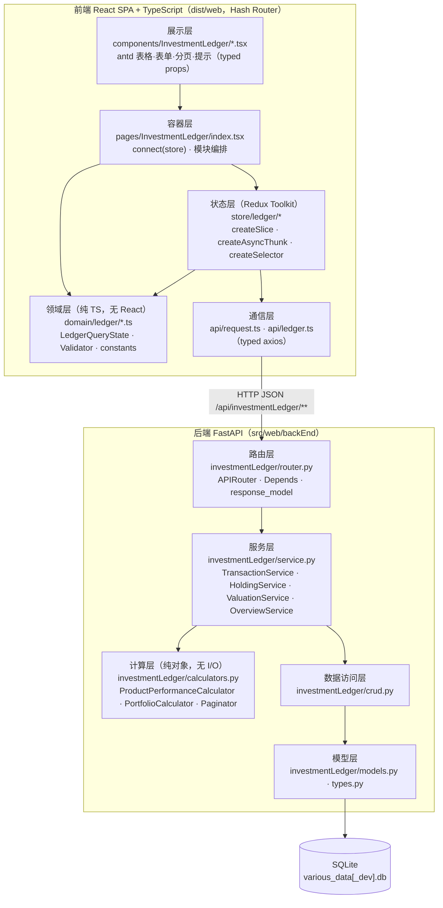
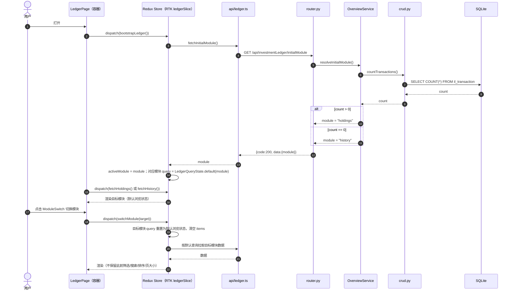
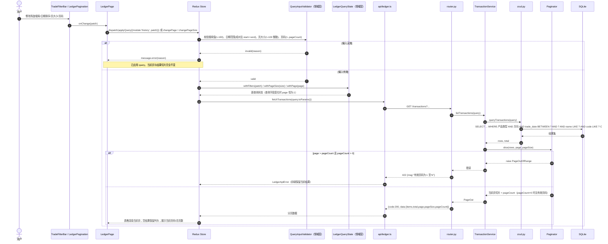

# 投资交易账本 设计文档

## Overview

（概述）

投资交易账本在现有 `various-data` 应用中新增一个独立功能模块：以「历史交易记录模块」作为交易数据的唯一写入入口（创建、删除、查询），以「持仓模块」作为只读的产品汇总视图，并基于产品的最新估值输出产品与投资组合的收益统计。

本设计严格以 [requirements.md](./requirements.md) 为唯一功能来源，分为**前端**与**后端**两大部分，遵循以下原则：

| 原则 | 落地方式 |
| --- | --- |
| 分层清晰 | 前端：领域层 / 状态层 / 容器层 / 展示层 / 通信层；后端：路由层 / 服务层 / 计算层 / 数据访问层 / 模型层 |
| 边界清晰 | 写操作只存在于历史交易与估值两个入口；持仓模块无任何写接口；不提供交易编辑接口（需求 1.4）；不提供按交易标识查询的接口（需求 2.23） |
| 低耦合 | 计算层与数据访问层零依赖（纯函数/纯对象）；前端领域层不依赖 React 与 antd；新模块不修改既有业务模块代码，后端 3 个装配点各追加 1 行注册代码，前端仅重写 store 根装配文件（既有 3 个 reducer 文件零改动） |
| 复用优先 | 后端不新增任何运行时依赖；前端仅新增 `@reduxjs/toolkit` 一个运行时依赖，以及 TypeScript 工具链（全部为 devDependencies），其余能力（React、antd、axios、dayjs、Sass）全部复用现有依赖；沿用现有目录、命名与装配惯例 |
| OOP + 模块化 | 后端以 `Service` / `Calculator` / `Repository(crud)` 类与纯值对象组织；前端以 TypeScript class 组件 + 领域类（`LedgerQueryState`、`TradeDraftValidator`）组织，类型契约显式声明 |
| 类型安全 | 新增前端模块全部使用 TypeScript（`.ts` / `.tsx`），`strict: true`；后端 Pydantic v2 + SQLAlchemy `Mapped` 注解 |
| 代码标识符不使用中文 | 领域枚举一律以**英文常量码**定义并贯穿类型系统、JSON 线格式与数据库列值：产品类型 `WEALTH` / `FUND` / `STOCK`，交易方向 `BUY` / `SELL`；中文（理财/基金/股票、买入/卖出）仅作为**前端展示标签**，集中在展示映射层（见「前端设计 3.1」），面向用户的错误文案与界面文案仍为中文 |
| 定义自带注释 | 所有接口/类型/类/常量/字段/方法在代码中均带中文注释，说明含义、单位与格式（十进制字符串、`YYYY-MM-DD`、闭区间等）、可空语义及其对应需求条目 |
| 无行内样式 | 全部样式写入 `index.module.scss`（CSS Modules）或 `index.css`，与现有 webpack loader 规则一致；TS 下需配 `*.module.scss` 模块声明（见「前端设计 1.3」） |

### 调研结论（设计依据）

对现有代码的核查结果，直接决定了本设计的技术选型：

1. **前端 UI 依赖已齐备**（[package.json](../../../package.json)）：`react@18`、`antd@5.8`、`@ant-design/icons@5.2`、`react-redux@8`、`redux@4.2`、`redux-thunk@2.4`、`react-router-dom@6.4`、`axios@1.4`、`dayjs@1.11`、`echarts@5.3`、`normalize.css`、`rc-virtual-list`。→ UI、路由、HTTP、日期、样式能力**全部复用，无需新增**。
   - **状态管理改用 Redux Toolkit（新增依赖）**：既有 store 为 `createStore + combineReducers + applyMiddleware(redux-thunk)`（[store/index.js](../../../src/web/frontEnd/src/store/index.js)、[store/reducers/index.js](../../../src/web/frontEnd/src/store/reducers/index.js)）。本设计**引入 `@reduxjs/toolkit`**，新模块以 `createSlice` / `createAsyncThunk` / `createSelector` 编写，`redux.createStore` 在 redux 4.2 中已被标记为 deprecated，RTK 是官方推荐替代。
   - **版本兼容性核查**：RTK **2.x 与 redux 5.0 / react-redux 9.0 / redux-thunk 3.0 同步发布**，会要求升级这三个包（[RTK 2.0 迁移说明](https://github.com/reduxjs/redux-toolkit/blob/master/docs/usage/migrating-rtk-2.md)、[react-redux v9 发布说明](https://github.com/reduxjs/react-redux/discussions/2098)）；而本项目为 `redux@^4.2.0` + `react-redux@^8.0.2` + `redux-thunk@^2.4.1`。→ 因此固定选用 **`@reduxjs/toolkit@^1.9.7`**（1.9 线内置 redux 4.2 / reselect 4 / redux-thunk 2.4，peer 允许 react-redux 7/8），**不升级** redux 与 react-redux，避免连带的破坏性升级。（内容依据来源转述以符合许可要求。）
   - 金额计算不引入 `decimal.js`：前端只做展示与输入校验，所有金额与比率均由后端以 `Decimal` 计算后以**十进制字符串**下发，前端不做浮点运算。
2. **样式方案由 webpack 决定**（[webpack.config.js](../../../scripts/webpack.config.js)）：
   - `.css` → `style-loader + css-loader`（全局作用域）。
   - `.s[ac]ss` → `style-loader + css-loader(modules.auto: true, localIdentName: '[local]__[hash]') + sass-loader`。`modules.auto: true` 意味着**只有 `*.module.scss` 才会被编译为 CSS Modules**。
   - → 本功能新增样式统一使用 **`index.module.scss`**，通过 `styles.xxx` 引用，禁止 `style={{...}}`。
   - **在 TypeScript 中导入 `*.module.scss` 必须先声明模块类型**，否则 `tsc` 报 `TS2307: Cannot find module`。因此新增 `src/web/frontEnd/src/types/global.d.ts`（见「前端设计 1.3」）。
3. **构建链现状与 TypeScript 接入方式**（[webpack.config.js](../../../scripts/webpack.config.js)、[webpack.dev.config.js](../../../scripts/webpack.dev.config.js)、[package.json](../../../package.json)）：
   - babel-loader 规则为 `test: /\.js$/`，presets 仅 `['@babel/preset-react']`；**未配置 `resolve.extensions`**（webpack 默认 `['.js', '.json', '.wasm']`）；`webpack.dev.config.js` 只是 `Object.assign(config, { mode: 'development' })`，因此**所有 loader / resolve 改动只需改 `webpack.config.js` 一处，dev 配置自动继承**。
   - 现有代码为 ESM + JSX 纯 JS，且 `package.json` 含 `"type": "module"`，`import` 都写全 `.js` 后缀。
   - → 选择 **`@babel/preset-typescript` + 独立 `tsc --noEmit` 类型检查**，而**不用 `ts-loader`**：babel 只做语法剥离（不做类型检查），编译最快且与既有 babel-loader 管线同构，只需在同一条 rule 上加一个 preset；`ts-loader` 会在构建期做全量类型检查、需要单独维护 `transpileOnly` / `fork-ts-checker` 配置，且与已有 babel 管线并行两套语法处理，收益不足。类型安全由独立 `npm run type-check` 与 CI/回归验证保证。
   - → **增量接入**：`allowJs: true`、`checkJs` 不开启，既有 `.js` 文件**一个字都不改**，仅投资账本新模块使用 `.ts` / `.tsx`。
4. **后端模块惯例**（[app/](../../../src/web/backEnd/app/)）：
   - 每个业务模块是一个包，内部文件职责固定：`router.py` / `crud.py` / `models.py` / `schemas.py`（见 [sinaFinanceNews](../../../src/web/backEnd/app/sinaFinanceNews)）。
   - SQLAlchemy 2.0 风格：模块内自带 `class Base(DeclarativeBase)`，`Mapped` / `mapped_column` 注解，并在 [app/models.py](../../../src/web/backEnd/app/models.py) 的 `initAppModels()` 中 `create_all` 注册。
   - 会话由 [app/database.py](../../../src/web/backEnd/app/database.py) 的 `SessionLocal` 提供，通过 [app/dependencies.py](../../../src/web/backEnd/app/dependencies.py) 的 `get_db` 以 `Depends` 注入。
   - 路由在 [app/api.py](../../../src/web/backEnd/app/api.py) 汇聚到 `apiRouter = APIRouter(prefix="/api")`，由 [main.py](../../../src/web/backEnd/main.py) `include_router`。
   - 函数命名使用 **camelCase**（`getNews`、`addNews`、`initAppModels`），Pydantic v2（`from_attributes = True`）。→ 新模块沿用同样的命名与组织风格。
   - [omo/crud.py](../../../src/web/backEnd/app/omo/crud.py) 已使用 `sqlalchemy.dialects.sqlite.insert(...).on_conflict_do_update(...)`。→ 估值「同一产品同一日期唯一、后写覆盖」直接复用这一成熟写法。
   - [Pipfile](../../../Pipfile) 已含 `fastapi` / `uvicorn` / `sqlalchemy`；**未含测试依赖**，测试依赖需在实现阶段以固定版本加入 `[dev-packages]`。
5. **不在本设计范围内的能力**：requirements.md 未包含「数据导入 / 导出（CSV、Excel 等）」需求，因此本设计**不设计导入导出流程与接口**；如需该能力，应先回到需求阶段补充需求条目，再追加设计。同理，交易编辑接口（需求 1.4 明确不可编辑）、按交易标识查询接口（需求 2.23）均**刻意不提供**。

---

## Architecture

（架构）

### 总体架构



### 分层职责与依赖规则

| 层 | 职责 | 允许依赖 | 禁止依赖 |
| --- | --- | --- | --- |
| 前端 展示层 | 渲染 antd 组件、把用户事件回调给容器；不含业务规则 | 领域层常量 | store、api |
| 前端 容器层 | `connect` store、组装面板、下发 thunk；不含计算公式 | 状态层、领域层、展示层 | api（一律经 thunk） |
| 前端 状态层 | 保存「已应用查询状态」「列表数据」「表单草稿与字段错误」；`createAsyncThunk` 中调用 api | RTK、领域层、通信层 | React、antd（`message` 提示由容器/组件负责） |
| 前端 领域层 | 查询状态转换规则、输入校验规则、枚举常量（纯 TS 类/纯函数，可单测与属性测试） | 无（仅 TS 类型） | 一切框架（含 RTK） |
| 前端 通信层 | axios 实例、统一响应解包与错误归一 | 无 | store |
| 后端 路由层 | HTTP 语义、参数绑定与依赖注入、响应模型 | 服务层、schemas | crud、models |
| 后端 服务层 | 用例编排、事务边界、结果集→分组→计算→排序→分页 | 计算层、数据访问层、schemas | HTTP 对象（`Request`/`Response`） |
| 后端 计算层 | 统计公式与分页切片，纯 `Decimal` 运算 | 值对象 | Session、schemas |
| 后端 数据访问层 | SQLAlchemy 查询与写入，只接收原生/值对象参数 | 模型层 | 服务层 |
| 后端 模型层 | 表结构、约束、`DecimalText` 类型 | 无 | 其它层 |

### 与既有代码的装配点（仅追加，不改动既有逻辑）

| 文件 | 追加内容 |
| --- | --- |
| [app/api.py](../../../src/web/backEnd/app/api.py) | `from app.investmentLedger.router import router as ledgerRouter` + `apiRouter.include_router(ledgerRouter)` |
| [app/models.py](../../../src/web/backEnd/app/models.py) | `from app.investmentLedger.models import Base as LedgerBase` + `LedgerBase.metadata.create_all(bind=engine)` |
| [main.py](../../../src/web/backEnd/main.py) | `registerLedgerExceptionHandlers(app)`（注册本模块异常处理器） |
| [frontEnd/src/router.js](../../../src/web/frontEnd/src/router.js) | 新增路由项 `/investmentLedger`（引入 `./pages/InvestmentLedger/index.tsx`，import 不写扩展名） |
| [frontEnd/src/main.js](../../../src/web/frontEnd/src/main.js) | 仅把 `import store from './store/index.js'` 改为 `'./store'`（store 文件改为 `.ts` 后的唯一连带改动） |
| [frontEnd/src/store/index.js](../../../src/web/frontEnd/src/store/index.js) | **改写为 `store/index.ts`**：`configureStore({ reducer: { news, stock, crawlers, ledger } })`，并导出 `RootState` / `AppDispatch` 类型（详见「前端设计 4.1」） |
| [frontEnd/src/store/reducers/index.js](../../../src/web/frontEnd/src/store/reducers/index.js) | 其唯一职责 `combineReducers` 由 `configureStore` 的 reducer 映射承担，该文件删除；`news.js` / `stock.js` / `crawlers.js` 三个 reducer 文件**零改动** |
| [scripts/webpack.config.js](../../../scripts/webpack.config.js) | 追加 `resolve.extensions`、babel-loader `test` 覆盖 `tsx?`、presets 追加 `@babel/preset-typescript`（详见「前端设计 1.4」）；`webpack.dev.config.js` 自动继承，无需改动 |
| [package.json](../../../package.json) | 追加 `@reduxjs/toolkit` 运行时依赖、TypeScript 工具链 dev 依赖与 `type-check` 脚本 |
| 新增 `tsconfig.json`（仓库根） | TypeScript 增量接入配置（详见「前端设计 1.2」） |

---

## Components and Interfaces

（组件与接口总览：下面两节「前端设计」「后端设计」分别展开细节）

| 侧 | 模块 | 主要类型 / 接口 | 对外契约 |
| --- | --- | --- | --- |
| 前端 | `pages/InvestmentLedger` | `LedgerPage`（`index.tsx`） | 连接 store，渲染 `ModuleSwitch` + 当前面板 |
| 前端 | `components/InvestmentLedger` | `TradeHistoryPanel`、`HoldingsPanel`、`TradeFilterBar`、`TradeFormModal`、`ValuationFormModal`、`PortfolioSummary`、`MetricValue`、`LedgerPagination`（均为 `.tsx`，props 接口显式声明） | props 入、回调出，无自有请求 |
| 前端 | `store/ledger` | `ledgerSlice`（`createSlice`）、`createAsyncThunk` 集合、`createSelector` 选择器 | `state.ledger` 形状见「前端设计 4」 |
| 前端 | `domain/ledger` | `LedgerQueryState`、`TradeDraftValidator`、`ValuationDraftValidator`、`QueryInputValidator`、`constants`（英文枚举码）、`labels`（码→中文展示映射） | 纯函数/纯类，可独立测试 |
| 前端 | `api` | `request.ts`（axios 实例 + 泛型解包）、`ledger.ts`（7 个函数）、`types.ts`（DTO 接口） | 唯一 HTTP 出口 |
| 后端 | `investmentLedger/router.py` | `APIRouter(prefix="/investmentLedger")` | 7 个 HTTP 接口，见「后端设计 4」 |
| 后端 | `investmentLedger/service.py` | `TransactionService`、`HoldingService`、`ValuationService`、`OverviewService` | 用例方法，接收/返回 schemas |
| 后端 | `investmentLedger/calculators.py` | `ProductPerformanceCalculator`、`PortfolioCalculator`、`Paginator` | 纯 `Decimal` 计算，无 I/O |
| 后端 | `investmentLedger/crud.py` | `queryTransactions`、`countTransactions`、`addTransaction`、`removeTransaction`、`getLatestValuations`、`upsertValuation` | 仅数据动作 |
| 后端 | `investmentLedger/models.py` · `types.py` | `Transaction`、`Valuation`、`DecimalText` | 表结构见「Data Models」 |
| 后端 | `investmentLedger/schemas.py` | `ApiResponse`、`Metric`、`TransactionCreate/Out/Query`、`HoldingQuery/Out`、`PageOut`、`PortfolioStatisticsOut`、`ValuationUpsert`、`InitialModuleOut` | 请求/响应契约 |
| 后端 | `investmentLedger/exceptions.py` | `LedgerError` 体系 + `registerLedgerExceptionHandlers(app)` | 统一错误响应 |

---

## 前端设计（Front-End）

### 1. 技术栈与依赖

#### 1.1 能力与依赖对照

| 能力 | 采用方案 | package.json 现状 | 是否新增 |
| --- | --- | --- | --- |
| UI 框架 | React 18 class 组件 | `react@^18.1.0`、`react-dom@^18.1.0` | 否（复用） |
| 组件库 | antd 5（`Table`、`Form`、`Select`、`DatePicker.RangePicker`、`InputNumber`、`Input.Search`、`Modal`、`Pagination`、`Radio.Group`、`Descriptions`、`Popconfirm`、`Tooltip`、`message`） | `antd@^5.8.4` | 否（复用；antd 5 自带 TS 类型） |
| 图标 | `@ant-design/icons` | `^5.2.5` | 否（复用，自带类型） |
| 状态管理（容器绑定） | react-redux `connect` | `react-redux@^8.0.2` | 否（复用；**v8 自带 TS 类型**，不需要 `@types/react-redux`） |
| 状态管理（store / 切片） | **Redux Toolkit**：`configureStore`、`createSlice`、`createAsyncThunk`、`createSelector` | 未安装 | **是：`@reduxjs/toolkit@^1.9.7`（dependencies）** |
| redux 内核 / thunk | 由 RTK 1.9 内置复用（`redux@4.2`、`redux-thunk@2.4`、`reselect@4`） | `redux@^4.2.0`、`redux-thunk@^2.4.1` | 否（保持现版本，**不升级**） |
| 路由 | react-router-dom Hash Router（沿用 `createHashRouter`） | `^6.4.4` | 否（复用，自带类型） |
| HTTP | axios 实例 + 拦截器（泛型响应） | `axios@^1.4.0` | 否（复用，自带类型） |
| 日期 | dayjs（antd 5 的 DatePicker 原生使用 dayjs） | `^1.11.9` | 否（复用，自带类型） |
| 样式 | Sass + CSS Modules（`*.module.scss`） | `sass`、`sass-loader`、`css-loader`、`style-loader` | 否（复用） |
| 语言与类型检查 | **TypeScript**（`tsc --noEmit`）+ `@babel/preset-typescript`（编译期仅剥离类型） | 仅 `@babel/core`、`@babel/preset-react`、`babel-loader` | **是：见 1.2 dev 依赖清单** |

**新增依赖清单（相对上一版设计的修订：不再是「零新增依赖」）**

| 依赖 | 版本 | 位置 | 理由 |
| --- | --- | --- | --- |
| `@reduxjs/toolkit` | `^1.9.7` | dependencies | 官方推荐的 redux 写法：`createSlice` 用 immer 消除手写不可变更新、`createAsyncThunk` 统一 pending/fulfilled/rejected 三态、`configureStore` 默认内置 thunk 与 DevTools。固定 1.9 线以兼容 `redux@4.2` + `react-redux@8`（RTK 2.x 需 redux 5 / react-redux 9） |
| `typescript` | `^5.4.5` | devDependencies | 类型检查器；`moduleResolution: "bundler"` 需要 TS ≥ 5.0 |
| `@babel/preset-typescript` | `^7.24.0` | devDependencies | 让既有 babel-loader 直接处理 `.ts` / `.tsx`（仅剥离类型，零运行时开销），避免引入 `ts-loader` 造成两套语法管线 |
| `@types/react` | `^18.2.79` | devDependencies | React 18 类型（`React.Component`、`ReactNode`、事件类型）；react-redux 8 的类型也依赖它 |
| `@types/react-dom` | `^18.2.25` | devDependencies | `react-dom/client` 的 `createRoot` 类型（供 `main` 及测试使用） |

**明确不新增**：

- `@types/react-redux`：react-redux **v8 起自带类型声明**，官方已将 `@types/react-redux` 标为 stub，安装反而可能与自带类型冲突。
- `ts-loader` / `fork-ts-checker-webpack-plugin`：见「调研结论 3」的取舍说明。
- `decimal.js`：金额/比率不在前端参与运算（后端以字符串下发）。
- `@types/node`：前端源码不使用 Node API；webpack 配置文件保持 `.js`，不纳入类型检查。
- 额外表格库：antd `Table` + `Pagination` 已满足分页与排序。

#### 1.2 `tsconfig.json`（仓库根，新增）

采用**增量接入**策略：`allowJs: true` 让既有 `.js` 文件仍可被解析与引用，`checkJs` 不开启因此**不会对既有 JS 产生任何报错**；只有本模块新增的 `.ts` / `.tsx` 受 `strict: true` 约束。

```jsonc
{
  "compilerOptions": {
    "target": "ES2020",              // 目标语法层级；babel 才是真正的降级者，此项只影响类型检查时的内置库假设
    "lib": ["ES2020", "DOM", "DOM.Iterable"],  // 浏览器环境：需要 DOM 与可迭代 NodeList 类型
    "module": "ESNext",              // 保留 ESM 语法交给 webpack 做 tree-shaking
    "moduleResolution": "bundler",   // 由 webpack 负责解析；import 允许不写扩展名
    "jsx": "react",                  // 与 babel @babel/preset-react 的默认 classic runtime 一致
    "strict": true,                  // 新模块的类型底线：严格空检查、严格函数参数等全开
    "noUncheckedIndexedAccess": true,// 索引访问返回 T | undefined，逼迫处理越界（分页切片场景直接受益）
    "noImplicitOverride": true,      // class 组件覆写 render/componentDidMount 必须显式 override
    "exactOptionalPropertyTypes": false, // 关闭：草稿类型大量使用 `?: T | null`，开启会与 antd 受控值互相打架
    "isolatedModules": true,         // 与 babel 单文件转译语义对齐：类型导入需写 import type
    "verbatimModuleSyntax": false,   // 关闭以兼容既有 CommonJS 风格依赖的默认导入
    "noEmit": true,                  // 产物由 webpack + babel 生成，tsc 只做类型检查
    "allowJs": true,                 // 既有 .js 文件可被 TS 解析与 import
    "checkJs": false,                // 不检查既有 .js，避免历史代码报错
    "esModuleInterop": true,         // 允许 `import axios from 'axios'` 这类默认导入互操作
    "allowSyntheticDefaultImports": true, // 无默认导出的模块也可默认导入（类型层面）
    "resolveJsonModule": true,       // 允许 import *.json（配置类静态数据）
    "forceConsistentCasingInFileNames": true, // Windows 开发 + Linux 部署，防止大小写不一致的路径漂移
    "skipLibCheck": true,            // 跳过 node_modules 的 .d.ts 检查，缩短 type-check 时间
    "baseUrl": ".",                  // 路径别名的解析基准（仓库根）
    "paths": {
      "@ledger/*": ["src/web/frontEnd/src/*"]  // 可选便利别名；需与 webpack resolve.alias 保持一致
    }
  },
  "include": ["src/web/frontEnd/src/**/*"],    // 只纳入前端源码，避免检查 webpack 配置等 Node 侧脚本
  "exclude": ["node_modules", "dist", "scripts"]
}
```

约定说明：

- **`jsx: "react"`（classic）而非 `react-jsx`**：项目 babel 只配了 `@babel/preset-react` 且未开启 `runtime: 'automatic'`，因此 JSX 会编译为 `React.createElement`。为保持与既有文件一致且不改动 babel 的 React 行为，新 `.tsx` 文件**必须 `import React from 'react'`**。若日后将 preset-react 切到 `runtime: 'automatic'`，则同步把此项改为 `react-jsx`。
- **`isolatedModules: true`**：babel 逐文件转译，无法感知跨文件类型信息。因此类型-only 导入必须写 `import type { ... } from '...'`，且**不使用 `const enum`**（本设计的枚举一律用 `as const` 对象 + 联合类型，见 3 节）。
- **`paths` 别名**：webpack 侧需同步 `resolve.alias`；若不希望维护两处映射，可只用相对路径导入而不使用该别名（本设计的示例代码全部使用相对路径，别名为可选便利）。
- **import 扩展名规则**：既有 `.js` 文件写全 `.js` 后缀（ESM 风格），**新增 TS 文件的 import 一律不写扩展名**（`import LedgerQueryState from '../../domain/ledger/LedgerQueryState'`）。二者可共存，因为解析工作由 webpack `resolve.extensions` 完成，`moduleResolution: "bundler"` 也不要求扩展名。TS 文件引用**既有 JS 文件**时保留其 `.js` 后缀写法（如 `import store from './store/index'` 为新文件、`import { getNews } from '../../store/actions.js'` 为旧文件）。

#### 1.3 `src/web/frontEnd/src/types/global.d.ts`（新增）

CSS Modules 与静态资源在 TS 中没有内置类型，必须声明，否则 `tsc --noEmit` 会在 `import styles from './index.module.scss'` 处报错：

```ts
// types/global.d.ts —— 全局环境声明（无 import/export 顶层语句，故为全局脚本）

/** CSS Modules（Sass）：webpack 的 modules.auto 只对 *.module.scss 生效，故默认导出为「原类名 → 编译后类名」映射 */
declare module '*.module.scss' {
  /** 只读的类名映射表；键为源文件中书写的类名 */
  const classes: { readonly [key: string]: string };
  export default classes;
}

/** CSS Modules（原生 css）：同上，便于日后新增 *.module.css */
declare module '*.module.css' {
  const classes: { readonly [key: string]: string };
  export default classes;
}

// 既有全局样式以副作用方式导入（import './index.css'），无默认导出，声明为无形状模块即可
declare module '*.css';
declare module '*.scss';
```

> 「避免行内样式」的项目规范不变：所有样式仍写在 `index.module.scss` 中，通过 `styles.xxx` 引用，组件里不出现 `style={{...}}`。上述声明文件正是为了让该规范在 TS 下仍然通过类型检查。

#### 1.4 webpack 改动（仅改 `scripts/webpack.config.js`）

`webpack.dev.config.js` 通过 `Object.assign(config, { mode: 'development' })` 继承同一份配置，因此**无需改动 dev 配置**。改动共两处：

```diff
 export default {
     entry: path.join(ROOT_PATH, 'src/web/frontEnd/src/main.js'),
+    resolve: {
+        // 默认值为 ['.js', '.json', '.wasm']，必须显式加入 TS 扩展名，
+        // 否则新 TS 文件的无扩展名 import 无法解析
+        extensions: ['.ts', '.tsx', '.js', '.jsx', '.json'],
+        alias: {
+            // 与 tsconfig.json 的 paths 对应（可选）
+            '@ledger': path.join(ROOT_PATH, 'src/web/frontEnd/src'),
+        },
+    },
     module: {
         rules: [
             {
-                test: /\.js$/,
+                // 同时覆盖既有 .js / .jsx 与新增 .ts / .tsx
+                test: /\.[jt]sx?$/,
                 exclude: /(node_modules|bower_components)/,
                 use: {
                     loader: 'babel-loader',
                     options: {
-                        presets: ['@babel/preset-react']
+                        // @babel/preset-typescript 内部按文件扩展名启用，
+                        // 对既有 .js 文件不产生任何行为变化
+                        presets: ['@babel/preset-react', '@babel/preset-typescript']
                     }
                 }
             },
```

- CSS / Sass 两条 rule **完全不动**，`modules.auto: true` 继续只对 `*.module.scss` 生效。
- `entry` 保持 `main.js`（既有文件不改）；新模块由 `router.js` 以 `import` 引入，webpack 顺着依赖图自动编译 `.tsx`。
- 若日后把 `main.js` / `router.js` 迁到 TS，只需改扩展名，本配置无需再动。

#### 1.5 `package.json` 改动

```diff
   "scripts": {
     "dev:web": "webpack --config ./scripts/webpack.dev.config.js --watch",
-    "dev:server": "pipenv run uvicorn src.web.backEnd.main:app --reload --port 8000"
+    "dev:server": "pipenv run uvicorn src.web.backEnd.main:app --reload --port 8000",
+    "build:web": "webpack --config ./scripts/webpack.config.js",
+    "type-check": "tsc --noEmit"
   },
   "dependencies": {
+    "@reduxjs/toolkit": "^1.9.7",
     "@ant-design/icons": "^5.2.5",
     ...
   },
   "devDependencies": {
+    "@babel/preset-typescript": "^7.24.0",
+    "typescript": "^5.4.5",
+    "@types/react": "^18.2.79",
+    "@types/react-dom": "^18.2.25",
     "@babel/core": "^7.20.5",
     ...
   }
```

- `type-check` 为**独立的一次性命令**（非 watch），是 CI 与「回归验证」步骤的必跑项；babel 不做类型检查，类型安全完全依赖它。
- 新增 `build:web` 只是把回归验证里手写的生产构建命令固化，不改变既有 `dev:web` / `dev:server` 行为。

### 2. 目录结构（新增文件）

新增文件全部为 TypeScript；既有 `.js` 文件除 store 根装配与 `router.js` 的注册行外不作改动。

```
tsconfig.json                            # 新增：TS 增量接入配置（仓库根）
src/web/frontEnd/src/
├── types/
│   └── global.d.ts                     # 新增：*.module.scss 等模块声明
├── api/
│   ├── index.js                        # 既有，不改动（legacy JS）
│   ├── types.ts                        # 新增：后端 DTO 接口（camelCase，与 Pydantic 输出对齐）
│   ├── request.ts                      # 新增：axios 实例 + 泛型解包拦截器 + LedgerApiError
│   └── ledger.ts                       # 新增：账本 API 客户端（唯一 HTTP 出口）
├── domain/ledger/                      # 新增：纯 TS 领域层（无 React / antd / axios / RTK）
│   ├── constants.ts                    # 英文枚举码（WEALTH/FUND/STOCK、BUY/SELL）、页大小边界（as const + 联合类型）
│   ├── labels.ts                       # 展示标签映射：码 → 中文文案 + antd 选项生成器（仅展示用）
│   ├── LedgerQueryState.ts             # 浏览状态值对象（readonly 字段，含重置/翻页规则）
│   ├── TradeDraftValidator.ts          # 交易草稿校验（需求 1.2）
│   ├── ValuationDraftValidator.ts      # 估值草稿校验（需求 3.2）
│   └── QueryInputValidator.ts          # 搜索值/日期范围/页大小/页码校验（需求 2.20/2.21/2.26/2.30）
├── store/
│   ├── index.ts                        # 改写：configureStore + RootState/AppDispatch（原 index.js 删除）
│   ├── actions.js                      # 既有，不改动
│   ├── actionTypes.js                  # 既有，不改动
│   ├── reducers/
│   │   ├── news.js                     # 既有，零改动
│   │   ├── stock.js                    # 既有，零改动
│   │   └── crawlers.js                 # 既有，零改动
│   │   # reducers/index.js 删除：combineReducers 由 configureStore 的 reducer 映射替代
│   └── ledger/                         # 新增：RTK 切片
│       ├── types.ts                    # LedgerState / LedgerQuerySnapshot / 表单状态类型
│       ├── thunks.ts                   # createAsyncThunk 定义
│       ├── ledgerSlice.ts              # createSlice（reducers + extraReducers）
│       └── selectors.ts                # createSelector 派生选择器
├── pages/InvestmentLedger/              # 新增：容器
│   ├── index.tsx                       # LedgerPage
│   └── index.module.scss
├── components/InvestmentLedger/         # 新增：展示组件（每个组件显式声明 Props 接口）
│   ├── ModuleSwitch/{index.tsx,index.module.scss}
│   ├── TradeHistoryPanel/{index.tsx,index.module.scss}
│   ├── HoldingsPanel/{index.tsx,index.module.scss}
│   ├── TradeFilterBar/{index.tsx,index.module.scss}
│   ├── TradeFormModal/index.tsx
│   ├── ValuationFormModal/index.tsx
│   ├── PortfolioSummary/{index.tsx,index.module.scss}
│   ├── MetricValue/{index.tsx,index.module.scss}
│   └── LedgerPagination/index.tsx
└── router.js                            # 既有，追加 /investmentLedger（import 无扩展名）
```

### 3. 领域层（OOP + TypeScript，纯逻辑）

领域层不依赖 React、antd、axios，也**不依赖 RTK**，因此可以在 vitest 中直接以属性测试驱动。所有值对象字段为 `readonly`，所有方法显式标注返回类型。

#### 3.1 枚举常量与展示标签分离

**设计决定：枚举值一律为英文常量码，中文只出现在展示标签映射中。**

| 关注点 | 位置 | 取值 |
| --- | --- | --- |
| 类型系统 / API 负载 / 数据库列值 | `domain/ledger/constants.ts`、后端 `constants.py`、`il_transaction` 表 | `WEALTH` / `FUND` / `STOCK`，`BUY` / `SELL` |
| 用户可见文案 | `domain/ledger/labels.ts`（仅前端，仅展示） | 理财 / 基金 / 股票，买入 / 卖出 |

理由：中文字面量作为类型值会把展示语言写死进契约与存储，一旦文案调整就要改数据；英文码使前后端契约稳定、日志与 SQL 可读、URL query 参数无需转义。**本功能的两张表都是全新表，不存在历史中文值，因此没有数据迁移问题。**

```ts
// domain/ledger/constants.ts
// 领域枚举与边界常量：用 as const + 联合类型替代 enum（isolatedModules 下不使用 const enum）。
// 本文件只定义「码」，不含任何中文展示文案（展示文案见 labels.ts）。

/** 产品类型码全集：WEALTH=理财、FUND=基金、STOCK=股票（需求 1.1、1.2 的预定义取值） */
export const PRODUCT_TYPES = ['WEALTH', 'FUND', 'STOCK'] as const;

/** 产品类型：与后端 ProductType 枚举、`il_transaction.product_type` 列值逐字符一致 */
export type ProductType = typeof PRODUCT_TYPES[number];

/** 交易方向码全集：BUY=买入、SELL=卖出（需求 1.1、1.2 的预定义取值） */
export const TRADE_DIRECTIONS = ['BUY', 'SELL'] as const;

/** 交易方向：与后端 TradeDirection 枚举、`il_transaction.direction` 列值逐字符一致 */
export type TradeDirection = typeof TRADE_DIRECTIONS[number];

/** 需求 2.24 规定必须提供的三个预设页大小，直接喂给 antd Pagination 的 pageSizeOptions */
export const PAGE_SIZE_OPTIONS = [10, 20, 50] as const;

/** 默认浏览状态使用的页大小（需求「默认浏览状态」定义中的模块预设页大小） */
export const DEFAULT_PAGE_SIZE = 20;

/** 自定义页大小下界，闭区间（需求 2.25、2.26） */
export const MIN_PAGE_SIZE = 1;

/** 自定义页大小上界，闭区间（需求 2.25、2.26） */
export const MAX_PAGE_SIZE = 100;

/** 两个独立界面模块的标识：history=历史交易记录模块，holdings=持仓模块（需求 2.1） */
export type LedgerModule = 'history' | 'holdings';

/** 排序方向：asc=从小到大，desc=从大到小（需求 2.19） */
export type SortOrder = 'asc' | 'desc';

/** 持仓模块可排序的数值字段：position=持仓（市值），totalProfit=总收益（需求 2.19） */
export type HoldingSortField = 'position' | 'totalProfit';
```

```ts
// domain/ledger/labels.ts
// 展示标签映射层（presentation-only）：把英文码翻译为界面中文文案。
// 只被展示层/容器层引用；领域计算、API 负载、持久化一律使用码，不使用本文件的值。
import { PRODUCT_TYPES, TRADE_DIRECTIONS } from './constants';
import type { ProductType, TradeDirection } from './constants';

/**
 * 产品类型的中文展示名。
 * 使用 Record<ProductType, string> 而非索引签名：新增类型码时缺少映射会**编译期报错**，
 * 从而保证映射对枚举全集穷尽（不会出现界面上显示原始码的情况）。
 */
export const PRODUCT_TYPE_LABELS: Record<ProductType, string> = {
  WEALTH: '理财',
  FUND: '基金',
  STOCK: '股票',
};

/** 交易方向的中文展示名，穷尽性同上 */
export const TRADE_DIRECTION_LABELS: Record<TradeDirection, string> = {
  BUY: '买入',
  SELL: '卖出',
};

/** antd Select / Radio 的选项类型：value 为码（进入 query 与请求体），label 为中文（仅渲染） */
export interface LabeledOption<T extends string> {
  readonly value: T;
  readonly label: string;
}

/** 由码全集 + 标签映射生成产品类型下拉选项，保证选项顺序与码全集声明顺序一致 */
export const productTypeOptions = (): readonly LabeledOption<ProductType>[] =>
  PRODUCT_TYPES.map((value) => ({ value, label: PRODUCT_TYPE_LABELS[value] }));

/** 由码全集 + 标签映射生成交易方向下拉选项 */
export const tradeDirectionOptions = (): readonly LabeledOption<TradeDirection>[] =>
  TRADE_DIRECTIONS.map((value) => ({ value, label: TRADE_DIRECTION_LABELS[value] }));
```

> 落地约束：`TradeFilterBar` / `TradeFormModal` / `ValuationFormModal` 的 antd `Select`、`Radio.Group` 选项**必须**由 `productTypeOptions()` / `tradeDirectionOptions()` 生成，表格的产品类型列与交易方向列用 `render: (v: ProductType) => PRODUCT_TYPE_LABELS[v]` 渲染；组件内不得出现中文字面量与码的手写对照。

#### 3.2 查询状态值对象

```ts
// domain/ledger/LedgerQueryState.ts
// 浏览状态（筛选 + 搜索 + 排序 + 分页 + 产品范围）的不可变值对象：
// 所有变换方法返回新实例，重置规则（需求 2.9 / 2.13 / 2.27）在此唯一实现。
import type { ProductType, TradeDirection, LedgerModule, SortOrder, HoldingSortField } from './constants';
import { DEFAULT_PAGE_SIZE } from './constants';

/**
 * 可序列化的查询快照：存进 redux state 的形状（纯数据，无类实例、无 dayjs 对象）。
 * 所有「未启用」的条件统一以 null 表示，便于 toParams() 直接省略该参数。
 */
export interface LedgerQuerySnapshot {
  /** 产品类型筛选码；null=未启用该筛选（需求 2.16） */
  readonly productType: ProductType | null;
  /** 交易方向筛选码；null=未启用（需求 2.16） */
  readonly direction: TradeDirection | null;
  /** 交易日期范围起始，YYYY-MM-DD，闭区间下界；与 endDate 必须成对（需求 2.16、2.21） */
  readonly startDate: string | null;
  /** 交易日期范围结束，YYYY-MM-DD，闭区间上界；须 >= startDate（需求 2.16、2.21） */
  readonly endDate: string | null;
  /** 产品名称搜索值，语义为「包含」匹配，长度 1..100；null=未启用（需求 2.17、2.18、2.20） */
  readonly productName: string | null;
  /** 产品代码搜索值，语义为「包含」匹配，长度 1..100；null=未启用（需求 2.17、2.18、2.20） */
  readonly productCode: string | null;
  /** 交易日期排序方向；null=未启用日期排序（需求 2.15） */
  readonly tradeDateOrder: SortOrder | null;
  /** 持仓条目排序字段；null=未启用数值排序，此时按首次出现顺序（需求 2.15、2.19） */
  readonly holdingSortField: HoldingSortField | null;
  /** 持仓条目排序方向；仅在 holdingSortField 非 null 时有意义（需求 2.19） */
  readonly holdingSortOrder: SortOrder | null;
  /** 当前页码，1 起；有效范围 1..pageCount（需求 2.28、2.30） */
  readonly page: number;
  /** 当前页大小，闭区间 1..100（需求 2.24、2.25） */
  readonly pageSize: number;
  /** 产品历史交易范围的产品类型码；与 scopeProductCode 同时为 null 或同时非 null（需求 2.9、2.10） */
  readonly scopeProductType: ProductType | null;
  /** 产品历史交易范围的产品代码（需求 2.9、2.10） */
  readonly scopeProductCode: string | null;
}

/** 产品键：持仓条目的唯一标识，也是「从持仓进入历史交易」时携带的范围参数（需求 2.5、2.9） */
export interface ProductScope {
  /** 产品类型码 */
  readonly productType: ProductType;
  /** 产品代码 */
  readonly productCode: string;
}

/**
 * 发往后端的 query 参数：键取自快照字段名（camelCase），
 * 值为字符串或数字（枚举传英文码，日期传 YYYY-MM-DD）；未启用的字段整体省略而非传 null。
 */
export type LedgerQueryParams = Partial<Record<keyof LedgerQuerySnapshot, string | number>>;

/** 浏览状态值对象：构造私有，只能经 default / defaultWithScope / from 创建 */
export default class LedgerQueryState {
  /**
   * @param snapshot 内部持有的纯数据快照；构造后连同实例一起冻结，保证真正不可变
   */
  private constructor(private readonly snapshot: LedgerQuerySnapshot) {
    Object.freeze(this.snapshot);
    Object.freeze(this);
  }

  /**
   * 构造模块的默认浏览状态：全部筛选/搜索/排序为 null，pageSize=DEFAULT_PAGE_SIZE，page=1，无产品范围。
   * @param module 目标模块，决定默认排序字段的取舍（当前两模块默认值一致，保留参数以便后续分化）
   * @returns 满足需求「默认浏览状态」定义的新实例
   */
  static default(module: LedgerModule): LedgerQueryState { /* ... */ }

  /**
   * 构造「默认浏览状态 + 产品历史交易范围」：除 scope 两字段外与 default(module) 完全相同。
   * @param scope 来源持仓条目的产品键
   * @returns 需求 2.9 要求的状态（不继承任何此前条件）
   */
  static defaultWithScope(module: LedgerModule, scope: ProductScope): LedgerQueryState { /* ... */ }

  /**
   * 从 redux 中的纯数据快照还原领域对象（reducer 与选择器的入口）。
   * @param snapshot 已存在的快照，不会被修改
   */
  static from(snapshot: LedgerQuerySnapshot): LedgerQueryState { /* ... */ }

  /**
   * 合并筛选/搜索/排序补丁。
   * @param patch 仅包含待变更字段；未出现的字段保持原值
   * @returns 新实例；**不变量：只要 patch 非空即把 page 置为 1**（需求 2.27）
   */
  withFilters(patch: Partial<LedgerQuerySnapshot>): LedgerQueryState { /* ... */ }

  /**
   * 切换页大小。
   * @param size 已由 QueryInputValidator 校验通过的 1..100 整数
   * @returns 新实例；**不变量：page 置为 1**（需求 2.25）
   */
  withPageSize(size: number): LedgerQueryState { /* ... */ }

  /**
   * 仅翻页。
   * @param page 已校验的有效页码
   * @returns 新实例；**不变量：除 page 外所有字段逐字段相等**（需求 2.28）
   */
  withPage(page: number): LedgerQueryState { /* ... */ }

  /**
   * 判断当前状态是否等于该模块的默认浏览状态（产品范围字段不参与比较）。
   * 供属性测试断言重置不变量、以及「重置」按钮的禁用判定使用。
   */
  isDefault(module: LedgerModule): boolean { /* ... */ }

  /** 导出内部快照，用于写回 redux；返回的对象已冻结，调用方不能改 */
  toSnapshot(): LedgerQuerySnapshot { return this.snapshot; }

  /** 序列化为后端 query 参数：跳过所有值为 null 的字段，枚举按英文码原样输出 */
  toParams(): LedgerQueryParams { /* ... */ }
}
```

> **为什么 state 里存快照而不是类实例**：RTK 的 `configureStore` 默认启用 `serializableCheck`，类实例会触发告警且不利于 DevTools 时间旅行。因此 **redux 只存 `LedgerQuerySnapshot`（纯数据）**，reducer 内部通过 `LedgerQueryState.from(state.query).withFilters(patch).toSnapshot()` 完成转换——规则的唯一实现处仍在领域类中（OOP 不被削弱），同时状态保持可序列化。

#### 3.3 校验器

```ts
// domain/ledger/TradeDraftValidator.ts
// 交易草稿校验器（需求 1.2）：纯逻辑、无副作用，逐字段给出中文原因，绝不改写入参。
import { PRODUCT_TYPES, TRADE_DIRECTIONS } from './constants';

/** 单个字段的校验错误 */
export interface FieldError {
  /** 出错字段名，camelCase，与表单项 / DTO 字段一一对应（如 unitPrice） */
  readonly field: string;
  /** 机器可读错误码，英文常量，如 INVALID_SCALE / OUT_OF_RANGE / NOT_IN_ENUM */
  readonly code: string;
  /** 面向用户的中文原因，直接渲染到 antd Form.Item 的 help 上 */
  readonly message: string;
}

/** 校验结果：valid 与 fieldErrors 为空的关系恒等（valid === fieldErrors.length === 0） */
export interface ValidationResult {
  /** 是否全部字段有效 */
  readonly valid: boolean;
  /** 全部无效字段的错误列表；每个无效字段至少产出一条（需求 1.2「指出每个无效信息项」） */
  readonly fieldErrors: readonly FieldError[];
}

/**
 * 交易表单草稿：字段全部可选且允许 null，代表「用户尚未填写完毕」的中间态。
 * 类型上刻意放宽为 string（而非 ProductType），因为校验器的职责就是判定取值是否落在码全集内。
 */
export interface TradeDraft {
  /** 产品类型：期望为 PRODUCT_TYPES 中的英文码，其它取值一律判为无效（需求 1.2） */
  readonly productType?: string | null;
  /** 产品名称：非空且 <= 100 字符 */
  readonly productName?: string | null;
  /** 产品代码：非空且 <= 32 字符 */
  readonly productCode?: string | null;
  /** 交易单价：十进制字符串承载（避免浮点误差），要求 > 0 且小数位恰为 2 */
  readonly unitPrice?: string | null;
  /** 交易数量：要求为 > 0 的整数；允许字符串以承载输入框原始文本 */
  readonly quantity?: string | number | null;
  /** 交易方向：期望为 TRADE_DIRECTIONS 中的英文码 */
  readonly direction?: string | null;
  /** 交易日期：YYYY-MM-DD，且必须是有效公历日期（如拒绝 2 月 30 日） */
  readonly tradeDate?: string | null;
}

/** 交易草稿校验器：无状态，可安全复用同一实例 */
export default class TradeDraftValidator {
  /**
   * 校验草稿全部字段。
   * @param draft 待校验草稿；**不变量：方法内不修改 draft 的任何字段**（需求 1.2 保留已提交值）
   * @returns 每个无效字段一条 FieldError；枚举字段以 PRODUCT_TYPES / TRADE_DIRECTIONS 的英文码为唯一合法集
   */
  validate(draft: TradeDraft): ValidationResult { /* ... */ }
}
```

- `TradeDraftValidator.validate(draft)` → `{ valid, fieldErrors: [{ field, code, message }] }`，逐字段给出中文原因，**不修改 draft**（需求 1.2 保留已提交值）；`ValuationDraftValidator` 同签名（`ValuationDraft` → `ValidationResult`）。
- **枚举字段的合法集为英文码**：`productType ∈ PRODUCT_TYPES`（`WEALTH` / `FUND` / `STOCK`）、`direction ∈ TRADE_DIRECTIONS`（`BUY` / `SELL`）。中文字面量（如 `'理财'`）、大小写不符的码（如 `'buy'`）一律判为 `NOT_IN_ENUM` 无效；错误 `message` 仍为中文（例如「产品类型必须为理财、基金或股票之一」），由 `PRODUCT_TYPE_LABELS` 拼装以避免文案与码脱节。
- `QueryInputValidator` 提供 `validateSearchValue(value: string): ValidationResult`、`validateDateRange(start: string | null, end: string | null): ValidationResult`、`validatePageSize(size: unknown): ValidationResult`、`validatePage(page: number, pageCount: number): ValidationResult`；校验失败时容器只 `message.error(...)`，**不 dispatch 查询变更**，从而保证「保留当前结果」（需求 2.20/2.21/2.26/2.30）。各方法的参数与返回契约：`validateSearchValue` 判定长度 1..100；`validateDateRange` 判定成对出现、日历有效性与 `start <= end`；`validatePageSize` 接受 `unknown` 以拦截非整数与非数字输入；`validatePage` 需要 `pageCount` 才能判定上界，`pageCount === 0` 时任何页码都无效（需求 2.31）。
- 领域层不含任何金额公式，公式唯一实现在后端计算层，避免双份实现漂移。
- 领域层不含任何中文展示文案的判定逻辑；`labels.ts` 只被展示层引用，校验器只在拼装 `message` 时读取它。

### 4. 状态层设计（Redux Toolkit）

#### 4.1 与既有 store 的集成方案

既有装配（[store/index.js](../../../src/web/frontEnd/src/store/index.js) + [store/reducers/index.js](../../../src/web/frontEnd/src/store/reducers/index.js)）：

```js
// 现状：store/index.js —— 手写装配，thunk 需显式 applyMiddleware
export default createStore(rootReducer, undefined, applyMiddleware(thunkMiddleware));

// 现状：store/reducers/index.js —— 该文件唯一职责就是合并三个既有 reducer
export default combineReducers({ news, stock, crawlers });
```

两种可行集成方式与取舍：

| 方案 | 做法 | 优点 | 代价 |
| --- | --- | --- | --- |
| **A（采纳）** | 根 store 迁移到 `configureStore`，用 **reducer 映射**列出 `news / stock / crawlers / ledger` | `configureStore` 内部自动 `combineReducers`，**state 形状与键名完全不变**；thunk 默认内置，无需手写 `applyMiddleware`；免费获得 DevTools、`immutableCheck`、`serializableCheck`；后续其它模块可直接迁 RTK | 改写 1 个既有文件（`store/index.js` → `store/index.ts`）并删除 `reducers/index.js` 这一层间接；开发模式下多两个检查中间件（有告警需处理，见下） |
| B（备选） | 保留 `createStore`，只把 `ledgerReducer` 挂进既有 `combineReducers` | 只追加 1 行，改动最小 | 仍使用已被 redux 4.2 标记 deprecated 的 `createStore`；拿不到 RTK 的默认中间件与 DevTools 集成；store 装配与切片写法风格割裂（一半 RTK、一半手写） |

**采纳方案 A**，理由：state 形状不变是可验证的（三个 reducer 函数原封不动地作为映射值传入，`combineReducers` 语义等价），风险可控；而收益（默认 thunk、不可变性检查、类型化 store）会持续作用于后续所有模块。`news.js` / `stock.js` / `crawlers.js` 三个 reducer 文件**不作任何修改**，既有 `store/actions.js` 里的 thunk 与 `connect` 调用方式也完全不受影响（RTK 默认中间件已包含 redux-thunk 2.4）。

```ts
// store/index.ts（替换原 store/index.js）
import { configureStore } from '@reduxjs/toolkit';
import news from './reducers/news.js';         // 既有 JS reducer，保留 .js 后缀写法
import stock from './reducers/stock.js';
import crawlers from './reducers/crawlers.js';
import ledger from './ledger/ledgerSlice';

/** 全局唯一 store：reducer 映射由 configureStore 内部 combineReducers，故 state 形状与迁移前完全一致 */
const store = configureStore({
  reducer: { news, stock, crawlers, ledger },   // 等价于原 combineReducers({...}) + ledger
  // 默认中间件已含 redux-thunk 2.4，故无需再 applyMiddleware
  middleware: (getDefaultMiddleware) =>
    getDefaultMiddleware({
      // 既有 NewsList 通过 antd RangePicker 把 dayjs 实例存入 news.filters.period，
      // 属于历史遗留的非序列化值：豁免而不是改既有代码（本设计不修改既有模块）
      serializableCheck: {
        ignoredActions: ['SET_FILTERS'],
        ignoredPaths: ['news.filters.period'],
      },
      immutableCheck: { ignoredPaths: ['news.filters.period'] },
    }),
  devTools: process.env.NODE_ENV !== 'production',
});

export default store;

/** 全局 state 类型：由 reducer 映射推导，新增切片后自动扩展，供 connect / selector 标注 */
export type RootState = ReturnType<typeof store.getState>;

/** 可派发 thunk 的 dispatch 类型：容器的 dispatch prop 必须用它，否则 thunk 返回值会丢类型 */
export type AppDispatch = typeof store.dispatch;
```

- `main.js` 的 `import store from './store/index.js'` 需要去掉扩展名改为 `'./store'`（或 `'./store/index'`），这是方案 A 唯一涉及既有文件的第二处改动。
- 新模块统一使用类型化的 `connect`：`connect<StateProps, DispatchProps, OwnProps, RootState>(...)`；`dispatch` 一律标注为 `AppDispatch` 以便识别 thunk 返回值。

#### 4.2 `LedgerState` 类型定义

```ts
// store/ledger/types.ts
import type { LedgerQuerySnapshot } from '../../domain/ledger/LedgerQueryState';
import type { FieldError } from '../../domain/ledger/TradeDraftValidator';
import type { LedgerModule } from '../../domain/ledger/constants';
import type {
  TransactionOut, HoldingOut, PortfolioStatisticsOut,
  TradeDraft, ValuationDraft,
} from '../../api/types';

/** 列表型模块（历史交易 / 持仓）的通用状态形状；T 为该模块的行数据 DTO */
export interface ListSliceState<T> {
  /** 「已应用」的查询状态，纯数据快照，是筛选/排序/分页的唯一真源（未应用的表单输入不进这里） */
  query: LedgerQuerySnapshot;
  /** 当前页数据行；请求失败时**刻意保留旧值**（需求 2.20/2.21/2.26/2.30） */
  items: T[];
  /** 结果集总条数（分页前），由后端下发 */
  total: number;
  /** 后端回显的当前页码，1 起；与 query.page 正常情况下相等 */
  page: number;
  /** 后端回显的当前页大小 */
  pageSize: number;
  /** 总页数 = ceil(total / pageSize)；为 0 表示无可浏览页（需求 2.31） */
  pageCount: number;
  /** 请求进行中标记，驱动 antd Table 的 loading */
  loading: boolean;
  /** 最近一次失败的中文提示；null 表示无错误 */
  error: string | null;
}

/** 表单型子状态（新建交易 / 维护估值）；D 为对应的草稿类型 */
export interface FormSliceState<D> {
  /** 弹窗是否可见 */
  visible: boolean;
  /** 用户当前输入的草稿；校验失败时原样保留（需求 1.2、3.2） */
  draft: D;
  /** 按字段的校验错误，来源可为前端领域层或后端 422 */
  fieldErrors: FieldError[];
  /** 提交请求进行中标记，用于禁用确认按钮防重复提交 */
  submitting: boolean;
}

/** state.ledger 的完整形状 */
export interface LedgerState {
  /** 当前激活模块；null 表示初始模块尚未由 bootstrapLedger 决定（需求 2.2、2.3） */
  activeModule: LedgerModule | null;
  /** 初始模块决策请求进行中；为 true 时容器渲染骨架屏 */
  bootstrapping: boolean;
  /** 历史交易记录模块的列表状态 */
  history: ListSliceState<TransactionOut>;
  /** 持仓模块的列表状态，额外携带投资组合统计；portfolio 为 null 表示尚未取到（需求 3.10-3.12） */
  holdings: ListSliceState<HoldingOut> & { portfolio: PortfolioStatisticsOut | null };
  /** 新建交易弹窗状态（历史交易模块唯一写入入口） */
  tradeForm: FormSliceState<TradeDraft>;
  /** 维护估值弹窗状态 */
  valuationForm: FormSliceState<ValuationDraft>;
}
```

#### 4.3 `createSlice` 与 `createAsyncThunk`

action type 字符串由 RTK 依据 `name: 'ledger'` 自动生成（如 `ledger/switchModule`、`ledger/fetchHistory/fulfilled`），**天然带命名空间，不会与既有 `actionTypes.js` 中的 `SET_FILTERS` 等常量冲突**，因此不再需要手写 `LEDGER_` 前缀常量文件。

```ts
// store/ledger/thunks.ts
import { createAsyncThunk } from '@reduxjs/toolkit';
import type { RootState } from '../index';
import * as ledgerApi from '../../api/ledger';
import LedgerQueryState from '../../domain/ledger/LedgerQueryState';
import TradeDraftValidator from '../../domain/ledger/TradeDraftValidator';
import type { FieldError } from '../../domain/ledger/TradeDraftValidator';
import type { PageOut, TransactionOut, TradeDraft } from '../../api/types';

/** 统一的 rejectValue 形状：普通错误 msg + 可选字段错误 */
export interface LedgerRejectValue {
  /** 面向用户的中文提示，容器用它调 message.error */
  message: string;
  /** 字段级错误，仅表单类 thunk 会带；用于回填 antd Form.Item */
  fieldErrors?: FieldError[];
}

/** createAsyncThunk 的公共泛型配置：让 getState() 带类型、rejectWithValue 载荷受约束 */
type ThunkConfig = { state: RootState; rejectValue: LedgerRejectValue };

/**
 * 按 state.ledger.history.query 拉取历史交易分页数据。
 * @returns PageOut<TransactionOut>，失败时 reject 一个 LedgerRejectValue
 * 不变量：不读取组件传参，参数完全由「已应用查询状态」派生，保证列表与状态一致
 */
export const fetchHistory = createAsyncThunk<PageOut<TransactionOut>, void, ThunkConfig>(
  'ledger/fetchHistory',
  async (_, { getState, rejectWithValue }) => {
    // 领域对象负责把快照翻译为 query 参数（省略未启用字段，枚举输出英文码）
    const params = LedgerQueryState.from(getState().ledger.history.query).toParams();
    try {
      return await ledgerApi.fetchTransactions(params);
    } catch (e) {
      return rejectWithValue({ message: (e as Error).message });
    }
  },
);

/**
 * 提交新建交易。
 * @param draft 表单草稿（枚举字段为英文码）
 * @returns 后端创建成功后的 TransactionOut；校验或请求失败时 reject
 * 不变量：领域层校验不通过时**不发起任何 HTTP 请求**，且不改动草稿（需求 1.2）
 */
export const submitTrade = createAsyncThunk<TransactionOut, TradeDraft, ThunkConfig>(
  'ledger/submitTrade',
  async (draft, { rejectWithValue, dispatch }) => {
    // 发请求前先跑领域层校验：不通过则直接 reject，不产生任何 HTTP 请求（需求 1.2）
    const result = new TradeDraftValidator().validate(draft);
    if (!result.valid) {
      return rejectWithValue({ message: '提交的信息有误', fieldErrors: [...result.fieldErrors] });
    }
    try {
      const created = await ledgerApi.createTransaction(draft);
      await dispatch(fetchHistory());   // 成功后按当前 query 重新拉取
      return created;
    } catch (e) {
      const err = e as { message: string; fieldErrors?: FieldError[] };
      return rejectWithValue({ message: err.message, fieldErrors: err.fieldErrors });
    }
  },
);
```

```ts
// store/ledger/ledgerSlice.ts
import { createSlice } from '@reduxjs/toolkit';
import type { PayloadAction } from '@reduxjs/toolkit';
import LedgerQueryState from '../../domain/ledger/LedgerQueryState';
import type { ProductScope } from '../../domain/ledger/LedgerQueryState';
import type { LedgerModule } from '../../domain/ledger/constants';
import type { LedgerState } from './types';
import * as thunks from './thunks';

/** 初始状态：activeModule 为 null（待 bootstrapLedger 决策），两个模块的 query 取各自默认浏览状态 */
const initialState: LedgerState = { /* 见 4.2，query 由 LedgerQueryState.default(...).toSnapshot() 生成 */ };

const ledgerSlice = createSlice({
  name: 'ledger',            // action type 命名空间，自动生成 `ledger/xxx`，与既有 actionTypes.js 天然隔离
  initialState,
  reducers: {
    // createSlice 基于 immer：可直接“赋值式”修改草案对象，产出仍是不可变新状态
    /** 切换模块：目标模块浏览状态重置为默认并清空数据，避免展示上一模块条件下的旧结果（需求 2.13） */
    switchModule(state, action: PayloadAction<LedgerModule>) {
      const target = action.payload;
      state.activeModule = target;
      state[target].query = LedgerQueryState.default(target).toSnapshot();   // 需求 2.13
      state[target].items = [];
      state[target].total = 0;
      state[target].pageCount = 0;
    },
    /** 从持仓条目进入历史交易：以默认浏览状态打开，仅附加该条目的产品历史交易范围（需求 2.9、2.10） */
    openHistoryWithScope(state, action: PayloadAction<ProductScope>) {
      state.activeModule = 'history';
      state.history.query = LedgerQueryState
        .defaultWithScope('history', action.payload)
        .toSnapshot();                                                        // 需求 2.9、2.10
      state.history.items = [];
    },
    /**
     * 应用筛选/搜索/排序补丁到指定模块。
     * payload.module 指定作用模块，payload.patch 仅含待改字段；只在容器侧校验通过后才 dispatch。
     */
    applyQuery(state, action: PayloadAction<{ module: LedgerModule; patch: Partial<LedgerState['history']['query']> }>) {
      const { module, patch } = action.payload;
      state[module].query = LedgerQueryState.from(state[module].query)
        .withFilters(patch)                                                   // 需求 2.27：page 归 1
        .toSnapshot();
    },
    /** 翻页：仅改 page，其余字段逐字段不变（需求 2.28） */
    changePage(state, action: PayloadAction<{ module: LedgerModule; page: number }>) { /* withPage */ },
    /** 改页大小：page 归 1（需求 2.25）；size 已由 QueryInputValidator 保证为 1..100 整数 */
    changePageSize(state, action: PayloadAction<{ module: LedgerModule; size: number }>) { /* withPageSize，page 归 1 */ },
    /** 打开新建交易弹窗：草稿与字段错误全部重置，避免上次失败残留 */
    openTradeForm(state) { /* visible=true，draft 置空，fieldErrors 清空 */ },
    /** 关闭新建交易弹窗：仅改可见性，草稿保留以便用户重新打开继续编辑 */
    closeTradeForm(state) { /* visible=false */ },
    /** 合并交易草稿补丁（受控表单每次输入触发）；不做校验，校验只在提交时进行 */
    changeTradeDraft(state, action: PayloadAction<Partial<LedgerState['tradeForm']['draft']>>) { /* 合并草稿 */ },
    /** 打开估值弹窗，语义同 openTradeForm */
    openValuationForm(state) { /* ... */ },
    /** 关闭估值弹窗，语义同 closeTradeForm */
    closeValuationForm(state) { /* ... */ },
    /** 合并估值草稿补丁，语义同 changeTradeDraft */
    changeValuationDraft(state, action) { /* ... */ },
  },
  // extraReducers 处理异步生命周期：pending 置 loading、fulfilled 写数据、rejected 只写错误
  extraReducers: (builder) => {
    builder
      .addCase(thunks.bootstrapLedger.pending, (state) => { state.bootstrapping = true; })
      .addCase(thunks.bootstrapLedger.fulfilled, (state, action) => { /* activeModule = payload.module */ })
      .addCase(thunks.fetchHistory.pending, (state) => { state.history.loading = true; state.history.error = null; })
      .addCase(thunks.fetchHistory.fulfilled, (state, action) => { /* 写入 items/total/page/pageSize/pageCount */ })
      .addCase(thunks.fetchHistory.rejected, (state, action) => {
        state.history.loading = false;
        state.history.error = action.payload?.message ?? '网络异常，请稍后重试';
        // 刻意不清空 items、不改 query（需求 2.20/2.21/2.26/2.30）
      })
      .addCase(thunks.submitTrade.rejected, (state, action) => {
        state.tradeForm.submitting = false;
        state.tradeForm.fieldErrors = action.payload?.fieldErrors ?? [];
        // draft 原样保留（需求 1.2）
      });
    // fetchHoldings / fetchPortfolioStatistics / deleteTrade / submitValuation 同构
  },
});

/** 同步 action creators：仅由容器在输入校验通过后 dispatch */
export const {
  switchModule, openHistoryWithScope, applyQuery, changePage, changePageSize,
  openTradeForm, closeTradeForm, changeTradeDraft,
  openValuationForm, closeValuationForm, changeValuationDraft,
} = ledgerSlice.actions;

/** 默认导出 reducer，挂到 store 根 reducer 映射的 `ledger` 键上 */
export default ledgerSlice.reducer;
```

#### 4.4 case reducer 不变量

| case reducer / thunk 生命周期 | 状态变化 | 需求 |
| --- | --- | --- |
| `switchModule`（同步 case reducer） | 目标模块 `query = LedgerQueryState.default(module).toSnapshot()`，清空 items | 2.13 |
| `openHistoryWithScope`（同步 case reducer） | `activeModule='history'`，`query = defaultWithScope(...)`（仅保留产品范围） | 2.9、2.10 |
| `applyQuery`（同步 case reducer） | `query = LedgerQueryState.from(query).withFilters(patch)`（page 归 1） | 2.27 |
| `changePageSize`（同步 case reducer） | `withPageSize(size)`（page 归 1） | 2.25 |
| `changePage`（同步 case reducer） | 仅改 page，其它字段不变 | 2.28 |
| `fetchHistory.rejected` / `fetchHoldings.rejected` / `fetchPortfolioStatistics.rejected` | 只写 `error` 与 `loading=false`，**不清空 items / 不改 query** | 2.20、2.21、2.26、2.30 |
| `submitTrade.rejected` / `submitValuation.rejected` | 只写 `fieldErrors`，`draft` 原样保留 | 1.2、3.2 |
| `deleteTrade.fulfilled` | 不做本地删行，转而 dispatch `fetchHistory()` 按当前 query 重新拉取（避免分页错位） | 1.5、2.11 |
| `submitTrade.fulfilled` | 关闭弹窗、清空草稿与 fieldErrors，并重新拉取当前页 | 1.3 |

> immer 说明：`createSlice` 的 case reducer 在 immer 草案上直接赋值，等价于原设计的展开式不可变更新，**外部可观察的状态语义完全一致**，因此上表所有不变量与 Correctness Properties 第 2、7 条的表述不受影响。

#### 4.5 `createAsyncThunk` 清单

| thunk（`ledger/` 前缀自动生成） | 参数类型 | 返回类型 | 说明 |
| --- | --- | --- | --- |
| `bootstrapLedger` | `void` | `InitialModuleOut` | 决定初始模块并拉取首屏数据（需求 2.2、2.3） |
| `fetchHistory` | `void` | `PageOut<TransactionOut>` | 依据 `state.ledger.history.query` 拉取 |
| `fetchHoldings` | `void` | `PageOut<HoldingOut>` | 成功后并发 dispatch `fetchPortfolioStatistics` |
| `fetchPortfolioStatistics` | `void` | `PortfolioStatisticsOut` | 复用持仓筛选参数（需求 3.10-3.12） |
| `submitTrade` | `TradeDraft` | `TransactionOut` | 先跑 `TradeDraftValidator`，不过直接 `rejectWithValue`，不发请求 |
| `deleteTrade` | `number`（交易 id） | `void` | 成功后重新拉取当前页 |
| `submitValuation` | `ValuationDraft` | `ValuationOut` | 先跑 `ValuationDraftValidator`；成功后若在持仓模块则重算统计 |

同步动作（`applyQuery` / `changePage` / `changePageSize` / `switchModule` / `openHistoryWithScope`）由容器在通过 `QueryInputValidator` 后 dispatch，随后再 dispatch 对应的 fetch thunk；**校验不通过时容器只 `message.error`，不 dispatch 任何 action**，从而保证已应用状态与当前结果完全不变。

#### 4.6 `createSelector` 派生选择器

```ts
// store/ledger/selectors.ts
import { createSelector } from '@reduxjs/toolkit';
import type { RootState } from '../index';
import LedgerQueryState from '../../domain/ledger/LedgerQueryState';

/** 根选择器：取本模块状态子树，作为其它记忆化选择器的输入 */
export const selectLedger = (state: RootState) => state.ledger;

/** 当前激活模块；null 表示初始模块尚未决定（容器据此渲染骨架屏） */
export const selectActiveModule = (state: RootState) => state.ledger.activeModule;

/** 历史交易的浏览状态领域对象；记忆化保证快照未变时不重复构造，避免下游组件无谓重渲染 */
export const selectHistoryQuery = createSelector(
  [selectLedger],
  (ledger) => LedgerQueryState.from(ledger.history.query),   // 记忆化：仅在快照变化时重建领域对象
);

/** 分页展示所需的四元组，供 LedgerPagination 直接消费（page/pageSize/pageCount/total） */
export const selectHistoryPagination = createSelector(
  [selectLedger],
  ({ history }) => ({ page: history.page, pageSize: history.pageSize, pageCount: history.pageCount, total: history.total }),
);

/** 是否处于产品历史交易范围：驱动「范围标签 + 清除范围」的显示（需求 2.9、2.10） */
export const selectHasScope = createSelector(
  [selectHistoryQuery],
  (query) => query.toSnapshot().scopeProductCode !== null,
);
```

### 5. 路由

```js
// router.js（既有 JS 文件）追加：引入 TS 组件时不写扩展名，由 webpack resolve.extensions 解析
import InvestmentLedger from './pages/InvestmentLedger';
// ...
// 单一路由承载两个模块：模块切换只改 redux 状态、不改 URL，从而使「导航即重置」语义唯一（需求 2.13）
{ path: '/investmentLedger', element: <InvestmentLedger /> }
```

进入页面后由 `bootstrapLedger()` 请求初始模块（需求 2.2 / 2.3）；模块切换只改 redux 状态、不改变 URL，从而保证「导航即重置」（需求 2.13）语义唯一。

### 6. API 客户端封装（TypeScript + 泛型）

#### 6.1 DTO 类型（`api/types.ts`）——与后端 Pydantic 的 camelCase 输出逐字段对齐

后端 `schemas.py` 内部字段为 snake_case，经 `alias_generator=to_camel` 输出为 camelCase；金额与比率一律为**十进制字符串**。前端类型据此镜像声明：

```ts
// api/types.ts
// 后端 DTO 的前端镜像声明：字段名与 Pydantic 的 camelCase 别名逐字段一致。
// 约定：枚举字段传英文码；金额与比率一律为十进制字符串；日期为 YYYY-MM-DD。
import type { ProductType, TradeDirection, SortOrder, HoldingSortField, LedgerModule }
  from '../domain/ledger/constants';

/** 项目既有响应信封 { code, msg, data }；T 为业务负载类型 */
export interface ApiEnvelope<T> {
  /** 业务状态码，200 为成功，其余由 exceptions.py 映射 */
  code: number;
  /** 中文提示语，失败时可直接展示给用户 */
  msg: string;
  /** 业务负载；失败或无返回值的接口为 null */
  data: T | null;
}

/** 字段级错误项，与领域层 FieldError 同构，用于回填表单 */
export interface FieldErrorItem {
  /** camelCase 字段名，如 unitPrice */
  field: string;
  /** 英文错误码，如 INVALID_SCALE、NOT_IN_ENUM */
  code: string;
  /** 中文原因，直接渲染 */
  message: string;
}

/** 统计指标：不可用时 value 为 null，绝不以 0 替代（需求 3.9） */
export interface Metric {
  /** 是否满足该指标公式的定义域；false 时 value 必为 null */
  available: boolean;
  /** 指标值，十进制字符串（金额两位小数，比率高精度）；不可用时为 null */
  value: string | null;
  /** 不可用原因的中文说明，如「缺少最新估值」；available 为 true 时为 null */
  unavailableReason: string | null;
}

/** 一笔交易记录的出参（历史交易表格的行数据，需求 2.12） */
export interface TransactionOut {
  /** 交易主键，仅用于删除定位；界面不渲染、也无按 id 查询接口（需求 2.23） */
  id: number;
  /** 产品类型码 WEALTH/FUND/STOCK，展示时经 PRODUCT_TYPE_LABELS 转中文 */
  productType: ProductType;
  /** 产品名称，<= 100 字符 */
  productName: string;
  /** 产品代码，<= 32 字符 */
  productCode: string;
  /** 交易单价，十进制字符串，恰两位小数 */
  unitPrice: string;
  /** 交易数量，> 0 的整数 */
  quantity: number;
  /** 交易方向码 BUY/SELL，展示时经 TRADE_DIRECTION_LABELS 转中文 */
  direction: TradeDirection;
  /** 交易日期，YYYY-MM-DD */
  tradeDate: string;
}

/** 一个持仓条目的汇总出参（持仓表格 7 列的数据源，需求 2.6） */
export interface HoldingOut {
  /** 产品键之一：产品类型码 */
  productType: ProductType;
  /** 展示名称：取该条目内最新一笔交易的产品名称（见「Data Models · 产品名称的确定性」） */
  productName: string;
  /** 产品键之二：产品代码 */
  productCode: string;
  /** 持仓（= 持仓市值 = 持仓数量 × 最新估值单价），需求 3.5 */
  position: Metric;
  /** 持仓数量（累计买入数量 − 累计卖出数量）；不作为独立列渲染，仅供核对与提示 */
  positionQuantity: Metric;
  /** 总收益 = 累计卖出金额 + 持仓市值 − 累计买入金额（需求 3.6） */
  totalProfit: Metric;
  /** 总收益率 = 总收益 ÷ 累计买入金额（需求 3.7） */
  totalProfitRate: Metric;
  /** 年化收益率 = (1 + 收益率)^(365 / 持有天数) − 1（需求 3.8） */
  annualizedRate: Metric;
}

/** 通用分页出参；T 为行数据类型（需求 2.24、2.28、2.29、2.31） */
export interface PageOut<T> {
  /** 当前页的行数据；最后一页可少于 pageSize（需求 2.29） */
  items: T[];
  /** 结果集总条数（分页前） */
  total: number;
  /** 当前页码，1 起 */
  page: number;
  /** 当前页大小 */
  pageSize: number;
  /** 总页数 = ceil(total / pageSize)；为 0 时不存在有效页码（需求 2.31） */
  pageCount: number;
}

/** 投资组合统计出参（需求 3.10-3.12），只聚合具有最新估值的产品 */
export interface PortfolioStatisticsOut {
  /** 总持仓 = Σ 各产品持仓市值 */
  totalPosition: Metric;
  /** 总收益 = Σ 各产品收益 */
  totalProfit: Metric;
  /** 总收益率 = 总收益 ÷ Σ 累计买入金额 */
  totalProfitRate: Metric;
  /** 总年化收益率 = Σ(年化收益率 × 累计买入金额) ÷ Σ 累计买入金额 */
  totalAnnualizedRate: Metric;
}

/** 初始模块决策出参（需求 2.2、2.3） */
export interface InitialModuleOut {
  /** 应默认打开的模块：无任何交易时为 'history'，否则为 'holdings' */
  module: LedgerModule;
}

/** 估值记录出参（PUT /valuations 的回显） */
export interface ValuationOut {
  /** 产品类型码 */
  productType: ProductType;
  /** 产品代码 */
  productCode: string;
  /** 估值日期，YYYY-MM-DD */
  valuationDate: string;
  /** 估值单价，十进制字符串，0 ≤ v ≤ 999999999.99 且小数位 ≤ 2 */
  unitPrice: string;
}

/** 交易表单草稿（请求负载）：字段允许缺失或 null，代表校验前的中间态 */
export interface TradeDraft {
  /** 产品类型码；未选择时为 null */
  productType?: ProductType | null;
  /** 产品名称 */
  productName?: string | null;
  /** 产品代码 */
  productCode?: string | null;
  /** 交易单价，十进制字符串（不用 number，避免浮点误差与两位小数判定失真） */
  unitPrice?: string | null;
  /** 交易数量；允许 string 以承载 InputNumber 的原始输入 */
  quantity?: string | number | null;
  /** 交易方向码；未选择时为 null */
  direction?: TradeDirection | null;
  /** 交易日期，YYYY-MM-DD（由 dayjs 格式化后写入） */
  tradeDate?: string | null;
}

/** 估值表单草稿（请求负载），语义同 TradeDraft */
export interface ValuationDraft {
  /** 产品类型码 */
  productType?: ProductType | null;
  /** 产品代码 */
  productCode?: string | null;
  /** 估值日期，YYYY-MM-DD */
  valuationDate?: string | null;
  /** 估值单价，十进制字符串 */
  unitPrice?: string | null;
}

/** 历史交易查询参数：所有字段可选，未启用的条件整体省略而非传空值 */
export interface TransactionQueryParams {
  /** 产品类型筛选码（需求 2.16） */
  productType?: ProductType;
  /** 交易方向筛选码（需求 2.16） */
  direction?: TradeDirection;
  /** 日期区间下界（含），YYYY-MM-DD；须与 endDate 同时出现（需求 2.16、2.21） */
  startDate?: string;
  /** 日期区间上界（含），YYYY-MM-DD */
  endDate?: string;
  /** 产品名称包含搜索值，长度 1..100（需求 2.17、2.18） */
  productName?: string;
  /** 产品代码包含搜索值，长度 1..100 */
  productCode?: string;
  /** 交易日期排序方向（需求 2.15） */
  tradeDateOrder?: SortOrder;
  /** 页码，1 起，默认 1 */
  page?: number;
  /** 页大小，1..100，默认 20 */
  pageSize?: number;
}

/** 持仓查询参数：在交易查询之上追加持仓条目的数值排序（需求 2.19） */
export interface HoldingQueryParams extends TransactionQueryParams {
  /** 排序字段：position（持仓）或 totalProfit（总收益） */
  holdingSortField?: HoldingSortField;
  /** 排序方向；仅在 holdingSortField 存在时生效 */
  holdingSortOrder?: SortOrder;
}
```

#### 6.2 axios 实例与错误归一（`api/request.ts`）

```ts
// api/request.ts —— 账本模块专用 axios 实例与错误归一，是本模块唯一的 HTTP 底座
import axios from 'axios';
import type { AxiosResponse } from 'axios';
import type { ApiEnvelope, FieldErrorItem } from './types';

/**
 * 账本模块统一异常类型：把网络错误、HTTP 状态错误、业务 code 错误收敛为同一形状，
 * 使 thunk 的 catch 分支只需处理一种错误类型。
 */
export class LedgerApiError extends Error {
  /**
   * @param message 面向用户的中文提示
   * @param fieldErrors 字段级错误；仅 422 场景非空，其余为空数组
   */
  constructor(message: string, readonly fieldErrors: FieldErrorItem[] = []) {
    super(message);
    this.name = 'LedgerApiError';
  }
}

/** axios 实例：baseURL 固定到本模块前缀，超时 10s 后按网络异常处理 */
const http = axios.create({ baseURL: '/api/investmentLedger', timeout: 10000 });

/**
 * 泛型解包：{ code, msg, data } → data。
 * @param promise 任一返回 ApiEnvelope<T> 的 axios 调用
 * @returns 成功时的业务负载 T
 * @throws LedgerApiError code !== 200、HTTP 非 2xx、网络异常或超时
 * 不变量：调用方永远拿到 T（非 null），不需要再判 code
 */
export async function unwrap<T>(promise: Promise<AxiosResponse<ApiEnvelope<T>>>): Promise<T> {
  // 错误拦截器：网络/超时/5xx → LedgerApiError('网络异常，请稍后重试')
  // 422 → LedgerApiError(msg, data.fieldErrors)
}

export default http;
```

#### 6.3 唯一 HTTP 出口（`api/ledger.ts`）——函数签名即前后端契约

```ts
import http, { unwrap } from './request';
import type {
  ApiEnvelope, InitialModuleOut, PageOut, TransactionOut, HoldingOut,
  PortfolioStatisticsOut, ValuationOut, TradeDraft, ValuationDraft,
  TransactionQueryParams, HoldingQueryParams,
} from './types';

/**
 * 查询应默认打开的模块。
 * @returns { module } —— 无任何交易时为 'history'，否则为 'holdings'（需求 2.2、2.3）
 */
export const fetchInitialModule = (): Promise<InitialModuleOut> =>
  unwrap(http.get<ApiEnvelope<InitialModuleOut>>('/initialModule'));

/**
 * 分页查询历史交易。
 * @param params 已省略未启用条件的查询参数（枚举为英文码，日期为 YYYY-MM-DD 闭区间）
 * @returns 当前页交易 + total/page/pageSize/pageCount
 */
export const fetchTransactions = (params: TransactionQueryParams): Promise<PageOut<TransactionOut>> =>
  unwrap(http.get<ApiEnvelope<PageOut<TransactionOut>>>('/transactions', { params }));

/**
 * 创建一笔交易（历史交易模块是唯一写入入口，需求 1.3）。
 * @param payload 已通过前端领域层校验的草稿
 * @returns 落库后的交易记录；后端二次校验失败时抛 LedgerApiError(fieldErrors)
 */
export const createTransaction = (payload: TradeDraft): Promise<TransactionOut> =>
  unwrap(http.post<ApiEnvelope<TransactionOut>>('/transactions', payload));

/**
 * 删除一笔交易（需求 1.5）。
 * @param transactionId 来自表格 rowKey 的交易主键（界面不展示）
 * @returns null；记录不存在时抛 LedgerApiError（HTTP 404）
 */
export const deleteTransaction = (transactionId: number): Promise<null> =>
  unwrap(http.delete<ApiEnvelope<null>>(`/transactions/${transactionId}`));

/**
 * 分页查询持仓条目及其汇总数据（只读，需求 2.4-2.8）。
 * @param params 交易筛选/搜索条件 + 持仓排序 + 分页
 */
export const fetchHoldings = (params: HoldingQueryParams): Promise<PageOut<HoldingOut>> =>
  unwrap(http.get<ApiEnvelope<PageOut<HoldingOut>>>('/holdings', { params }));

/**
 * 查询投资组合统计（需求 3.10-3.12）。
 * @param params 与持仓列表共用筛选/搜索条件；后端忽略其中的分页与排序，保证统计口径覆盖整个结果集
 */
export const fetchPortfolioStatistics = (params: HoldingQueryParams): Promise<PortfolioStatisticsOut> =>
  unwrap(http.get<ApiEnvelope<PortfolioStatisticsOut>>('/portfolioStatistics', { params }));

/**
 * 保存估值记录（需求 3.1-3.3）。用 PUT 表达幂等语义：
 * 同一（产品类型, 产品代码, 估值日期）重复提交只保留最后一次单价。
 */
export const saveValuation = (payload: ValuationDraft): Promise<ValuationOut> =>
  unwrap(http.put<ApiEnvelope<ValuationOut>>('/valuations', payload));
```

响应体沿用项目既有 `{ code, msg, data }` 约定（[api/index.js](../../../src/web/frontEnd/src/api/index.js) 的 `get()` 已按此约定处理），前端行为保持一致；新客户端只是把该约定用泛型固化，并把错误统一为 `LedgerApiError`。

### 7. 组件划分与渲染约束

| 组件 | 职责 | 关键约束 |
| --- | --- | --- |
| `LedgerPage`（容器） | 连接 store、决定渲染哪个面板、承接 `message` 提示 | 首次挂载 dispatch `bootstrapLedger()`；`activeModule === null` 时渲染 `Skeleton` |
| `ModuleSwitch` | `Radio.Group` 切换持仓 / 历史交易 | 切换即触发重置（需求 2.13） |
| `TradeHistoryPanel` | antd `Table` 展示当前页交易，列：产品类型、产品名称、产品代码、交易单价、交易数量、交易方向、交易日期 + 操作列（删除） | `rowKey={record => record.id}`，**id 不作为列渲染**（需求 2.23）；仅交易日期列可排序（需求 2.15）；无编辑入口（需求 1.4）；`pagination={false}`，分页交给 `LedgerPagination` |
| `HoldingsPanel` | antd `Table` 展示持仓条目，列：产品类型、产品名称、产品代码、持仓、总收益、总收益率、年化收益率 + 「查看交易」入口 | 只读：无新增/删除/编辑控件；`expandable` 未启用（需求 2.7 不展示逐笔）；持仓与总收益列可排序（需求 2.19）；任何写操作意图（若从其它入口触发）由 `message.info` 提示前往历史交易模块（需求 1.6、1.7） |
| `TradeFilterBar` | 产品类型、交易方向、交易日期范围、产品名称搜索、产品代码搜索 | 受控组件；提交前经 `QueryInputValidator`；处于产品历史交易范围时展示范围标签与「清除范围」 |
| `LedgerPagination` | antd `Pagination` + 自定义页大小输入（1-100） | `pageSizeOptions=['10','20','50']`，`showTotal` 展示当前页与总页数（需求 2.24、2.28）；`pageCount === 0` 时渲染「当前结果没有可浏览的页」（需求 2.31） |
| `TradeFormModal` / `ValuationFormModal` | antd `Form` 受控表单 | 校验失败时保留输入并按字段展示错误（需求 1.2、3.2） |
| `PortfolioSummary` | `Descriptions` 展示总持仓、总收益、总收益率、总年化收益率 | 每项经 `MetricValue` 渲染 |
| `MetricValue` | 统一渲染统计指标 | `available === false` → 渲染「不可用」并以 `Tooltip` 展示原因；**绝不以 0 或 `--` 之外的数值替代**（需求 3.9） |
| 空结果 | 所有 `Table` 保留列头 + antd 默认 `Empty` | 需求 2.22 |

组件全部为 `React.Component` 子类（与 [pages/ChartWithNews/index.js](../../../src/web/frontEnd/src/pages/ChartWithNews/index.js) 风格一致），事件处理器为类属性箭头函数；样式通过 `import styles from './index.module.scss'` + `className={styles.panel}` 使用，**不出现 `style={{...}}`**（该 import 依赖「前端设计 1.3」的 `global.d.ts` 声明才能通过类型检查）。

**中文文案的唯一来源**：凡渲染产品类型或交易方向的地方（表格列 `render`、`Select` / `Radio.Group` 的 options、范围标签、确认弹窗文案），都必须读取 `PRODUCT_TYPE_LABELS` / `TRADE_DIRECTION_LABELS` 或调用 `productTypeOptions()` / `tradeDirectionOptions()`；组件与 store 内部流转的值恒为英文码，**不得出现中文字面量与码的手写对照表**。

#### 7.1 组件 Props 类型（每个组件显式声明）

```tsx
// components/InvestmentLedger 各组件的 props 契约（节选自各自的 index.tsx）
import type React from 'react';
import type { LedgerModule, ProductType, TradeDirection, SortOrder, HoldingSortField }
  from '../../domain/ledger/constants';
import type { LedgerQuerySnapshot, ProductScope } from '../../domain/ledger/LedgerQueryState';
import type {
  TransactionOut, HoldingOut, Metric, PortfolioStatisticsOut,
  TradeDraft, ValuationDraft, FieldErrorItem,
} from '../../api/types';

/** 模块切换器：两个独立模块之间的唯一切换入口（需求 2.1、2.13） */
export interface ModuleSwitchProps {
  /** 当前激活模块码，决定 Radio 选中项 */
  activeModule: LedgerModule;
  /** 切换回调；容器据此 dispatch switchModule，触发目标模块重置 */
  onSwitch: (module: LedgerModule) => void;
}

/** 历史交易表格面板：7 个数据列 + 删除操作列（需求 2.11、2.12） */
export interface TradeHistoryPanelProps {
  /** 当前页交易行；产品类型与方向列渲染时经 labels 映射转中文 */
  items: TransactionOut[];
  /** 加载中标记，透传给 Table 的 loading */
  loading: boolean;
  /** 交易日期列的当前排序方向；null 表示未启用排序（需求 2.15） */
  tradeDateOrder: SortOrder | null;
  /** 排序变更回调；传 null 表示取消排序 */
  onSortChange: (order: SortOrder | null) => void;
  /** 删除回调，参数为 rowKey 提供的交易主键；面板本身不发请求（需求 1.5、2.23） */
  onDelete: (transactionId: number) => void;
}

/** 持仓表格面板：只读，7 列汇总 + 「查看交易」入口（需求 2.4-2.8） */
export interface HoldingsPanelProps {
  /** 当前页持仓条目 */
  items: HoldingOut[];
  /** 加载中标记 */
  loading: boolean;
  /** 当前数值排序字段；null 表示按首次出现顺序（需求 2.15） */
  sortField: HoldingSortField | null;
  /** 当前数值排序方向 */
  sortOrder: SortOrder | null;
  /** 排序变更回调；两参同时为 null 表示取消数值排序 */
  onSortChange: (field: HoldingSortField | null, order: SortOrder | null) => void;
  /** 进入该条目的产品历史交易范围（需求 2.8、2.9） */
  onViewTransactions: (scope: ProductScope) => void;
  /** 持仓模块的写操作意图（需求 1.6、1.7）：由容器给出 message 提示，面板不发任何写请求 */
  onReadOnlyIntent: (kind: 'trade' | 'holding') => void;
}

/** 筛选与搜索栏：产品类型、交易方向、日期范围、名称/代码搜索（需求 2.16-2.18） */
export interface TradeFilterBarProps {
  /** 已应用的查询快照，作为各受控控件的值来源（含产品范围标签的显示依据） */
  query: LedgerQuerySnapshot;
  /** 所在模块，决定是否渲染持仓专属控件 */
  module: LedgerModule;
  /** 应用条件回调；仅在 QueryInputValidator 通过后由容器 dispatch（需求 2.20、2.21） */
  onApply: (patch: Partial<LedgerQuerySnapshot>) => void;
  /** 清除产品历史交易范围，回到全部交易（需求 2.10、2.14） */
  onClearScope: () => void;
}

/** 分页器：预设页大小 10/20/50 + 自定义页大小 1..100（需求 2.24-2.31） */
export interface LedgerPaginationProps {
  /** 当前页码，1 起 */
  page: number;
  /** 当前页大小 */
  pageSize: number;
  /** 总页数；为 0 时渲染「当前结果没有可浏览的页」（需求 2.31） */
  pageCount: number;
  /** 结果集总条数，用于 showTotal 文案 */
  total: number;
  /** 翻页回调；越界页码由容器校验后拦截（需求 2.30） */
  onPageChange: (page: number) => void;
  /** 页大小变更回调；非 1..100 整数由容器校验后拦截（需求 2.26） */
  onPageSizeChange: (size: number) => void;
}

/** 新建交易弹窗：受控表单，校验失败保留输入（需求 1.1、1.2） */
export interface TradeFormModalProps {
  /** 弹窗可见性 */
  visible: boolean;
  /** 当前草稿；枚举字段为英文码，Select 的 options 由 productTypeOptions() 生成 */
  draft: TradeDraft;
  /** 字段级错误，映射到 Form.Item 的 validateStatus/help */
  fieldErrors: FieldErrorItem[];
  /** 提交中标记，用于禁用确认按钮 */
  submitting: boolean;
  /** 单字段变更回调（受控输入） */
  onChange: (patch: Partial<TradeDraft>) => void;
  /** 提交回调；实际校验在领域层与后端进行，组件不内置业务规则 */
  onSubmit: (draft: TradeDraft) => void;
  /** 取消回调，仅关闭弹窗 */
  onCancel: () => void;
}

/** 估值维护弹窗：字段语义同上，草稿类型为 ValuationDraft（需求 3.1、3.2） */
export interface ValuationFormModalProps {
  /** 弹窗可见性 */
  visible: boolean;
  /** 当前估值草稿 */
  draft: ValuationDraft;
  /** 字段级错误 */
  fieldErrors: FieldErrorItem[];
  /** 提交中标记 */
  submitting: boolean;
  /** 单字段变更回调 */
  onChange: (patch: Partial<ValuationDraft>) => void;
  /** 提交回调 */
  onSubmit: (draft: ValuationDraft) => void;
  /** 取消回调 */
  onCancel: () => void;
}

/** 投资组合统计摘要：四项指标的只读展示（需求 3.10-3.12） */
export interface PortfolioSummaryProps {
  /** 组合统计；null 表示尚未取到，渲染骨架而非 0 */
  portfolio: PortfolioStatisticsOut | null;
  /** 加载中标记 */
  loading: boolean;
}

/** 单个统计指标的渲染组件：不可用指标的唯一展示口径（需求 3.9） */
export interface MetricValueProps {
  /** 待渲染指标；available 为 false 时渲染「不可用」+ Tooltip 原因 */
  metric: Metric;
  /** 展示形态：金额或比率，仅影响格式化后缀，不参与任何数值运算 */
  kind: 'amount' | 'rate';
}
```

容器 `LedgerPage` 的类型：

```tsx
// pages/InvestmentLedger/index.tsx
import React from 'react';
import { connect } from 'react-redux';
import type { RootState, AppDispatch } from '../../store';

/** 从 store 映射的只读数据；容器不派生业务值，派生统一放在 selectors.ts */
interface StateProps { /* activeModule、bootstrapping、history、holdings、tradeForm、valuationForm */ }

/** 注入的派发能力；用 AppDispatch 而非 Dispatch，才能拿到 thunk 的返回值类型 */
interface DispatchProps { dispatch: AppDispatch }

/** 容器完整 props */
type LedgerPageProps = StateProps & DispatchProps;

/** 容器本地 state：仅承载纯 UI 局部状态（如弹窗动画标记），不放任何业务数据 */
interface LedgerPageState { /* ... */ }

/**
 * 账本页容器：唯一负责「校验 → dispatch → message 提示」的编排点。
 * 挂载时 dispatch bootstrapLedger() 决定初始模块（需求 2.2、2.3）；
 * 所有 QueryInputValidator 校验失败的分支只调 message.error，不 dispatch（需求 2.20/2.21/2.26/2.30）。
 */
class LedgerPage extends React.Component<LedgerPageProps, LedgerPageState> { /* ... */ }

// 显式四泛型 connect：StateProps / DispatchProps / OwnProps / RootState，保证 mapState 返回值受检
export default connect<StateProps, DispatchProps, {}, RootState>(
  (state) => ({ /* ... */ }),
)(LedgerPage);
```

---

## 后端设计（Back-End）

### 1. 目录结构（沿用 sinaFinanceNews 模块惯例）

```
src/web/backEnd/app/investmentLedger/
├── __init__.py
├── constants.py     # ProductType / TradeDirection 英文码枚举、页大小边界、默认值
├── types.py         # DecimalText：SQLite 上精确存取 Decimal 的 TypeDecorator
├── models.py        # Base(DeclarativeBase) / Transaction / Valuation
├── schemas.py       # Pydantic v2 请求与响应模型（含 ApiResponse 信封、Metric）
├── crud.py          # 数据访问：查询、写入、删除、upsert（只依赖 models）
├── calculators.py   # 纯计算：ProductPerformanceCalculator / PortfolioCalculator / Paginator
├── service.py       # 用例编排：TransactionService / HoldingService / ValuationService / OverviewService
├── exceptions.py    # LedgerError 体系 + registerLedgerExceptionHandlers(app)
└── router.py        # APIRouter(prefix="/investmentLedger", tags=["investmentLedger"])
```

### 2. 数据模型概要（完整表结构见后文 Data Models）

#### 2.1 枚举常量（`constants.py`）

枚举以 `str, Enum` 定义，**成员名与成员值均为英文**，因此：Pydantic 序列化后进入 JSON 的是 `"WEALTH"` / `"BUY"`；SQLAlchemy 写入 `il_transaction.product_type` 的也是同一串英文码；日志、SQL、URL query 全链路无需处理中文编码。中文文案只在前端展示层出现（见「前端设计 3.1」）。

```python
# constants.py —— 领域枚举与边界常量；本模块不含任何中文展示文案
from enum import Enum


class ProductType(str, Enum):
    """产品类型（需求 1.1、1.2 的预定义取值）。

    继承 str 使成员可直接当字符串用（比较、拼 SQL、JSON 序列化），
    成员值与成员名一致且为英文码，保证线格式与数据库列值稳定、与展示语言解耦。
    """

    WEALTH = "WEALTH"  # 理财
    FUND = "FUND"      # 基金
    STOCK = "STOCK"    # 股票


class TradeDirection(str, Enum):
    """交易方向（需求 1.1、1.2 的预定义取值）。"""

    BUY = "BUY"    # 买入
    SELL = "SELL"  # 卖出


DEFAULT_PAGE_SIZE = 20  # 默认浏览状态使用的页大小
MIN_PAGE_SIZE = 1       # 自定义页大小下界（闭区间，需求 2.25、2.26）
MAX_PAGE_SIZE = 100     # 自定义页大小上界（闭区间，需求 2.25、2.26）
PAGE_SIZE_OPTIONS = (10, 20, 50)  # 需求 2.24 要求提供的三个预设页大小

MAX_PRODUCT_NAME_LENGTH = 100  # 产品名称长度上限（需求 1.2）
MAX_PRODUCT_CODE_LENGTH = 32   # 产品代码长度上限（需求 1.2、3.2）
MAX_SEARCH_VALUE_LENGTH = 100  # 搜索值长度上限（需求 2.20）

ANNUALIZATION_DAYS = 365                     # 年化换算的年度天数（需求 3.8）
MAX_VALUATION_UNIT_PRICE = "999999999.99"    # 估值单价上限（需求 3.2），以字符串给出以便 Decimal 精确构造
```

> 后端**不维护**码到中文的映射：错误提示文案在 `exceptions.py` / 校验器中以完整中文句子直接书写（如「产品类型必须为理财、基金或股票之一」），不做逐码翻译，避免后端承担展示职责。

#### 2.2 表模型（`models.py`）

**为什么用 `DecimalText`**：SQLite 没有原生 `NUMERIC` 精确类型，SQLAlchemy `Numeric` 在 SQLite 上退化为 `REAL`（浮点），会破坏「交易单价恰有两位小数」「估值上限 999999999.99」等约束的精确性。因此定义 `DecimalText(TypeDecorator, impl=String)`：写入时 `str(value.quantize(Decimal('0.01')))`，读取时 `Decimal(value)`。既有 [omo/models.py](../../../src/web/backEnd/app/omo/models.py) 同样以字符串存放金额，风格一致。

```python
# types.py
class DecimalText(TypeDecorator):
    """把 Decimal 以定长十进制字符串存入 TEXT 列的自定义列类型。

    存在意义：SQLite 无精确 NUMERIC，直接用 Numeric 会退化为浮点并破坏两位小数约束。
    cache_ok=True 允许 SQLAlchemy 缓存使用本类型的编译后语句。
    """

    impl = String          # 底层实际列类型
    cache_ok = True

    def process_bind_param(self, value: Decimal | None, dialect) -> str | None:
        """写库方向：Decimal → 两位小数字符串；None 透传（表示 SQL NULL）。"""

    def process_result_value(self, value: str | None, dialect) -> Decimal | None:
        """读库方向：字符串 → Decimal，全程不经过 float；None 透传。"""
```

```python
# models.py（SQLAlchemy 2.0 Mapped 风格，与 sinaFinanceNews 一致）

# 复用型主键注解：自增整型主键，避免每张表重复书写 mapped_column 参数
primaryKey = Annotated[int, mapped_column(primary_key=True, autoincrement=True)]


class Base(DeclarativeBase):
    """本模块独立的声明式基类；其 metadata 在 app/models.py 的 initAppModels() 中 create_all。"""
    ...


class Transaction(Base):
    """交易记录表：一行一笔买卖，**只有 INSERT 与 DELETE 两条路径，没有 UPDATE**（需求 1.4）。"""

    __tablename__ = "il_transaction"

    # 主键：仅用于删除定位，既不展示也不提供按其查询的接口（需求 2.23）
    id:           Mapped[primaryKey]
    # 产品类型英文码，取值 ∈ {WEALTH, FUND, STOCK}；长度 16 足以容纳最长码 WEALTH 并留余量
    product_type: Mapped[str]      = mapped_column(String(16), index=True)
    # 产品名称，1..100 字符；随每笔不可变交易保存，允许同一产品历史更名
    product_name: Mapped[str]      = mapped_column(String(100))
    # 产品代码，1..32 字符；与 product_type 共同构成产品键
    product_code: Mapped[str]      = mapped_column(String(32), index=True)
    # 交易单价，> 0 且恰两位小数；以 TEXT 精确存放 Decimal（见 DecimalText 说明）
    unit_price:   Mapped[Decimal]  = mapped_column(DecimalText(20))
    # 交易数量，> 0 的整数
    quantity:     Mapped[int]
    # 交易方向英文码，取值 ∈ {BUY, SELL}
    direction:    Mapped[str]      = mapped_column(String(16), index=True)
    # 交易日期（有效公历日期）；建索引以支撑区间筛选与排序（需求 2.16、2.15）
    trade_date:   Mapped[date]     = mapped_column(Date, index=True)
    # 写入时间：同一交易日期内多笔记录的稳定次序依据（需求 2.15）
    created_at:   Mapped[datetime] = mapped_column(DateTime, default=datetime.now)

    # 复合索引：支撑按产品键分组与产品历史交易范围查询（需求 2.5、2.10）
    __table_args__ = (Index("ix_il_transaction_product", "product_type", "product_code"),)


class Valuation(Base):
    """估值记录表：同一产品同一估值日期唯一，重复提交以最后一次单价为准（需求 3.3）。"""

    __tablename__ = "il_valuation"

    # 主键：仅内部使用，不对外暴露
    id:             Mapped[primaryKey]
    # 产品类型英文码，取值 ∈ {WEALTH, FUND, STOCK}
    product_type:   Mapped[str]     = mapped_column(String(16))
    # 产品代码，1..32 字符
    product_code:   Mapped[str]     = mapped_column(String(32))
    # 估值日期（有效公历日期）；取最大值者为「最新估值」（需求 3.4）
    valuation_date: Mapped[date]    = mapped_column(Date)
    # 估值单价，0 ≤ v ≤ 999999999.99 且小数位 ≤ 2（需求 3.2）
    unit_price:     Mapped[Decimal] = mapped_column(DecimalText(20))
    # 最后一次覆盖写入的时间，upsert 时由 onupdate 刷新（需求 3.3）
    updated_at:     Mapped[datetime] = mapped_column(DateTime, default=datetime.now, onupdate=datetime.now)

    __table_args__ = (
        # 唯一约束：既是业务规则，也是 SQLite upsert 的冲突目标
        UniqueConstraint("product_type", "product_code", "valuation_date",
                         name="uq_il_valuation_product_date"),   # 需求 3.3
    )
```

> **列长度与迁移**：`product_type` / `direction` 由中文改为英文码后单列内容变长（`WEALTH` 6 字符、`SELL` 4 字符），故长度取 `String(16)`。两张表都是本功能新建的表，库中不存在任何历史中文值，**因此不涉及数据迁移或回填**；SQLite 的 `String(n)` 本身也不强制截断，长度声明主要用于表达意图与其它方言的可移植性。

### 3. Pydantic 模型（`schemas.py`）

字段内部使用 snake_case，通过 `model_config = ConfigDict(alias_generator=to_camel, populate_by_name=True, from_attributes=True)` 对外输出 camelCase，与前端字段命名直接对齐。所有金额/比率以**十进制字符串**序列化，避免 JSON 浮点误差。

```python
class ApiResponse(BaseModel, Generic[T]):
    """统一响应信封，与前端既有 {code,msg,data} 约定一致；T 为业务负载类型。"""

    code: int = 200          # 业务状态码，200 成功，异常码见 exceptions.py 映射表
    msg: str = "ok"          # 中文提示语，失败时可直接展示
    data: T | None = None    # 业务负载；无返回值的接口（如删除）为 None


class FieldErrorItem(BaseModel):
    """字段级错误项，前端据此定位到具体表单项（需求 1.2、3.2）。"""

    field: str    # camelCase 字段名，如 unitPrice
    code: str     # 英文错误码，如 INVALID_SCALE / NOT_IN_ENUM
    message: str  # 中文原因，直接渲染给用户


class Metric(BaseModel):
    """统计指标包装：把「可用性」与「值」显式分开，避免用 0 冒充不可用（需求 3.9）。"""

    available: bool                        # 是否满足该指标公式的定义域
    value: str | None = None               # 十进制字符串；available 为 False 时必为 None
    unavailable_reason: str | None = None  # 中文不可用原因，如「缺少最新估值」


class TransactionCreate(BaseModel):
    """创建交易的入参（需求 1.1、1.2）。"""

    product_type: ProductType   # 英文码枚举，非法值由 Pydantic 直接拒绝并给出可选值列表
    product_name: str           # 1..100 字符
    product_code: str           # 1..32 字符
    unit_price: Decimal         # > 0 且小数位恰为 2
    quantity: int               # > 0 的整数
    direction: TradeDirection   # 英文码枚举
    trade_date: date            # 有效公历日期，非法日期在解析阶段即失败
    # 校验器：长度、> 0、恰两位小数（exponent == -2）；枚举合法集为英文码，
    #        中文字面量（如「理财」）与大小写不符的码一律判为无效


class TransactionOut(BaseModel):
    """交易出参（历史交易表格行数据，需求 2.12）。"""

    id: int                     # 仅用于删除定位，前端不渲染、无查询接口（需求 2.23）
    product_type: ProductType   # 英文码，前端经展示映射转中文
    product_name: str           # 产品名称
    product_code: str           # 产品代码
    unit_price: str             # 十进制字符串，恰两位小数（序列化为 str 以规避 JSON 浮点误差）
    quantity: int               # 交易数量
    direction: TradeDirection   # 英文码
    trade_date: date            # 序列化为 YYYY-MM-DD


class TransactionQuery(BaseModel):
    """历史交易查询入参；以 Annotated[TransactionQuery, Depends()] 从 query string 注入。"""

    product_type: ProductType | None = None    # 产品类型筛选；None=未启用（需求 2.16）
    direction: TradeDirection | None = None    # 交易方向筛选；None=未启用（需求 2.16）
    start_date: date | None = None             # 日期闭区间下界（需求 2.16）
    end_date: date | None = None               # 日期闭区间上界（需求 2.16）
    product_name: str | None = Field(None, min_length=1, max_length=100)  # 名称包含搜索（需求 2.17、2.20）
    product_code: str | None = Field(None, min_length=1, max_length=100)  # 代码包含搜索（需求 2.18、2.20）
    trade_date_order: Literal["asc", "desc"] | None = None  # 交易日期排序；None=未启用（需求 2.15）
    page: int = Field(1, ge=1)                 # 页码，1 起（需求 2.28）
    page_size: int = Field(20, ge=1, le=100)   # 页大小，闭区间 1..100（需求 2.25、2.26）
    # 校验器：start_date/end_date 必须成对出现且 start <= end（需求 2.21）


class HoldingQuery(TransactionQuery):
    """持仓查询入参：复用全部交易筛选/搜索条件，追加持仓条目的数值排序（需求 2.19）。"""

    holding_sort_field: Literal["position", "totalProfit"] | None = None  # 排序字段；None=按首次出现顺序
    holding_sort_order: Literal["asc", "desc"] | None = None              # 排序方向；仅在字段非空时生效


class HoldingOut(BaseModel):
    """持仓条目汇总出参（需求 2.6 的 7 列数据源）。"""

    product_type: ProductType   # 产品键之一（英文码）
    product_name: str           # 展示名称：取条目内最新一笔交易的名称
    product_code: str           # 产品键之二
    position: Metric            # 持仓市值（需求 2.6 的「持仓」列，与需求 3.10 的总持仓口径一致）
    position_quantity: Metric   # 持仓数量（需求 3.5），不作为独立列渲染
    total_profit: Metric        # 总收益（需求 3.6）
    total_profit_rate: Metric   # 总收益率（需求 3.7）
    annualized_rate: Metric     # 年化收益率（需求 3.8）


class PageOut(BaseModel, Generic[T]):
    """通用分页出参；T 为行数据类型（需求 2.24、2.28、2.29、2.31）。"""

    items: list[T]    # 当前页行数据；最后一页可少于 page_size（需求 2.29）
    total: int        # 结果集总条数（分页前）
    page: int         # 当前页码
    page_size: int    # 当前页大小
    page_count: int   # 总页数 = ceil(total / page_size)；为 0 表示无有效页码（需求 2.31）


class PortfolioStatisticsOut(BaseModel):
    """投资组合统计出参：只聚合具有最新估值的产品（需求 3.10-3.12）。"""

    total_position: Metric         # 总持仓 = Σ 持仓市值
    total_profit: Metric           # 总收益 = Σ 收益
    total_profit_rate: Metric      # 总收益率 = 总收益 ÷ Σ 累计买入金额
    total_annualized_rate: Metric  # 总年化收益率 = Σ(年化 × 累计买入) ÷ Σ 累计买入


class ValuationUpsert(BaseModel):
    """估值写入入参（需求 3.1、3.2）；同键重复提交由 upsert 覆盖（需求 3.3）。"""

    product_type: ProductType  # 英文码枚举
    product_code: str          # 1..32 字符
    valuation_date: date       # 有效公历日期
    unit_price: Decimal        # 0 ≤ v ≤ 999999999.99 且小数位 ≤ 2


class InitialModuleOut(BaseModel):
    """初始模块决策出参（需求 2.2、2.3）。"""

    module: Literal["history", "holdings"]  # 无任何交易时为 history，否则为 holdings
```

### 4. 接口清单（逐条对应需求）

前缀：`/api/investmentLedger`。全部响应包裹在 `ApiResponse` 中。

| # | 方法与路径 | 请求模型 | 响应 `data` | 覆盖需求 |
| --- | --- | --- | --- | --- |
| 1 | `GET /initialModule` | 无 | `InitialModuleOut` | 2.2、2.3 |
| 2 | `GET /transactions` | `TransactionQuery`（`Depends()`） | `PageOut[TransactionOut]` | 2.10、2.11、2.12、2.14、2.16、2.17、2.18、2.20、2.21、2.22、2.24、2.25、2.28、2.29、2.30、2.31 |
| 3 | `POST /transactions` | `TransactionCreate` | `TransactionOut` | 1.1、1.2、1.3 |
| 4 | `DELETE /transactions/{transactionId}` | 路径参数 `int` | `null` | 1.5 |
| 5 | `GET /holdings` | `HoldingQuery`（`Depends()`） | `PageOut[HoldingOut]` | 2.4、2.5、2.6、2.7、2.8、2.15、2.19、2.22、2.24、2.28、2.29、2.31、3.4、3.5、3.6、3.7、3.8、3.9 |
| 6 | `GET /portfolioStatistics` | `HoldingQuery`（复用筛选/搜索，忽略分页与排序） | `PortfolioStatisticsOut` | 3.10、3.11、3.12 |
| 7 | `PUT /valuations` | `ValuationUpsert` | `ValuationOut` | 3.1、3.2、3.3 |

**刻意不提供的接口**（边界约束）：

| 不提供 | 依据 |
| --- | --- |
| `PUT/PATCH /transactions/{id}` | 需求 1.4：交易记录保存后不可编辑 |
| `GET /transactions/{id}`、任何以交易标识为查询条件的参数 | 需求 2.23 |
| 持仓条目 / 汇总数据的任何写接口 | 需求 2.4、1.6、1.7（持仓模块只读，写入意图由前端提示引导至历史交易模块） |
| 导入 / 导出接口 | requirements.md 未包含该需求 |

路由层示例（沿用现有 `Depends(get_db)` 写法）：

```python
# router.py —— 只负责 HTTP 语义（路径、参数绑定、响应模型），不含任何业务规则
router = APIRouter(prefix="/investmentLedger", tags=["investmentLedger"])
get_db = dependencies.get_db  # 复用既有会话依赖，保持与其它模块一致的事务边界


def getTransactionService(db: Session = Depends(get_db)) -> TransactionService:
    """服务层工厂依赖：把请求作用域的 Session 注入服务，使路由不直接接触 Session。

    :param db: 由 get_db 提供的请求级会话
    :return: 绑定该会话的 TransactionService 实例
    """
    return TransactionService(db)


@router.get("/transactions", response_model=ApiResponse[PageOut[TransactionOut]])
def getTransactions(query: Annotated[TransactionQuery, Depends()],
                    service: TransactionService = Depends(getTransactionService)):
    """分页查询历史交易（需求 2.11-2.31）。

    :param query: 从 query string 绑定并校验后的查询条件（枚举字段为英文码）
    :param service: 注入的服务层
    :return: ApiResponse 包裹的分页结果；页码越界等业务错误由异常处理器统一转信封
    """
    return ApiResponse(data=service.listTransactions(query))
```

### 5. 服务层与数据访问层

```python
# service.py —— 用例编排与事务边界；不接触 HTTP 对象，也不写 SQL
class TransactionService:
    """历史交易用例：查询、创建、删除。**刻意不提供更新方法**（需求 1.4）。"""

    def __init__(self, db: Session):
        """:param db: 请求级会话，由路由层注入；服务不负责创建或关闭会话"""
        self._db = db

    def listTransactions(self, query: TransactionQuery) -> PageOut[TransactionOut]:
        """查询 → 分页。把筛选/搜索/范围下推 SQL，再由 Paginator 切片。

        :param query: 已校验的查询条件
        :return: 当前页交易 + total/page/page_size/page_count
        :raises PageOutOfRange: page > page_count 且 page_count > 0（需求 2.30）
        """

    def createTransaction(self, payload: TransactionCreate) -> TransactionOut:
        """插入一笔交易并提交（需求 1.3）。

        :param payload: 已通过 Pydantic 校验的入参
        :return: 落库后的交易；不变量：写入值与入参逐字段相等
        """

    def deleteTransaction(self, transactionId: int) -> None:
        """按主键删除一笔交易（需求 1.5）。

        :param transactionId: 交易主键
        :raises TransactionNotFound: 记录不存在
        :return: None；不变量：其余记录不受影响
        """


class HoldingService:
    """持仓用例：只读聚合，无任何写方法（需求 2.4、1.6、1.7）。"""

    def listHoldings(self, query: HoldingQuery) -> PageOut[HoldingOut]:
        """结果集 → 分组 → 计算 → 排序 → 分页（流水线见下文六步）。

        :param query: 交易筛选/搜索 + 持仓排序 + 分页
        :return: 当前页持仓条目；不变量：分组是结果集的精确划分（需求 2.5）
        """

    def getPortfolioStatistics(self, query: HoldingQuery) -> PortfolioStatisticsOut:
        """组合统计（需求 3.10-3.12）。

        :param query: 与列表共用筛选条件；**忽略其中的分页与排序**，统计覆盖整个结果集
        :return: 四项组合指标；不满足前提者标记为不可用
        """


class ValuationService:
    """估值用例。"""

    def upsertValuation(self, payload: ValuationUpsert) -> ValuationOut:
        """写入或覆盖估值（需求 3.3）。

        :param payload: 产品键 + 估值日期 + 估值单价
        :return: 生效后的唯一估值记录
        :不变量: 同一（产品类型, 产品代码, 估值日期）在表中恒为 1 行，单价为最后一次写入值
        """


class OverviewService:
    """跨模块概览用例。"""

    def resolveInitialModule(self) -> str:
        """决定应默认打开的模块（需求 2.2、2.3）。

        :return: crud.countTransactions() > 0 时为 'holdings'，否则为 'history'
        """
```

`HoldingService.listHoldings` 的固定流水线（职责单一、可单独测试）：

1. `crud.queryTransactions(query)`：把筛选（产品类型、方向、日期闭区间）、搜索（`LIKE %v%`）与产品历史交易范围下推到 SQL，并按 `trade_date` 排序（未指定排序时按 `id` 升序）→ **结果集**。
2. `groupByProductKey(rows)`：以 `(product_type, product_code)` 为键分组，保持首次出现顺序（`dict` 插入序即稳定去重序）→ 需求 2.5、2.15。
3. `crud.getLatestValuations(keys)`：一次查询取每个产品 `valuation_date` 最大的估值（`ROW_NUMBER()` 或 `MAX(valuation_date)` 关联子查询）→ 需求 3.4。
4. `ProductPerformanceCalculator.calculate(txns, latestValuation)`：纯 `Decimal` 计算 → 需求 3.5-3.9。
5. `sortHoldings(...)`：按 `position` / `total_profit` 数值稳定排序（`sorted` 的稳定性保证等值项维持来源顺序）；指标不可用者恒排在末尾 → 需求 2.19。
6. `Paginator.slice(items, page, pageSize)`：`page_count = ceil(total / page_size)`；`page > page_count` → `PageOutOfRange` → 需求 2.24-2.31。

`crud.py` 仅暴露数据动作，不含业务判断：

```python
# crud.py —— 只做「取数/写数」，不判断业务规则、不抛业务异常（异常由服务层决定）
def queryTransactions(db: Session, query: TransactionQuery) -> list[models.Transaction]:
    """按已启用条件查询交易，构成需求定义的「结果集」。

    :param query: 筛选（产品类型、方向、trade_date 闭区间）、搜索（LIKE %v%）、
                  产品历史交易范围；枚举条件按英文码直接比较，无需转换
    :return: 已排序的交易列表；未指定 trade_date_order 时按 id 升序，保证顺序稳定（需求 2.15）
    """

def countTransactions(db: Session) -> int:
    """统计全表交易条数，供初始模块决策使用（需求 2.2、2.3）。

    :return: 交易总条数，空库为 0
    """

def addTransaction(db: Session, payload: TransactionCreate) -> models.Transaction:
    """插入一笔交易并提交。

    :return: 带自增主键的持久化对象；不变量：不修改任何既有行（需求 1.4）
    """

def removeTransaction(db: Session, transactionId: int) -> models.Transaction | None:
    """按主键删除一笔交易。

    :return: 被删除的对象；主键不存在时返回 None（由服务层转 TransactionNotFound）
    """

def getLatestValuations(db: Session, keys: list[tuple[str, str]]) -> dict[tuple[str, str], models.Valuation]:
    """批量取每个产品 valuation_date 最大的唯一估值（需求 3.4）。

    :param keys: 产品键列表 [(product_type, product_code), ...]，均为英文码
    :return: 产品键 → 最新估值的映射；无估值记录的产品**不出现在返回值中**（供计算层判定不可用）
    """

def upsertValuation(db: Session, payload: ValuationUpsert) -> models.Valuation:
    """写入或覆盖估值（需求 3.3）。

    :return: 生效后的唯一估值行
    :不变量: 同一（产品类型, 产品代码, 估值日期）在表中恒为 1 行
    """
```

其中 `upsertValuation` 复用 [omo/crud.py](../../../src/web/backEnd/app/omo/crud.py) 的 SQLite upsert：

```python
# crud.upsertValuation：一条语句完成「插入或覆盖」，避免先查后写的竞态
stmt = (sqlite_upsert(models.Valuation)
        # product_type 写入英文码（如 "STOCK"），与前端传入值、枚举成员值完全一致
        .values(product_type=..., product_code=..., valuation_date=..., unit_price=...)
        .on_conflict_do_update(
            # 冲突目标即 uq_il_valuation_product_date 唯一约束的三列（需求 3.3）
            index_elements=[models.Valuation.product_type,
                            models.Valuation.product_code,
                            models.Valuation.valuation_date],
            # 冲突时只覆盖单价与更新时间，保留原主键，使「唯一估值」语义成立
            set_=dict(unit_price=..., updated_at=datetime.now()))
        # returning 直接拿回生效后的行，省去二次查询
        .returning(models.Valuation))
```

### 6. 计算层（公式，纯 `Decimal`，无 I/O）

```python
# calculators.py —— 纯对象、纯 Decimal，无 Session / 无 HTTP / 无 schemas 依赖，可独立属性测试
class ProductPerformanceCalculator:
    """单个产品的业绩计算器（需求 3.5-3.9）。无状态，可复用同一实例。"""

    def calculate(self, txns: list[Transaction], latestValuation: Valuation | None) -> ProductPerformance:
        """计算某产品的全部统计指标。

        :param txns: 该产品（同一产品键）的全部交易，顺序不影响结果
        :param latestValuation: 估值日期最大的估值；None 表示无估值，此时依赖估值的指标一律不可用
        :return: 各指标的 Metric 集合 + 供组合聚合使用的累计买入金额
        :不变量: 任一指标不满足定义域时 available=False 且 value=None，**绝不以 0 代替**（需求 3.9），
                 且不影响同一次计算中其它指标的正确输出
        """


class PortfolioCalculator:
    """投资组合聚合计算器（需求 3.10-3.12）。"""

    def aggregate(self, performances: list[ProductPerformance]) -> PortfolioStatistics:
        """按累计买入金额加权聚合。

        :param performances: 全部产品的业绩；**仅具有最新估值的产品参与聚合**（需求 3.10）
        :return: 总持仓 / 总收益 / 总收益率 / 总年化收益率；不满足前提者标记为不可用
        """


class Paginator:
    """分页切片器（需求 2.24-2.31）。与数据类型无关，故对交易与持仓条目通用。"""

    def slice(self, items: list[T], page: int, pageSize: int) -> tuple[list[T], int]:
        """切出当前页并给出总页数。

        :param page: 请求页码，1 起
        :param pageSize: 页大小，闭区间 1..100
        :return: (当前页切片, page_count)；page_count = ceil(len(items) / pageSize)，空集为 0
        :raises PageOutOfRange: page_count > 0 且 page > page_count（需求 2.30）
        :不变量: 按页码顺序拼接全部有效页恰好还原 items，无重复无遗漏
        """
```

`ProductPerformanceCalculator` 输入：某产品的交易列表 + 最新估值（可为 `None`）；输出各指标的 `Metric`。

| 指标 | 公式 | 前提（不满足 → `available=False`） | 需求 |
| --- | --- | --- | --- |
| 持仓数量 | `Σ买入数量 − Σ卖出数量` | 无（始终可算） | 3.5 |
| 持仓市值（持仓） | `持仓数量 × 最新估值单价` | 存在最新估值 | 3.5、3.10 |
| 累计买入金额 | `Σ(买入单价 × 买入数量)` | 无 | — |
| 累计卖出金额 | `Σ(卖出单价 × 卖出数量)` | 无 | — |
| 总收益 | `累计卖出金额 + 持仓市值 − 累计买入金额` | 存在最新估值 | 3.6 |
| 总收益率 | `总收益 ÷ 累计买入金额` | 存在最新估值 且 累计买入金额 > 0 | 3.7、3.9 |
| 年化收益率 | `(1 + 收益率)^(365 / 持有天数) − 1` | 存在最新估值、累计买入金额 > 0、最新估值日期 > 首次买入日期（持有天数 > 0）、收益率 ≥ −1 | 3.8、3.9 |

- 持有天数 = `(最新估值日期 − 首次买入交易日期).days`。
- 非整数指数用 `Decimal` 的 `ln`/`exp` 实现：`(Decimal(1) + r).ln() * k` 后 `exp()`，上下文精度 28 位；`1 + r == 0` 时结果直接取 `-1`（`0^正数 = 0`）。
- 指标不可用时 `value = None` 且给出 `unavailable_reason`（如「缺少最新估值」「累计买入金额为 0」「持有天数不足」），**绝不以 0 代替**（需求 3.9）。

`PortfolioCalculator` 输入：一组产品业绩；只聚合**具有最新估值**的产品（需求 3.10）：

| 指标 | 公式 | 前提 | 需求 |
| --- | --- | --- | --- |
| 总持仓 | `Σ 持仓市值` | 合格产品集合可为空（空集为 0） | 3.10 |
| 总收益 | `Σ 总收益` | 同上 | 3.10 |
| 总收益率 | `总收益 ÷ Σ累计买入金额` | `Σ累计买入金额 > 0` | 3.11 |
| 总年化收益率 | `Σ(年化收益率 × 累计买入金额) ÷ Σ累计买入金额` | 集合（有最新估值且累计买入金额 > 0）非空，且集合内每个产品均有年化收益率 | 3.12 |

---

## Data Models

（数据模型与表结构）

### 后端持久化模型（表结构与业务约束）

ORM 定义见「后端设计 2」。业务级约束与需求映射如下：

| 表 | 字段 | 类型 / 约束 | 需求 |
| --- | --- | --- | --- |
| `il_transaction` | `id` | 自增主键，仅用于删除定位，不展示、不可查询 | 2.23 |
| | `product_type` | `String(16)`，`∈ {WEALTH, FUND, STOCK}`（英文码，展示时前端映射为理财/基金/股票），索引 | 1.1、1.2 |
| | `product_name` | `String(100)`，非空且 ≤ 100 字符 | 1.2 |
| | `product_code` | `String(32)`，非空且 ≤ 32 字符，索引 | 1.2 |
| | `unit_price` | `DecimalText`，`> 0` 且恰有两位小数 | 1.2 |
| | `quantity` | `Integer`，`> 0` 的整数 | 1.2 |
| | `direction` | `String(16)`，`∈ {BUY, SELL}`（英文码，展示时前端映射为买入/卖出），索引 | 1.1、1.2 |
| | `trade_date` | `Date`，有效日历日期，索引（排序与区间筛选） | 1.2、2.16 |
| | `created_at` | `DateTime`，写入时间；同日交易的稳定次序依据 | 2.15 |
| | 复合索引 | `(product_type, product_code)`：分组与产品范围查询 | 2.5、2.10 |
| | 更新路径 | **无**：不存在 `UPDATE` 语句与更新路由 | 1.4 |
| `il_valuation` | `id` | 自增主键 | — |
| | `product_type` | `String(16)`，`∈ {WEALTH, FUND, STOCK}`，枚举同上 | 3.1、3.2 |
| | `product_code` | `String(32)`，非空且 ≤ 32 字符 | 3.2 |
| | `valuation_date` | `Date`，有效日历日期 | 3.2 |
| | `unit_price` | `DecimalText`，`0 ≤ v ≤ 999999999.99` 且小数位 ≤ 2 | 3.2 |
| | `updated_at` | `DateTime`，`onupdate` 自动刷新 | 3.3 |
| | 唯一约束 | `(product_type, product_code, valuation_date)`，冲突时覆盖单价 | 3.3 |

### 值语义

| 概念 | 表示 | 说明 |
| --- | --- | --- |
| 产品键 | `(product_type, product_code)` | 持仓条目的唯一标识（需求 2.5）；不含产品名称，允许历史更名 |
| 枚举 | 后端 `str, Enum` 英文码 ↔ 数据库 TEXT ↔ JSON 英文字符串 ↔ 前端联合类型 | 全链路同一串英文码（`WEALTH`/`FUND`/`STOCK`、`BUY`/`SELL`），无编码与转义问题 |
| 枚举展示文案 | 前端 `Record<ProductType, string>` / `Record<TradeDirection, string>` | 仅存在于前端展示映射层；`Record` 保证映射对码全集穷尽（缺项即编译报错），后端不参与翻译 |
| 金额 / 单价 | Python `Decimal` ↔ 数据库 TEXT ↔ JSON 十进制字符串 | 全链路避免二进制浮点误差 |
| 比率 | `Decimal`（上下文精度 28 位）→ JSON 字符串 | 收益率、年化收益率 |
| 统计指标 | `Metric { available, value, unavailableReason }` | 不可用时 `value = null`，不以 0 替代（需求 3.9） |
| 日期 | `datetime.date` ↔ `YYYY-MM-DD` | 前端用 dayjs 与 antd DatePicker 交互 |

**产品名称的确定性**：产品名称随每笔不可变交易保存。持仓条目的展示名称取该条目内「交易日期最大、同日 `id` 最大」的那笔交易的名称，保证同一产品发生历史更名时展示结果稳定（需求 2.6）。

### 前端状态模型

前端不保存领域实体的第二份真源，只保存「已应用的浏览状态 + 当前页数据 + 表单草稿」，TypeScript 类型见「前端设计 4.2」的 `LedgerState`。redux 中流转的枚举值恒为英文码，中文文案不进入 state。redux 中存放的是**可序列化的 `LedgerQuerySnapshot` 纯数据**；`LedgerQueryState`（不可变值对象，`readonly` 字段）在 reducer 与选择器中按需由快照构造，是需求 2.9 / 2.13 / 2.27 重置规则的唯一实现处。DTO 类型（`TransactionOut`、`HoldingOut`、`Metric`、`PageOut<T>`、`PortfolioStatisticsOut`、`InitialModuleOut`、`FieldErrorItem`）与后端 Pydantic 的 camelCase 输出逐字段镜像，见「前端设计 6.1」。

---

## 核心流程时序图（Sequence Diagrams）

> 说明：requirements.md 未包含数据导入 / 导出需求，因此不提供该流程时序图；下列 6 张图覆盖需求文档定义的全部核心流程。

### 流程 1：进入账本 —— 初始模块决策与模块导航（需求 2.2、2.3、2.13）



### 流程 2：新建交易记录（需求 1.1、1.2、1.3）

```mermaid
sequenceDiagram
    autonumber
    actor U as 用户
    participant F as TradeFormModal
    participant P as LedgerPage
    participant S as Redux Store
    participant V as TradeDraftValidator（领域层）
    participant A as api/ledger.ts
    participant R as router.py
    participant SC as schemas.TransactionCreate
    participant SV as TransactionService
    participant C as crud.py
    participant DB as SQLite

    U->>F: 选择产品类型/交易方向，填写名称、代码、单价、数量、日期
    F->>P: onSubmit(draft)
    P->>S: dispatch(submitTrade(draft))
    S->>V: validate(draft)
    alt 存在无效字段
        V-->>S: {valid:false, fieldErrors:[...]}
        S->>S: tradeForm.fieldErrors = 错误列表（draft 原样保留）
        S-->>F: 按字段展示中文原因，输入框内容不清空
    else 全部有效
        V-->>S: {valid:true}
        S->>A: createTransaction(payload)
        A->>R: POST /transactions
        R->>SC: Pydantic 校验（枚举/长度/正整数/两位小数/日期）
        alt 后端校验失败
            SC-->>R: RequestValidationError
            R-->>A: 422 {code:422, data:{fieldErrors}}
            A-->>S: LedgerApiError(fieldErrors)
            S-->>F: 展示字段错误，保留输入
        else 校验通过
            SC-->>R: TransactionCreate
            R->>SV: createTransaction(payload)
            SV->>C: addTransaction(...)
            C->>DB: INSERT INTO il_transaction ... ; COMMIT
            DB-->>C: 新记录
            C-->>SV: Transaction
            SV-->>R: TransactionOut
            R-->>A: {code:200, data:{...}}
            A-->>S: 创建成功
            S->>S: 关闭弹窗、清空草稿
            S->>A: fetchTransactions(当前 query)
            A-->>S: 最新分页数据
            S-->>P: 表格刷新（新交易不可编辑）
        end
    end
```

### 流程 3：删除交易记录（需求 1.5、1.6、2.11）

```mermaid
sequenceDiagram
    autonumber
    actor U as 用户
    participant T as TradeHistoryPanel
    participant S as Redux Store
    participant A as api/ledger.ts
    participant R as router.py
    participant SV as TransactionService
    participant C as crud.py
    participant DB as SQLite

    U->>T: 在交易行点击「删除」并在 Popconfirm 中确认
    T->>S: dispatch(deleteTrade(record.id))
    Note over T,S: id 来自 rowKey，界面不作为列展示（需求 2.23）
    S->>A: deleteTransaction(id)
    A->>R: DELETE /transactions/{transactionId}
    R->>SV: deleteTransaction(id)
    SV->>C: removeTransaction(id)
    C->>DB: SELECT ... WHERE id = ?
    alt 记录不存在
        DB-->>C: None
        C-->>SV: None
        SV-->>R: raise TransactionNotFound
        R-->>A: 404 {code:404, msg:"交易记录不存在"}
        A-->>S: LedgerApiError
        S-->>T: message.error，列表与查询状态不变
    else 记录存在
        C->>DB: DELETE ... ; COMMIT
        DB-->>C: ok
        C-->>SV: ok
        SV-->>R: None
        R-->>A: {code:200, data:null}
        A-->>S: 删除成功
        S->>A: fetchTransactions(当前 query)
        A-->>S: 重新分页后的数据
        S-->>T: 该行移除，每笔交易仍恰好一行、不重复
    end
```

### 流程 4：历史交易列表查询、筛选、排序与分页（需求 2.16-2.31）



### 流程 5：持仓列表与盈亏计算（需求 2.5-2.8、2.15、2.19、3.4-3.12）

```mermaid
sequenceDiagram
    autonumber
    actor U as 用户
    participant H as HoldingsPanel
    participant S as Redux Store
    participant A as api/ledger.ts
    participant R as router.py
    participant SV as HoldingService
    participant C as crud.py
    participant PC as ProductPerformanceCalculator
    participant PF as PortfolioCalculator
    participant PG as Paginator
    participant DB as SQLite

    U->>H: 打开持仓模块（或修改筛选/排序/分页）
    H->>S: dispatch(fetchHoldings())
    S->>A: fetchHoldings(params) 并发 fetchPortfolioStatistics(params)
    A->>R: GET /holdings ; GET /portfolioStatistics
    R->>SV: listHoldings(query) / getPortfolioStatistics(query)
    SV->>C: queryTransactions(query)
    C->>DB: SELECT 交易（应用筛选与搜索，按 trade_date 排序）
    DB-->>C: 结果集
    C-->>SV: rows
    SV->>SV: groupByProductKey(rows) → 保持首次出现顺序的持仓条目
    SV->>C: getLatestValuations(productKeys)
    C->>DB: SELECT 每个产品 valuation_date 最大的唯一估值
    DB-->>C: 最新估值映射
    C-->>SV: latestValuations
    loop 每个持仓条目
        SV->>PC: calculate(该产品交易, 最新估值)
        PC->>PC: 持仓数量 / 持仓市值 / 累计买入 / 累计卖出 / 总收益 / 收益率 / 年化收益率（Decimal）
        PC-->>SV: 各指标 Metric（不满足前提者 available=false + 原因）
    end
    alt 请求持仓列表
        SV->>SV: sortHoldings(按 持仓 或 总收益 稳定排序；未选排序则保持首次出现顺序)
        SV->>PG: slice(items, page, pageSize)
        PG-->>SV: 当前页条目 + pageCount
        SV-->>R: PageOut[HoldingOut]
    else 请求组合统计
        SV->>PF: aggregate(仅含最新估值的产品业绩)
        PF-->>SV: 总持仓 / 总收益 / 总收益率 / 总年化收益率（按累计买入金额加权）
        SV-->>R: PortfolioStatisticsOut
    end
    R-->>A: {code:200, data:...}
    A-->>S: 持仓分页数据 + 组合统计
    S-->>H: 7 列只读表格 + PortfolioSummary；不可用指标显示「不可用」

    U->>H: 点击某条目的「查看交易」
    H->>S: dispatch(openHistoryWithScope({productType, productCode}))
    S->>S: activeModule='history'；query = defaultWithScope（仅保留产品范围）
    S->>A: fetchTransactions(带产品范围的默认查询)
    A-->>S: 该产品逐笔交易
    S-->>H: 切换到历史交易模块并展示该产品交易
```

### 流程 6：维护估值（需求 3.1、3.2、3.3）

```mermaid
sequenceDiagram
    autonumber
    actor U as 用户
    participant F as ValuationFormModal
    participant S as Redux Store
    participant V as ValuationDraftValidator（领域层）
    participant A as api/ledger.ts
    participant R as router.py
    participant SV as ValuationService
    participant C as crud.py
    participant DB as SQLite

    U->>F: 填写产品类型、产品代码、估值日期、估值单价
    F->>S: dispatch(submitValuation(draft))
    S->>V: validate(draft)
    alt 存在无效字段（枚举/空或超 32 字符/无效日期/<0 或 >999999999.99 或小数超 2 位）
        V-->>S: fieldErrors
        S-->>F: 逐字段提示，保留已提交值
    else 有效
        V-->>S: valid
        S->>A: saveValuation(payload)
        A->>R: PUT /valuations
        R->>SV: upsertValuation(payload)
        SV->>C: upsertValuation(...)
        C->>DB: INSERT ... ON CONFLICT(product_type, product_code, valuation_date) DO UPDATE SET unit_price=? ; COMMIT
        DB-->>C: 唯一一条该日期估值（本次单价生效）
        C-->>SV: Valuation
        SV-->>R: ValuationOut
        R-->>A: {code:200, data:{...}}
        A-->>S: 保存成功
        S->>A: 若当前在持仓模块 → fetchHoldings() + fetchPortfolioStatistics()
        A-->>S: 使用最新估值重算后的统计
        S-->>F: 关闭弹窗并提示成功
    end
```

---

## Correctness Properties

（正确性属性）

*属性（property）是指在系统所有有效执行中都应成立的特征或行为——即关于系统应当做什么的形式化陈述。属性是人类可读的需求与机器可验证的正确性保证之间的桥梁。*

本功能的核心逻辑（校验器、查询谓词、分组、排序、分页、收益计算）都是**无 I/O 的纯逻辑**，输入空间巨大（金额精度、长度边界、非 ASCII、日期跨度、重复键、非整除分页），非常适合属性测试。界面固定结构（列集合、必填字段、只读约束）与外部装配（路由注册、SQLite upsert）不适合属性测试，改由示例测试与集成测试覆盖（见测试策略）。

以下 11 条属性已按预分析中的「属性反思」去冗余：可选谓词的各种组合合并为一条，分页的各类边界合并为一条，浏览状态的各类重置合并为一条，无效输入的各类形态合并为一条。

### Property 1: 交易草稿校验拒绝无效输入并保留原值

*For any（对于任意）*至少包含一个无效字段的交易草稿（产品类型或交易方向不属于预定义取值、产品名称为空或超过 100 字符、产品代码为空或超过 32 字符、交易数量不是大于 0 的整数、交易单价不大于 0 或小数位不恰为 2 位、交易日期不是有效日历日期），校验都必须拒绝创建，为每一个无效字段返回一条错误原因，并且草稿中所有字段值保持不变。

**Validates: Requirements 1.2**

### Property 2: 浏览状态转换遵守重置不变量

*For any（对于任意）*已应用的筛选条件、搜索条件、交易日期排序、持仓条目排序、页大小与有效页码组合：模块间导航后目标模块的浏览状态等于该模块的默认浏览状态；从持仓条目进入历史交易记录模块后浏览状态等于默认浏览状态且仅附加该条目的产品历史交易范围；对任一筛选条件、搜索条件、排序或页大小做出改变后，页码恒等于 1。

**Validates: Requirements 2.9, 2.13, 2.27**

### Property 3: 查询结果恰好是满足全部已启用谓词的交易集合

*For any（对于任意）*交易记录集合，以及任意启用子集的产品类型筛选、交易方向筛选、交易日期闭区间筛选、产品名称包含搜索、产品代码包含搜索和产品历史交易范围：查询结果中的每一笔交易都满足所有已启用谓词，且原集合中满足所有已启用谓词的每一笔交易都出现在结果中（健全且完备）。

**Validates: Requirements 2.10, 2.16, 2.17, 2.18**

### Property 4: 持仓条目是结果集的一个精确划分

*For any（对于任意）*结果集，按产品类型与产品代码分组后：每一笔交易属于且仅属于一个持仓条目，任意两个持仓条目的（产品类型, 产品代码）键不相同，同一持仓条目内所有交易的产品类型与产品代码均相同，且所有条目内交易的并集等于结果集。

**Validates: Requirements 2.5**

### Property 5: 持仓条目顺序遵循来源顺序或所选数值排序

*For any（对于任意）*已按交易日期排序的结果集：在未选择持仓或总收益排序时，持仓条目的顺序等于其（产品类型, 产品代码）键在结果集中首次出现的稳定去重顺序；在选择持仓或总收益字段并指定升序或降序后，条目在该字段上单调排列，该字段数值相同的条目保持来源顺序，该字段不可用的条目排在全部可用条目之后。

**Validates: Requirements 2.15, 2.19**

### Property 6: 分页是结果集无重复、无遗漏的有序划分

*For any（对于任意）*有序结果集（交易记录或持仓条目）与 1 至 100 之间的整数页大小：总页数等于 `ceil(总条数 / 页大小)`；每一有效页的内容精确等于结果集在 `[(页码-1)×页大小, 页码×页大小)` 上的切片；按页码顺序拼接全部有效页恰好还原结果集且不出现重复项；当总条数不能被页大小整除时最后一页包含全部剩余项；当结果集为空时总页数为 0 且不存在有效页码。

**Validates: Requirements 2.11, 2.25, 2.28, 2.29, 2.31**

### Property 7: 无效查询输入不改变已应用的浏览状态与结果

*For any（对于任意）*先前有效的浏览状态，以及任意一种无效查询输入（产品名称或产品代码搜索值为空或超过 100 字符、交易日期范围缺少起始或结束日期或包含无效日历日期或起始晚于结束、自定义页大小不是 1 至 100 的整数、请求页码小于 1 或大于总页数）：系统都必须报告相应的无效提示，且已应用的筛选条件、搜索条件、排序、页大小、当前有效页码以及当前结果切片全部保持不变。

**Validates: Requirements 2.20, 2.21, 2.26, 2.30**

### Property 8: 产品统计精确计算并显式标记不可用指标

*For any（对于任意）*某产品的交易记录集合与满足「同一产品同一估值日期唯一」约束的估值记录集合：统计选取估值日期最大的估值记录作为最新估值单价；持仓数量等于累计买入数量减累计卖出数量；在存在最新估值单价时持仓市值等于持仓数量乘最新估值单价、收益等于累计卖出金额加持仓市值减累计买入金额；在累计买入金额大于 0 时收益率等于收益除以累计买入金额；在累计买入金额大于 0、最新估值日期晚于首次买入交易日期且收益率大于或等于 −1 时年化收益率等于 `(1 + 收益率)^(365 / 持有天数) − 1`；当某指标所需输入缺失或不满足其定义域时，该指标被标记为不可用且不以任何数值替代，而同一次请求中其它满足前提的指标仍然输出正确值。

**Validates: Requirements 3.4, 3.5, 3.6, 3.7, 3.8, 3.9**

### Property 9: 组合统计只聚合合格产品并按累计买入金额加权

*For any（对于任意）*产品统计结果集合：总持仓等于全部具有最新估值单价的产品的持仓市值之和，总收益等于这些产品的收益之和（无最新估值的产品一律不参与聚合）；当这些产品的累计买入金额总和大于 0 时总收益率等于总收益除以该总和，否则总收益率不可用；当「具有最新估值单价且累计买入金额大于 0」的产品集合非空且集合中每个产品都有年化收益率时，总年化收益率等于各产品年化收益率乘以其累计买入金额之和再除以这些累计买入金额之和，否则总年化收益率不可用。

**Validates: Requirements 3.10, 3.11, 3.12**

### Property 10: 估值草稿校验拒绝无效输入并保留原值

*For any（对于任意）*至少包含一个无效字段的估值草稿（产品类型不属于预定义取值、产品代码为空或超过 32 字符、估值日期不是有效日历日期、估值单价小于 0 或大于 999999999.99 或小数位超过 2 位），校验都必须拒绝保存，为每一个无效字段返回一条错误原因，并且草稿中所有字段值保持不变。

**Validates: Requirements 3.2**

### Property 11: 交易写入语义（创建可检索、删除即消失且互不影响）

*For any（对于任意）*字段完全合法的交易记录集合：逐笔创建后，按对应产品条件查询都能取回与提交值逐字段相等的记录；随后删除其中任意一笔，该笔记录不再出现在任何查询结果中，总条数恰好减少 1，且其余每一笔记录的所有字段保持不变。

**Validates: Requirements 1.3, 1.5**

### 估值写入的幂等/覆盖语义

需求 3.3 的「同一产品同一估值日期唯一且以本次单价为准」依赖数据库唯一约束与 upsert 副作用，属于持久化行为，不适合作为纯属性测试；改由集成测试对同一键重复写入 N 次后断言「记录数为 1 且单价等于最后一次写入」（见测试策略）。

---

## Error Handling

（错误处理）

### 统一错误响应

```json
{ "code": 422, "msg": "参数校验失败", "data": { "fieldErrors": [ { "field": "unitPrice", "code": "INVALID_SCALE", "message": "交易单价必须为大于 0 且恰有两位小数的数值" } ] } }
```

### 后端异常体系（`exceptions.py`）

| 异常 | HTTP | `code` | 触发场景 | 需求 |
| --- | --- | --- | --- | --- |
| `LedgerError`（基类） | 400 | 400 | 兜底业务错误 | — |
| `LedgerValidationError` | 422 | 422 | 服务层判定的业务校验失败（含 `fieldErrors`） | 1.2、3.2 |
| `TransactionNotFound` | 404 | 404 | 删除的交易不存在 | 1.5 |
| `PageOutOfRange` | 422 | 422 | 页码 < 1 或 > 总页数，`msg` 含「有效页码为 1 至 N」 | 2.30 |
| `InvalidPageSize` | 422 | 422 | 页大小不是 1-100 的整数 | 2.26 |
| `InvalidDateRange` | 422 | 422 | 日期范围缺项或起始晚于结束 | 2.21 |
| `InvalidSearchValue` | 422 | 422 | 搜索值为空或超 100 字符 | 2.20 |

`registerLedgerExceptionHandlers(app)` 注册两类处理器：`LedgerError` → 统一信封；`RequestValidationError` → 把 Pydantic 的 `loc/msg/type` 翻译为 `fieldErrors`（`field` 用 camelCase 别名，`code` 用英文常量如 `NOT_IN_ENUM` / `INVALID_SCALE` / `OUT_OF_RANGE` / `TOO_LONG`，`message` 为中文）。枚举取值非法时 `code` 恒为 `NOT_IN_ENUM`，`message` 直接书写完整中文句子（如「产品类型必须为理财、基金或股票之一」），**不把英文码原样回显给用户**。数据库异常（`IntegrityError`、`OperationalError`）统一转为 `code: 500`、`msg: "数据保存失败，请稍后重试"`，**不外泄 SQL、表名或堆栈**；写操作在 `try/except` 中 `db.rollback()`。

### 前端错误处理

| 场景 | 行为 | 需求 |
| --- | --- | --- |
| 表单字段无效（前端领域层拦截） | 不发请求；按字段渲染中文错误；输入内容原样保留 | 1.2、3.2 |
| 后端 422 带 `fieldErrors` | 映射到 antd `Form.Item.help/validateStatus`；输入保留 | 1.2、3.2 |
| 搜索值 / 日期范围 / 页大小 / 页码无效 | `message.error(原因)`；**不更新 query、不清空 items** | 2.20、2.21、2.26、2.30 |
| 404 删除失败 | `message.error`；表格与查询状态不变 | 1.5 |
| 网络异常 / 超时 / 5xx | `message.error('网络异常，请稍后重试')`；保留当前已渲染表格与浏览状态，允许重试 | — |
| 持仓模块的写操作意图 | `message.info('请在历史交易记录模块中维护历史交易')` / `message.info('持仓模块仅供查看')`，不发任何写请求 | 1.6、1.7 |
| 统计指标不可用 | `MetricValue` 渲染「不可用」+ Tooltip 原因，绝不以 0 替代 | 3.9 |

---

## Testing Strategy

（测试策略）

### 分层测试与依赖

| 层次 | 范围 | 工具 |
| --- | --- | --- |
| 后端属性测试 | `calculators.py`、`service.py` 中的分组/排序/分页/谓词流水线、`schemas.py` 校验器 | `pytest` + `hypothesis`（需以固定版本加入 Pipfile `[dev-packages]`，例如 `pytest = "==8.3.3"`、`hypothesis = "==6.112.1"`） |
| 后端示例/集成测试 | 路由注册、状态码、SQLite upsert、初始模块决策、事务回滚 | `pytest` + `fastapi.testclient.TestClient` + 临时 SQLite 文件 |
| 前端类型检查 | 全部新增 `.ts` / `.tsx`（含 store 切片、DTO 契约、组件 props） | `tsc --noEmit`（`npm run type-check`），`strict: true`；babel 不做类型检查，故这是前端唯一的类型防线 |
| 前端属性测试 | `domain/ledger/*.ts`（`LedgerQueryState`、三个 Validator）与 `ledgerSlice` 的纯 reducer 转换 | `vitest` + `fast-check`（需以固定版本加入 devDependencies；均为 dev 依赖，不进入产物） |
| 前端示例测试 | 列结构、只读约束、空结果列头、页大小选项、错误提示 | `@testing-library/react` + `vitest` |

**测试相关依赖与 TS 支持**：

- 测试 dev 依赖需新增（项目当前既无 Python 也无 JS 测试框架）：`vitest`、`fast-check`、`@testing-library/react`、`@testing-library/jest-dom`、`jsdom`。**vitest 通过 esbuild 原生支持 `.ts` / `.tsx`，无需额外 loader 配置**；测试文件本身也写为 `.test.ts` / `.test.tsx`，并复用根 `tsconfig.json`（需要在 `include` 中覆盖测试文件所在目录）。
- vitest 配置需 `environment: 'jsdom'`、`css: { modules: { classNameStrategy: 'non-scoped' } }`（或对 `*.module.scss` 做 stub），使 CSS Modules 导入在测试中可用。
- **运行时依赖新增：`@reduxjs/toolkit`（1 个）**；构建期 dev 依赖新增：`typescript`、`@babel/preset-typescript`、`@types/react`、`@types/react-dom`。
- 测试命令必须使用单次执行模式（如 `vitest --run`、`pytest -q`），不使用 watch 模式。
- 若用户不希望引入前端测试框架，则前端仅保留 `tsc --noEmit` 与领域层可手工验证的纯函数，属性测试全部落在后端（后端已能覆盖 11 条属性中除「浏览状态转换」外的全部逻辑；浏览状态规则可在后端以等价的查询状态对象镜像实现，或退化为示例测试）。

### 属性测试实现约束

- 每条正确性属性**恰好**实现为 1 个属性测试，命名 `test_property_{n}_{简述}`。
- 每个测试至少运行 100 个样本：`@settings(max_examples=100, deadline=None)`（前端 `fc.assert(..., { numRuns: 100 })`）。
- 每个测试首行注释关联设计：
  `# Feature: investment-trade-ledger, Property 8: 产品统计精确计算并显式标记不可用指标`
- 生成器（`strategies.py`）必须偏置以下边界：
  - 枚举字段：合法取值只从**英文码全集**中采样（`WEALTH` / `FUND` / `STOCK`，`BUY` / `SELL`，即 `sampled_from(list(ProductType))`）；非法取值必须覆盖中文字面量（`'理财'`、`'买入'`）、大小写不符的码（`'buy'`、`'Stock'`）、空串与 `None`，用于驱动 Property 1 与 Property 10 的 `NOT_IN_ENUM` 分支。
  - 产品名称长度 0 / 1 / 100 / 101，含中文、emoji、空白串；产品代码长度 0 / 1 / 32 / 33。
  - 交易单价：`0.00`、`0.01`、正常两位小数、三位小数、负数、非数字字符串。
  - 估值单价：`0`、`999999999.99`、`1000000000.00`、三位小数、负数。
  - 数量：`0`、`1`、负数、非整数、极大值。
  - 日期：闰年 2 月 29 日、`2 月 30 日`（非法）、跨年区间、`start == end`、`start > end`；持有天数 1 天与数千天。
  - 交易集合：同产品代码不同产品类型、同键不同名称（验证名称取最新）、全买入、全卖出、买卖抵平（持仓数量为 0）、收益率恰为 `-1`。
  - 分页：`total = 0`、`total < pageSize`、整除与非整除、`pageSize = 1` 与 `pageSize = 100`。
- 金额与比率的期望值一律以 `Decimal` 计算并比较，**禁止使用 `float` 断言**；比率比较允许在 `Decimal('1e-18')` 量级内。
- 统计属性采用「参考实现对比」（model-based）：用最直白的循环求和实现作为模型，与生产实现结果比对。

### 集成测试要点

1. 空库 `GET /initialModule` → `history`；插入 1 笔后 → `holdings`（需求 2.2、2.3）。
2. `PUT /valuations` 对同一 `(产品类型, 产品代码, 估值日期)` 连续写入 N 次 → 表内该键仅 1 行且单价为最后一次（需求 3.3）。
3. `POST /transactions` 有效数据 → 201/200 + 可在 `GET /transactions` 中检索到；无效数据 → 422 且响应含 `fieldErrors`（需求 1.2、1.3）。
4. `DELETE /transactions/{id}` 存在 → 成功；不存在 → 404（需求 1.5）。
5. 断言应用路由表中**不存在**交易更新方法与 `GET /transactions/{id}`（需求 1.4、2.23）。
6. 全部集成测试使用临时 SQLite 文件并在结束后清理，**不得连接 `various_data.db` 或 `various_data_dev.db`**，不访问真实金融接口。

### 前端示例测试要点

- 历史交易表格：列集合与顺序恰为 7 列 + 操作列；渲染文本中不出现记录 id；无编辑入口（需求 1.4、2.12、2.23）。
- 持仓表格：7 列只读；无新增/删除/编辑控件；无展开行（需求 2.4、2.6、2.7）。
- 空结果：0 行但列头保留（需求 2.22）。
- 分页：页大小选项为 10/20/50；`pageCount === 0` 时显示「当前结果没有可浏览的页」（需求 2.24、2.31）。
- 枚举展示映射：产品类型列与交易方向列渲染出的文本为中文标签（理财/基金/股票、买入/卖出），而 dispatch 出的 action 载荷与请求参数为英文码；断言 `Object.keys(PRODUCT_TYPE_LABELS)` 与 `PRODUCT_TYPES` 集合相等（映射穷尽性的运行时兜底，编译期已由 `Record` 保证）。
- 断言样式通过 CSS Modules class 生效，组件树中不存在行内 `style` 属性（项目规范）。
- 组件查询使用可访问角色与文本（`getByRole`、`getByLabelText`），不依赖内部 DOM 结构。
- store 集成断言：`configureStore` 后 `store.getState()` 仍含 `news` / `stock` / `crawlers` 三个键且初始值与迁移前一致（保证方案 A 未改变既有 state 形状）。

### 回归验证

实现完成后按顺序执行：

1. `npm run type-check`（`tsc --noEmit`）——必须 0 错误；这是 TS 增量接入后唯一的类型防线，既有 `.js` 因 `checkJs: false` 不应产生任何报错。
2. 前端生产构建 `npm run build:web`（`webpack --config ./scripts/webpack.config.js`）——确认 `.ts` / `.tsx` 经 babel-loader 打包通过，且既有 `.js` 入口链路不受 loader `test` 放宽影响。
3. `npx vitest --run`（若引入前端测试）与后端 `pytest -q` 全绿。
4. 手工启动 `npm run dev:web` + `uvicorn`，逐一验证既有页面：首页、`#/chartWithNews`（新闻筛选与 K 线联动，重点看 store 迁到 `configureStore` 后 `news` / `stock` 行为一致、控制台无 serializable/immutable 告警）、`#/crawlersAdmin`。
5. 验证既有新闻、OMO、akshare 接口不受 `api.py` / `models.py` / `main.py` 三处装配改动影响。
